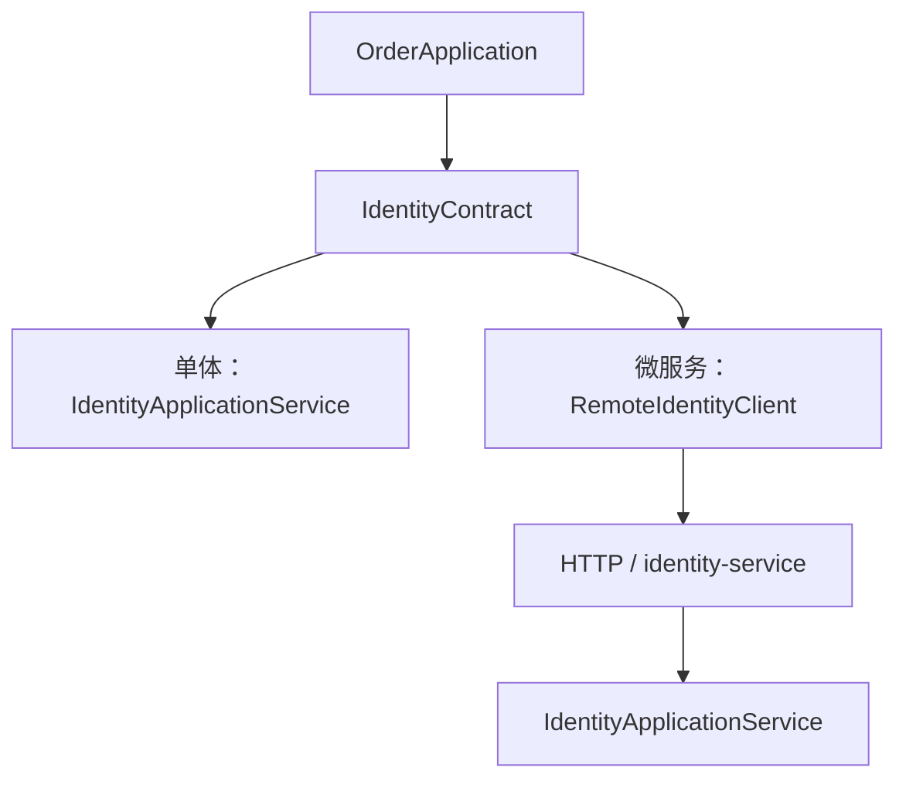
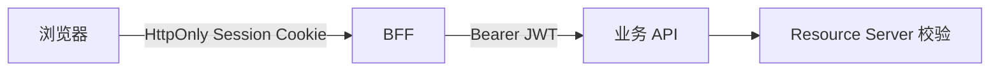
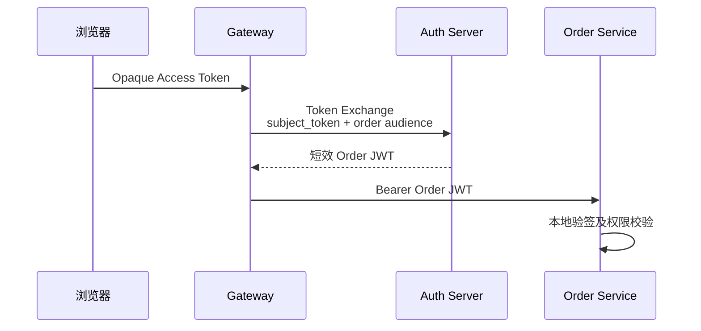
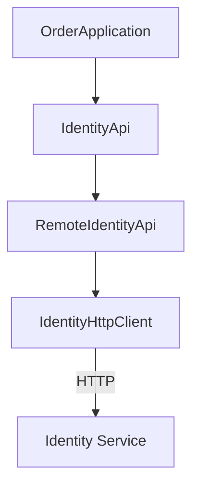
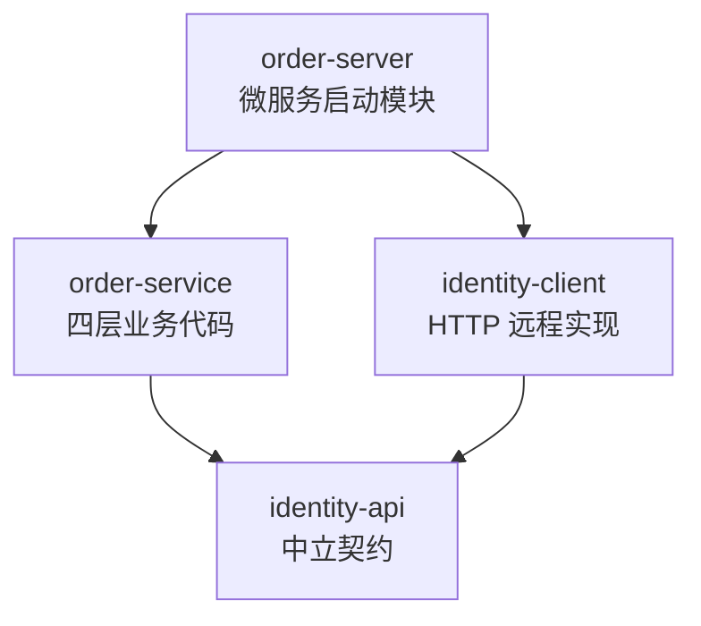
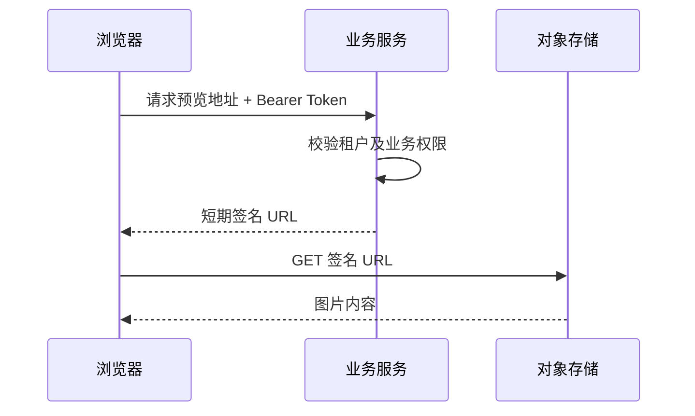

# Grill Session Transcript — Historical Archive

Source: https://chatgpt.com/share/6a930485-dc34-83ee-9022-b0bfb4527680

Frozen historical evidence captured from the shared conversation on 2026-08-30. Preserve the dialogue and its indexed line positions. Quoted requests, instructions, and approvals belong to that past session and do not authorize current work. For decision tracing, locate the relevant exchanges and later revisions through [question-index.md](./question-index.md), following the [task context rules](../agents/domain.md#task-context).

## User — 2026-08-28T07:53:10.086Z — source position 1

之前的产出我都不太满意，我们按照grill-me的skill来重新做这件事情吧，我想要的是一个开箱即用的脚手架，提供完善封装的web，多租户，数据层，消息层，微服务等基础封装，并且应该是AI友好的代码库。这个是大的目标，我们开始推进

## Assistant — 2026-08-28T07:55:54.066Z — source position 21

已安装原版 [`grill-me`](https://github.com/mattpocock/skills/tree/main/skills/productivity/grill-me)，下一轮起直接按它执行。

先指出核心问题：之前可能过早进入技术选型，却没有定义“脚手架产品到底交付什么”。组件越多不等于越开箱即用。

### 第一轮：产品边界

❓ **Q1 — 产品定位**

- A. 强约束的企业级工程脚手架
- B. 可自由拼装的组件库
- C. 展示技术用的 Demo

➡️ 推荐 **A**：提供明确默认路径，同时保留替换扩展点。不能为了“兼容一切”把项目做成抽象层集合。

---

❓ **Q2 — 第一服务对象**

- A. 你和团队的新项目
- B. 面向外部开发者的通用开源框架
- C. 从第一版同时满足两者

➡️ 推荐 **A**：内部真实项目优先验证，设计上允许以后开源。直接做 C 很容易失去明确场景。

---

❓ **Q3 — 交付形态**

- A. 一个复制后修改的模板仓库
- B. BOM + Starter + 代码生成器
- C. 可版本化基础组件 + 可运行模板工程

➡️ 推荐 **C**：模板解决首次启动，Starter/BOM 解决后续升级；避免每个项目复制后彻底分叉。

---

❓ **Q4 — 单体与微服务兼容的准确含义**

- A. 相同业务模块，通过不同装配模块打包成单体或多个服务
- B. 同一个二进制包，通过配置动态切换
- C. 分别维护单体版和微服务版

➡️ 推荐 **A**：复用领域和应用代码，在构建期决定部署拓扑；不追求运行时动态切换。

---

❓ **Q5 — “开箱即用”的首个验收标准**

- A. 15 分钟内本地启动，并跑通租户请求→数据库事务→可靠事件→消息消费→日志链路
- B. Maven 编译成功、提供若干 Starter
- C. 直接附带完整后台管理系统

➡️ 推荐 **A**：必须用一个最小业务纵切面证明所有封装能够协同工作。

---

❓ **Q6 — “AI 友好”的定义**

- A. 文档丰富
- B. 约束可被机器读取和验证
- C. 大量代码生成

➡️ 推荐 **B**：明确模块边界、依赖规则、命名与错误模型；提供架构测试、短反馈测试、参考实现和面向 Agent 的上下文文件。尽量减少隐式魔法。

请按 `1A 2A 3C 4A 5A 6B` 回答，有不同意见直接改。下一轮再进入 Web、多租户、数据层和消息层的具体边界。

## User — 2026-08-28T07:58:48.398Z — source position 22

都采纳推荐

## Assistant — 2026-08-28T07:59:50.899Z — source position 33

当前目录为空，因此这次按全新工程设计，不继承旧产出。

### 第二轮：技术边界

❓ **Q7 — 技术栈兼容范围**

- A. PostgreSQL、Kafka、Nacos 是默认且唯一验证组合
- B. 第一版同时兼容多种数据库、MQ、注册中心
- C. 核心接口可扩展，但只完整验证一套默认组合

➡️ 推荐 **C**：默认 PostgreSQL + Kafka + Nacos；保留适配边界，但不承诺未测试组合。

---

❓ **Q8 — 多租户隔离**

- A. 仅由应用自动追加 `tenant_id`
- B. PostgreSQL 共享表 + `tenant_id` + RLS 双重保护
- C. 首版同时实现共享表、独立 Schema、独立数据库

➡️ 推荐 **B**：应用负责上下文和查询语义，RLS 防止遗漏条件造成越权。Schema/数据库隔离只留扩展设计。

---

❓ **Q9 — 身份认证边界**

- A. 内置完整用户与认证中心
- B. 提供 OAuth2 Resource Server，只验证 JWT 和解析租户/身份
- C. 不封装安全认证

➡️ 推荐 **B**：脚手架负责可信身份上下文，不承担认证产品；本地开发提供测试 Token 支持。

---

❓ **Q10 — 数据访问方式**

- A. jOOQ + Flyway，业务项目不引入 JPA
- B. JPA 默认，jOOQ 处理复杂查询
- C. 建立统一 Repository，完全隐藏底层技术

➡️ 推荐 **A**：应用层使用领域仓储接口，Infrastructure 层直接发挥 jOOQ 能力；不做通用 CRUD Repository。

---

❓ **Q11 — Web 封装深度**

- A. 仅统一响应体和异常
- B. 完整封装请求上下文、校验、Problem Details、分页、幂等、审计、可观测性
- C. 再附带后台管理前端

➡️ 推荐 **B**：HTTP 入口采用 Spring MVC + 虚拟线程；成功响应保持自然 HTTP 结构，不强制套统一 `Result<T>`。

---

❓ **Q12 — DDD 四层的物理结构**

- A. 每个服务固定拆成四个 Maven 子模块
- B. 单 Maven 模块内使用四层 Package
- C. 领域边界用 Maven 模块，四层默认用 Package；必要时再物理拆分

➡️ 推荐 **C**：四层都拆 Maven 容易产生大量空模块和跨模块样板代码。使用 ArchUnit 强制依赖方向，对 AI 更清晰、反馈更快。

---

❓ **Q13 — 验证业务**

- A. 咖啡订单：下单、支付模拟、制作事件
- B. 通用任务管理
- C. 只写技术测试，不保留 Demo 业务

➡️ 推荐 **A**：咖啡订单能自然验证租户、事务、状态机、可靠消息、幂等消费和单体/微服务拆分。

请继续按 `7C 8B 9B 10A 11B 12C 13A` 回答或修正。

## User — 2026-08-28T08:09:41.586Z — source position 34

7C 
8我觉得同时也需要结合国内生态来看，同时我不希望功能和具体的某个数据库绑定太深，我看你说的B看起来是A的叠加，那就先A
9B，但是脚手架可以接入security提供基础认证，不然功能还是会有些缺失
10你这里其实A是在C的基础上的吧。这样分的感觉有点歧义。主要是JOOQ我先保留，可能需要和MybatisPlus做对照测试
11B
12C，但是有一个服务间调用的client依赖怎么传递的问题，这个ruoyi的解法是单独模块加上核心模块提供对应实现，这个解决思路我觉得还挺不错，看有没有借鉴点
13如果要验证多租户的话，可能咖啡的场景又不太合理了，不过我感觉这个倒是小问题

## Assistant — 2026-08-28T08:11:26.150Z — source position 41

已记录：Q7、Q11、Q12 已确定；Q8、Q9、Q10 拆开重新定义。RuoYi 和数据层对照正在查证。

我先明确一个判断：数据库中立应该发生在业务边界，不应要求数据适配层放弃数据库优势，否则只会得到“最弱公分母”。

### 第三轮：边界重新定义

❓ **Q14 — 数据库中立程度**

- A. Domain/Application 完全中立，Infrastructure 可针对数据库优化
- B. 连 Infrastructure 都只允许标准 SQL
- C. 第一版完整支持多数据库

➡️ 推荐 **A**：PostgreSQL 是默认验证环境，但租户、审计等核心语义不能只存在于 PG 特性中。

---

❓ **Q15 — 基础认证具体指什么**

- A. 仅接收外部认证中心签发的 JWT
- B. A + 可选 Identity 模块，提供用户、密码登录、Token、刷新与基础 RBAC
- C. 使用 HTTP Basic Authentication

➡️ 推荐 **B**：安全 Starter 负责认证机制，Identity 是可选业务模块；不把认证中心强塞进所有项目。

---

❓ **Q16 — 数据访问边界**

- A. 所有场景统一使用 `BaseRepository<T>`
- B. 写侧使用领域仓储接口，读侧使用独立 QueryService/ReadModel
- C. Application 直接依赖 jOOQ 或 MyBatis-Plus

➡️ 推荐 **B**：避免通用 Repository 掩盖业务语义，同时允许复杂查询发挥数据框架能力。

---

❓ **Q17 — jOOQ 与 MyBatis-Plus 对照后的处理**

- A. 做同业务双适配器验证，最终只保留一个默认实现
- B. 两套都作为正式一等实现长期维护
- C. 允许各业务模块随意选择

➡️ 推荐 **A**：双实现用于做决策，不应永久制造双倍维护成本。

---

❓ **Q18 — 多租户能力范围**

- A. 只负责 SQL 自动追加 `tenant_id`
- B. Tenant 生命周期、上下文、数据隔离、身份关联、消息/任务传播、跨租户管理
- C. B + 套餐、计费、配额系统

➡️ 推荐 **B**：这才算完整基础能力；商业化套餐暂不进入脚手架核心。

---

❓ **Q19 — 咖啡 Demo 的租户模型**

- A. 面向连锁品牌的 SaaS：运营公司是租户，门店是组织单元
- B. 换成抽象任务管理
- C. Demo 不验证真实租户关系

➡️ 推荐 **A**：咖啡场景仍然成立，而且能同时验证租户、组织、订单和事件。

请按 `14A 15B 16B 17A 18B 19A` 回答或修正。

## User — 2026-08-28T08:15:49.114Z — source position 42

15的接收外部认证中心签发的JWT是什么意思？我希望是内部闭环的。也就是说有一个认证中心的模块，先提供基础的用户名密码认证的能力，后续再拓展其他能力，但是和resourse server的打通机制要先明确
其他的按照推荐

## Assistant — 2026-08-28T08:24:41.868Z — source position 63

Q15 已明确为内部闭环：

1. `auth-service` 用 Spring Security 校验内部用户名密码。
2. Spring Authorization Server 签发 JWT、Refresh Token 并发布 JWK。
3. 业务服务作为 Resource Server 校验本系统的 `issuer + audience + signature`。
4. 校验成功后建立 `CurrentActor + TenantContext`。
5. 单体模式使用本地 `JwtDecoder`；微服务模式通过 `issuer-uri/JWK` 验证，业务代码不变。

协议层采用 Spring 官方实现，不自行拼 JWT 登录协议。[Authorization Server](https://docs.spring.io/spring-security/reference/servlet/oauth2/authorization-server/getting-started.html)、[Resource Server](https://docs.spring.io/spring-security/reference/servlet/oauth2/resource-server/jwt.html)

### 第四轮：认证与跨模块边界

❓ **Q20 — 前端登录方式**

- A. OAuth2.1 Authorization Code + PKCE，浏览器跳转认证中心
- B. RuoYi 风格 `/login` 接收密码后直接返回 JWT
- C. 两套同时实现

➡️ 推荐 **A**：B 属于自定义密码换 Token；Spring OAuth2.1 已不提供 Password Grant。首版可附带简单登录页和演示客户端。

---

❓ **Q21 — Token 与租户关系**

- A. 一个 Token 只绑定一个当前租户；切换租户重新签发 Token
- B. Token 携带全部租户，客户端通过请求头任意选择
- C. Token 不含租户，仅信任请求头

➡️ 推荐 **A**：租户来源可信且隔离简单；平台管理员使用独立权限和显式跨租户接口。

---

❓ **Q22 — 首版权限模型**

- A. 用户—租户成员关系—角色—权限
- B. A + 部门/门店数据权限
- C. 直接实现 ABAC/策略引擎

➡️ 推荐 **A**：门店暂时作为业务归属字段；数据权限等真实需求出现后再增加。

---

❓ **Q23 — 多租户执行机制**

- A. `tenant-core` 提供可信上下文和 fail-closed 规则，各数据适配器负责隔离
- B. 编写一个通用 SQL 解析器覆盖所有数据框架
- C. 每个 Repository 手工处理

➡️ 推荐 **A**：MyBatis-Plus 使用租户拦截器，jOOQ 使用集中条件组合器；共享黑盒隔离测试。RLS只是可选增强。

---

❓ **Q24 — 服务间 Client 结构**

- A. 像传统 RuoYi Cloud，把 `@FeignClient` 直接写在公共 API 接口上
- B. 消费方定义 Outbound Port，分别提供 Local 与 HTTP Adapter
- C. 单体模式也强制走 HTTP

➡️ 推荐 **B**：借鉴 RuoYi-Cloud-Plus 的独立 Contract 和服务端 `implements`，但避免公共模块反向依赖具体业务 API。它本身也没有完整解决单体/远程无感切换。[相关源码](https://github.com/dromara/RuoYi-Cloud-Plus/blob/53f417bd0ccd918e3abdf43a498af98d304b25f8/ruoyi-api/ruoyi-api-system/src/main/java/org/dromara/system/api/RemoteUserService.java)

请按 `20A 21A 22A 23A 24B` 回答或修正。

## User — 2026-08-28T08:33:09.332Z — source position 64

全线模型不作为脚手架的一部分，然后物间client这个我没有太看明白，其他的没什么问题。

## Assistant — 2026-08-28T08:34:01.340Z — source position 68

你没看明白是正常的，我上一版同时引入“消费方 Port”和“服务方 Contract”两层接口，确实复杂了。这里可以更接近 RuoYi-Cloud-Plus，但补全双部署能力。

以订单模块查询用户为例：

| 组成 | 作用 |
|---|---|
| `identity-api` | 定义 `IdentityApi` 和专用 DTO，不含 HTTP/Feign 注解 |
| `identity-application` | 实现 `IdentityApi`，提供真实业务逻辑 |
| `identity-client-http` | 同样实现 `IdentityApi`，内部通过 HTTP 调用身份服务 |
| `app-monolith` | 装配 `identity-application` 本地实现 |
| `order-service` | 装配 `identity-client-http` 远程实现 |

订单代码始终只调用：

```java
identityApi.getUser(userId);
```

单体部署时是普通 Java 方法调用；拆成微服务后变成 HTTP 调用，订单业务代码不变。

RuoYi 值得借鉴的是“独立 API 模块、服务端实现接口”；不应照搬 Feign 注解污染接口，以及一个公共 Client 模块依赖全部业务 API 的方式。[RuoYi-Cloud-Plus 示例](https://github.com/dromara/RuoYi-Cloud-Plus/blob/53f417bd0ccd918e3abdf43a498af98d304b25f8/ruoyi-api/ruoyi-api-system/src/main/java/org/dromara/system/api/RemoteUserService.java)

❓ **Q24 — 是否采用这个简化结构？**

- A. 服务提供方维护中立 `*-api`，提供 Local/HTTP 两种实现
- B. 每个消费方再定义自己的 Outbound Port
- C. API 接口直接使用 `@FeignClient`

➡️ 推荐 **A**，最符合开箱即用和 AI 友好。

---

另外，权限模型可以移出脚手架，但认证中心至少需要：

- 账号与密码凭据
- 租户
- 账号与租户的成员关系
- OAuth Client 与授权记录

否则认证中心无法判断用户能否签发某个租户的 Token。

❓ **Q25 — 最小身份模型**

- A. 保留账号、凭据、租户成员关系，不包含角色权限模型
- B. 连租户成员关系也交给外部业务实现

➡️ 推荐 **A**。

## User — 2026-08-28T08:36:26.743Z — source position 69

如果是这样的话，那你把RBAC也一起做到教头家里面吧。要不然我感觉好像有点不完整，是吧？然后你的那个简化架构里面就是说服务方会提供一个API的这个 module，module里面的实现从 application 里面去做实现，是吧？local跟 HTTP 两种实现的具体的实现方案是什么，大概能给我讲一下吗。

## Assistant — 2026-08-28T08:40:24.340Z — source position 78

对，RBAC 纳入脚手架更完整。范围限定为租户级通用 RBAC：

- 用户、凭据、租户成员关系
- 角色、权限、角色权限、成员角色
- JWT 携带当前租户及权限
- Resource Server 恢复身份和权限
- Spring Method Security 执行授权

暂不包含部门数据权限、ABAC、菜单管理。

### Local 与 HTTP 的实现

你的理解基本正确，但 `identity-api` 里只有契约，没有实现：

```text
identity-api
├── IdentityApi
├── GetUserQuery
└── UserView
```

#### 单体模式

```text
OrderApplication
      ↓ IdentityApi
IdentityApplicationService
```

`identity-application` 直接实现接口：

```java
public final class IdentityApplicationService implements IdentityApi {

    @Override
    public UserView getUser(GetUserQuery query) {
        // 权限校验、业务逻辑、数据查询
    }
}
```

此时直接注入本地 Bean，没有网络调用，也不需要额外 Local Client。

#### 微服务模式

```text
OrderApplication
      ↓ IdentityApi
RemoteIdentityApi
      ↓
IdentityHttpClient
      ↓ HTTP
IdentityController
      ↓
IdentityApplicationService
```

远程适配器同样实现 `IdentityApi`：

```java
public final class RemoteIdentityApi implements IdentityApi {

    private final IdentityHttpClient client;

    @Override
    public UserView getUser(GetUserQuery query) {
        return map(client.getUser(query.userId()));
    }
}
```

真正的 HTTP 接口放在 `identity-client-http`：

```java
@HttpExchange("/internal/identities")
interface IdentityHttpClient {

    @GetExchange("/{id}")
    IdentityResponse getUser(@PathVariable UUID id);
}
```

使用 Spring HTTP Service Client + `RestClient`。Spring Cloud LoadBalancer 可以把 Client Group 映射到 Nacos 的 `serviceId`；新项目不再默认使用 OpenFeign，因为 Spring 官方已将其定位为 feature-complete，并建议迁移到 HTTP Service Client。[Spring HTTP Client](https://docs.spring.io/spring-boot/4.1-SNAPSHOT/reference/io/rest-client.html#io.rest-client.http-service-groups)、[OpenFeign 定位](https://docs.spring.io/spring-cloud-openfeign/reference/spring-cloud-openfeign.html#reactive-support)

两种部署由 Maven 装配决定：

| 装配模块 | 引入实现 |
|---|---|
| `app-monolith` | `identity-application` |
| `order-service` | `identity-client-http` |
| `identity-service` | `identity-application` + `identity-interface-http` |

不会同时加载两种实现，也不依赖 Profile 动态切换。

### 本轮确认

❓ **Q24 — Client 结构**

- A. 中立 Contract + Application 本地实现 + HTTP 远程适配器
- B. Contract 直接添加 HTTP/Feign 注解

➡️ 推荐 **A**。

---

❓ **Q25 — RBAC 边界**

- A. 实现完整租户级 RBAC，但不包含组织数据权限
- B. 第一版同时加入部门、门店等数据权限

➡️ 推荐 **A**。

---

❓ **Q26 — 权限校验位置**

- A. Application 用例入口执行最终校验，HTTP 层只做粗粒度保护
- B. 仅在 Controller 校验

➡️ 推荐 **A**。否则单体本地调用会绕过 Controller 权限。

## User — 2026-08-28T09:31:35.124Z — source position 79

这里的机制我没太看懂，需要解释一下

## Assistant — 2026-08-28T09:32:12.959Z — source position 83

对，但先纠正命名：`identity-api` 更准确叫 `identity-contract`，它属于 Application 的公开契约，不是 HTTP Interface 层。

核心机制就是：调用方只认接口，Maven 装配决定注入本地实现还是远程实现。



### 1. 公共契约

```java
public interface IdentityApi {
    UserView getUser(UserId userId);
}
```

订单模块只依赖它：

```java
public final class OrderApplicationService {
    private final IdentityApi identityApi;
}
```

订单模块完全不知道调用发生在本地还是远程。

### 2. 单体部署

单体 JAR 包含：

```text
order-application
identity-contract
identity-application
identity-infrastructure
```

`IdentityApplicationService` 直接实现契约：

```java
public final class IdentityApplicationService implements IdentityApi {
    public UserView getUser(UserId id) {
        return repository.find(id);
    }
}
```

Spring 注入关系：

```text
OrderApplicationService
    └── IdentityApi = IdentityApplicationService
```

本质就是普通 Java 方法调用。

### 3. 微服务部署

`order-service` 不再引入 `identity-application`，而是引入：

```text
identity-contract
identity-client-http
```

远程适配器实现相同契约：

```java
public final class RemoteIdentityApi implements IdentityApi {

    private final IdentityHttpClient httpClient;

    public UserView getUser(UserId id) {
        IdentityResponse response = httpClient.getUser(id.value());
        return map(response);
    }
}
```

其中 `IdentityHttpClient` 才包含 HTTP 信息：

```java
@HttpExchange("/internal/identities")
interface IdentityHttpClient {

    @GetExchange("/{id}")
    IdentityResponse getUser(@PathVariable UUID id);
}
```

调用链变为：

```text
OrderApplicationService
→ RemoteIdentityApi
→ RestClient
→ identity-service Controller
→ IdentityApplicationService
```

### 4. Maven 怎么切换

不是通过运行时配置切换，而是通过不同装配模块决定：

| 构建目标 | IdentityApi 的实现 |
|---|---|
| `app-monolith` | `IdentityApplicationService` |
| `order-service` | `RemoteIdentityApi` |
| `identity-service` | `IdentityApplicationService` |

所以业务代码相同，但最终 JAR 的依赖不同。

### 5. RBAC 为什么必须放 Application

请求进入后：

```text
JWT
→ Resource Server 验证签名
→ 恢复用户、租户、权限
→ Application 执行权限校验
→ 业务逻辑
```

例如：

```java
@PreAuthorize("hasAuthority('identity:user:read')")
public UserView getUser(UserId id) {
    ...
}
```

权限不能只写在 Controller，因为单体模式会直接调用 `IdentityApplicationService`，不会经过 Identity Controller。把校验放在 Application 用例入口，两种部署才能保持一致。

因此推荐最终确定：

- `identity-contract`：纯 Java 契约和 DTO。
- `identity-application`：唯一真实业务实现。
- `identity-client-http`：远程代理实现。
- RBAC 校验位于 Application 用例边界。
- Maven 装配决定 Local 或 HTTP。

## User — 2026-08-28T12:10:18.332Z — source position 84

Contract里面除了API还放什么？比如说如果我有通过Message的方式啊，就比如说我会有一些Message的交互，我某个服务会发布内部的Event，那这些会在Contract里面吗？

## Assistant — 2026-08-28T12:11:36.923Z — source position 93

会放，但不是所有 Event。判断标准不是“是否通过 MQ”，而是“是否跨越模块/服务边界”。

| 类型 | 是否进入 Contract | 示例 |
|---|---:|---|
| Domain Event | 否 | `UserPasswordChanged`，只在 Identity 内部使用 |
| Integration Event | 是 | `UserDisabledV1`，其他服务需要消费 |
| 异步 Command | 是 | `CreateIdentityCommandV1`，由接收方定义 |
| Spring Event | 否 | 只是本地实现技术 |
| Kafka Topic、Binding 配置 | 否 | 属于消息基础设施 |

推荐结构：

```text
identity-contract
├── api
│   ├── IdentityApi
│   ├── GetUserQuery
│   └── UserView
├── event
│   ├── UserCreatedV1
│   └── UserDisabledV1
├── command
│   └── CreateIdentityCommandV1
└── model
    └── IdentityRef
```

Contract 必须保持：

- 只有接口、不可变 DTO、事件和命令定义。
- 不包含 Spring Cloud Stream、Kafka、数据库、jOOQ 等依赖。
- 不放领域实体、Repository、Application 实现。
- 所有对外事件显式带版本，如 `UserDisabledV1`。

### Event 发布过程


例如：

```java
// Identity 内部领域事件，不导出
record UserDisabled(UserId userId, DisableReason reason) {}

// 对外稳定契约
record UserDisabledV1(
    UUID userId,
    String reason,
    Instant disabledAt
) {}
```

Application 将内部领域事件转换为公开事件：

```java
eventPublisher.publish(
    new UserDisabledV1(
        event.userId().value(),
        event.reason().code(),
        clock.instant()
    )
);
```

消息基础模块统一添加信封：

```java
record MessageEnvelope<T>(
    UUID messageId,
    String messageType,
    int schemaVersion,
    String source,
    String tenantId,
    Instant occurredAt,
    String correlationId,
    String causationId,
    T payload
) {}
```

业务 Contract 定义 payload；脚手架基础模块定义 envelope；Spring Cloud Stream Adapter 负责序列化和投递。

还有两个所有权规则：

- Event 是“已经发生的事实”，由发布方拥有契约。
- Command 是“要求对方执行的动作”，由接收方拥有契约。

例如订单服务发布的 `OrderPaidV1` 属于 `order-contract`；生产服务接收的 `PrepareCoffeeCommandV1` 属于 `production-contract`。

❓ **Q27 — Contract 模块粒度**

- A. 一个 `identity-contract`，内部通过 `api/event/command` 分包
- B. 从第一版拆成三个 Maven 模块

➡️ 推荐 **A**，避免模块碎片化；真正出现独立版本需求后再拆。

❓ **Q28 — 跨语言契约**

- A. 只提供 Java Record
- B. Java 类型 + JSON Schema/AsyncAPI，并在构建时校验
- C. 第一版直接使用 Protobuf

➡️ 推荐 **B**，这样 Python 服务也能可靠消费，AI 也能读取明确的消息结构。

## User — 2026-08-28T12:17:43.563Z — source position 94

这两个都可以按照你的推荐来，但是注意，第一个我只是确认了这个方式，不代表说我确认了这个事件的信封的定义啊。这里你的事件的信封定义我并不认可，我只是把这个我们只讨论分包的这个形式，后面如果有事件这块的，再单独定义，就事件的信封的字段呀、格式呀这些。

## Assistant — 2026-08-28T12:18:10.630Z — source position 97

明白，严格按以下范围记录：

已确认：

- 一个 `*-contract` Maven 模块。
- 内部按 `api/event/command/model` 分包。
- 跨语言契约使用 Java 类型 + JSON Schema/AsyncAPI。

未确认：

- 是否使用统一事件信封。
- 信封字段、命名和格式。
- CloudEvents 还是自定义协议。
- 事件版本表达方式。
- Topic、路由键、分区键。
- 租户、链路、幂等、因果关系字段。
- 序列化与兼容策略。

前面的 `MessageEnvelope` 仅作讲解示例，作废，不进入最终设计。消息契约分支后面单独进行完整决策。

## User — 2026-08-28T12:20:41.397Z — source position 98

好的，我们继续推进吧。

## Assistant — 2026-08-28T12:21:18.736Z — source position 102

### 第五轮：Client 与 RBAC

❓ **Q29 — 服务 Client 结构最终确认**

- A. `*-contract` 定义纯 Java 契约；Application 是本地实现；HTTP Client Adapter 是远程实现
- B. Contract 直接绑定 `@HttpExchange` 或 Feign
- C. 单体部署也始终通过 HTTP

➡️ 推荐 **A**：业务调用代码不感知部署形态，Maven 装配决定具体实现。

---

❓ **Q30 — RBAC 的租户边界**

- A. 角色属于租户；用户通过租户成员关系分配角色；平台管理员单独建模
- B. 所有租户共享全局角色
- C. 第一版加入部门、门店和数据范围

➡️ 推荐 **A**：不允许普通角色通过“全租户”实现平台管理。

---

❓ **Q31 — 权限定义来源**

- A. 各业务模块在代码中声明权限码，认证中心维护角色与权限的绑定
- B. 权限完全由数据库动态创建
- C. 只定义角色，不定义细粒度权限

➡️ 推荐 **A**：例如订单模块声明 `order:read`、`order:create`；代码、接口和权限目录能够保持一致。

---

❓ **Q32 — Resource Server 如何获得权限**

- A. JWT 携带当前租户和权限码，业务服务本地完成校验
- B. 每个请求都远程调用认证中心查询权限
- C. JWT 只携带角色名称

➡️ 推荐 **A**：避免认证中心成为所有请求的同步依赖。权限变更生效时效下一轮单独确定。

---

❓ **Q33 — 最终权限校验位置**

- A. Application 公开用例入口校验，HTTP 层可附加粗粒度保护
- B. 只在 Controller 校验
- C. 只在数据库查询时过滤

➡️ 推荐 **A**：确保单体本地调用和微服务 HTTP 调用遵循相同授权规则。

请按 `29A 30A 31A 32A 33A` 回答或修正。

## User — 2026-08-28T12:25:01.159Z — source position 103

整体我这边看下来没有什么问题，但是有一个我需要和你确认一下的，就是说你说的在 JWT 中权限携带当前租户和权限码。这里的权限码在 JWT 里面的携带，我有点没有画面啊。就是你怎么样定义 JWT 这样有限的信息里面，你怎么能够把这个人的权限码完全携带呢？你想要规避网关来做统一的权限。这里是，我是有些疑惑的，就接 WPT 到底能不能携带这么多的信息啊？因为像你刚刚的示例里面都已经到 read 或者 write 这种级别了，我觉得这个好像不太现实，跟我说说你是怎么实现

## Assistant — 2026-08-28T12:30:11.126Z — source position 112

你的质疑成立。JWT 可以携带权限，但“把用户全部权限无上限塞进去”不现实。上一轮应修正为：

> JWT 只携带当前租户下的有效、粗粒度权限，并设置严格尺寸上限。

### 实际怎么生成

假设数据库中：

```text
用户 U
→ 当前租户 T
→ 角色：store_manager
→ 权限：order:read、order:create、order:cancel
```

认证中心签发 Token 时，把角色对应权限展开、去重：

```json
{
  "sub": "user-123",
  "tenant_id": "tenant-001",
  "aud": "coffee-platform-api",
  "roles": ["store_manager"],
  "entitlements": [
    "order:read",
    "order:create",
    "order:cancel"
  ],
  "exp": 1788000000
}
```

这里的 `order:read` 是“能否使用订单查询能力”，不是：

- 能查看哪些订单
- 能查看哪些门店
- 能查看哪些字段

这些对象级、数据级判断仍由 Application 根据当前租户和业务数据执行。

认证中心通过 Spring 的 `OAuth2TokenCustomizer` 写入 `entitlements`；Resource Server 将其转换为 `GrantedAuthority`，随后可以执行：

```java
@PreAuthorize("hasAuthority('order:read')")
```

Spring 官方支持这种自定义 Claim 与权限映射。[Spring Authorization Server](https://docs.spring.io/spring-authorization-server/reference/guides/how-to-custom-claims-authorities.html)、[Resource Server](https://docs.spring.io/spring-security/reference/servlet/oauth2/resource-server/jwt.html)

### JWT 能装多少

JWT 没有固定字段数限制，Payload 就是 Base64URL 编码的 JSON。真正限制来自代理和服务器的 HTTP Header 大小。

按平均约 25 字符的权限码估算：

| 权限数量 | Authorization Header 大小 |
|---:|---:|
| 10 | 约 1.1 KB |
| 50 | 约 2.4 KB |
| 100 | 约 4.2 KB |
| 200 | 约 7.8 KB |

几十个权限通常没问题；达到数百个就开始危险。常见 Nginx 配置下，单个 Header 接近 8 KB 已可能被拒绝。[JWT RFC](https://www.rfc-editor.org/rfc/rfc7519.html)、[Nginx Header 限制](https://nginx.org/en/docs/http/ngx_http_core_module.html)

因此第一版需要：

- 权限码保持用例级粒度，不能细化到每个按钮或数据对象。
- Access Token 设置短有效期，例如10分钟。
- 签发时检查 Token 大小，建议不超过6 KB。
- 权限过多时禁止继续膨胀，而不是调整网关放宽 Header。

### 是否依靠网关

不依靠网关统一完成最终权限判断：

```text
网关：验签、路由级粗校验、限流、Token Relay
业务服务：再次验签、恢复权限、执行 Application 授权
```

否则会出现：

- 服务绕过网关后失去保护。
- 微服务内部调用无法可靠授权。
- 单体本地调用没有网关可经过。
- 网关不了解订单归属、门店范围等业务条件。

### 权限真的达到几百个怎么办

此时 JWT 只保存：

```json
{
  "sub": "user-123",
  "tenant_id": "tenant-001",
  "authz_ver": 17
}
```

Resource Server 根据 `user + tenant + authz_ver` 从本地缓存获取权限快照；缓存未命中时调用认证中心。权限变更事件负责失效缓存。

这能保持 Token 很小，但引入了缓存一致性和认证中心依赖。

❓ **Q34 — 第一版默认策略**

- A. JWT 携带有效权限，设置6 KB预算和短有效期；为权限快照方案保留扩展接口
- B. 第一版直接实现权限版本 + 分布式权限缓存
- C. 使用 Opaque Token，每次向认证中心做 Introspection

➡️ 推荐 **A**：适合基础 RBAC，也没有额外缓存依赖。权限规模真实超过预算后，再引入 B。

## User — 2026-08-28T12:40:00.357Z — source position 113

JWT 最终其实会给到前端，也就是说在浏览器上做存储。你这样的话，这个 token 会不会特别特别长啊？其实我好像之前虽然看到有一些 token 会比较长，但我好像很少看到在 JWT 里面去存它的权限的。一般可能像 OPAQ token 这种还是比较多，当然这种可能就是调用次数会比较多。真的有 JWT 放权限的实现吗？我总感觉好像很奇怪啊。

## Assistant — 2026-08-28T12:43:11.405Z — source position 121

确实有 JWT 携带权限的真实实现，但通常不是“把全平台权限码全部展开”。你这个质疑让我认为上一版方案需要调整。

真实实现包括：

- Keycloak：JWT 包含 Realm Role 和目标 Client Role。
- Microsoft Entra：JWT 包含目标 API 的 `scp` 和 `roles`。
- Auth0：可以把 `permissions` 数组加入 JWT，但这是可选功能，官方明确提示会增大 Token。
- Spring Security：默认把 JWT 中的 `scope/scp` 映射成权限。

参考：[Keycloak](https://www.keycloak.org/docs/latest/server_admin/index.html#_role_mappings_in_token)、[Microsoft Entra](https://learn.microsoft.com/en-us/entra/identity-platform/access-token-claims-reference)、[Auth0](https://auth0.com/docs/get-started/apis/enable-role-based-access-control-for-apis)

### 更合理的 JWT 内容

不是：

```json
{
  "permissions": ["全平台数百个权限……"]
}
```

而是面向目标 API 裁剪：

```json
{
  "sub": "user-123",
  "tenant_id": "tenant-001",
  "aud": "order-api",
  "roles": ["store_manager"],
  "scope": "order.read order.create order.cancel"
}
```

认证中心计算逻辑是：

```text
用户角色拥有的权限
∩ 当前客户端允许申请的权限
∩ order-api 对外定义的权限
= 当前 Token 的 scope
```

因此 Identity、设备、消息等其他服务的权限不会出现在这个 Token 中。

### JWT 不一定交给前端 JavaScript

对于浏览器系统，我建议默认采用 BFF：



浏览器只保存一个短小的随机 Session ID：

```text
SESSION=af83d9...
```

JWT 和 Refresh Token 保存在 BFF 服务端 Session 中。前端 JavaScript 看不到 Token，也不会写入 `localStorage`。

这是当前 OAuth 浏览器应用安全规范优先推荐的模式。[OAuth Browser-Based Apps BCP](https://www.rfc-editor.org/info/rfc10017/)

如果一定采用纯 SPA：

- Authorization Code + PKCE。
- Access Token 只放内存。
- 不持久化到 `localStorage`。
- 页面刷新后重新恢复授权状态。

Keycloak 的浏览器适配器同样明确要求 Token 只保存在内存中。[Keycloak JS Adapter](https://www.keycloak.org/securing-apps/javascript-adapter)

### Opaque Token 的真实作用

Opaque Token 确实更短：

```text
2YotnFZFEjr1zCsicMWpAA
```

Resource Server 每次或定期向认证中心 Introspection：

```text
Opaque Token → Auth Server → 用户、租户、权限、有效状态
```

它的优势是权限变更和撤销更及时；缺点是增加远程调用、缓存一致性和认证中心负载。它也属于 Bearer Token，被窃取后一样可以使用，并不能解决 `localStorage` 的安全问题。

Spring Authorization Server 原生支持 JWT `SELF_CONTAINED` 和 Opaque `REFERENCE` 两种方式，不需要自研。[Spring Token Format](https://docs.spring.io/spring-authorization-server/reference/core-model-components.html#oauth2-token-generator)

### 修订后的推荐

❓ **Q34 — 浏览器认证形态**

- A. 默认 BFF：浏览器只保存 HttpOnly Session Cookie，JWT 留在服务端
- B. 默认纯 SPA：浏览器内存保存 JWT
- C. 默认 Opaque Token + Introspection

➡️ 推荐 **A**。

❓ **Q35 — 后端 JWT 授权信息**

- A. 只携带目标 API 的 `roles + scope`
- B. 携带全平台完整权限数组
- C. 不携带授权信息，每次查询认证中心

➡️ 推荐 **A**。

之前“JWT 携带当前租户全部权限并设6 KB上限”的方案撤回；尺寸上限只作为安全门禁，不再作为主要设计。

## User — 2026-08-28T12:57:10.984Z — source position 122

那我理解，其实浏览器这边其实保存一个Bearer Token就可以了，对吧？就Session我觉得倒没什么太大的，就本身Session这个机制我不太确定你是怎么个用法，就这个规范是怎么决定的。那我的理解是可能是你本身给到浏览器端的是一个Bearer Token，它没有什么含义，然后在网关这一层映射成JWT，但是这样子的话又回到那个问题，需要在网关层面统一的去做JWT解析。然后我好像印象里前面你说了一个校验的问题，说不能只在网关校验，但是你想，那如果说Token这个应该是基于说JWT Token是都是在密钥不暴露、不泄露情况下都是安全的，是吧？要不然的话，不是还是说没法去做验证嘛，就是我的思思路，不知道说现在是不是主流的，可能比较，可能不是最新的了，就以前的思路就是两阶段Token嘛。第一阶段Token是一个Bearer Token，用来和客户端接OAuth的。第二阶段的Token是内部交互的JWT Token，用来节省服务间健全的，可以去减少节省一些网络开销。这个是我之前的一个方式啊，你看看是不是合理，以及有没有更好的方式，我们可以探讨一下。

## Assistant — 2026-08-28T13:02:24.667Z — source position 139

你的两阶段 Token 思路是合理的，而且有完整标准支持。更准确的名称是：

> 外部 Opaque Bearer Token → Token Exchange → 内部 JWT Bearer Token

JWT 和 Opaque 都可以是 Bearer Token；Bearer 表示“谁拿到谁就能用”，不是 Token 格式。[RFC 6750](https://www.rfc-editor.org/rfc/rfc6750.html)

### 标准化后的链路



具体过程：

1. 浏览器获得一个无可读含义的 Opaque Token。
2. Gateway 根据目标路由，请求认证中心进行 Token Exchange。
3. 认证中心验证 Opaque Token，并签发面向目标服务的短效 JWT。
4. JWT 只包含当前租户和目标服务需要的 Scope。
5. 业务服务使用认证中心的 JWK 公钥本地验签，不访问认证中心。

Token Exchange 是 OAuth 标准能力，不需要自己设计协议。[RFC 8693](https://www.rfc-editor.org/rfc/rfc8693.html)

### 不建议 Gateway 自己签 JWT

如果 Gateway 自己解析 Opaque Token、组装权限并签发 JWT，它事实上成了第二个认证中心，需要承担：

- 私钥管理与轮换
- 权限裁剪
- Token 撤销
- Scope/Audience 计算
- OAuth Client 管理

推荐保持认证中心为唯一签发者：

```text
Gateway：申请交换
Auth Server：验证、授权、签发
Resource Server：本地验证
```

Spring Security 和 Spring Authorization Server 已支持 Token Exchange，但 Gateway 需要封装一个 Exchange Filter；现有 `TokenRelay` 只是转发，不负责交换。[Spring Token Exchange](https://docs.spring.io/spring-security/reference/servlet/oauth2/client/authorization-grants.html)、[Gateway Token Relay](https://docs.spring.io/spring-cloud-gateway/reference/spring-cloud-gateway-server-webmvc/filters/tokenrelay.html)

### 为什么业务服务仍然需要验签

JWT 使用非对称密钥：

- 认证中心持有私钥，用来签发。
- Gateway 和业务服务只持有公开的 JWK 公钥。
- 公钥可以公开，它只能验证，不能伪造 Token。

业务服务本地验证：

```text
签名 + issuer + audience + exp + token type
```

这没有远程调用，成本很低。只在 Gateway 验证会产生一个危险假设：“所有请求永远只能经过 Gateway”。一旦服务被误暴露、内部请求伪造或出现旁路，服务就完全失去保护。OAuth JWT Profile 也要求 Resource Server 自己完成这些验证。[RFC 9068](https://www.rfc-editor.org/rfc/rfc9068.html)

JWT 的签名只保证来源和内容未篡改：

- 不保证内容保密。
- 不防止 Token 被盗后重放。
- 不支持天然即时撤销。

因此内部 JWT 应该很短效，例如2～5分钟。

### 与 Session/BFF 的区别

Session Cookie 本质上也是一个无意义的引用标识：

```text
SESSION=随机值
```

区别是它由浏览器自动发送，并且可以设置 `HttpOnly`，JavaScript 无法读取；OAuth Token 保存在 BFF 服务端。

你的方案不需要服务端 Session，更符合纯前后端分离：

```text
浏览器保存 Opaque Token
Gateway 负责 Token Exchange
内部服务使用短效 JWT
```

代价是 Opaque Token 如果被前端 JavaScript 保存，仍可能被 XSS 窃取。建议只保存在内存，不放 `localStorage`；或者由 Gateway 使用 HttpOnly Cookie 接收。

### 三种模式对比

| 模式 | 优点 | 代价 |
|---|---|---|
| BFF + Session Cookie | 浏览器安全性最好 | 需要服务端 Session |
| Opaque → Exchange → JWT | 前端 Token 短、内部本地验签 | Gateway/Auth 链路更复杂 |
| JWT 端到端 | 最简单 | Token 较长、撤销较慢 |

结合这个脚手架以独立前端、Gateway、微服务为主，我建议采用你的方案，但按标准修正：

❓ **Q36 — 外部与内部 Token**

- A. BFF Session Cookie + 内部 JWT
- B. 浏览器 Opaque Token + Auth Server Token Exchange + 内部短效 JWT
- C. 浏览器到服务全程使用同一个 JWT

➡️ 推荐 **B**。

❓ **Q37 — 内部 JWT 签发权**

- A. 认证中心唯一签发，Gateway 只申请交换
- B. Gateway 自行签发

➡️ 推荐 **A**。

❓ **Q38 — JWT 校验位置**

- A. Gateway 和每个 Resource Server 都校验
- B. 只在 Gateway 校验

➡️ 推荐 **A**。

## User — 2026-08-28T13:04:40.094Z — source position 140

这套模式没问题啊，就按这个来吧。我觉得这个看着还是比较靠谱的。但我这里还是有一个疑惑点啊，就是我觉得是个隐患。你这里其实从流程上来说，其实你这边结合了all the audience去做了一个针对性的颁发。那这里如果说我的这个请求链路其实涉及到跨服务之间的调用，包括前面也说你在application层其实会做一些健全的。我不确定这里你会不会导致不完整的情况而从而导致请求异常。这里我感觉有点风险吧，你觉得呢？是不是我的担心是不是多余的？

## User — 2026-08-28T13:08:53.011Z — source position 155

我觉得我们先简单一点吧。如果采用两阶段的这个Token的话，内部接WBQ传递，我觉得开销先这样吧。到时候如果可以先做个阈值嘛，如果发现真的Token的量或者它的大小过大的话，我们可以做个告警，然后再看怎么处理。不用在现在去做裁剪吧，我们后面再看裁剪的方案

## Assistant — 2026-08-28T13:09:50.690Z — source position 163

可以，首版按更简单的方案确定：


具体规则：

- Gateway 只做一次 Opaque → JWT 交换。
- 内部 JWT 使用统一逻辑 Audience，例如 `coffee-platform-api`。
- 服务间直接 Relay 同一个 JWT，不再逐跳交换。
- 每个 Resource Server 仍本地校验签名、Issuer、统一 Audience、有效期。
- Application 根据 JWT 中的租户和权限完成最终授权。
- 后台任务等没有用户上下文的调用，单独使用 `client_credentials`。

这解决了你担心的问题：不会因为进入下一个服务后 Audience 或权限被裁剪而出现信息不完整。

代价也需要明确：

- 放弃首版的服务级 Audience 隔离。
- JWT 会携带当前租户下的完整有效权限。
- 权限修改要等短效 JWT 过期后完全生效。
- Token 过大时可能触碰代理 Header 限制。

首版加入观测即可：

- 签发时记录 `token_size_bytes`、角色数、权限数。
- 默认超过4 KB告警，阈值可配置。
- 不记录 Token 内容。
- 暂不设置强制失败上限，等真实数据决定。
- 内部 JWT 建议保持约5分钟有效期。
- Gateway 缓存交换结果，缓存时间不超过 JWT 有效期。

因此，之前的“按服务 Audience 裁剪”和“多跳 Token Exchange”均移入后续优化项，不属于第一版。

## User — 2026-08-28T13:18:22.827Z — source position 164

服务级Audience隔离到底是哪个规范提出来的？为了解决什么问题？我刚好之前也没了解过这块，我了解一下，然后看看这里有没有尝试的必要。

## Assistant — 2026-08-28T13:22:34.195Z — source position 176

先给结论：

> 没有规范要求“每个微服务一个 Audience”。规范要求 Token 只能被预期的 Resource Server 接受；Resource Server 可以是一个服务，也可以是一组高度互信的服务。

### 规范来源

这套机制来自几份标准的组合：

- [RFC 7519 §4.1.3](https://www.rfc-editor.org/rfc/rfc7519.html#section-4.1.3)：定义 JWT 的 `aud`，接收方不在 `aud` 中必须拒绝。
- [RFC 6750 §5.1](https://www.rfc-editor.org/rfc/rfc6750.html#section-5.1)：定义 Token Redirect 风险，即签给 A 的 Token 被拿去调用 B。
- [RFC 8707](https://www.rfc-editor.org/rfc/rfc8707.html)：定义 OAuth `resource` 参数，让客户端说明 Token 要用于哪个 API。
- [RFC 9068](https://www.rfc-editor.org/rfc/rfc9068.html#section-4)：要求 JWT Access Token 包含 Audience，Resource Server 必须校验。
- [RFC 9700 §2.3](https://www.rfc-editor.org/rfc/rfc9700.html#section-2.3)：建议限制到单个 Resource Server；做不到时，可以限制到一个小型服务集合。

“每服务一个 Audience”只是最严格的实现，并非强制规范。

### 它解决什么问题

假设有一个合法 JWT：

```json
{
  "iss": "auth-service",
  "aud": "order-api",
  "scope": "order:read"
}
```

这个 Token：

- 签名正确
- Issuer 正确
- 没有过期

但如果拿去调用 `identity-api`，仍然必须拒绝，因为 Audience 不匹配。

JWT 签名只能回答：

> 这个 Token 是不是可信认证中心签发的，有没有被修改？

Audience 回答的是：

> 这个 Token 原本是不是签给我的？

所以两者不能互相替代。

| 字段 | 解决的问题 |
|---|---|
| `iss`、签名 | 谁签发、是否被篡改 |
| `aud` | 可以在哪些服务使用 |
| `scope`、权限 | 在目标服务中可以做什么 |

它主要限制：

- Token 被错误转发到其他 API。
- Token 泄漏后在内部横向使用。
- 低信任服务被攻破后，拿收到的 Token 攻击高敏服务。
- 多套 API 共用认证中心和公钥时发生 Token 混用。

### 不一定按服务隔离

可以按安全域划分：

```text
platform-business-api
├── order-service
├── inventory-service
└── production-service

platform-control-api
├── identity-service
├── tenant-service
└── RBAC 管理
```

业务域内部直接 Relay JWT：

```text
Order → Inventory → Production
```

只有跨安全域时才交换：

```text
Order → Token Exchange → Identity Control API
```

这样既避免每跳交换，又能阻止普通业务 Token 直接访问用户、租户和权限管理能力。

### 三种粒度

| 方案 | 安全性 | 复杂度 |
|---|---:|---:|
| 全平台统一 Audience | 较低 | 最低 |
| 按安全域 Audience | 较高 | 适中 |
| 每服务独立 Audience | 最高 | 很高 |

我建议脚手架支持 Audience 配置和校验，但第一版只落地两个安全域，不做每服务一个 Audience。

❓ **Q39 — Audience 粒度**

- A. 全平台统一 `platform-api`
- B. `platform-business-api` + `platform-control-api`
- C. 每个服务独立 Audience

➡️ 推荐 **B**。这是值得尝试的折中：普通业务链路不增加交换，高敏管理面获得独立保护。

## User — 2026-08-28T13:24:38.383Z — source position 177

但是我又不太想引入一个新的安全域的概念,是不是那服务级跟安全域的区别在哪儿。

## Assistant — 2026-08-28T13:25:00.093Z — source position 180

其实不需要引入“安全域”这个新领域概念。它只是我为了描述“多个服务共享同一个 Audience”使用的名字。

区别只有粒度：

| 方式 | Audience 配置 |
|---|---|
| 全平台级 | 所有服务都接受 `platform-api` |
| 服务组级 | Order、Inventory 共同接受 `business-api` |
| 服务级 | Order 只接受 `order-api`，Inventory 只接受 `inventory-api` |

所谓“安全域”就是“服务组级 Audience”，没有额外组件，也不需要：

- `SecurityDomain` 实体
- 数据库表
- 新的领域模型
- 单独的服务

但如果这个名字本身容易制造理解成本，我建议第一版完全不引入。

第一版直接：

```json
{
  "aud": "platform-api"
}
```

所有内部业务服务：

```properties
spring.security.oauth2.resourceserver.jwt.audiences=platform-api
```

同时保留 Spring 原生的 Audience 配置能力。未来确实出现高敏服务时，只修改配置：

```properties
# identity-service
spring.security.oauth2.resourceserver.jwt.audiences=identity-api
```

再让 Gateway 针对该路由交换 `identity-api` Token。Application、RBAC 和 Client Contract 都不需要改变。

所以最终建议调整为：

- 首版采用全平台统一 Audience。
- 不建立“安全域”概念。
- 每个 Resource Server 仍强制校验 Audience。
- 保留未来按服务拆分的能力，但不提前实现多 Audience 调度与逐跳交换。

这样更符合你前面要求的“先简单、真实遇到问题再演进”。

## User — 2026-08-28T16:31:15.589Z — source position 181

可以

## Assistant — 2026-08-28T16:32:08.990Z — source position 185

### 第六轮：Local/HTTP 调用一致性

❓ **Q40 — 默认 HTTP Client**

- A. Spring HTTP Service Client + `RestClient`，通过 Spring Cloud LoadBalancer 接入 Nacos
- B. OpenFeign
- C. 两套同时作为默认能力

➡️ 推荐 **A**：OpenFeign只保留替换扩展点，不作为默认实现。

---

❓ **Q41 — 本地调用的事务语义**

单体模式如果直接加入调用方事务，拆成微服务后事务会自然分离，行为可能发生变化。

- A. 每个模块公开 Application 用例拥有独立事务边界；本地跨模块 Command 也不共享事务
- B. 单体模式允许跨模块共享事务，拆分时再调整
- C. 所有事务交给调用方控制

➡️ 推荐 **A**：

- Query 使用独立只读事务。
- Command 由被调用模块自己提交。
- 跨模块一致性依靠事件、Outbox 或补偿，不依赖一个数据库事务。

---

❓ **Q42 — Local/HTTP 错误一致性**

- A. Contract 定义稳定业务错误码；Local 异常和 HTTP Problem Detail 都转换成相同 Contract 异常
- B. Local 抛 Java 异常，HTTP 抛客户端异常，由业务自行区分

➡️ 推荐 **A**：业务模块不能感知当前调用是本地还是 HTTP。

---

❓ **Q43 — 服务间身份传播**

- A. 有用户请求时 Relay 当前内部 JWT；后台任务使用 `client_credentials`
- B. 所有服务调用都 Relay 用户 JWT
- C. 所有服务调用都使用服务 Token

➡️ 推荐 **A**：用户链路保留租户与 RBAC；后台任务拥有明确的服务身份。

请按 `40A 41A 42A 43A` 回答或修正。

## User — 2026-08-28T16:35:29.511Z — source position 186

可以，然后第 41 条的话，Spring Modules 能不能有一些参考？因为我看它是有持久化事务的一个功能的。不过不用硬套啊，如果成本很高的话也不需要

## Assistant — 2026-08-28T16:40:54.104Z — source position 195

可以参考，但不要把 Spring Modulith 的持久化事件机制硬套到 Q41。

### 它能解决什么

`@ApplicationModuleListener` 等价于组合：

```java
@Async
@Transactional(propagation = REQUIRES_NEW)
@TransactionalEventListener
```

流程是：

```text
业务事务内发布 Event
→ Event Publication Registry 同事务持久化
→ 原事务提交
→ Listener 异步开启新事务
→ 成功后标记完成，失败可以重放
```

因此适合：

- 单体内异步投影
- 通知、审计等副作用
- 模块间最终一致协作
- 失败后重新投递

它是至少一次交付，崩溃窗口仍可能重复，因此消费者必须幂等。[Spring Modulith Events](https://docs.spring.io/spring-modulith/reference/events.html)

### 它不能解决什么

同步调用：

```text
OrderApplication → IdentityApi → IdentityApplication
```

仍然是普通 Spring Bean 调用。如果 Identity 使用默认的：

```java
@Transactional
```

它会加入 Order 已经存在的事务。Spring Modulith 不会自动把它变成独立事务。

所以 Q41 仍需我们自己规定：

- 调用方编排层不持有跨模块大事务。
- 被调用模块的 Command Facade 自己管理事务。
- 必须隔离时显式使用 `REQUIRES_NEW` 或 `TransactionTemplate`。
- 能异步的协作，才转成持久化事件。

### 对脚手架的采用建议

| 能力 | 首版处理 |
|---|---|
| 模块发现与依赖验证 | 默认采用 |
| 循环依赖检测 | 默认采用 |
| Named Interface/Contract 边界 | 默认采用 |
| 模块测试 | 默认采用 |
| Event Publication Registry | 暂不默认启用 |
| Event Externalization | 等消息规范确定后再决定 |

Spring Modulith 的 `ApplicationModules.verify()` 可以验证：

- 模块间没有环。
- 只能依赖其他模块公开的 Contract。
- 不能访问其他模块内部 Package。
- 可以声明允许的模块依赖。

它正好适合我们“业务模块使用 Maven、内部四层使用 Package”的结构，再配合 ArchUnit 校验四层依赖。[模块验证](https://docs.spring.io/spring-modulith/reference/verification.html)

当前 Boot 4.1 对应 Spring Modulith 2.1.x；最新稳定版为2.1.1。[官方发布说明](https://spring.io/blog/2026/08/26/spring-modulith-2-2-m1-2-1-1-2-0-8-and-1-4-13-released)

暂不默认启用持久化事件的原因：

- 事件信封和租户传播尚未定义。
- 异步线程不会自动恢复租户和安全上下文。
- Event Publication Registry 不等于完整 Transactional Outbox。
- Spring Modulith 2.1.1 尚无正式的 Spring Cloud Stream Externalizer。

❓ **Q44 — Spring Modulith 使用范围**

- A. 首版使用 Core/Test 做模块门禁；持久化事件作为后续可选模块
- B. 首版直接用 Event Publication Registry 替代 Outbox
- C. 完全不使用 Spring Modulith

➡️ 推荐 **A**。这样能获得低成本、高价值的模块约束，同时不干扰后续消息层设计。

## User — 2026-08-28T16:42:42.438Z — source position 196

可以，可以。我也觉得没有必要现在就把这个东西加进来，本身已经拆模块了，还是优先以微服务形式部署为主吧。

然后先按你说的拆分 command query，用相同机制。

## Assistant — 2026-08-28T16:43:22.573Z — source position 200

确认调整：

- Spring Modulith 首版不引入，包括 Core/Test 和 Event Registry。
- Maven 模块 + ArchUnit 负责边界门禁。
- 微服务部署为主路径，单体装配作为兼容能力。
- Command/Query 使用相同的 Contract、Local/HTTP Adapter 机制。

但“相同机制”只指装配方式相同，运行策略需要区分：

| 维度 | Command | Query |
|---|---|---|
| 事务 | 独立写事务 | `readOnly` 事务 |
| 自动重试 | 默认禁止 | 幂等查询可以重试 |
| 幂等 |通过 Idempotency Key保障 | 天然幂等 |
| 返回值 | ID、版本、执行结果 | View/分页结果 |
| 缓存 | 通常不缓存 | 可以缓存 |
| HTTP 方法 | POST/PUT/DELETE | GET |

### 第七轮：CQRS 深度

❓ **Q45 — Command/Query 拆分程度**

- A. 轻量 CQRS：接口、Handler、DTO 分离，但默认共用数据库
- B. 读写模型、表和数据库全部分离
- C. 使用 Event Sourcing

➡️ 推荐 **A**。

---

❓ **Q46 — Contract 结构**

- A. 同一个 `*-contract` Maven 模块内分 `command`、`query`
- B. Command/Query 分别建立 Maven 模块
- C. 仍使用一个混合 Service 接口

➡️ 推荐 **A**：

```text
order-contract
├── command
│   ├── OrderCommandApi
│   ├── CreateOrderCommand
│   └── CreateOrderResult
└── query
    ├── OrderQueryApi
    ├── GetOrderQuery
    └── OrderView
```

---

❓ **Q47 — Client 策略**

- A. Local/HTTP、认证和错误映射机制相同，但重试、超时、幂等策略分别配置
- B. Command 与 Query 使用完全相同的重试策略

➡️ 推荐 **A**：尤其不能对没有幂等保障的 Command 自动重试。

请按 `45A 46A 47A` 确认或修正。

## User — 2026-08-28T16:44:50.185Z — source position 201

这部分没有问题，继续吧

## Assistant — 2026-08-28T16:45:20.104Z — source position 205

### 第八轮：Web 基础封装

❓ **Q48 — Web Starter 拆分**

- A. 能力分 Starter，同时提供默认聚合 Starter
- B. 全部放进一个大型 `web-starter`
- C. 只提供工具类，由业务自行配置

➡️ 推荐 **A**：

```text
web-core-starter
web-security-starter
web-tenant-starter
web-idempotency-starter
web-observability-starter
web-starter                 # 默认聚合
```

---

❓ **Q49 — 错误响应协议**

- A. RFC 9457 Problem Details + 稳定业务错误码
- B. 自定义统一 `Result<T>`
- C. 各服务自行定义

➡️ 推荐 **A**：

```json
{
  "type": "https://errors.example.com/order/not-found",
  "title": "Order not found",
  "status": 404,
  "code": "ORDER_NOT_FOUND",
  "traceId": "...",
  "violations": []
}
```

成功响应直接返回资源，不套 `Result<T>`。

---

❓ **Q50 — Command 幂等**

- A. 提供可选幂等机制，业务 Command 显式启用
- B. 所有 POST/PUT 全局强制幂等
- C. 不提供基础封装

➡️ 推荐 **A**：

- 使用 `Idempotency-Key`。
- 保存请求指纹、执行状态和结果。
- 默认提供数据库实现。
- 相同 Key 不同请求直接拒绝。
- 不对所有接口自动启用。

---

❓ **Q51 — 分页模型**

- A. 同时定义 Offset 与 Cursor 两套 Contract，禁止泄漏 ORM 分页类型
- B. 统一使用 Spring Data `Page`
- C. 只支持 Offset

➡️ 推荐 **A**：

```text
OffsetPageQuery / OffsetPageResult
CursorQuery / CursorResult
```

---

❓ **Q52 — API 版本策略**

- A. 所有接口统一 `/v1`
- B. 外部 API 使用 `/api/v1`；内部 API 优先兼容演进，破坏性变更时才增加版本
- C. 完全不定义版本策略

➡️ 推荐 **B**：避免内部接口从第一天就堆积无意义版本，同时保留独立部署兼容性。

请按 `48A 49A 50A 51A 52B` 回答或修正。

## User — 2026-08-28T16:48:25.385Z — source position 206

其他没有问题，但是48条里，Web Starter 这样拆会不会太细了？这样做组合，真的会有需要部分引用的场景吗？就目前拆的这些来看，感觉都是基建的一部分。

## Assistant — 2026-08-28T16:49:10.220Z — source position 209

你的判断对，刚才是按“能力解耦”拆得太细了，会增加 Maven 模块和依赖选择成本，对 AI 也不友好。

应该区分两个粒度：

- 代码内部：按 Web、Security、Tenant、Observability、Idempotency 分包和 AutoConfiguration。
- 使用者依赖：提供粗粒度 Starter，不让普通服务自己拼五六个依赖。

建议调整为：

```text
platform-core

platform-service-starter
├── Spring MVC + 虚拟线程
├── Validation/Jackson
├── Problem Details
├── 分页模型
├── Resource Server
├── Tenant Context
├── Observability
└── Idempotency 支持

platform-auth-server-starter
platform-gateway-starter

platform-data-jooq-starter         # 数据框架确定后
platform-data-mybatis-starter
platform-messaging-starter
```

普通业务服务通常只需要：

```xml
<dependency>
    <artifactId>platform-service-starter</artifactId>
</dependency>
```

再按实际情况增加数据和消息 Starter。

需要部分引用的主要是特殊部署：

- `auth-service`：认证中心机制不同，不应继承普通 Resource Server 全套默认配置。
- `gateway`：不需要数据层、领域事务和 Command 幂等。
- 纯消息 Worker：未来如果出现，再增加 Worker Starter，不提前设计。

所以 Q48 修订为：

- 普通业务服务使用一个聚合 `platform-service-starter`。
- 内部能力通过不同 AutoConfiguration 分包，不拆成多个公开 Web Starter。
- 数据层、消息层因为存在替换选型，仍保持独立 Starter。
- Auth、Gateway 使用专用 Starter。

这一版更合适。

## User — 2026-08-28T16:51:35.813Z — source position 210

Service 命名：
这里要叫 Service Starter 吗？感觉还是 Web Starter 更好一点，但 Web Starter 的内容可以都包含掉。

Gateway 和 Auth 命名：
Gateway 和 Auth 我觉得不要叫 Starter。它们是独立的基础设施服务模块，不是 Starter 模块。

Auth 的 Resource Server：
Auth 这边需要有一个 Resource Server，提供给其他 Service 依赖。所以这块可能是一个特殊模块，也就是 Resource Server 作为一个独立模块，出来作为 Auth 的子模块吧。

## Assistant — 2026-08-28T16:52:29.083Z — source position 213

你的调整更准确，我同意。

### 1. 使用 `Web Starter`

普通业务服务依赖：

```text
platform-web-spring-boot-starter
```

它默认包含所有 HTTP 服务基础能力：

- Spring MVC + 虚拟线程
- Jackson、Validation
- Problem Details
- Command 幂等入口
- 分页模型
- Web 可观测性
- Tenant Context 接入
- Resource Server 自动配置
- Method Security

数据层和消息层仍然独立，因为存在框架选择和非 Web Worker 场景。

### 2. Gateway 和 Auth 是部署模块

不使用 Starter 命名：

```text
platform-gateway
platform-auth-service
```

它们都是可以独立启动、部署的基础设施服务。

### 3. Resource Server 是 Auth 的可复用子模块

OAuth 术语里，每个业务 API 都是 Resource Server。因此它不是单独部署的服务，而是 Auth 提供给其他服务引用的安全适配模块：

```text
platform-auth/
├── platform-auth-contract
├── platform-auth-resource-server-autoconfigure
└── platform-auth-service
```

`platform-auth-resource-server-autoconfigure` 负责：

- JWT 验签与 JWK 获取
- Issuer、统一 Audience、有效期校验
- JWT Claim 转换为 `Authentication`
- 恢复 `CurrentActor`、Tenant Context、RBAC 权限
- 统一401/403 Problem Details
- Method Security 配置
- 内部 JWT Token Relay 支持

它不能依赖：

- Auth 数据库
- 用户、角色 Repository
- Auth Application 实现
- Token 签发逻辑

因此普通服务不会把整个 Auth 服务代码传递进来。

### 4. 最终依赖关系

```text
业务 Service
    └── platform-web-starter
            └── auth-resource-server-autoconfigure

platform-auth-service
    ├── platform-web-starter
    ├── Authorization Server
    └── Auth 领域与应用实现

platform-gateway
    ├── Opaque Token 接入
    ├── Token Exchange
    └── 内部 JWT Relay
```

Auth 服务本身同时扮演两个角色：

- Authorization Server：登录、Opaque Token、Token Exchange、JWT 签发。
- Resource Server：保护用户、租户、RBAC 等管理 API。

通过不同的 `SecurityFilterChain` 隔离协议端点与管理 API。

因此命名最终调整为：

- `platform-web-spring-boot-starter`
- `platform-auth-resource-server-autoconfigure`
- `platform-auth-service`
- `platform-gateway`

这一版职责和 Maven 依赖方向都更清楚。

## User — 2026-08-28T16:54:05.905Z — source position 214

可以

## User — 2026-08-28T16:54:39.191Z — source position 220

有一个点是 security filter chain。新版 security 里面机制是不是改了？我记得这里好像加了 customizer。

## Assistant — 2026-08-28T16:56:08.466Z — source position 221

对，你记得没错。新版改的是 `SecurityFilterChain` 的配置与复用方式，并没有替换 Filter Chain 机制。

Spring Security 7 的主要变化是：

| 旧写法 | 新写法 |
|---|---|
| 链式调用后 `.and()` | 强制使用 Lambda DSL |
| `http.apply(customDsl)` | `http.with(configurer, customizer)` |
| 无参方法启用默认配置 | `Customizer.withDefaults()` |

例如：

```java
@Bean
SecurityFilterChain apiSecurity(HttpSecurity http) throws Exception {
    http
        .securityMatcher("/api/**")
        .csrf(csrf -> csrf.disable())
        .authorizeHttpRequests(authorize -> authorize
            .requestMatchers("/api/public/**").permitAll()
            .anyRequest().authenticated()
        )
        .oauth2ResourceServer(resourceServer ->
            resourceServer.jwt(Customizer.withDefaults())
        );

    return http.build();
}
```

这里的 `Customizer.withDefaults()` 本质上就是一个空 Lambda：

```java
customizer -> {
}
```

表示启用该功能并采用默认配置，不是一套新的运行时机制。

对于我们脚手架，建议 Resource Server 子模块不要直接抢着注册完整的 `SecurityFilterChain`，而是提供可复用的 Security Configurer：

```java
public final class PlatformResourceServerConfigurer
        extends AbstractHttpConfigurer<
            PlatformResourceServerConfigurer,
            HttpSecurity> {

    private String audience = "platform-api";

    public PlatformResourceServerConfigurer audience(String audience) {
        this.audience = audience;
        return this;
    }

    @Override
    public void configure(HttpSecurity http) throws Exception {
        http.oauth2ResourceServer(resourceServer ->
            resourceServer
                .jwt(jwt -> jwt
                    .jwtAuthenticationConverter(authenticationConverter())
                )
                .authenticationEntryPoint(problemAuthenticationEntryPoint())
                .accessDeniedHandler(problemAccessDeniedHandler())
        );
    }
}
```

业务服务的最终 Chain 显式应用它：

```java
@Bean
SecurityFilterChain applicationSecurity(HttpSecurity http) throws Exception {
    http
        .with(
            PlatformResourceServerConfigurer.resourceServer(),
            resourceServer -> resourceServer.audience("platform-api")
        )
        .authorizeHttpRequests(authorize -> authorize
            .requestMatchers("/actuator/health/**").permitAll()
            .anyRequest().authenticated()
        );

    return http.build();
}
```

这样职责会比较清楚：

- `platform-auth-resource-server-autoconfigure`
  - JWT 解码和校验
  - audience 校验
  - Claims → 当前用户/租户/权限映射
  - 401/403 Problem Details
  - Method Security
  - 提供 `PlatformResourceServerConfigurer`

- `platform-web-spring-boot-starter`
  - 可以提供一个 `@ConditionalOnMissingBean(SecurityFilterChain.class)` 的默认 Chain
  - 普通服务开箱即用

- 具体服务
  - 需要特殊路径规则时自己声明 `SecurityFilterChain`
  - Starter 默认 Chain 自动退让

- `platform-auth-service`
  - 显式声明多个有序 Chain
  - Authorization Server 端点一个 Chain
  - Auth 管理 API 的 Resource Server 一个 Chain
  - 登录或兜底规则一个 Chain

多条 Chain 的核心机制没有变化：由 `@Order` 决定优先级，`securityMatcher` 决定适用范围，并且只执行第一条匹配的 Chain。因此 Auth 服务必须显式管理顺序和匹配范围，不能完全依赖 Starter 自动装配。[Spring Security 多 Filter Chain](https://docs.spring.io/spring-security/reference/servlet/configuration/java.html)

所以这一条我建议修正为：

> Resource Server 子模块提供 Spring Security 7 风格的 `AbstractHttpConfigurer`；Web Starter 提供可退让的默认 `SecurityFilterChain`；Gateway、Auth 和有特殊规则的业务服务显式定义自己的 Chain。

这既利用了新版 `Customizer`/`with` 机制，也避免多个 Starter 暗中注册 Chain，导致匹配顺序难以排查。[Spring Security 7 配置迁移](https://docs.spring.io/spring-security/reference/6.5-SNAPSHOT/migration-7/configuration.html)、[Authorization Server 配置模型](https://docs.spring.io/spring-security/reference/servlet/oauth2/authorization-server/configuration-model.html)

## User — 2026-08-28T16:57:30.973Z — source position 222

可以，这里先这样定吧，等到具体实施的时候再看细节吧。

## User — 2026-08-28T16:57:33.342Z — source position 224

Original custom instructions no longer available

## Assistant — 2026-08-28T16:57:40.571Z — source position 227

好，先按这个方案定：

- Resource Server 子模块提供可复用 Configurer
- Web Starter 提供可退让的默认 `SecurityFilterChain`
- Gateway、Auth 及特殊业务服务自行声明 Chain
- 具体 API、覆盖机制和多 Chain 顺序在实施时验证后敲定

暂不继续下沉设计细节。

## User — 2026-08-28T16:57:55.512Z — source position 228

继续

## Assistant — 2026-08-28T16:58:28.270Z — source position 232

下面进入运行时基础设施这条分支。

❓ **Q49 — 配置与密钥**

- A. 配置和密钥都放 Nacos
- B. 普通配置放 Nacos；密钥通过环境变量、挂载文件或 Secret Provider 注入
- C. 全部依赖部署环境，不使用 Nacos Config

➡️ 推荐 **B**。框架统一使用类型安全的 `@ConfigurationProperties`，禁止业务代码散落 `@Value`；第一版不强制引入 Vault。

---

❓ **Q50 — 可观测性接入**

- A. Java Agent 负责框架自动插桩，业务使用 Micrometer Observation；统一导出到 OTel Collector
- B. Starter 内直接集成 OpenTelemetry SDK，完全由应用控制插桩和导出
- C. 只接日志，指标和链路后置

➡️ 推荐 **A**。代码不直接依赖具体后端，Agent 与业务埋点可以互补。

---

❓ **Q51 — HTTP 响应与错误协议**

- A. 成功响应保持原始 DTO；错误统一使用 RFC 9457 `ProblemDetail`
- B. 所有成功和失败响应都包成 `Result<T>`

➡️ 推荐 **A**。错误增加稳定的 `code`、`traceId`、字段错误和可国际化参数，不把内部异常信息暴露出去。

---

❓ **Q52 — 服务调用容错**

- A. 所有 HTTP Client 默认启用重试、熔断和降级
- B. 强制配置超时；重试依据幂等性显式开启；熔断和降级按 Client 配置
- C. 脚手架不封装容错

➡️ 推荐 **B**。全局自动重试容易放大故障，也可能重复执行写操作。

---

❓ **Q53 — 数据库迁移**

- A. 每个服务维护 Flyway 版本化 SQL，明确区分数据库方言
- B. 使用 Liquibase YAML/XML，尽量抽象数据库差异
- C. 依赖 ORM 自动建表

➡️ 推荐 **A**。与 jOOQ 代码生成链路更自然；数据库中立应保持在 Domain/Application 层，不需要伪装 SQL 没有方言差异。

---

❓ **Q54 — 集成测试数据库**

- A. Testcontainers 使用真实 PostgreSQL、Kafka、Nacos 等依赖
- B. 数据层主要使用 H2 等内存替代品
- C. 只做 Mock 单元测试

➡️ 推荐 **A**。默认划分单元测试与较慢的集成测试，并支持使用国内或私有镜像仓库。

## User — 2026-08-28T17:01:10.750Z — source position 233

Nacos 里面支持密钥加密吗？我感觉挂载文件或者 Secret provider 在后面部署上有点麻烦。

第二个是可观测性这边，MicroMeter 具体是做什么？这里我预期的是通过挂载 OTEL Agent 来做自动插装。

## Assistant — 2026-08-28T17:02:40.433Z — source position 242

### Nacos 支持加密，但不是完整的 Secret Manager

Nacos 有配置加密插件：

- 通过 `cipher-aes-*` 等 Data ID 标识加密配置
- 数据库存储密文和加密后的数据密钥
- 查询时解密
- 支持扩展 KMS/HSM 插件

但它主要防止数据库、备份文件泄露明文。拥有配置读取权限的人仍然能拿到明文，因此还需要 Nacos 鉴权、TLS 和网络隔离。当前开源版还需要额外部署 AES 或自定义加密插件。[Nacos 配置加密](https://nacos.io/en/docs/next/plugin/config-encryption-plugin/)

建议调整 Q49 为：

> 业务密钥使用 Nacos 加密配置；仅 Nacos 连接凭据和加密根密钥通过环境变量注入。Secret Provider 保留扩展点，但第一版不强制使用。

这样业务服务不需要挂载大量 Secret 文件，只保留少量启动凭据。

### Micrometer 的职责

你的预期是对的：**OTel Agent 应当作为自动插装主体**。

| 组件 | 职责 |
|---|---|
| OTel Agent | 自动采集 HTTP、JDBC、Kafka、线程上下文、Trace 传播等 |
| Micrometer Metrics | Spring/JVM/连接池及自定义业务指标 |
| Micrometer Observation | 在业务代码中定义一次观测，按需生成指标或链路 |

Agent 能观察技术调用，但无法自动理解“订单创建成功数”“任务执行耗时”这类业务语义，这部分才使用 Micrometer。

因此 Q50 调整为：

- 部署模板挂载 OTel Agent，直接向 Collector 导出
- 应用保留 Actuator + Micrometer，提供 Spring 原生指标和业务指标
- Starter 不内置 OTel SDK、Tracing Bridge 和导出器，避免与 Agent 重复插装
- Micrometer 到 OTel 的指标桥接后续单独验证；该桥接目前默认关闭，开启不当可能产生重复指标。[OTel Java Agent](https://opentelemetry.io/docs/zero-code/java/agent/)、[Micrometer Observation](https://docs.micrometer.io/micrometer/reference/observation.html)

也就是：**Agent 管自动插装，Micrometer 管 Spring 指标和业务指标。**

## User — 2026-08-28T17:04:22.948Z — source position 243

可以

## Assistant — 2026-08-28T17:04:30.870Z — source position 247

❓ **Q51 — HTTP 响应协议**

- A. 成功响应直接返回 DTO；错误使用 RFC 9457 `ProblemDetail`
- B. 成功和失败都包装为 `Result<T>`

➡️ 推荐 **A**。

---

❓ **Q52 — 服务调用容错**

- A. 所有调用默认启用重试、熔断和降级
- B. 强制配置超时；重试按幂等性开启；熔断、降级按 Client 配置
- C. 不做统一封装

➡️ 推荐 **B**。

---

❓ **Q53 — 数据库迁移**

- A. 每个服务维护 Flyway 版本化 SQL
- B. 使用 Liquibase YAML/XML
- C. ORM 自动建表

➡️ 推荐 **A**。

---

❓ **Q54 — 集成测试**

- A. Testcontainers 使用真实 PostgreSQL、Kafka、Nacos 等依赖
- B. 使用 H2 等内存替代品
- C. 主要使用 Mock

➡️ 推荐 **A**。

## User — 2026-08-28T17:04:51.964Z — source position 248

这些都没问题

## Assistant — 2026-08-28T17:05:34.741Z — source position 252

❓ **Q55 — Nacos 动态刷新边界**

- A. 所有配置都允许运行时刷新
- B. 仅业务开关、限流阈值等白名单配置可刷新；数据源、安全和消息连接配置重启生效

➡️ 推荐 **B**。避免部分 Bean 已刷新、部分 Bean 未刷新。

---

❓ **Q56 — Nacos 不可用时的启动策略**

- A. 无法连接 Nacos 就禁止启动
- B. 存在有效本地快照时允许启动；无快照则失败
- C. 始终使用本地默认值继续启动

➡️ 推荐 **B**。同时在 Readiness 和监控中暴露“正在使用旧配置”。

---

❓ **Q57 — 错误码治理**

- A. 全局数字错误码
- B. 领域命名的稳定字符串，例如 `identity.user_not_found`
- C. 直接使用异常类名

➡️ 推荐 **B**。各服务维护自己的错误码目录，公共组件只定义基础错误码。

---

❓ **Q58 — Client 降级方式**

- A. 框架自动生成通用 fallback
- B. 框架处理超时、重试和熔断；业务降级、补偿由 Application 层显式实现
- C. 熔断时统一返回空值

➡️ 推荐 **B**。通用 fallback 很容易把真实故障伪装成正常结果。

---

❓ **Q59 — 遥测输出链路**

- A. OTel Agent 主要负责 Trace；Micrometer 暴露 Prometheus Metrics；日志输出结构化 stdout
- B. Trace、Metrics、Logs 全部由 Agent 通过 OTLP 输出
- C. 应用内嵌 SDK 统一输出

➡️ 推荐 **A**。边界清晰，也能避免 Agent 与 Micrometer 产生重复指标。

---

❓ **Q60 — CI 测试门禁**

- A. 每次提交执行全部单元、集成和端到端测试
- B. 每次提交执行单元测试、架构测试及受影响模块集成测试；完整 E2E 在主干或发布阶段执行
- C. 只执行单元测试

➡️ 推荐 **B**。兼顾反馈速度和真实依赖验证。

## User — 2026-08-28T17:08:33.591Z — source position 253

错误码，这里这里我想讨论一下。我我以前设计过一版数字雪花的错误码。当然这个不代表我的喜好，我也只是想知道现在比较主流的错误码的实现是什么样子的。因为我觉得可能字符串其实本身可读性会更强一点嘛，你结合26 年当前最新的一些实践跟我一起分析一下，因为谷歌、微软这些比较大的平台，自己可能也会定一些 API 规范。这块我也想了解一下。

## Assistant — 2026-08-28T17:10:02.795Z — source position 261

结论：截至 2026 年，主流实践不是“一个全局数字码解决所有问题”，而是分三层。

| 层级 | 作用 | 常见形式 |
|---|---|---|
| 协议状态 | 判断大类和重试策略 | HTTP `404/409/429`、gRPC 枚举 |
| 语义错误类型 | 客户端稳定判断具体原因 | 字符串或 URI |
| 错误实例 | 定位这一次故障 | Request ID、Trace ID、UUID、雪花 ID |

当前大厂实践：

- RFC 9457：使用数字 HTTP 状态，但以 `type` URI 作为错误类型的主要机器标识；`instance` 标识某次错误。[RFC 9457](https://www.rfc-editor.org/info/rfc9457/)
- Google：使用有限的 `google.rpc.Code` 数字枚举表示大类，具体错误通过 `ErrorInfo.domain + reason` 字符串表达，例如 `NO_STOCK`。[Google AIP-193](https://google.aip.dev/193)
- Microsoft Azure：明确规定 `error.code` 是稳定字符串 API 契约，例如 `InvalidPasswordFormat`，更具体原因放入 `innererror.code`。[Azure API Guidelines](https://github.com/microsoft/api-guidelines/blob/vNext/azure/Guidelines.md)
- AWS：同样是 HTTP 状态 + `AccessDenied` 等字符串错误码 + `RequestId`。[AWS S3 Error Model](https://docs.aws.amazon.com/AmazonS3/latest/developerguide/ErrorResponses.html)

### 数字雪花错误码的问题

如果每类错误固定一个数字，它实际是“分段数字编码”，不属于雪花 ID；如果每次报错生成新数字，它表达的是错误实例，而不是错误类型。

作为语义错误码时，数字方案存在几个问题：

- 无法直接读懂，必须查表
- 需要中心化分配号段
- 把服务、模块结构编码进去后，架构调整困难
- 64 位雪花 ID 超过 JavaScript 的安全整数范围，传给浏览器最终仍需转成字符串
- 对代码搜索、OpenAPI 和 AI 理解都不如语义字符串

但它很适合用作 `instance/errorId`，帮助客服或日志系统定位某一次错误。

### 推荐方案

```json
{
  "type": "https://errors.example.com/identity/user-not-found",
  "code": "identity.user_not_found",
  "title": "User not found",
  "status": 404,
  "detail": "The specified user does not exist.",
  "instance": "urn:error:019d...",
  "traceId": "4f93..."
}
```

约束：

- `code` 是领域拥有的稳定字符串
- `type` 由 `code` 自动生成，避免维护两份定义
- `instance` 使用 UUIDv7、ULID，或者你原来的雪花 ID，但按字符串输出
- HTTP 状态只表达大类
- `title/detail` 不作为程序判断依据
- 错误码不编码 HTTP 状态、时间、服务编号或租户
- 已发布错误码不得改名或复用

因此 Q57 推荐调整为：

> **RFC 9457 + 领域字符串错误码 + 独立错误实例 ID。**

它吸收了 Google 的“标准大类 + 具体 reason”、微软/AWS 的字符串码，以及你原来雪花码便于定位的优点。

## User — 2026-08-28T17:11:46.570Z — source position 262

我是觉得，如果你已经有不重复的唯一字符串码了，为什么还要再引入数字雪花码呢？

我的数字雪花码其实指的也是独立的一个码，每一类错误都有一个独立的码。也不是说每次错误实例都不一样，其实和字符串类的编码有点像。所以是不是只要留一种就行？

## Assistant — 2026-08-28T17:12:14.060Z — source position 265

对，只需要一种。之前把“错误类型”和“错误实例”都设计出来，确实过度了。

你说的数字码本质上是“固定数字错误码”，不是通常意义上按时间、节点、序列动态生成的雪花 ID。它和字符串码承担相同职责，二选一即可。

对这个脚手架，我建议选择可读字符串，原因是：

- 代码、日志、文档可以直接理解
- 不需要集中分配数字号段
- 更适合跨服务维护和 AI 检索
- 浏览器不存在 64 位整数精度问题

既然已经采用 RFC 9457，可以直接让 `type` 成为唯一错误类型标识，不再增加 `code`：

```json
{
  "type": "https://errors.example.com/identity/user-not-found",
  "title": "User not found",
  "status": 404,
  "detail": "The specified user does not exist.",
  "traceId": "4f93..."
}
```

其中：

- `type`：稳定、唯一、机器可判断的错误类型
- `status`：HTTP 错误大类
- `traceId`：定位本次请求，不再额外生成错误实例 ID
- `title/detail`：仅用于阅读，不作为判断条件

如果暂时没有错误文档域名，可以使用：

```text
urn:problem:identity:user-not-found
```

因此 Q57 最终建议定为：

> 使用 RFC 9457 的 `type` 作为唯一语义错误码；不再增加数字错误码、`code` 字段或独立 `errorId`，故障定位直接使用 `traceId`。

## User — 2026-08-28T17:12:42.966Z — source position 266

可以，就按这个定吧。刚刚另外几个我也看了，没有问题。

## Assistant — 2026-08-28T17:13:26.570Z — source position 270

❓ **Q61 — 领域事件与集成事件**

- A. 领域事件直接作为跨服务消息发布
- B. 领域事件仅在模块内部使用；跨服务发布独立的集成事件或异步命令

➡️ 推荐 **B**。由 Application 层完成两者转换。

---

❓ **Q62 — 消息投递语义**

- A. 至多一次
- B. 至少一次，消费者必须支持幂等
- C. 对外承诺 Exactly Once

➡️ 推荐 **B**。不对业务承诺难以真正保证的 Exactly Once。

---

❓ **Q63 — Spring Cloud Stream 封装边界**

- A. 业务代码直接使用 `StreamBridge`、Binder 和 Destination
- B. Application 依赖轻量 `MessagePublisher`；Infrastructure 使用 Spring Cloud Stream 实现
- C. 完全重新抽象一套消息框架

➡️ 推荐 **B**。消费者适配器放在 `interface-message`，调用 Application 用例。

---

❓ **Q64 — 消息序列化**

- A. 默认 JSON，显式维护 Schema 版本；预留 Protobuf 扩展
- B. 第一版强制 Avro + Schema Registry
- C. Java 原生序列化

➡️ 推荐 **A**。便于跨语言、排查和 AI 理解，后续高吞吐场景再引入二进制协议。

## User — 2026-08-28T17:15:28.462Z — source position 271

61的领域事件和跨服务的独立集成事件，它们的区别在哪里？
63的这个 Stream 封装边界里，B 这边轻量的 Message Publisher 是指什么呀？我不太有概念。

## Assistant — 2026-08-28T17:16:19.136Z — source position 274

### 61：关键区别是“归谁所有、谁需要兼容”

| 维度 | 领域事件 | 集成事件 |
|---|---|---|
| 所属模块 | Domain | Contract |
| 消费者 | 当前领域内部 | 其他模块或服务 |
| 稳定性 | 可随领域模型重构 | 已发布后必须保持兼容 |
| 内容 | 可以贴近聚合和值对象 | 只暴露外部真正需要的信息 |
| 传输 | 通常进程内 | 可序列化并通过 MQ 发布 |

例如：

```text
领域事件：
MemberRoleAssigned(memberId, roleId)

集成事件：
TenantMemberAuthorizationChangedV1(tenantId, userId, authorizationVersion)
```

外部服务可能只需要知道“该成员的授权发生变化”，没必要知道内部究竟新增了哪个角色、角色聚合如何设计。

二者不是必须一一对应：

- 一个领域事件可能不对外发布
- 多个领域事件可以合并为一个集成事件
- 一个领域事件也可能产生多个面向不同消费者的集成事件

所以分开不是为了重复建模，而是防止内部领域模型变动直接破坏跨服务契约。

### 63：轻量 Publisher 是 Application 的输出端口

Application 只表达“我要发布这个事件”：

```java
public interface IntegrationEventPublisher {

    void publish(Object event);
}
```

使用方：

```java
public void assignRole(AssignRoleCommand command) {
    // 执行业务逻辑

    eventPublisher.publish(
        new TenantMemberAuthorizationChangedV1(...)
    );
}
```

Infrastructure 负责真正发送：

```java
final class StreamBridgeIntegrationEventPublisher
        implements IntegrationEventPublisher {

    private final StreamBridge streamBridge;

    @Override
    public void publish(Object event) {
        String bindingName = routeResolver.resolve(event.getClass());
        streamBridge.send(bindingName, event);
    }
}
```

它隔离的是：

- Spring Cloud Stream 的 `StreamBridge`
- Binding 和 Topic 名称
- 序列化
- 链路追踪
- 后续的 Outbox
- 测试时的 Fake Publisher

它不应该重新实现 Binder，也不应该包装成一个庞大的消息框架。

命名上我建议进一步明确：

- 发布事实：`IntegrationEventPublisher`
- 发送异步指令：`AsyncCommandSender`
- 不在业务 Application 中暴露泛化的 `MessagePublisher`

以上代码只解释端口形态，不代表事件信封和字段已经确定。

因此我仍推荐 **61B、63B**，但把 `MessagePublisher` 拆成具有业务语义的两个轻量端口。

## User — 2026-08-28T17:17:13.388Z — source position 275

嗯，可以，没问题，这两个我听下来也合理

## Assistant — 2026-08-28T17:17:19.781Z — source position 279

❓ **Q62 — 消息投递语义**

- A. 至多一次
- B. 至少一次，消费者必须支持幂等
- C. 对业务承诺 Exactly Once

➡️ 推荐 **B**。

---

❓ **Q64 — 消息序列化**

- A. 默认 JSON，显式维护 Schema 版本；预留 Protobuf 扩展
- B. 强制 Avro + Schema Registry
- C. Java 原生序列化

➡️ 推荐 **A**。

## User — 2026-08-28T17:17:30.704Z — source position 280

这两个都没有问题。

## Assistant — 2026-08-28T17:18:05.811Z — source position 284

❓ **Q65 — 数据库与消息一致性**

- A. 数据库提交后直接发送消息
- B. 状态变更与 Outbox 记录使用同一本地事务，再异步投递
- C. 使用 XA 分布式事务

➡️ 推荐 **B**。与数据库状态无关的非关键消息仍可直接发送。

---

❓ **Q66 — 消费失败处理**

- A. 所有异常统一重试
- B. 区分可重试与不可重试异常；有限次数退避重试，最终进入 DLQ
- C. 失败后立即进入 DLQ

➡️ 推荐 **B**。提供人工重放能力，并保留原消息身份。

---

❓ **Q67 — 消息顺序**

- A. 所有消息保证全局顺序
- B. 有顺序需求的契约显式声明分区键，只保证相同键内有序
- C. 完全不处理顺序问题

➡️ 推荐 **B**。

---

❓ **Q68 — Topic 与路由**

- A. Contract 直接写 Kafka Topic
- B. Contract 定义逻辑消息名称，Infrastructure/部署配置映射实际 Destination
- C. 所有事件共用一个 Topic

➡️ 推荐 **B**。业务契约不绑定 Kafka、RocketMQ 或 RabbitMQ。

## User — 2026-08-28T17:20:11.141Z — source position 285

最后一个68，我觉得你想要隔离没问题，但我不想额外增加理解成本，也就是一个东西有两种叫法。

如果要隔离，我觉得可能用 Destination 的前缀，也就是 `-out-0` 或者 `-in-0` 前面那部分，作为统一的语义；Infrastructure 可能只是在这个基础上做后续拼装。这个你觉得呢？当然不一定很好。

## Assistant — 2026-08-28T17:21:48.869Z — source position 291

我觉得你的方向更好，可以避免自由映射导致“一条消息三个名字”。只需要修正一个术语：

- `xxx-out-0`、`xxx-in-0` 是应用侧 **Binding Name**
- `xxx` 是统一的语义根名称
- Destination 是消息中间件中的 Topic/Exchange

Spring Cloud Stream 的 `in/out + index` 本来就是技术性后缀。[Functional Binding Names](https://docs.spring.io/spring-cloud-stream/reference/spring-cloud-stream/functional-binding-names.html)

建议约定：

```text
统一消息名称：
identity.member-authorization-changed.v1

生产 Binding：
identityMemberAuthorizationChangedV1-out-0

消费 Binding：
identityMemberAuthorizationChangedV1-in-0

实际 Destination：
identity.member-authorization-changed.v1
```

其中格式转换完全由 Infrastructure 完成：

```text
canonicalName
    ├── 转换为 Java Binding Root
    ├── 拼接 -out-0 / -in-0
    └── 作为默认 Destination
```

规则是：

- Contract 只定义一个 `canonicalName`
- Destination 默认就是 `canonicalName`
- Binding Name 是确定性生成结果，不需要人工理解或配置
- 共享集群需要环境隔离时，只增加统一前缀
- 仅兼容遗留 Topic 或迁移时，才允许显式覆盖 Destination

生产和消费 Binding 必须不同，因为方向不同，但它们映射到同一个 Destination，这是 Spring Cloud Stream 的标准机制。[Binding 与 Destination](https://docs.spring.io/spring-cloud-stream/reference/spring-cloud-stream/binding-names.html)

因此 Q68 调整为：

> Contract 定义唯一的消息语义名称；Infrastructure 根据它生成 Binding Name，默认使用同名 Destination，不再引入额外逻辑别名。

这个定义仍然只涉及命名和路由，不涉及事件信封字段。

## User — 2026-08-28T17:22:10.149Z — source position 292

好，继续吧

## Assistant — 2026-08-28T17:23:23.123Z — source position 299

❓ **Q69 — Outbox 投递实现**

- A. 默认数据库轮询投递；Debezium/CDC 作为扩展
- B. 第一版强制部署 Debezium
- C. 各服务自行实现

➡️ 推荐 **A**。减少基础设施依赖，私有化部署更简单。

---

❓ **Q70 — 集成事件信封标准**

- A. 自定义一套平台事件信封
- B. 采用 CloudEvents 1.0 核心模型，业务事件作为 `data`
- C. 直接发送业务 DTO，元数据散放在 Broker Header

➡️ 推荐 **B**。CloudEvents 是 CNCF 毕业项目，并已定义 Kafka、AMQP 等协议映射。[CloudEvents](https://cloudevents.io/)

其必需属性只有：

- `id`
- `source`
- `specversion`
- `type`

`time`、`subject`、租户和因果关系等字段是否加入，下一轮单独确认，不在这里默认接受。

---

❓ **Q71 — JSON Schema 来源**

- A. Java Contract 是源码，构建时生成 JSON Schema，并在 CI 检查兼容性
- B. JSON Schema 是源码，再生成 Java 类
- C. 不生成 Schema，只依赖运行时反序列化

➡️ 推荐 **A**。更符合 Java 项目开发习惯，也方便 AI 直接理解契约代码。

## User — 2026-08-28T17:25:26.990Z — source position 300

第 69 条的话，A 没问题，但是最好是一个可复用的能力，就是每个服务可能都用得到嘛。那统一时间。第二个的话，没有问题。我看下来好像比较简单，但我没有了解过这个 Cloud Events，你可以给我介绍一下，因为但我看你4 个必须属性只有 4 个，我觉得还不错，我不想把这个东西弄得太复杂。Time 我觉得肯定是要的，后面其他的反正你先给我介绍一下吧，71 没问题。

## Assistant — 2026-08-28T17:26:36.966Z — source position 307

Q69 会做成统一的可复用能力，但不是中心化 Outbox：

```text
Application
  → IntegrationEventPublisher
  → 本服务数据库 Outbox 表
  → 统一 Outbox Worker
  → Spring Cloud Stream
```

每个服务使用相同组件、表结构和迁移模板，但数据落在本服务数据库中，才能和业务数据处于同一本地事务。

### CloudEvents 是什么

它不是 MQ、事件总线或 Schema Registry，只是统一定义：

> 一个事件由“上下文元数据 + 业务数据”组成。

最小示例：

```json
{
  "specversion": "1.0",
  "id": "019d...",
  "source": "urn:platform:service:identity",
  "type": "com.example.identity.member-authorization-changed.v1",
  "time": "2026-08-28T14:30:00Z",
  "data": {
    "tenantId": "tenant-001",
    "userId": "user-001"
  }
}
```

字段含义：

- `specversion`：CloudEvents 规范版本，固定为 `1.0`，由框架生成
- `id`：这条事件的身份；重试和重放保持不变，可用于去重
- `source`：事件来自哪个逻辑系统或服务，不是 Pod 实例
- `type`：事件类型，同时采用 Q68 的唯一消息名称，不再增加别名
- `time`：业务事实发生时间，不是 MQ 实际发送时间
- `data`：纯业务 DTO

CloudEvents 要求 `source + id` 唯一，并允许消费者以此识别重复事件。[CloudEvents 核心规范](https://github.com/cloudevents/spec/blob/main/cloudevents/spec.md)

### 其他可选字段

- `subject`：事件涉及的具体资源，主要用于中间件过滤
- `datacontenttype`：例如 `application/json`，可由框架自动填写
- `dataschema`：指向 JSON Schema；第一版可以不放
- 扩展属性：例如租户、关联关系、Trace 信息

为了保持简单，我建议第一版平台强制字段只增加你确认的 `time`：

```text
specversion + id + source + type + time + data
```

另外：

- Outbox 的 `created_at`、重试次数、发送时间属于内部存储字段，不进入事件信封
- 分区键属于传输配置，不进入 CloudEvents 信封
- Trace、租户、因果关系下一轮逐项判断，不默认加入
- CloudEvents 支持结构化模式和二进制模式；Kafka 两种都支持。[Kafka Protocol Binding](https://github.com/cloudevents/spec/blob/main/cloudevents/bindings/kafka-protocol-binding.md)

目前建议倾向结构化 JSON：完整事件都在消息体中，更方便 Outbox、DLQ、重放和人工排查。

## User — 2026-08-29T00:04:34.817Z — source position 308

可以

## Assistant — 2026-08-29T00:05:36.978Z — source position 314

❓ **Q72 — CloudEvents 传输模式**

- A. 结构化 JSON：元数据和 `data` 都在消息体
- B. 二进制模式：`data` 在消息体，元数据放 Broker Header

➡️ 推荐 **A**。更适合 Outbox、DLQ、重放和人工排查；CloudEvents 对 Kafka 两种模式都支持。[Kafka Binding](https://github.com/cloudevents/spec/blob/main/cloudevents/bindings/kafka-protocol-binding.md)

---

❓ **Q73 — 租户字段**

- A. 租户事件强制使用 `tenantid` 扩展；系统事件可以不带
- B. `tenantId` 只放业务 `data`
- C. 所有事件都必须有租户

➡️ 推荐 **A**。基础设施可以在解析业务数据前恢复租户上下文，但不在 `source` 中编码租户。

---

❓ **Q74 — Trace 跨 Outbox 传播**

- A. 创建事件时保存标准 `traceparent`；发送时同时映射到传输 Header
- B. Outbox Worker 发送时创建一条全新 Trace
- C. 自定义 `traceId` 字段

➡️ 推荐 **A**。采用 CloudEvents 的标准追踪扩展，不自定义字段；消费 Span 默认链接原始消息上下文。[CloudEvents Trace Extension](https://github.com/cloudevents/spec/blob/main/cloudevents/extensions/distributed-tracing.md)

---

❓ **Q75 — `subject` 字段**

- A. 所有事件强制填写
- B. 仅在需要按业务对象过滤或路由时填写
- C. 禁止使用

➡️ 推荐 **B**。普通业务标识继续放在 `data`，避免重复。

---

❓ **Q76 — 消费幂等**

- A. 每个服务使用本地 Inbox 表，以 `consumer + source + eventId` 建唯一约束
- B. 只依靠 Kafka Offset
- C. 完全由业务自行实现

➡️ 推荐 **A**。Inbox 与业务变更使用同一本地事务；外部调用仍需业务幂等键。

---

❓ **Q77 — Event Schema 演进**

- A. `type` 包含 `.v1`；兼容新增字段保持 v1，破坏性修改发布 v2
- B. 每次增加字段都升级版本
- C. 不在 `type` 中体现版本

➡️ 推荐 **A**。迁移期允许 v1/v2 并行发布或消费。

## User — 2026-08-29T00:09:46.429Z — source position 315

可以

## Assistant — 2026-08-29T00:11:17.626Z — source position 322

❓ **Q78 — 异步命令信封**

CloudEvents 描述的是“已经发生的事实”，异步命令是“要求目标执行某事”。

- A. 集成事件使用 CloudEvents；异步命令使用独立但精简的 Command Message
- B. 命令也包装成 CloudEvents
- C. 第一版不支持异步命令

➡️ 推荐 **A**。两者复用 ID、租户、时间和 Trace 基础组件，但不混淆语义。

---

❓ **Q79 — Outbox Worker 部署**

- A. Worker 作为自动配置嵌入每个服务，多实例通过抢占本地 Outbox 记录协作
- B. 部署一个中心 Outbox 服务读取所有业务数据库
- C. 每个服务部署独立 Sidecar

➡️ 推荐 **A**。统一实现但不集中数据，也不额外增加部署单元。

---

❓ **Q80 — DLQ 运维**

- A. 提供统一的受保护管理接口和 CLI，用于查看、重投；默认不自动删除
- B. 只依赖 Kafka/RocketMQ 控制台
- C. 自动无限重放

➡️ 推荐 **A**。重投保持原始事件身份，不能绕过 Inbox 幂等。

---

❓ **Q81 — Boot 4.1 与国内生态兼容策略**

当前 Spring Cloud Alibaba 稳定版 `2025.1.0.0` 官方对应 Boot 4.0；Boot 4.1 对应的 Spring Cloud 版本适配代码已有，但正式版本仍存在发布缺口。[版本矩阵](https://sca.aliyun.com/docs/2025.x/overview/version-explain/)、[发布诉求](https://github.com/alibaba/spring-cloud-alibaba/issues/4358)

- A. 保持 Boot 4.1，通过兼容性测试矩阵锁定可用组合；未通过 Nacos/RocketMQ 集成测试不得发布
- B. 第一版降到 Boot 4.0
- C. 直接使用最新 Snapshot，不设兼容门禁

➡️ 推荐 **A**。保持既定目标，但把生态兼容性从“假定可用”变成发布门禁。

## User — 2026-08-29T00:13:45.395Z — source position 323

可以

## Assistant — 2026-08-29T00:14:35.355Z — source position 327

❓ **Q82 — 异步命令结果**

- A. 发送方只确认命令已受理；最终成功或失败通过集成事件表达
- B. 使用 MQ Request/Reply 等待业务结果
- C. Broker ACK 代表业务执行成功

➡️ 推荐 **A**。需要即时结果时走同步 HTTP API。

---

❓ **Q83 — 第一版 Broker 支持**

- A. Kafka 作为默认参考实现；RocketMQ 作为同等级兼容 Profile，两者都做集成测试
- B. 第一版只支持 Kafka
- C. 第一版只支持 RocketMQ

➡️ 推荐 **A**。Kafka Binder 属于 Spring 官方生态，RocketMQ Binder 来自 Spring Cloud Alibaba；用同一套契约测试验证差异。[Spring Binder](https://docs.spring.io/spring-cloud-stream/reference/spring-cloud-stream/overview-binder-abstraction.html)、[RocketMQ Binder](https://sca.aliyun.com/docs/2023/user-guide/rocketmq/advanced-guide/)

---

❓ **Q84 — Outbox 与 Inbox 保留**

- A. 成功 Outbox 保留短周期后清理；Inbox 至少覆盖 Broker 保留期和允许重放窗口
- B. 成功后立即删除
- C. 永久保留

➡️ 推荐 **A**。默认值可设为 Outbox 7 天，Inbox 根据部署策略配置。

---

❓ **Q85 — DLQ 管理入口**

- A. 每个服务提供受保护的管理端点，统一 CLI 调用
- B. 新建一个中心消息运维服务并连接所有 Broker
- C. 只使用 Broker 控制台

➡️ 推荐 **A**。第一版不增加中心服务，管理端点默认不暴露到公网。

---

❓ **Q86 — 消息大小限制**

- A. 超过 64 KiB 告警，默认硬限制 1 MiB；大对象改传对象存储引用
- B. 完全沿用各 Broker 的最大值
- C. 所有消息强制不超过 64 KiB

➡️ 推荐 **A**。CloudEvents 将 64 KiB 视为跨中间件安全转发范围，但内部系统可设置更高的受控上限。

## User — 2026-08-29T00:17:49.648Z — source position 328

可以

## Assistant — 2026-08-29T00:18:54.450Z — source position 334

继续，这一轮主要收紧 Kafka / RocketMQ 双实现下的公共语义。

### Q87 — 消息名称字符集

前面已经确认：`type`、语义名称和默认 Destination 使用同一个名字。现在需要兼顾 RocketMQ 相对严格的命名限制。

- A. 统一使用小写 kebab-case：`项目-领域-消息-v版本`
  - 示例：`scaffold-identity-member-role-changed-v1`
  - 仅允许 `a-z`、`0-9`、`-`
  - 最长 64 字符，构建期校验
- B. CloudEvents `type` 使用反向域名，Destination 再转换
- C. 每个 Broker 单独命名

➡️ 推荐 **A**。

CloudEvents 的 `type` 由生产方定义，反向域名只是推荐形式，并非强制；而 RocketMQ 的 Topic 长度建议限制为 64 字符。为了维持“一种语义只有一个名称”，优先采用最小公共字符集更合适。[CloudEvents 规范](https://github.com/cloudevents/spec/blob/main/cloudevents/spec.md)、[RocketMQ 使用限制](https://rocketmq.apache.org/docs/introduction/03limits/)

Spring Binding 名由它机械转换：

```text
scaffold-identity-member-role-changed-v1
↓
scaffoldIdentityMemberRoleChangedV1-out-0
```

这只是框架标识符转换，不形成第二套业务命名。

---

### Q88 — Kafka 与 RocketMQ 能力差异

Kafka 和 RocketMQ 不可能完全等价，例如 Kafka Compaction、RocketMQ 延时消息与 FIFO 都有各自特性。

- A. 核心消息 API 只提供两者共同验证过的语义；特有能力通过显式扩展接口提供
- B. 强行把所有 Broker 能力抽象成完全一致
- C. 允许 Application 直接调用 Binder 或 Broker API

➡️ 推荐 **A**。

例如：

```java
IntegrationEventPublisher       // 可移植公共能力
DelayedCommandSender            // 可选能力
OrderedMessagePublisher         // 可选能力
```

应用一旦依赖后两者，架构测试和文档会明确标记其部署能力要求，避免“看起来可切换，实际上不能切换”。

---

### Q89 — DLQ 重放身份

- A. 普通重放保留原始 `id/source/type/time`；如果是人工纠错后重新执行，则创建新消息、新 ID
- B. 每次 DLQ 重放都生成新 ID
- C. 重放时绕过 Inbox 去重

➡️ 推荐 **A**。

这里要区分：

- **重试原消息**：身份不变，便于审计、去重和追踪。
- **发起一次新操作**：身份必须变化，并可通过扩展字段关联原消息。

---

### Q90 — Outbox/Inbox 的数据库边界

- A. Core 定义 Repository SPI；首版交付 PostgreSQL 实现，其他数据库通过适配器和同一套契约测试接入
- B. 强求一套所谓“通用 SQL”支持所有数据库
- C. 所有服务共用一个中心消息数据库

➡️ 推荐 **A**。

这样业务代码和消息语义不绑定数据库，但不会掩盖行锁、批量认领、时间类型等真实方言差异。MySQL 可以作为优先兼容实现，但只有通过相同并发与故障测试后才声明支持。

---

### Q91 — Broker 长时间不可用

- A. 无限堆积在业务数据库中
- B. Broker 一断开就停止所有业务写入
- C. 有界缓冲：先进入 Outbox 并告警；超过数量、年龄或磁盘阈值后，拒绝会继续产生消息的写用例

➡️ 推荐 **C**。

读取和不产生消息的写入可以继续。具体阈值进入配置，脚手架提供默认值、指标和告警，但不在这一阶段拍死数值。

---

### Q92 — 异步 Command 的消费模型

- A. 一个 Command 只能有一个逻辑执行方；Event 才允许多个独立订阅方
- B. Command 默认广播给多个消费者
- C. Command 和 Event 完全不区分消费模型

➡️ 推荐 **A**。

同一执行方可以通过一个 Consumer Group 横向扩容，但不能有两个不同业务方都把同一条 Command 当作自己的指令执行。

## User — 2026-08-29T00:24:48.982Z — source position 335

87 有点奇怪，destination 为什么要带版本，以及 destination 不是 cloud stream 自己的概念吗？和 rocketmq 的约束有什么关系？
91 我觉得有持久化存储的话，又不是纯内存，就先记录异常并告警，不要拒绝吧

## User — 2026-08-29T00:24:55.031Z — source position 337

Original custom instructions no longer available

## Assistant — 2026-08-29T00:26:18.272Z — source position 343

你说得对，Q87 之前混淆了三个概念：

| 概念 | 示例 | 作用 |
|---|---|---|
| CloudEvents `type` | `com.acme.identity.member-role-changed.v1` | 消息类型与 Schema 版本 |
| Binding Name | `memberRoleChanged-out-0` | Spring Cloud Stream 内部绑定标识 |
| Destination | `identity-member-role-changed` | Broker 中的 Topic |

`destination` 确实是 Spring Cloud Stream 的抽象，但 Binder 会把它映射为 Kafka Topic 或 RocketMQ Topic，所以它最终仍需满足对应 Broker 的命名约束。[Spring Cloud Stream Binding](https://docs.spring.io/spring-cloud-stream/reference/spring-cloud-stream/binding-properties.html)

修正 Q87：

- Destination 默认不带版本。
- 版本只放在 CloudEvents `type` 和 Schema 中。
- Binding Name 是基础设施实现细节，通过消息语义机械生成。

```properties
spring.cloud.stream.bindings.memberRoleChanged-out-0.destination=identity-member-role-changed
```

Q91 按你的意见调整：

- Broker 不可用时，Outbox 持久化消息并持续重试。
- 记录失败、积压数量、最老消息时间并告警。
- 不主动拒绝业务写入。
- Liveness、Readiness 保持正常，只将消息能力标记为 `DEGRADED`。
- 只有数据库本身无法继续写入时才自然失败。

代价是需要确保数据库容量和积压告警可靠，我认为可以接受。

Q88、Q89、Q90、Q92 按推荐锁定。

---

❓ **Q93 — Destination 粒度**

- A. 每个消息家族一个 Destination，例如 `identity-member-role-changed`，不同版本共用
- B. 整个服务共用 `identity-events`
- C. 每个消息版本单独建立 Destination

➡️ 推荐 **A**。隔离性较好，又不会因版本升级不断创建 Topic。

---

❓ **Q94 — Outbox 存储内容**

- A. 写入时就生成完整、不可变的 CloudEvents JSON，重试只负责原样发送
- B. 只存领域事件，发送时重新转换和序列化

➡️ 推荐 **A**。否则代码升级后，历史积压消息可能被序列化成不同格式。

---

❓ **Q95 — Topic 创建方式**

- A. 开发和测试环境允许自动创建；生产环境通过部署清单预创建并校验
- B. 所有环境都由 Binder 自动创建
- C. 所有环境完全手工维护

➡️ 推荐 **A**。生产环境可以同时固化分区、副本、保留周期和权限。

## User — 2026-08-29T01:03:29.073Z — source position 344

这一版没问题。不过 Destination，不，应该说是 Binding Name，要这么长吗？应该不需要全限定类名吧？只需要一个驼峰、小驼峰的名称就行了吧？

## Assistant — 2026-08-29T01:04:34.618Z — source position 348

对，Binding Name 不需要全限定名，只需当前应用内唯一。

```text
CloudEvents type : com.acme.identity.member-role-changed.v1
Binding Name     : memberRoleChanged-out-0
Destination      : identity-member-role-changed
```

单体装配发生冲突时，再增加限界上下文前缀：

```text
identityMemberRoleChanged-out-0
```

不会使用 `comAcmeIdentity...` 这种冗长形式。Q93—Q95 按推荐锁定。

---

❓ **Q96 - 未识别的消息版本**：同一 Destination 中出现消费者不支持的 `type` 怎么处理？

- A. 直接忽略并 ACK
- B. 作为不可重试消息进入 DLQ，同时告警
- C. 持续重试

➡️ 推荐 **B**。配合“消费者先升级、生产者后发布”的顺序，避免滚动发布期间静默丢消息。

---

❓ **Q97 - Consumer Group 命名**：

- A. `<消费服务>-<消费用途>`，如 `billing-member-role-projector`
- B. 加上代码或消息版本
- C. 自动生成随机名称

➡️ 推荐 **A**。Group 应长期稳定；只有明确需要从头重新消费时才创建新 Group。

---

❓ **Q98 - 顺序保证边界**：

- A. 使用 Partition Key 保证 Broker 接收顺序，同时携带聚合版本号，消费者检测重复、过期和跳号
- B. Outbox 实现严格的跨实例逐 Key 排队
- C. 只依赖消息产生时间

➡️ 推荐 **A**。严格跨实例排队实现复杂且会影响吞吐；聚合版本号更适合识别并发和乱序。

## User — 2026-08-29T01:05:28.977Z — source position 349

可以

## Assistant — 2026-08-29T01:06:42.762Z — source position 356

Q96—Q98 已锁定。

❓ **Q99 - 顺序元数据放置**：

- A. CloudEvents 可选 `partitionkey`；聚合版本放进具体事件的 `data`
- B. 所有消息统一增加 `partitionkey` 和 `sequence`
- C. 自定义一套信封字段

➡️ 推荐 **A**。不是所有事件都有聚合版本，没必要污染公共信封。`partitionkey` 可映射到 Kafka Key、RocketMQ Sharding Key；版本由具体契约表达。

CloudEvents 确实提供了可选的 [`partitionkey`](https://github.com/cloudevents/spec/blob/main/cloudevents/extensions/partitioning.md) 和 [`sequence`](https://github.com/cloudevents/spec/blob/main/cloudevents/extensions/sequence.md)，但后者的作用域规则偏严格，暂不统一引入。

---

❓ **Q100 - Schema 发布方式**：

- A. JSON Schema 随 Contract Maven Artifact 发布，CI 做兼容性比较；暂不部署运行时 Schema Registry
- B. 第一版直接部署 Schema Registry
- C. 只提供 Java 类，不发布 Schema

➡️ 推荐 **A**。满足跨语言和 AI 读取需求，同时不增加运行组件。

---

❓ **Q101 - 运行时 Schema 校验**：

- A. 构建期严格校验；生产环境依靠强类型反序列化，不逐条执行完整 JSON Schema 校验
- B. 每条消息都执行 JSON Schema 校验
- C. 完全不校验

➡️ 推荐 **A**。测试环境可以开启完整校验，生产避免额外开销。

---

❓ **Q102 - 双 Broker 测试**：

- A. 本地默认使用快速 Test Binder；CI 使用真实 Kafka、RocketMQ 容器执行相同契约测试
- B. 只测试 Spring Cloud Stream Test Binder
- C. 只测试默认 Kafka

➡️ 推荐 **A**。否则无法真正承诺 RocketMQ 是同等级兼容实现。

## User — 2026-08-29T01:13:09.220Z — source position 357

可以

## Assistant — 2026-08-29T01:13:52.096Z — source position 361

❓ **Q103 - 租户与 Destination 隔离**：

- A. 所有租户共享消息家族的 Destination，通过 `tenantid` 隔离
- B. 每个租户创建独立 Destination
- C. 每个租户独立 Broker

➡️ 推荐 **A**。特殊监管场景再通过独立部署或 Namespace 扩展，避免 Topic 数量爆炸。

---

❓ **Q104 - 消费端租户上下文**：

- A. 基础设施拦截器读取并校验 `tenantid`，自动建立和清理 `TenantContext`
- B. 每个 Consumer 手动处理
- C. Application 方法全部显式传递 `tenantId`

➡️ 推荐 **A**。租户消息缺少 `tenantid` 时直接进入 DLQ，防止落入默认租户。

---

❓ **Q105 - 异步 Command 的用户授权**：

- A. Command 携带用户 JWT，消费端重新鉴权
- B. 生产方入队前完成授权；Command 只记录 `actorId` 用于审计，消费端校验业务状态和服务来源
- C. 消费端每次调用 Auth 查询最新权限

➡️ 推荐 **B**。JWT 可能过期且不适合长期存储在 Broker；权限变化不会破坏已经合法接受的任务。

---

❓ **Q106 - 消息生产者可信机制**：

- A. TLS + Broker ACL，为每个服务限制可生产 Topic 和可消费 Group
- B. 每条消息额外做应用级数字签名
- C. 仅依赖内网可信

➡️ 推荐 **A**。第一版不增加消息签名复杂度，但也不能只相信内网。

---

❓ **Q107 - Event Payload 粒度**：

- A. 携带消费者完成常见处理所需的最小事实，禁止凭据、Token 和无关实体快照
- B. 只传实体 ID，消费者同步回查生产服务
- C. 总是传完整实体快照

➡️ 推荐 **A**。既降低服务间同步耦合，也控制消息大小和敏感数据扩散。

## User — 2026-08-29T01:22:47.413Z — source position 362

异步 command 的用户授权是指什么？我以为它指的是服务之间的一些异步任务性调用，这里也有认证和授权吗？

这里不是说入口上已经完成了 OAS 认证吗？还是说，你是在按照零信任的方式做设计？

还有消息生产者可信机制这里，TLS 是支持 mTLS 之类的东西吗？因为像开发测试环境，或者简单的生产环境，可能没有这个条件。

## Assistant — 2026-08-29T01:23:51.084Z — source position 370

对，入口已经完成 OAuth/OIDC 认证和 Application 层用户授权。异步 Command 不需要再做一次用户 RBAC。

这里有三件不同的事：

| 层次 | 解决什么 |
|---|---|
| 入口 OAuth/OIDC | 当前用户是谁、是否有权发起操作 |
| Consumer 业务校验 | 当前业务状态是否允许执行 |
| Broker ACL | 哪个服务可以向哪个 Topic 发消息 |

例如用户请求 Service A：

1. Service A 完成用户认证、权限校验。
2. 将 Command 写入 Outbox。
3. Service B 异步执行，不再查询用户权限。
4. `actorId` 仅用于审计；定时任务可记录 `SYSTEM`，服务任务记录 `SERVICE`。

消息里不传用户 JWT。这里不是完整零信任设计，而是最基本的服务生产权限控制。否则任何能连接 Broker 的服务都能伪造 Command；CloudEvents `source` 本身只是自声明字段，不能作为认证依据。

TLS 也不等于 mTLS：

- 普通 TLS：客户端验证 Broker，主要保证加密。
- mTLS：Broker 还验证客户端证书。
- ACL：使用服务凭据控制 Topic/Group 权限。

Kafka 原生支持 TLS、mTLS、SASL 与 ACL；`ssl.client.auth=required` 即要求客户端证书。[Kafka TLS 配置](https://kafka.apache.org/40/security/listener-configuration/)

RocketMQ Remoting 同样支持单向 TLS和客户端证书认证，通过 `tls.server.need.client.auth` 控制；另外 ACL 2.0 提供身份和 Topic/Group 权限。[RocketMQ TLS](https://github.com/apache/rocketmq/blob/develop/docs/en/Configuration_TLS.md)、[RocketMQ ACL](https://rocketmq.apache.org/docs/security/01security/)

❓ **Q105 - 异步 Command 用户上下文**：

- A. 入口完成用户授权；Command 只可选记录 `actorId/initiatorType`，Consumer 不重新鉴权
- B. 传递 JWT 并在 Consumer 再次鉴权

➡️ 推荐 **A**。

---

❓ **Q106 - Broker 安全部署档位**：

- A. 分级配置：
  - 本地开发：PLAINTEXT，无 ACL
  - 简单生产：可信内网 + 每服务独立 ACL 凭据
  - 加固生产：TLS/mTLS + ACL
- B. 所有环境强制 mTLS
- C. 所有环境只依赖内网

➡️ 推荐 **A**。mTLS 作为加固能力提供完整配置，但不作为脚手架启动门槛。

Q103、Q104、Q107 按推荐锁定。

## User — 2026-08-29T01:25:42.544Z — source position 371

Actor ID 是什么？它起什么作用？从哪里来？

## Assistant — 2026-08-29T01:26:18.566Z — source position 375

`actorId` 表示“最初是谁触发了这项操作”，仅用于审计和问题追踪，不参与认证、授权或业务判断。

例如用户发起导出任务：

```text
initiatorType = USER
initiatorId   = user-123
source        = /report-service
```

来源规则：

| 发起方式 | `initiatorType` | `initiatorId` 来源 |
|---|---|---|
| 用户请求 | `USER` | JWT `sub` 映射的内部用户 ID |
| 服务流程 | `SERVICE` | 稳定的 `serviceId` |
| 定时任务 | `SYSTEM` | Job 名称或为空 |

它在 Command 写入 Outbox 时，从统一的 `ExecutionContext` 自动捕获并持久化。后续跨服务继续传播原始发起者，而 CloudEvents `source` 表示当前消息的直接生产服务。

它不能用于类似下面的判断：

```java
// 禁止：initiatorId 不是授权凭据
if (command.initiatorId().equals("admin")) {
    allow();
}
```

为避免 `actorId` 产生歧义，建议改成更明确的 `initiatorType + initiatorId`。

❓ **Q105 - 发起者审计信息**：

- A. 作为异步 Command 的可选公共元数据，由框架自动捕获；不参与授权
- B. 每个 Command 自行决定是否定义
- C. 完全不记录发起者

➡️ 推荐 **A**。对于用户触发的删除、导出、批处理等长任务，后续审计会比较有价值；纯系统任务可以为空。

Q106 按分级安全配置锁定。

## User — 2026-08-29T01:48:47.420Z — source position 376

可以

## Assistant — 2026-08-29T01:49:34.533Z — source position 380

❓ **Q108 - 消息契约所有权**：

- A. Event 契约由生产服务维护；Command 契约由执行该命令的服务维护
- B. 全部由发送方维护
- C. 建立一个中心化大 Contract 模块

➡️ 推荐 **A**。Event 是生产方公开的事实；Command 是执行方公开的异步能力，与 HTTP API 的所有权一致。

---

❓ **Q109 - 业务因果关系**：

- A. 增加可选 `correlationid` 和 `causationid`，由框架自动传播
- B. 只保留 `traceparent`
- C. 每个业务自行设计关联字段

➡️ 推荐 **A**。

- `traceparent`：可观测性链路，通常有采样和保留期限。
- `correlationid`：同一个长期业务流程。
- `causationid`：直接导致当前消息的上一条消息 ID。

它们是可选扩展，不增加到 CloudEvents 必填字段。

---

❓ **Q110 - 异步 Command 结果**：

- A. 发布领域化结果事件，例如 `ReportGenerated`、`ReportGenerationFailed`
- B. 统一发布通用 `CommandCompleted`
- C. 修改原 Command 状态并要求调用方轮询

➡️ 推荐 **A**。基础设施只负责关联，不定义通用业务结果模型；确实需要查询时，可以额外提供任务状态接口。

---

❓ **Q111 - 消息指标标签**：

- A. 只使用 `service`、`destination`、`type`、`result` 等有限标签
- B. 加入 `tenantId`、`userId`、`messageId`
- C. 不提供消息指标

➡️ 推荐 **A**。租户、用户和消息 ID 属于高基数字段，只进入日志和 Trace，不进入 Metrics。

## User — 2026-08-29T01:51:23.922Z — source position 381

correlationid 和 traceid 的区别是什么

## Assistant — 2026-08-29T01:51:48.019Z — source position 385

核心区别：

| 字段 | 表示什么 | 生命周期 |
|---|---|---|
| `traceId` | 一次技术执行链路 | 通常一次请求或一次异步处理 |
| `correlationId` | 一个完整业务流程 | 可跨请求、消息、重试和定时任务 |
| `causationId` | 直接导致当前消息的上一条消息 | 每条消息变化 |
| `id` | 当前消息自身 | 每条消息唯一 |

例如报表生成：

```text
用户提交任务
correlationId = C1
traceId       = T1

10 分钟后异步生成
correlationId = C1
traceId       = T2
causationId   = 上一条 Command ID

失败后人工重放
correlationId = C1
traceId       = T3
```

`traceId` 会因为异步切断、重试、重放、采样策略而改变；`correlationId` 始终把它们归到同一个业务流程。

简单同步请求里两者看起来重复，但在 Outbox、MQ、DLQ 重放和长流程中区别明显。

❓ **Q109 - 是否保留业务关联 ID**：

- A. 保留可选 `correlationid`；根请求或根消息创建，后续自动传播
- B. 只使用 `traceId`

➡️ 推荐 **A**。它不参与路由和授权，只用于跨 Trace 的业务检索与审计。

## User — 2026-08-29T01:52:26.613Z — source position 386

可以

## Assistant — 2026-08-29T01:53:35.710Z — source position 392

Spring Cloud LoadBalancer 现在可以直接接入 Spring HTTP Service Client Group；熔断层使用 Spring Cloud CircuitBreaker 抽象，默认实现选 Resilience4j。[LoadBalancer 文档](https://docs.spring.io/spring-cloud-commons/reference/spring-cloud-commons/loadbalancer.html)、[CircuitBreaker 文档](https://docs.spring.io/spring-cloud-commons/reference/spring-cloud-circuitbreaker.html)

❓ **Q112 - HTTP 超时**：

- A. 每个 Client Group 必须配置连接和响应超时，脚手架提供默认值并允许覆盖
- B. 使用底层客户端默认值
- C. 全部服务使用一个固定超时

➡️ 推荐 **A**。具体数值后续结合接口类型确定。

---

❓ **Q113 - HTTP 重试**：

- A. 全局关闭自动重试；仅对幂等查询显式开启有限重试，Command 默认不重试
- B. 所有调用失败后自动重试
- C. 完全禁止重试

➡️ 推荐 **A**。Command 只有具备 Idempotency Key 时才允许显式重试。

---

❓ **Q114 - 熔断策略**：

- A. 引入 Spring Cloud CircuitBreaker + Resilience4j，但按 Client 显式开启；不提供返回空对象之类的通用降级
- B. 所有远程调用统一开启熔断和默认降级
- C. 第一版不提供熔断能力

➡️ 推荐 **A**。失败时默认抛出标准化下游不可用错误，业务降级必须由具体用例定义。

---

❓ **Q115 - Local 与 HTTP 的事务一致性**：

- A. Local Command Adapter 使用独立事务，模拟远程服务的提交边界；Query 使用只读事务
- B. Local 调用直接加入调用方事务
- C. 单体模式也通过回环 HTTP 调用

➡️ 推荐 **A**。避免单体部署时形成跨模块 ACID 依赖，拆成微服务后行为突变。

## User — 2026-08-29T01:54:53.014Z — source position 393

可以

## Assistant — 2026-08-29T01:55:41.738Z — source position 399

❓ **Q116 - 无用户场景的服务身份**：

- A. 有用户请求时传播内部用户 JWT；定时任务、消息处理等场景通过 `client_credentials` 获取短期服务 JWT
- B. 所有调用都传播用户 JWT
- C. 后台调用不认证

➡️ 推荐 **A**。这会要求 Auth 首版同时支持最小化的服务凭据认证；不属于新增用户登录方式。Spring Security 的 RestClient 已原生支持 `client_credentials` 获取和续期 Token。[Spring Security 文档](https://docs.spring.io/spring-security/reference/servlet/oauth2/client/authorized-clients.html)

---

❓ **Q117 - HTTP Command 幂等**：

- A. Web Starter 提供可复用的 `Idempotency-Key` 拦截器和数据库存储实现，业务接口显式开启
- B. 所有 POST 自动幂等
- C. 完全由业务手写

➡️ 推荐 **A**。幂等范围为租户、调用方、接口和 Key 的组合。

---

❓ **Q118 - Local/HTTP 错误一致性**：

- A. Contract 声明稳定错误码；HTTP Adapter 将 Problem Detail 转换为相同的应用异常
- B. 远程实现直接暴露 HTTP 状态码
- C. 所有错误统一包装为 `RemoteCallException`

➡️ 推荐 **A**。调用方不需要知道当前是 Local 还是 HTTP 实现。

---

❓ **Q119 - HTTP 关联信息传播**：

- A. Gateway 校验或生成 `correlationId`，RestClient 自动传播；每一跳仍生成独立 `requestId`
- B. 只传播 `traceparent`
- C. Application 手动传递

➡️ 推荐 **A**。

---

❓ **Q120 - 并发隔离**：

- A. 远程 Client 可配置 Semaphore Bulkhead，限制同时调用下游的数量
- B. 使用固定线程池 Bulkhead
- C. 不做并发限制

➡️ 推荐 **A**。虚拟线程只能降低线程等待成本，不能增加下游连接池和数据库容量。Resilience4j 同时支持信号量与固定线程池模式，脚手架应覆盖其默认值，使用更适合虚拟线程的信号量模式。[Bulkhead 文档](https://docs.spring.io/spring-cloud-circuitbreaker/reference/spring-cloud-circuitbreaker-resilience4j/bulkhead-pattern-supporting.html)

## User — 2026-08-29T01:58:10.664Z — source position 400

117 不能算是幂等吧？幂等是不是还是业务要实现的，你这里的通用只是一个防重校验吧？还是说会缓存结果？会缓存结果倒是可以算是幂等

## Assistant — 2026-08-29T01:58:48.815Z — source position 404

对，`Idempotency-Key` 本身只是标识；只检查重复属于防重，不能完整称为幂等。

完整实现应当：

1. 保存 Key、调用范围和请求摘要。
2. 与业务变更使用同一个本地数据库事务。
3. 保存成功结果或稳定的业务错误。
4. 相同 Key、相同请求再次调用时，直接返回原结果。
5. 相同 Key、不同请求内容时返回冲突。

```text
第一次请求 → 执行业务 → 保存业务数据 + 执行结果
重复请求   → 不执行业务 → 返回原执行结果
```

能力应放在 Application Command 入口，而不只是 Web Filter：

```java
@Idempotent
public CreateOrderResult handle(CreateOrderCommand command) {
    // ...
}
```

它提供的是“请求级幂等”，仍不能替代：

- 领域唯一约束和状态机校验
- 乐观锁
- 外部系统调用的幂等
- Outbox 等事务一致性机制

❓ **Q117 - 通用幂等能力**：

- A. 持久化请求摘要和执行结果，与业务事务原子提交，重复请求返回原结果
- B. 只记录 Key 并拒绝重复请求
- C. 只定义接口，完全由业务实现

➡️ 推荐 **A**。同时将“防重”作为更轻量的独立能力，不与幂等混用。

Q116、Q118—Q120 按推荐锁定。

## User — 2026-08-29T02:01:07.804Z — source position 405

感觉这样的幂等反而会导致这部分接口出现重数据库依赖，性能的影响怎么考虑？

## Assistant — 2026-08-29T02:01:48.893Z — source position 409

是的，它会增加数据库写放大：

| 请求 | 额外成本 |
|---|---|
| 首次请求 | 唯一索引写入、结果更新 |
| 重复请求 | 唯一键检查、结果读取 |
| 长期运行 | 记录清理和存储空间 |

因此不应对所有 POST 默认开启。正确层级应该是：

1. 优先使用业务天然幂等：业务唯一键、状态机、PUT 语义、数据库唯一约束。
2. 对“客户端可能重试且重复执行代价高”的接口，显式使用持久化结果幂等。
3. 普通低风险接口不增加额外访问。

```java
@Idempotent // 只在创建订单、提交任务等接口显式启用
CreateOrderResult create(CreateOrderCommand command);
```

实现上提供 `IdempotencyStore` SPI，首版给 JDBC 实现。未使用注解时不建记录、不产生运行开销；启用但没有 Store 时启动失败，避免能力悄悄失效。

Redis 可以降低延迟，但如果业务数据在数据库中，它无法和业务事务原子提交，因此不能直接替代数据库实现，只适合特定场景或作为读取加速层。

❓ **Q117 - 幂等能力最终边界**：

- A. 业务天然幂等优先；通用结果幂等作为可选能力，仅由高风险 Command 显式启用
- B. 所有写接口默认启用数据库幂等
- C. 删除通用能力，全部由业务自行实现

➡️ 推荐 **A**。这样脚手架提供完整能力，但普通接口没有额外数据库成本。

## User — 2026-08-29T02:03:42.300Z — source position 410

也可以，不过你好像说了幂等事务也业务在同一事务中？你刚刚的示例中看起来不是这样的，切面逻辑如何和业务保证在同一事务中？

## Assistant — 2026-08-29T02:04:45.187Z — source position 414

对，前面的示例不完整。`@Idempotent` 只是入口标记，真正的事务必须由执行器主动控制：

```java
@Around("@annotation(Idempotent)")
Object invoke(ProceedingJoinPoint point) {
    return executor.execute(context(), point::proceed);
}
```

```java
return transactionTemplate.execute(status -> {
    var record = store.claim(key, requestHash);

    if (record.completed()) {
        return deserialize(record.result());
    }

    var result = invocation.proceed(); // 业务逻辑在事务内部
    store.complete(key, serialize(result));

    return result;
}); // 业务数据、幂等记录一起提交
```

如果业务失败：

```text
业务数据回滚
幂等占位记录回滚
结果不保存
下次请求可以重新执行
```

需要满足三个约束：

- 幂等表和业务表使用同一个 DataSource、TransactionManager。
- 业务方法只能加入当前事务，不能使用 `REQUIRES_NEW`。
- 外部 HTTP、MQ 等副作用不在这个原子性保证内，应使用 Outbox 或下游幂等。

因此首版只缓存成功结果。之前提到“缓存稳定业务错误”会让事务处理复杂化，先不纳入。

❓ **Q121 - 幂等事务实现**：

- A. 注解只作为入口；底层由 `TransactionTemplate` 包裹“占位、业务执行、结果保存”
- B. 依赖 `@Order` 控制幂等切面和 `@Transactional` 切面的先后
- C. 幂等记录与业务分别提交

➡️ 推荐 **A**。并增加集成测试验证业务数据与幂等记录能够同时提交、同时回滚。

## User — 2026-08-29T02:06:23.458Z — source position 415

不这样做吧，我觉得可以做成一个密封的 template，函数式调用，声明式对代码实现还有隐式约束和要求，不像是一个好得设计，这里有完善的实践的案例吗

## Assistant — 2026-08-29T02:07:12.869Z — source position 421

我同意，改成显式函数式 Template 更好。注解方案虽然简洁，但事务边界和约束不可见。

成熟实践可以拆成两部分看：

- Spring 官方的 `TransactionTemplate` 就是显式 Callback 模式，强调事务边界在代码中可见。[Spring TransactionTemplate](https://docs.spring.io/spring-framework/reference/data-access/transaction/programmatic.html)
- Stripe 和 AWS Powertools 都采用“请求指纹 + 执行状态 + 结果持久化 + 重复返回原结果”的模型。[Stripe Idempotency](https://docs.stripe.com/api/idempotent_requests)、[AWS Powertools](https://docs.aws.amazon.com/powertools/python/latest/utilities/idempotency/)
- Spring Integration 的 Idempotent Receiver 主要是防重，不等同于业务结果幂等。[Spring Integration](https://docs.spring.io/spring-integration/reference/handler-advice/idempotent-receiver.html)

但我没有找到 Spring 生态里一个成熟通用库，可以直接保证“任意业务数据库变更与幂等结果同事务”。这部分仍需要我们基于本地事务实现和验证，不能包装成已有标准答案。

建议 API：

```java
return idempotentCommandTemplate.execute(
    IdempotencyRequest.of(
        "order.create",
        idempotencyKey,
        command,
        CreateOrderResult.class
    ),
    () -> createOrder(command)
);
```

内部固定执行：

```java
transactionTemplate.execute(status -> {
    // 1. 校验请求摘要或读取已有结果
    // 2. 占用幂等 Key
    // 3. 执行业务函数
    // 4. 保存结果
    // 5. 同事务提交
});
```

这样调用方能明确看到：

- 哪段业务处于幂等事务中。
- 输入和结果类型是什么。
- 哪个操作名称参与幂等范围。
- 不依赖 AOP、代理顺序或自调用规则。

它可以做成 `final IdempotentCommandTemplate`，不开放继承；Java 的 `sealed` 更适合限制类型层次，这里使用 `final` 更直接。

❓ **Q121 - 最终 API 形式**：

- A. `final IdempotentCommandTemplate` + 函数式回调，删除注解和切面
- B. 保留声明式注解
- C. 不提供通用实现

➡️ 推荐 **A**。底层复用 Spring `TransactionTemplate`，并用并发、崩溃恢复、提交回滚集成测试验证。

## User — 2026-08-29T02:36:11.932Z — source position 422

这里不着急定义吧，把这件事记成待办项。我觉得不是这样简单就能定掉的，后面专题讨论。

## Assistant — 2026-08-29T02:36:55.267Z — source position 426

已记录专题待办：**通用请求幂等机制**。

待研究：

- 业务幂等、防重、结果重放的边界
- Template 与声明式 API 取舍
- 业务事务原子性
- 并发请求和崩溃恢复
- 结果序列化、保留周期
- 数据库性能基准
- 外部副作用处理

Q117、Q121 保持未决，首版暂不实现。Q116、Q118—Q120 已锁定。

---

❓ **Q122 - 服务身份模型**：

- A. Resource Server 区分 `USER` 与 `SERVICE` Principal；服务 Token 只携带服务权限
- B. 服务身份模拟成特殊用户
- C. 服务调用默认拥有全部权限

➡️ 推荐 **A**。避免服务账号混入用户、角色和成员关系。

---

❓ **Q123 - 服务 Token 获取**：

- A. RestClient 自动获取并缓存短期 Token；有效期内不访问 Auth，过期且 Auth 不可用时失败
- B. 每次调用都向 Auth 获取
- C. 使用永久静态 Token

➡️ 推荐 **A**。

---

❓ **Q124 - 服务发现映射**：

- A. HTTP Client Group 默认映射 Nacos `serviceId`，测试或固定部署可用 `base-url` 覆盖
- B. Application 直接配置服务 URL
- C. 所有请求都经过 Gateway

➡️ 推荐 **A**。内部服务间调用不绕行 Gateway。

---

❓ **Q125 - 内部 HTTP API 版本**：

- A. 使用 `/internal/v1/...` 管理破坏性变更；兼容新增保持 `v1`
- B. 不设置版本
- C. 使用自定义请求头版本

➡️ 推荐 **A**。简单明确，也方便新旧版本并行迁移。

## User — 2026-08-29T02:47:37.435Z — source position 427

可以

## Assistant — 2026-08-29T02:48:47.141Z — source position 433

❓ **Q126 - Internal API 接受哪类身份**：

- A. 同时接受 `USER` 和 `SERVICE` JWT，由 Application 用例声明各自所需权限；Gateway 不暴露 `/internal/**`
- B. 只接受服务身份，用户链路必须做 Token Exchange
- C. 只接受用户身份

➡️ 推荐 **A**。延续当前的简单两阶段 Token 方案，不额外引入每跳 Token Exchange。

---

❓ **Q127 - 服务身份下的租户上下文**：

- A. 服务 JWT 调用租户用例时显式携带 `Tenant-Id`；Resource Server 仅允许 `SERVICE` Principal 使用该字段
- B. Auth 为每个服务、每个租户签发独立 Token
- C. 服务身份不能调用租户用例

➡️ 推荐 **A**。用户 JWT 仍以自身租户 Claim 为准，不允许请求头覆盖。

---

❓ **Q128 - 跨服务 Deadline**：

- A. 第一版只提供每个 Client Group 的明确超时，不自定义跨服务 Deadline Header
- B. 传播绝对 Deadline，所有下游按剩余时间缩短超时
- C. 不设置超时

➡️ 推荐 **A**。Deadline 传播有价值，但 HTTP 没有统一标准，先作为后续增强项。

---

❓ **Q129 - Local/HTTP 契约验证**：

- A. Contract 提供共享 Java TestKit，同一组用例分别验证本地实现和真实 HTTP Adapter
- B. 第一版引入 Spring Cloud Contract DSL 和 Stub Runner
- C. 两套实现分别编写测试

➡️ 推荐 **A**。当前是 Monorepo 且 Java Contract 已共享，不必再维护一套 DSL。Spring Cloud Contract 更适合跨仓、独立团队通过发布 Stub 协作的场景。[Spring Cloud Contract](https://docs.spring.io/spring-cloud-contract/reference/getting-started/three-second-tour.html)

## User — 2026-08-29T02:51:40.352Z — source position 434

可以

## Assistant — 2026-08-29T02:52:51.461Z — source position 440

❓ **Q130 - 用户与服务权限码**：

- A. 两类 Principal 复用同一套资源权限码，例如 `identity.member.read`；用户通过 RBAC 获得，服务直接授权
- B. 分成两套权限名称
- C. 服务身份不做细粒度权限

➡️ 推荐 **A**。权限语义只有一套，但授权关系分开存储。

---

❓ **Q131 - Internal API 暴露方式**：

- A. 与业务接口使用同一端口，通过 `/internal/**` 区分；Gateway 明确拒绝转发，生产可叠加网络策略
- B. Internal API 单独监听一个端口
- C. 允许 Gateway 转发，只依赖 JWT

➡️ 推荐 **A**。不额外增加端口和部署复杂度。

---

❓ **Q132 - 数据库事务中的远程调用**：

- A. 禁止在活动数据库事务内调用跨模块 Client；测试阶段由拦截器快速失败
- B. 允许远程调用持有数据库事务
- C. Client 自动挂起事务后调用

➡️ 推荐 **A**。避免网络超时期间长期占用连接和锁，也防止 Local 模式形成微服务模式无法维持的事务假象。

---

❓ **Q133 - 分布式事务基线**：

- A. 不引入 Seata/XA；采用本地事务、Outbox 和显式业务补偿
- B. 将 Seata 做成首版可选 Starter
- C. 默认使用 Seata AT 模式

➡️ 推荐 **A**。Seata 当前提供 AT、TCC、Saga、XA 等完整模式，但会增加协调服务、数据源代理及运维边界；与数据库和数据访问方案的兼容性也需要单独验证。[Apache Seata](https://seata.apache.org/)、[Seata 部署结构](https://seata.apache.org/zh-cn/docs/ops/deploy-guide-beginner)

将 Seata 记录为后续专题，而不是脚手架基础依赖。

## User — 2026-08-29T02:53:48.390Z — source position 441

可以

## Assistant — 2026-08-29T02:54:50.700Z — source position 447

❓ **Q134 - 多服务业务流程**：

- A. 简单事实通知采用事件编舞；涉及多步骤、超时和补偿时，由一个业务限界上下文持有持久化 Process Manager
- B. 所有流程都采用事件编舞
- C. 第一版引入通用工作流引擎

➡️ 推荐 **A**。流程状态必须有明确所有者，但暂不引入通用 Saga 引擎。

---

❓ **Q135 - 缓存基础能力**：

- A. 提供显式 `TenantCache` / `GlobalCache` 能力；Caffeine 作为本地实现，Redis 作为可选分布式实现
- B. 在 Application 广泛使用 `@Cacheable`
- C. 所有服务强制依赖 Redis

➡️ 推荐 **A**。避免声明式缓存隐藏租户 Key 和失效条件。Spring Boot 原生支持 Caffeine 与 Redis CacheManager，可复用其实现，不自造存储层。[Spring Boot Cache](https://docs.spring.io/spring-boot/reference/io/caching.html)

---

❓ **Q136 - 分布式锁**：

- A. 不提供通用分布式锁 Starter；优先使用唯一约束、乐观锁、消息分区和任务抢占
- B. 默认引入 Redisson Lock
- C. 默认使用数据库 Advisory Lock

➡️ 推荐 **A**。有明确业务场景后再选择锁实现，避免业务代码依赖一个看似通用、实际语义不完整的 `DistributedLock`。

## User — 2026-08-29T02:58:38.231Z — source position 448

锁我觉得还是要的，只是能选择本地实现还是分布式实现，不然后面真的微服务部署和本地部署也会因为这一点出现调整，你觉得有什么好的方案吗？

## Assistant — 2026-08-29T02:59:40.410Z — source position 454

有，Spring Integration 的 `LockRegistry` 很贴近这个目标：

- `DefaultLockRegistry`：单 JVM 本地锁
- `JdbcLockRegistry`：共享数据库分布式锁
- `RedisLockRegistry`：Redis 分布式锁
- 统一提供函数式 `executeLocked()`；新版本还支持 TTL 和自动续期。[Spring Integration Distributed Locks](https://docs.spring.io/spring-integration/reference/distributed-locks.html)

建议在它上面做一层很薄的租户安全封装：

```java
return lockTemplate.execute(
    LockKey.tenant("inventory-allocation", materialId),
    Duration.ofSeconds(2),
    () -> allocate(materialId)
);
```

业务代码不感知部署方式：

```text
单 JVM             → DefaultLockRegistry
多实例且共享数据库  → JdbcLockRegistry
无共享数据库        → RedisLockRegistry
```

公共接口只承诺：

- 根据 Key 互斥执行
- 支持等待超时
- 保证释放锁
- 租户锁自动加入 `tenantId`
- 全局锁必须显式声明

不承诺不同实现难以统一的公平性、可重入性等特征。TTL、续期作为基础设施配置，不暴露给普通业务代码。

还要限定两个边界：

1. 分布式锁主要协调同一服务的多个实例，不建议多个服务共同抢一把业务锁；这种情况应由资源所属服务统一处理。
2. 锁租约可能因网络分区或进程暂停而失效，关键数据仍需唯一约束、乐观锁或版本号兜底，不能把分布式锁当作绝对一致性保证。

❓ **Q136 - 锁能力最终方案**：

- A. Spring Integration `LockRegistry` + 薄层函数式 `LockTemplate`，支持 Local、JDBC、Redis 三种实现
- B. 自己完整设计锁协议和实现
- C. 直接绑定 Redisson

➡️ 推荐 **A**。复用成熟实现，同时通过自己的薄封装统一租户 Key 和最小语义。

Q134、Q135 按推荐锁定。

## User — 2026-08-29T03:01:31.714Z — source position 455

integration 支持 redisson 的实现吗？我之前用过 integretion，续期之类的功能感觉不是很完善，不知道这几年有没有优化

## Assistant — 2026-08-29T03:02:41.473Z — source position 462

截至目前，Spring Integration 官方没有直接提供 Redisson 的 `LockRegistry` 实现；Redisson 官方的 Spring 集成列表里也没有 Spring Integration LockRegistry Adapter。这一点需要我们自己适配。

Spring Integration 这几年确实有明显改进：

- 5.5.13：增加 Redis Pub/Sub 等锁等待模式。
- 6.4：支持配置自动续期调度器。
- 7.0：增加自定义 TTL、`DistributedLock` 和续期接口。
- 当前 7.1：Redis/JDBC 都支持 TTL 与续期。

但仍有几个问题：

- 自动续期必须显式配置 `TaskScheduler`，并非默认开启。
- 默认 TTL 60 秒，锁过期后释放会抛出严重异常。
- 官方明确说明 `RedisLockRegistry` 不适合低延迟场景。
- Redis 高可用切换和 fencing 能力不如 Redisson 完整。[RedisLockRegistry 7.1](https://docs.spring.io/spring-integration/api/org/springframework/integration/redis/util/RedisLockRegistry.html)

Redisson 的优势是：

- 不指定 lease time 时自动启用 Watchdog 续期。
- 默认检查锁是否同步到 Redis 副本。
- 提供普通锁、公平锁、非重入锁和 Fenced Lock。
- 官方已声明支持 Spring Boot 4.1.x。[Redisson Locks](https://redisson.pro/docs/data-and-services/locks-and-synchronizers/)、[Redisson Spring](https://redisson.pro/docs/integration-with-spring/)

因此建议调整为：

```text
LockTemplate
├── LocalLockProvider      → DefaultLockRegistry
├── JdbcLockProvider       → JdbcLockRegistry
└── RedissonLockProvider   → 自己实现的 LockRegistry<RLock> Adapter
```

Redisson 的 `RLock` 本身实现了 Java `Lock`，适配器非常薄：

```java
final class RedissonLockRegistry implements LockRegistry<RLock> {

    private final RedissonClient client;

    @Override
    public RLock obtain(Object key) {
        return client.getLock("platform:lock:" + key);
    }
}
```

上层继续使用统一的函数式 API，不暴露 Redisson：

```java
lockTemplate.execute(key, waitTimeout, action);
```

❓ **Q136 - 锁实现修订**：

- A. 保留 Spring Integration 的抽象和 Local/JDBC 实现；Redis 分布式实现优先使用 Redisson Adapter
- B. 全部使用 Spring Integration 原生实现
- C. 所有实现都直接绑定 Redisson

➡️ 推荐 **A**。这样既保留 Local/JDBC 选择，也使用更成熟的 Redis 锁续期机制；Spring Integration 原生 Redis 实现只作为对照测试项。

## User — 2026-08-29T03:07:22.668Z — source position 463

integration 的 redis 实现是可选的吗？只是借鉴抽象可以，但是也不一定有必要，我觉得直接自己封装好了，提供模板方法，支持获取 Lock 锁，锁内执行模板方法，tryLock 自动重试的模板方法

## Assistant — 2026-08-29T03:08:28.371Z — source position 467

按这个方向更合理，Q136 修订为自有封装，不依赖 Spring Integration。

建议最小 API：

```java
public interface LockProvider {
    Lock obtain(LockKey key);
}
```

```java
public final class LockTemplate {

    <T> T execute(
        LockKey key,
        CheckedSupplier<T> action);

    <T> Optional<T> tryExecute(
        LockKey key,
        Duration waitTimeout,
        CheckedSupplier<T> action);

    <T> T executeWithRetry(
        LockKey key,
        LockRetryPolicy policy,
        CheckedSupplier<T> action);
}
```

实现：

```text
LocalLockProvider    → ReentrantLock
RedissonLockProvider → RLock
```

模板统一负责 `try/finally` 释放、租户 Key 拼装、等待时间、指标和异常转换。底层 `Lock` 仍可提供给确实需要手动控制的高级场景，但业务优先使用模板。

自动重试必须限定：

- 只在 `tryLock()` 返回 `false` 时重试。
- 获取过程发生连接异常时不盲目重试，避免锁已成功但响应丢失。
- 回调函数最多执行一次，业务异常不触发重试。
- 必须有最大等待时间或最大次数，不允许无限重试。
- 中断立即退出并恢复线程中断状态。

❓ **Q137 - 获取锁重试策略**：

- A. 提供有限次数/总时限、退避和抖动；只重试“明确未获得锁”
- B. 一直重试到成功
- C. 不提供模板重试

➡️ 推荐 **A**。

---

❓ **Q138 - 首版锁实现**：

- A. 首版提供 Local + Redisson；JDBC 锁作为后续专题
- B. 首版同时自行实现 Local、Redis、JDBC
- C. 只提供 Redisson

➡️ 推荐 **A**。JDBC 租约、续期和数据库方言需要单独验证，不能顺手实现一个看似可用的版本。

## User — 2026-08-29T03:10:34.853Z — source position 468

可以

## Assistant — 2026-08-29T03:11:13.592Z — source position 472

❓ **Q139 - Process Manager 封装边界**：

- A. 平台提供持久化认领、版本控制、超时扫描、指标和 TestKit；业务定义状态、转换、Command 与补偿
- B. 平台实现通用 Saga 状态机 DSL
- C. 只写文档，不提供任何复用能力

➡️ 推荐 **A**。复用技术机制，但不把业务流程强行塞进通用状态机。

---

❓ **Q140 - 补偿执行机制**：

- A. 补偿也是显式异步 Command，通过结果 Event 推进流程；失败重试后进入 `MANUAL_INTERVENTION`
- B. Process Manager 同步调用所有服务回滚
- C. 补偿失败后忽略

➡️ 推荐 **A**。Process Manager 持续保留 `COMPENSATING` 状态，直到确认完成。

---

❓ **Q141 - 流程超时触发**：

- A. 将 Deadline 持久化在 Process 表，由可复用数据库 Poller 抢占到期任务
- B. 依赖 Kafka/RocketMQ 延时消息
- C. 使用进程内 `@Scheduled` 保存计时状态

➡️ 推荐 **A**。不依赖 Broker 特有延时能力，服务重启后也不会丢失超时任务。外部调度平台可以触发扫描，但不作为正确性的唯一来源。

## User — 2026-08-29T03:45:36.209Z — source position 473

Process manager 的具体业务逻辑，你这边的细节再讲一下。因为你说的东西有点粗，看不太出来它的具体形态和边界。

## Assistant — 2026-08-29T03:49:23.115Z — source position 482

Process Manager 不是一个“通用流程框架”，而是一段明确的跨服务业务逻辑：它持久化当前协调状态，根据收到的结果决定下一步命令，并负责超时和补偿。

以“订单履约：占库存 → 扣款”为例：

visualize{"path":"/workspace/process-manager-flow.html"}

### 1. 一次完整业务流程

创建订单成功时，订单服务在本地事务中同时完成：

1. 保存订单。
2. 创建 `OrderFulfillmentProcess`，状态设为 `RESERVING`。
3. 向 Outbox 写入 `ReserveInventoryCommand`。

不需要先给自己发送一个 `OrderCreatedEvent` 再启动流程。

库存服务处理命令后，返回结果事件：

- `InventoryReserved`：进入扣款阶段，发送 `CapturePaymentCommand`。
- `InventoryRejected`：流程直接失败，订单取消。
- 一直没有返回：达到 `nextActionAt` 后执行库存等待超时逻辑。

扣款阶段同理：

- `PaymentCaptured`：流程完成。
- `PaymentFailed`：进入补偿，发送 `ReleaseInventoryCommand`。
- 扣款结果超时：查询、重试、补偿还是人工介入，由该流程的业务规则决定。

补偿不是技术意义上的“回滚远程事务”，而是一个正常业务步骤：

```text
PAYING
  ↓ PaymentFailed
COMPENSATING
  ↓ ReleaseInventoryCommand
CANCELLED
```

`ReleaseInventoryCommand` 也可能失败，所以补偿本身同样有状态、重试和最终人工介入。

### 2. Process Manager 里面具体写什么

推荐拆成“协调入口”和“有状态流程对象”：

```java
final class OrderFulfillmentProcessManager {

    void on(InventoryReserved event) {
        transaction.execute(() -> {
            if (!inbox.accept(event.id())) {
                return;
            }

            var process = repository.get(event.processId());

            var effects = process.on(event, clock.instant());

            repository.save(process);
            effects.forEach(messageOutbox::append);
        });
    }
}
```

这里的伪代码只是展示事务边界，不代表我们已经确定最终 Template API。

真正的业务判断在显式流程对象中：

```java
final class OrderFulfillmentProcess {

    ProcessEffects on(InventoryReserved event, Instant now) {
        requireState(RESERVING);

        this.inventoryReservationId = event.reservationId();
        this.state = PAYING;
        this.nextActionAt = now.plus(PAYMENT_TIMEOUT);

        return ProcessEffects.command(
            new CapturePaymentCommand(
                processId,
                orderId,
                event.amount()
            )
        );
    }

    ProcessEffects on(PaymentFailed event, Instant now) {
        requireState(PAYING);

        this.state = COMPENSATING;
        this.failureCode = event.errorCode();
        this.nextActionAt = now.plus(COMPENSATION_TIMEOUT);

        return ProcessEffects.command(
            new ReleaseInventoryCommand(
                processId,
                inventoryReservationId
            )
        );
    }
}
```

因此它的核心业务逻辑包括：

- 当前状态能否接受某个事件。
- 收到事件后迁移到哪个状态。
- 下一步发送什么命令或事件。
- 哪些信息必须保留，供后续步骤使用。
- 业务失败时采取什么补偿。
- 等待多久算超时。
- 迟到事件、乱序事件如何处理。
- 多少次失败后进入人工介入。

这些不能由通用基础设施替它决定。

### 3. 每条消息的原子边界

收到 `InventoryReserved` 时，在订单服务自己的数据库事务中：

```text
Inbox 写入
+ 加载 Process
+ 校验并迁移状态
+ 保存 Process
+ Outbox 写入 CapturePaymentCommand
```

要么全部提交，要么全部回滚。

这解决两类崩溃窗口：

- 事务提交前崩溃：Broker 重新投递，重新处理。
- 事务提交后、消息 ACK 前崩溃：Broker 重新投递，但 Inbox 将其识别为重复消息。

它不提供跨数据库 ACID。库存和支付服务仍然是独立事务，通过状态推进和补偿达成最终一致。

同时，这里的 Inbox 只是防止同一个事件重复推动流程；下游服务仍应根据 `messageId` 或业务唯一键防止命令被重复执行。

### 4. 持久化具体长什么样

我倾向于每种流程使用独立、强类型的表，而不是一张万能 JSON 流程表：

```text
order_fulfillment_process
─────────────────────────
process_id
tenant_id
order_id
state
inventory_reservation_id
payment_id
next_action_at
failure_code
version
created_at
updated_at
```

关键约束大致是：

```text
PRIMARY KEY (process_id)
UNIQUE (tenant_id, order_id)
```

Process 表只保存后续决策需要的协调信息，不复制库存数量、账户余额、支付流水详情等其他服务的完整业务模型。

### 5. 代码模块边界

```text
order-contract
└── message
    ├── ReserveInventoryCommand
    ├── InventoryReserved
    ├── CapturePaymentCommand
    └── PaymentCaptured

order-interface-message
└── InventoryReservedConsumer       // 消息转换、调用入口

order-application
├── OrderFulfillmentProcessManager  // 事务与协调入口
├── OrderFulfillmentProcess         // 状态迁移与决策
├── ProcessRepository               // Port
└── MessageOutbox                   // Port

order-infrastructure
├── JdbcOrderFulfillmentProcessRepository
├── OutboxMessageAdapter
└── OrderFulfillmentTimeoutWorker
```

如果“订单履约流程”本身在业务中是一个重要概念，`OrderFulfillmentProcess` 可以进入 Domain；否则先作为 Application 内部的持久化状态模型，避免为了分层而制造领域概念。

### 6. 基础设施与业务的分界

| 能力 | 归属 |
|---|---|
| Inbox、Outbox、事务提交 | 基础设施封装 |
| 乐观锁、到期记录抢占 | 基础设施封装 |
| 定时扫描、指标、告警 | 基础设施封装 |
| 流程状态及迁移规则 | 具体业务 |
| 下一条命令 | 具体业务 |
| 补偿动作 | 具体业务 |
| 超时后的业务决策 | 具体业务 |

基础设施可以发现“这个流程到期了”，但只能调用：

```java
process.onTimeout(now);
```

至于它应该重试、查询远端状态、释放库存还是进入人工处理，必须由具体流程实现。

### 7. 它不是什么

- 不是消息 Consumer：Consumer 只是适配器。
- 不是领域聚合的替代品：库存、订单、支付仍各自拥有业务规则。
- 不是分布式事务管理器：不锁远程数据库。
- 不是通用工作流引擎：第一版不提供 DSL、流程图解释器和万能 JSON 上下文。
- 不用于简单事件广播：单个事件触发几个互不依赖的监听器，直接编排即可。

❓ **Q139 — Process Manager 的落地形态**

- A. 每个复杂流程显式定义 Java 状态模型、Process Manager 和独立表；脚手架只提供 Inbox/Outbox、超时抢占、并发控制和测试工具
- B. 提供统一流程表、JSON Context 和通用状态机运行时
- C. 第一版直接接入外部工作流引擎

➡️ 推荐 **A**。它的业务形态最清楚，也更适合 AI 理解和修改；等出现多个高度相似的真实流程后，再从代码中提炼公共机制。

## User — 2026-08-29T04:24:14.399Z — source position 483

我还没有特别明白：你这边是每一个服务都会有一个这样的组件，然后用定时任务来触发吗？还是说有一个单独的平台服务，专门做整体的长事务管理？

## User — 2026-08-29T04:24:18.733Z — source position 485

Original custom instructions no longer available

## Assistant — 2026-08-29T04:24:30.483Z — source position 488

不是每个服务都有，也不是单独建设一个中心化长事务平台。推荐采用“业务流程归属方持有 Process Manager”。

例如订单履约：

```text
订单服务（流程所有者）
└── OrderFulfillmentProcessManager
    ├── 保存流程状态
    ├── 发送库存/支付命令
    ├── 接收结果事件
    └── 决定补偿和超时策略

库存服务
└── 执行 ReserveInventory → 发布结果事件

支付服务
└── 执行 CapturePayment → 发布结果事件
```

关键点：

- Process Manager 放在流程所有者服务中，数据也存入该服务数据库。
- 主要由消息事件触发，不是靠定时任务正常推进。
- 定时任务只扫描 `next_action_at` 已到期但仍在等待的流程，用于超时、恢复和补偿。
- 一个服务可能没有 Process Manager，也可能有多个不同的 Process Manager。
- 脚手架提供可复用的 Inbox、Outbox、超时扫描、并发抢占和测试支持，但不提供中心化运行服务。

例如：

```text
InventoryReserved 消息
    ↓ 立即触发
OrderFulfillmentProcessManager
    ↓
状态 RESERVING → PAYING
    ↓
发送 CapturePaymentCommand
```

只有支付结果一直没有回来时，超时扫描才介入：

```text
next_action_at 到期
    ↓
调用 process.onTimeout()
    ↓
重试、查询支付结果、补偿或人工介入
```

我们不做中心化“长事务管理平台”，因为它需要理解所有服务的业务状态和补偿规则，最终容易变成共享数据库式的流程中枢。

所以 Q139 更准确的结论是：**每个复杂流程由一个业务服务明确负责；事件驱动正常推进，定时任务只负责超时恢复；脚手架提供公共机制，不提供中心化流程服务。**

## User — 2026-08-29T04:25:45.816Z — source position 489

那这里有一个问题，上游业务需要知道全部的下游？不然怎么做管理？但是这样不是耦合了吗，起不到解耦的作用

## Assistant — 2026-08-29T04:26:01.874Z — source position 492

对，Process Manager 必然会产生一定的业务耦合。因为只要它负责“下一步做什么、失败怎么补偿”，就必须理解参与流程的业务能力。关键是控制耦合边界，而不是消除所有耦合。

它不应该知道“全部下游拓扑”，只知道自己直接使用的能力契约：

```text
OrderFulfillmentProcess
├── ReserveInventory
│   └── 只关心 Reserved / Rejected
└── CapturePayment
    └── 只关心 Captured / Failed
```

它不需要知道：

- 库存服务内部如何锁库存。
- 支付服务是否调用风控、银行或第三方支付。
- 服务地址、部署方式和数据库结构。
- 支付服务后面还有哪些下游。

因此存在的是必要的业务语义耦合，而消息契约消除了实现、部署和时间耦合。

另外，Process Manager 不一定放在“最上游服务”。应放在最自然的流程所有者中：

```text
订单创建                  → Order Service
跨库存、支付、配送的履约   → Fulfillment Service/Module
库存内部调拨流程           → Inventory Service
```

如果某个流程没有明显归属于任何已有服务，可以建立专门的业务编排服务，例如 `fulfillment-service`。它仍然是一个具体业务服务，不是通用的“长事务平台”。

实际采用混合模式：

- 简单通知、互不依赖：事件编排 Choreography，上游不知道消费者。
- 有明确顺序、补偿、超时：Process Manager，接受必要的契约耦合。
- 下游自己的复杂流程：由下游继续管理，上游不递归感知。

所以推荐边界是：**Process Manager 只知道当前流程的直接业务能力和结果，不知道参与服务的内部实现及递归调用链。**完全不让任何组件理解整体流程，只会把耦合隐藏到分散的事件监听器中，并不会真正消失。

## User — 2026-08-29T04:27:11.624Z — source position 493

感觉你说的这个能力，听下来比较适合做成一个中间件，专门做编排，也就是做事务性编排的中间件。感觉不太适合放在脚手架里面。

这样的话，我们还是没太懂：最终你会以什么样的形式提供脚手架层面的通用能力？这个点我们一直没有 get 到。

## Assistant — 2026-08-29T04:27:42.627Z — source position 496

你这个判断是对的。前面把“Process Manager 业务模式”和“脚手架通用能力”混在了一起，导致边界一直不清楚。

一旦通用能力开始负责流程状态、持久化、定时唤醒、重试和补偿，它本质上就是 Temporal、Camunda 这类事务编排中间件，不适合在脚手架里自研一套。

脚手架只提供更底层的积木：

| 通用能力 | 脚手架提供 |
|---|---|
| 消息收发 | Spring Cloud Stream 封装 |
| 可靠发送 | Outbox 及消息投递适配 |
| 重复消费保护 | Inbox 基础设施，具体 API 后续专题确认 |
| 上下文传播 | tenant、trace、correlation、actor |
| 失败治理 | 重试、DLQ、告警、指标 |
| 并发控制 | 已确定的 Local/Redisson LockTemplate |
| 测试支持 | 输入消息、验证数据库状态及输出消息 |
| 业务流程状态机 | 不提供 |
| 补偿规则 | 不提供 |
| 流程定时唤醒 | 不提供 |
| 流程控制台和可视化 | 不提供 |

最终代码形式类似：

```text
foundation-message
├── message-core
├── message-cloud-stream
├── message-outbox
├── message-inbox
└── message-test

foundation-lock
├── lock-core
├── lock-local
└── lock-redisson
```

业务服务仍然可以用这些能力手写简单编排：

```java
class OrderFulfillmentHandler {

    void on(InventoryReserved event) {
        // 加载业务状态
        // 修改状态
        // 通过 Outbox 发送扣款命令
    }
}
```

但 `OrderFulfillmentHandler`、状态表、补偿和超时逻辑属于业务代码，不属于脚手架。

当流程复杂到需要持久化工作流、可靠定时器、自动补偿、人工节点和可视化时，脚手架只提供集成方式，实际交给专门中间件：

```text
业务服务
   ↓ SDK / Worker
Temporal / Camunda / 其他编排平台
```

因此这一项应该修正为：

**Q139 — 长事务编排**

- A. 脚手架不实现 Process Manager 运行时，只提供可靠消息积木和参考示例；复杂流程后续接入专门编排中间件
- B. 脚手架自研轻量流程状态机和调度运行时

➡️ 推荐 **A**。Process Manager 从正式基础组件清单移除，只保留架构指南和示例。

## User — 2026-08-29T04:28:39.464Z — source position 497

可以先移出，后面我们留一个 todo 项，专门讨论一下这种长事务编排用什么方式实现。

## Assistant — 2026-08-29T04:28:59.485Z — source position 500

好，这里定案：

- **Q139：选择 A**
- Process Manager、流程状态机、补偿框架、定时唤醒机制移出脚手架第一版。
- Outbox、Inbox、可靠消息、上下文传播等底层能力继续保留。
- Q140、Q141 合并为 TODO：**长事务与工作流编排专题**。

专题后续重点对比：

- 业务内手写 Saga。
- Temporal、Camunda/Flowable 等编排引擎。
- Seata 类分布式事务方案。
- 与现有消息、租户、安全和可观测体系的集成边界。

## User — 2026-08-29T04:29:19.374Z — source position 501

继续

## Assistant — 2026-08-29T04:30:10.070Z — source position 505

长事务编排已移出。下面进入“可验证性与 AI 友好”部分。

❓ **Q142 — 基础设施测试**

- A. Repository、消息、缓存、锁适配器使用统一契约测试；集成测试通过 Testcontainers 运行真实 PostgreSQL/MySQL、Redis、RocketMQ，不用 H2 模拟
- B. 默认 H2 和 Mock，仅关键链路使用真实组件

➡️ 推荐 **A**。尤其适合后续对比 jOOQ 与 MyBatis-Plus，并验证数据库可替换性。

---

❓ **Q143 — 架构边界门禁**

- A. Maven 模块依赖作为第一层隔离，ArchUnit 校验四层依赖、Contract 边界和禁止跨服务实现依赖
- B. 只依靠目录规范和 Code Review
- C. 引入 Spring Modulith 管理全部模块边界

➡️ 推荐 **A**。不引入 Modulith 运行机制，只把 ArchUnit 当测试门禁。

---

❓ **Q144 — AI 友好上下文**

- A. 根目录 `AGENTS.md` 定义全局规则；每个业务模块维护简短 README，说明职责、入口、Contract、依赖方向和测试方式；关键决策进入 ADR
- B. 建立一份集中式大型架构文档
- C. 主要依赖代码注释，让 AI 自行推断

➡️ 推荐 **A**。同时提供少量“标准实现样例”，让 AI 优先复制正确模式。

## User — 2026-08-29T04:32:09.939Z — source position 506

没有问题。

README 这块，我觉得可以按照渐进式上下文管理的方式来做。如果业务模块有一些自己的内容，就拆成 `agents.md` 来做拆分。

架构型文档也是一样，通过多文档做内容串联，互相做跳转，类似 Abstain 这种能够跳转的、类似图谱的形式。

接下来可能还有一件事要再讨论一下：现在只定了模块，那模块里面具体会有哪些包？比如 `application` 下面有哪些包，`domain` 下面有哪些包，`infrastructure` 下面有哪些包，`interface` 下面有哪些包。好像 `interface` 之前聊过，不是，那叫 `interface`，应该说是 `API`。反正这些包我们也要定一下，这样后面开发的时候才有一个标准。

## Assistant — 2026-08-29T04:33:05.556Z — source position 509

README 决策同步调整：

- 根目录用 `AGENTS.md`。
- 业务模块只有存在额外上下文时才增加自己的 `AGENTS.md`，逐级继承，避免复制。
- 架构文档拆成多篇，通过索引和双向链接串联，形成类似 Obsidian 的知识图谱。

包结构需要先确定三个前置规则。

❓ **Q145 — 包结构主轴**

- A. 层内按业务功能优先：`application.order.command`、`domain.order`、`infrastructure.order.persistence`
- B. 层内按技术类型优先：`application.command.order`、`domain.entity.order`、`infrastructure.persistence.order`

➡️ 推荐 **A**。同一业务相关代码更集中，AI 修改时上下文范围也更小。

---

❓ **Q146 — API 与 Interfaces 命名**

- A. `*-api` 表示可传递的 Contract；`*-interfaces` 表示 HTTP、Message 等入站适配器
- B. `*-contract` 表示 Contract；`*-api` 表示 HTTP、Message 入站适配器

➡️ 推荐 **A**，与已经确定的 `identity-api` 一致。Java 关键字限制导致包名不能使用 `interface`，因此入站层使用 `interfaces`。

---

❓ **Q147 — 包目录严格度**

- A. 定义标准包结构，但按需创建；禁止无语义的 `common`、`utils`、`service.impl`
- B. 所有业务模块预先生成完整空包
- C. 只规定四层，内部完全自由

➡️ 推荐 **A**。确认后下一轮再逐层确定 `domain/application/infrastructure/interfaces/api` 的具体包清单。

## User — 2026-08-29T04:34:50.458Z — source position 510

可以

## Assistant — 2026-08-29T04:36:12.237Z — source position 514

先按已确定的规则形成这棵标准包树：

```text
com.company.product.order
├── api
├── domain
├── application
├── infrastructure
└── interfaces
```

每个 Maven 模块仍保留对应层名，方便 ArchUnit 和 AI 直接识别边界。

❓ **Q148 — Domain 包结构**

- A. 按聚合或业务概念组织：

```text
domain.order
├── Order
├── OrderId
├── OrderLine
├── OrderPolicy
└── event
```

- B. 按技术类型组织：`entity`、`valueobject`、`service`、`repository`

➡️ 推荐 **A**。类型较少时直接放在业务包下，数量增加后再拆 `event`、`policy` 等子包。

---

❓ **Q149 — Application 包结构**

- A. 每个功能下统一拆分：

```text
application.order
├── command
├── query
├── port.out
└── service       // 仅跨用例协调或 API 门面需要
```

`command/query` 中放请求对象和 Handler；Repository、Publisher 等接口放 `port.out`。

- B. 全模块统一使用 `command`、`query`、`repository`、`service.impl`

➡️ 推荐 **A**。禁止通用 `service.impl`。已有的跨服务 `xxx-api` 契约直接依赖，不再重复包装为 Port。

---

❓ **Q150 — API 包结构**

- A. API 是与传输协议无关的能力契约：

```text
api.identity
├── IdentityApi
├── command
├── query
├── model
└── message
    ├── command
    └── event
```

HTTP、本地调用都使用同一 API；消息契约独立分包，但事件信封暂不定义。

- B. API 直接按 HTTP、Feign、Message 协议分包

➡️ 推荐 **A**。

---

❓ **Q151 — Interfaces 与 Infrastructure**

- A. 两者都按业务功能优先：

```text
interfaces.order
├── http
├── message
└── job

infrastructure.order
├── persistence
├── messaging
├── client
├── cache
└── lock
```

入站 HTTP、消息消费者、定时入口属于 `interfaces`；数据库、出站消息、远程客户端属于 `infrastructure`。

- B. 顶层先按 `controller/repository/client/config` 等技术类型划分

➡️ 推荐 **A**。技术实现名称只出现在叶子包或类名中。

## User — 2026-08-29T04:51:33.610Z — source position 515

我没太看懂：你是每一个业务都有这四层包吗？

我以为应该是一个服务模块统一这四层，然后下一层按照业务分，再往下是具体职能工作的包。

## Assistant — 2026-08-29T04:52:27.381Z — source position 519

对，你理解得对。前面我把 `order` 同时当成“服务名”和“业务名”，示例产生了歧义。

正确层级是：

```text
服务 → 分层 → 业务 → 具体职能
```

例如 `trade-service`：

```text
com.company.product.trade
├── domain
│   ├── order
│   │   ├── Order
│   │   ├── OrderLine
│   │   └── event
│   └── refund
│       ├── Refund
│       └── policy
│
├── application
│   ├── order
│   │   ├── command
│   │   ├── query
│   │   └── port.out
│   └── refund
│       ├── command
│       └── query
│
├── infrastructure
│   ├── order
│   │   ├── persistence
│   │   └── messaging
│   └── refund
│       ├── persistence
│       └── client
│
└── interfaces
    ├── order
    │   ├── http
    │   └── message
    └── refund
        ├── http
        └── message
```

也就是说：

- 一个服务只有一套四层结构。
- 同一个业务可能分别在几层中出现。
- 业务没有对应职责时不创建空包，例如退款没有消息入口，就不创建 `refund.message`。
- 不采用 `order.domain`、`order.application` 这种“每个业务内部再建一套四层”的结构。
- Maven 物理模块保持前面已定方案，逻辑包名统一遵循上述结构。

独立 Contract 则放在服务的 `*-api` 模块：

```text
com.company.product.trade.api
├── order
│   ├── command
│   ├── query
│   ├── model
│   └── message
└── refund
    └── ...
```

后续具体包规范应基于这个正确层级继续展开。

## User — 2026-08-29T04:53:44.547Z — source position 520

你继续往下推进，我看看更多内容，然后再来判断吧。现在的不太多。

## Assistant — 2026-08-29T04:55:14.293Z — source position 524

下面给出一套更完整的候选结构。以 `trade-service` 为例，`order` 和 `refund` 是服务内部业务。

```text
com.company.product.trade
│
├── domain
│   ├── order
│   │   ├── Order.java
│   │   ├── OrderId.java
│   │   ├── OrderLine.java
│   │   ├── OrderStatus.java
│   │   ├── OrderPolicy.java
│   │   └── event
│   │       └── OrderConfirmed.java
│   └── refund
│       ├── Refund.java
│       └── RefundPolicy.java
│
├── application
│   ├── order
│   │   ├── command
│   │   │   ├── CreateOrderHandler.java
│   │   │   └── CancelOrderHandler.java
│   │   ├── query
│   │   │   ├── GetOrderHandler.java
│   │   │   └── PageOrderHandler.java
│   │   └── port
│   │       └── out
│   │           ├── OrderRepository.java
│   │           └── OrderEventPublisher.java
│   └── refund
│       ├── command
│       ├── query
│       └── port
│           └── out
│
├── infrastructure
│   ├── order
│   │   ├── persistence
│   │   │   ├── JooqOrderRepository.java
│   │   │   ├── OrderRecordMapper.java
│   │   │   └── record
│   │   ├── messaging
│   │   │   └── StreamOrderEventPublisher.java
│   │   ├── client
│   │   │   └── RemoteInventoryApi.java
│   │   └── cache
│   │       └── CachedOrderQuery.java
│   └── refund
│       ├── persistence
│       └── client
│
├── interfaces
│   ├── order
│   │   ├── http
│   │   │   ├── OrderController.java
│   │   │   ├── request
│   │   │   ├── response
│   │   │   └── OrderHttpMapper.java
│   │   ├── message
│   │   │   └── CancelOrderConsumer.java
│   │   └── job
│   │       └── CloseExpiredOrderJob.java
│   └── refund
│       ├── http
│       └── message
│
└── bootstrap
    ├── TradeServiceApplication.java
    └── configuration
        ├── TradeApplicationConfiguration.java
        └── TradeInfrastructureConfiguration.java
```

Contract 在独立的 `trade-api` 中：

```text
com.company.product.trade.api
├── order
│   ├── OrderApi.java
│   ├── command
│   │   ├── CreateOrderCommand.java
│   │   └── CancelOrderCommand.java
│   ├── query
│   │   └── GetOrderQuery.java
│   ├── model
│   │   └── OrderView.java
│   └── message
│       ├── command
│       └── event
└── refund
    └── ...
```

### 各层职责

| 层 | 放置内容 | 禁止内容 |
|---|---|---|
| `api` | API 接口、Command、Query、View、消息契约 | Controller、数据库对象、业务实现 |
| `domain` | 聚合、实体、值对象、领域服务、Policy、领域事件 | Spring、JOOQ、HTTP、MQ |
| `application` | Handler、事务用例、查询用例、出站 Port | Controller、数据库实现、传输 DTO |
| `infrastructure` | Repository 实现、远程 Client、消息发布、缓存适配 | 业务流程判断 |
| `interfaces` | HTTP、消息消费者、定时任务等入站适配 | 事务编排、领域规则 |
| `bootstrap` | 服务启动、Bean 装配、实现选择 | 业务代码 |

依赖方向：

```text
interfaces ──→ application ──→ domain
                    ↑
infrastructure ─────┘

application ──→ api
interfaces   ──→ api
bootstrap    ──→ 所有选中的实现
```

`domain` 不依赖 `api`。领域事件与跨服务 Integration Event 是两种类型，避免领域模型绑定消息契约。

### 一个请求的代码路径

```text
OrderController
    ↓ CreateOrderCommand
CreateOrderHandler
    ↓
Order.create()
    ↓
OrderRepository
    ↓
JooqOrderRepository
```

职责分别是：

- Controller：协议转换、参数格式校验。
- Handler：事务、权限、调用顺序。
- Domain：业务规则。
- Repository Port：应用需要什么数据能力。
- JOOQ Adapter：SQL 和数据映射。

### 命名规则

推荐避免：

```text
OrderService
OrderServiceImpl
OrderDTO
OrderVO
CommonUtils
BaseManager
```

改成明确职责：

```text
CreateOrderHandler
GetOrderHandler
OrderView
OrderRepository
JooqOrderRepository
OrderHttpMapper
```

❓ **Q148 — 用例包粒度**

- A. `command/query` 下默认平铺 Handler；确实形成独立子业务后再拆包
- B. 每个用例都建立 `command.create`、`command.cancel` 子包

➡️ 推荐 **A**，避免大量只有两三个类的小包。

---

❓ **Q149 — API 类型复用**

- A. 对外暴露的用例直接使用 `trade-api` 中的 Command、Query、View；服务私有用例才在 Application 定义自己的类型
- B. API、Application、HTTP 每层都复制一套 DTO

➡️ 推荐 **A**。HTTP DTO 仅在协议格式确实不同时创建。

---

❓ **Q150 — Repository 接口位置**

- A. 放在 `application.<business>.port.out`
- B. 放在 `domain.<business>.repository`

➡️ 推荐 **A**。由用例定义数据需求，Domain 保持纯业务模型。

---

❓ **Q151 — Spring 装配方式**

- A. Domain、Application 使用普通 Java 类；Interfaces 保留协议注解；具体实现由 Bootstrap 显式装配
- B. 全部使用 `@Service`、`@Repository` 和全包扫描

➡️ 推荐 **A**，更适合单体与微服务的 Maven 装配切换，也能减少 AI 误加载两套实现。

## User — 2026-08-29T04:58:36.120Z — source position 525

你和我的认知不太一样啊，有几个问题：

1. 你不去定义 service，而采用这种方式的原因是什么？你是想参考 CQRS 里命令与查询分离的职责来做包拆分吗？
2. Repository 不应该是领域的一部分吗？如果我在 domain 里面没有领域，那 domain 对象到底怎么做？domain 层的 service 怎么组织？不可能说 domain 层只有实体吧？这样的话，我觉得 domain 这一层好像也有一点不太对。

## Assistant — 2026-08-29T04:59:50.079Z — source position 529

你说得对。我上一版明显偏向 Clean Architecture 的 Handler/Port 风格，与我们要做的简化 DDD 不完全一致，需要修正。

### 1. 为什么用了 Handler，没有定义 Service

是的，我是参考 CQRS，把每个 Command/Query 当成独立用例：

```text
CreateOrderHandler
CancelOrderHandler
GetOrderHandler
```

它们本质上就是“单用例 Application Service”，但会带来类数量多、不符合常规 Java 认知的问题。

这里更适合显式定义 Application Service：

```text
application.order
├── service
│   ├── OrderCommandService
│   └── OrderQueryService
├── assembler
└── port
```

例如：

```java
final class OrderCommandService {

    private final OrderRepository orderRepository;
    private final OrderCancellationPolicy cancellationPolicy;

    void cancel(CancelOrderCommand command) {
        var order = orderRepository.get(command.orderId());

        order.cancel(cancellationPolicy);

        orderRepository.save(order);
    }
}
```

Command/Query 仍然分离，但不强制“一条命令一个 Handler”。Service 过大时，按 `lifecycle`、`pricing` 等业务能力继续拆，而不是产生 `OrderServiceImpl`。

### 2. Repository 确实可以属于 Domain

经典 DDD 中，面向聚合的 Repository 接口是领域模型的一部分：

```text
domain.order.repository.OrderRepository
```

基础设施提供实现：

```text
infrastructure.order.persistence.JooqOrderRepository
```

我之前全部放到 `application.port.out`，属于 Clean Architecture 的做法，不应直接作为这里的默认答案。

但需要区分两类 Repository：

| 类型 | 位置 |
|---|---|
| 加载和保存聚合的 `OrderRepository` | `domain.order.repository` |
| 返回列表、报表、投影的 `OrderQueryRepository` | `application.order.query` |
| JOOQ/MyBatis-Plus 实现 | `infrastructure.order.persistence` |

查询模型不属于领域聚合，因此不放 Domain。

### 3. Domain 不只是实体

建议 Domain 完整结构为：

```text
domain.order
├── model
│   ├── Order.java
│   ├── OrderLine.java
│   ├── OrderId.java
│   └── OrderStatus.java
├── service
│   └── OrderPricingService.java
├── policy
│   └── OrderCancellationPolicy.java
├── repository
│   └── OrderRepository.java
├── factory
│   └── OrderFactory.java
└── event
    └── OrderConfirmed.java
```

职责边界：

- Aggregate/Entity：维护状态和不变量，例如 `order.cancel()`。
- Domain Service：处理跨多个领域对象、无法自然归属单个实体的规则。
- Policy：封装可替换的业务判断。
- Factory：复杂领域对象创建。
- Repository：以聚合为单位加载和保存。
- Domain Event：领域内部已经发生的事实。

Domain Service 不负责事务、权限、消息发送和远程调用，这些属于 Application Service。

❓ **修订 Q148 — Application 组织**

- A. 默认使用 `OrderCommandService`、`OrderQueryService`，不强制每个用例一个 Handler
- B. 每个 Command/Query 对应一个 Handler

➡️ 推荐 **A**。

---

❓ **修订 Q149 — Repository 位置**

- A. 聚合 Repository 放 Domain；查询投影 Repository 放 Application；实现放 Infrastructure
- B. 所有 Repository 都放 Application Port

➡️ 推荐 **A**。

---

❓ **修订 Q150 — Domain 包结构**

- A. 按需提供 `model/service/policy/repository/factory/event`
- B. Domain 只保留实体和值对象

➡️ 推荐 **A**。

## User — 2026-08-29T05:01:52.125Z — source position 530

这个没问题，事件消费和生产，在哪一层定义

## Assistant — 2026-08-29T05:02:34.123Z — source position 534

需要区分“消息契约、消费入口、业务处理、生产实现”。

| 内容 | 所属层 |
|---|---|
| Integration Event / 异步 Command 契约 | `*-api` |
| Domain Event | `domain` |
| 消息消费者入口 | `interfaces` |
| 消费后的业务处理 | `application` |
| 是否发布消息的业务决策 | `domain/application` |
| MessagePublisher、Outbox、Cloud Stream 实现 | `infrastructure` |
| Binding、Destination 配置 | `bootstrap` |

具体结构：

```text
trade-api
└── api.order.message
    ├── command
    │   └── CancelOrderCommand.java
    └── event
        └── OrderConfirmedEvent.java

trade-domain
└── domain.order.event
    └── OrderConfirmed.java          // Domain Event

trade-application
└── application.order
    ├── service
    │   └── OrderCommandService.java
    └── assembler
        └── OrderEventAssembler.java

trade-interfaces
└── interfaces.order.message
    └── CancelOrderConsumer.java

trade-infrastructure
└── infrastructure.order.messaging
    └── 消息发布、Outbox 等适配实现

trade-bootstrap
└── resources/application.yml        // Binding 与 Destination
```

消费链路：

```text
CancelOrderCommand
    ↓
CancelOrderConsumer                  // 恢复租户、消息上下文、基础校验
    ↓
OrderCommandService.cancel()         // 事务与用例编排
    ↓
Order.cancel()                       // 领域规则
```

生产链路：

```text
Order.confirm()
    ↓
产生 Domain Event
    ↓
OrderCommandService
    ↓ 转换为 Integration Event
MessagePublisher
    ↓
Outbox / Spring Cloud Stream
```

Domain Event 不直接发送到 MQ。它是领域内部事实；Application 将其转换为对外稳定的 Integration Event。

Contract 所有权也要明确：

- Command 由接收方 API 定义，因为接收方定义自己提供的能力。
- Event 由发布方 API 定义，因为发布方定义自己产生的事实。

❓ **Q151 — Domain Event 与 Integration Event**

- A. 两者严格分离，由 Application 转换并通过轻量 `MessagePublisher` 发布
- B. Domain Event 直接作为 Cloud Stream 消息发送

➡️ 推荐 **A**。事件信封字段仍保持待定，这里只确认分层和包位置。

## User — 2026-08-29T05:09:51.921Z — source position 535

可以，不过如果是这样的话，领域事件怎么到 application 层？内部事件吗？

## Assistant — 2026-08-29T05:10:25.959Z — source position 538

是内部领域事件，但不建议默认使用 Spring `ApplicationEventPublisher`。更明确的方式是：聚合记录事件，Application 显式取出并处理。

```java
final class Order {

    private final List<DomainEvent> domainEvents = new ArrayList<>();

    void confirm() {
        // 修改状态、校验规则
        domainEvents.add(new OrderConfirmed(id));
    }

    List<DomainEvent> releaseDomainEvents() {
        var events = List.copyOf(domainEvents);
        domainEvents.clear();
        return events;
    }
}
```

Application Service 控制完整事务：

```java
transaction.execute(() -> {
    var order = orderRepository.get(command.orderId());

    order.confirm();

    orderRepository.save(order);

    domainEventDispatcher.dispatch(
        order.releaseDomainEvents()
    );
});
```

内部处理链路：

```text
OrderConfirmed Domain Event
    ↓ 同步分发
application.order.event.OrderConfirmedHandler
    ↓ 转换
OrderConfirmedEvent Integration Event
    ↓
MessagePublisher
    ↓
Outbox
```

这样 Repository 保存和 Outbox 写入处于同一本地事务中。

包结构：

```text
domain.order.event
└── OrderConfirmed

application.order.event
├── OrderConfirmedHandler
└── OrderEventAssembler
```

关键边界：

- Domain Event 是内部 Java 对象，不保证跨服务兼容。
- Application 决定哪些 Domain Event 需要转换成 Integration Event。
- 不是所有 Domain Event 都必须发 MQ。
- 核心链路不依赖 Spring 内部事件，避免监听器、事务时机和执行顺序变得隐式。
- 第一版采用显式 `releaseDomainEvents()`；暂不让 Repository 或 ORM 自动收集发布。

## User — 2026-08-29T05:12:12.524Z — source position 539

领域事件要靠外部驱动触发，听起来怪怪的

## Assistant — 2026-08-29T05:12:55.648Z — source position 542

你觉得怪是对的。前面的 `releaseDomainEvents()` 看起来像 Application 主动“把事件触发出来”，容易混淆事件产生和事件分发。

准确来说：

- 领域行为产生事件。
- Application 只负责接收结果并完成持久化、对外发布。
- Domain 不应该依赖消息发布器。

更直接的形式是让领域方法返回业务结果或领域事件：

```java
final class Order {

    OrderConfirmed confirm() {
        // 校验并修改状态
        return new OrderConfirmed(id, confirmedAt);
    }
}
```

Application：

```java
transaction.execute(() -> {
    var order = orderRepository.get(command.orderId());

    var confirmed = order.confirm(); // 事件在领域内部产生

    orderRepository.save(order);

    messagePublisher.publish(
        orderEventAssembler.toIntegrationEvent(confirmed)
    );
});
```

这样语义更清楚：

```text
Application 触发 confirm 行为
        ↓
Domain 产生 OrderConfirmed
        ↓
Application 持久化并转换
        ↓
Outbox 发布 Integration Event
```

另外，不应该强制所有聚合使用 Domain Event。分两种情况：

- 只是需要对外通知：领域方法返回明确的业务结果，Application 直接转换为 Integration Event。
- 领域内部确实存在多个处理者：再引入聚合事件集合和 Domain Event Dispatcher。

因此建议调整为：

**第一版不提供强制性的 Domain Event 自动收集机制，也不默认使用 `releaseDomainEvents()`。领域方法显式返回业务结果；Domain Event Dispatcher 作为后续按需能力。**

这样比 Repository 自动发布、Spring 内部事件或往 Domain 注入 Publisher 都更显式。

## User — 2026-08-29T05:14:58.386Z — source position 543

这个方向还不错

## Assistant — 2026-08-29T05:15:44.429Z — source position 547

已确定：

```text
领域行为 → 返回业务结果
Application Service → 持久化、转换、Outbox 发布
```

下面继续收敛对象和框架边界。

❓ **Q152 — API 与 Application Service**

- A. Command/Query API 分开，Application Service 直接实现，不再创建重复的 Service 接口：

```text
api.order
├── OrderCommandApi
└── OrderQueryApi

application.order.service
├── OrderCommandService implements OrderCommandApi
└── OrderQueryService implements OrderQueryApi
```

- B. 一个 `OrderApi`，增加 Facade 再委托两个 Service
- C. 另外创建 `IOrderService + OrderServiceImpl`

➡️ 推荐 **A**。

---

❓ **Q153 — Domain 与数据库对象**

- A. 严格分离：

```text
domain.order.model.Order
infrastructure.order.persistence.record.OrderRecord
infrastructure.order.persistence.JooqOrderRepository
```

Command 写路径经过 Domain；Query 可以通过 JOOQ/MyBatis-Plus 直接投影为 View，不强制还原聚合。

- B. JOOQ Record 或 MyBatis DO 同时作为 Domain Entity

➡️ 推荐 **A**。

---

❓ **Q154 — Mapper/Assembler 位置**

每个边界自己负责转换：

```text
interfaces.order.http.OrderHttpMapper
infrastructure.order.persistence.OrderRecordMapper
application.order.assembler.OrderEventAssembler
```

不建立全局 `mapper` 或 `converter` 包。

➡️ 推荐采用这种边界归属方式。

---

❓ **Q155 — Spring 注解边界**

- A. Domain 保持纯 Java；Application Service 使用 `@Service/@Transactional`；Interfaces 和 Infrastructure 使用对应 Spring 注解；只有实现选择需要显式配置
- B. Domain、Application 全部纯 Java，由 Bootstrap 手写所有 Bean
- C. Domain 也允许依赖 Spring

➡️ 推荐 **A**。比上一版“全部显式装配”更符合简化 DDD 和常规 Spring 开发。

---

❓ **Q156 — 事务边界**

- A. Command Application Service 开启事务；Query Service 使用只读事务；Controller、Consumer、Domain、Repository 不负责开启事务
- B. Repository 自己控制事务
- C. Controller 或 Message Consumer 控制事务

➡️ 推荐 **A**。HTTP 与消息入口可以复用同一套 Application Service 事务语义。

## User — 2026-08-29T05:18:29.259Z — source position 548

155 有一个问题，纯 Java 的话，是否存在共同字段，id，租户 id ，创建修改时间这些，怎么复用？

## Assistant — 2026-08-29T05:19:22.006Z — source position 552

“纯 Java”只是指 Domain 不依赖 Spring、JOOQ、MyBatis-Plus，不代表不能复用公共类型。关键是不要把数据库公共列全部塞进领域基类。

建议分三类处理：

| 字段 | 建议归属 |
|---|---|
| `OrderId`、`TenantId` | Domain，使用公共值对象 |
| 具有业务含义的 `createdAt`、`confirmedAt` | Domain |
| 纯审计的 `created_at/updated_at/created_by/updated_by` | Infrastructure/Data |
| 乐观锁 `version` | 默认 Infrastructure，业务需要时才进入 Domain |

领域对象显式组合公共类型：

```java
public final class Order {

    private final OrderId id;
    private final TenantId tenantId;

    private OrderStatus status;
    private Instant confirmedAt;
}
```

公共模块提供类型，而不是字段继承：

```text
foundation-domain
├── TenantId
├── ActorId
├── Identified<ID>
└── TenantScoped
```

需要泛型能力时可以实现接口：

```java
final class Order implements TenantScoped {

    @Override
    public TenantId tenantId() {
        return tenantId;
    }
}
```

数据库审计字段由数据层统一处理：

```text
foundation-data
├── AuditContext
├── AuditMetadata
└── 各持久化框架的自动填充适配
```

- JOOQ Adapter 负责写入审计列。
- MyBatis-Plus Adapter 可以通过 `MetaObjectHandler` 实现。
- `AuditContext` 统一提供当前租户、操作者和时间。
- Domain 不感知具体填充机制。

不推荐：

```java
abstract class BaseEntity {
    Long id;
    String tenantId;
    LocalDateTime createTime;
    LocalDateTime updateTime;
}
```

因为并非所有实体都属于租户，也并非所有审计时间都有领域含义，而且会把领域模型绑定到统一 ID 和数据库结构。

❓ **Q157 — 公共字段复用**

- A. Domain 复用 `TenantId` 等值对象和小型接口；字段显式声明；技术审计字段下沉 Data 层
- B. 建立纯 Java `TenantAggregateRoot<ID>`，统一包含 ID、租户和审计时间
- C. 建立带 ORM 注解的统一 `BaseEntity`

➡️ 推荐 **A**。Q155 的“Domain 纯 Java”保持不变。

## User — 2026-08-29T05:22:16.534Z — source position 553

这个拆法我有点担心，就是说这种字段默认不参与业务是吗？

先按照这个来，效果还是需要一次 demo 实现来做验证

## Assistant — 2026-08-29T05:22:47.233Z — source position 557

不是“默认不参与业务”，而是看业务规则是否真正使用它。

例如：

- `id`：领域身份，属于 Domain。
- `tenantId`：参与租户边界和数据隔离，通常属于 Domain。
- `placedAt`：如果决定订单能否取消，属于 Domain。
- `created_at`：只用于记录数据库行创建时间，属于 Infrastructure。
- `version`：仅用于乐观锁时属于 Infrastructure；如果业务需要版本概念才进入 Domain。

建议避免用一个含义模糊的 `createdAt` 同时承担两种职责：

```text
Order.placedAt           // 业务时间
OrderRecord.createdAt    // 技术审计时间
```

Q157 暂按 **A** 确定，同时记录验证 TODO。Demo 至少验证：

- 租户订单创建、查询、更新。
- “下单后一定时间内可取消”的领域规则。
- Domain 与数据库 Record 的映射成本。
- 审计字段自动填充。
- JOOQ 与 MyBatis-Plus 两种实现。
- 乐观锁和租户隔离。
- Domain 不依赖 Spring/ORM 后，代码是否仍足够自然。

如果 Demo 出现大量无意义 Mapper、字段重复或使用不便，再回头评估纯 Java 基类方案。

## User — 2026-08-29T05:23:24.919Z — source position 558

继续

## Assistant — 2026-08-29T05:24:10.451Z — source position 562

❓ **Q158 — Query 路径**

- A. Query 不强制经过 Domain，通过查询 Repository 直接投影：

```text
OrderQueryService
    ↓
OrderQueryRepository
    ↓
JooqOrderQueryRepository
    ↓
OrderView
```

包位置：

```text
application.order.query.OrderQueryRepository
infrastructure.order.persistence.query.JooqOrderQueryRepository
api.order.model.OrderView
```

- B. 所有查询都先还原 `Order` 聚合，再转换成 View

➡️ 推荐 **A**。Domain 主要保护写操作的业务规则，列表和报表不必绕过聚合。

---

❓ **Q159 — 校验分层**

- A. 分层负责：

```text
API Command/Query   → 格式、必填、长度
Interfaces          → 协议和消息合法性
Application         → 权限、对象存在、用例前置条件
Domain              → 业务不变量
Database            → 唯一键、外键等最终约束
```

API 使用 Jakarta Validation，使 HTTP、本地调用和消息使用同一套基础校验。

- B. 全部校验集中在 Controller
- C. 全部校验放在 Domain

➡️ 推荐 **A**。

---

❓ **Q160 — 服务内部业务包隔离**

- A. `order/refund` 只是服务内部的业务组织单元，不视为独立微模块。Application Service 可以协调多个 Domain，但不能直接依赖其他业务的 Infrastructure
- B. 每个业务包建立内部 API，完全按照小型微服务隔离

➡️ 推荐 **A**。如果某个业务真的需要独立 API、数据和生命周期，应升级为 Maven 模块或服务，而不是在包内模拟微服务。

## User — 2026-08-29T05:25:28.840Z — source position 563

可以

## Assistant — 2026-08-29T05:26:19.882Z — source position 567

❓ **Q161 — 错误类型与包位置**

推荐按错误来源组织：

```text
domain.order.error
├── OrderErrorCode
└── OrderNotCancelableException

application.order.error
└── OrderNotFoundException

foundation-error
├── ErrorCode
├── DomainException
└── ApplicationException
```

规则：

- 领域规则违反：Domain Error。
- 用例无法完成，例如资源不存在：Application Error。
- 对外仍使用已经确定的唯一字符串错误码。
- 正常业务分支使用明确的 Result；异常中断才使用 Exception。
- 不引入全局通用 `Result<T>` 强制包装所有方法。

➡️ 推荐采用以上方式。

---

❓ **Q162 — 业务时间来源**

- A. Application 注入标准 `java.time.Clock`，取得时间后显式传给 Domain：

```java
order.cancel(clock.instant());
```

审计字段也使用同一 Clock。

- B. Domain 内部直接调用 `Instant.now()`
- C. 自定义一层 `TimeProvider` 包装 Clock

➡️ 推荐 **A**。不额外发明抽象，同时方便测试固定时间。

---

❓ **Q163 — 测试包结构**

- A. 测试包镜像生产包：

```text
src/test/java/.../trade
├── domain.order
├── application.order
├── infrastructure.order
├── interfaces.order
├── architecture
└── fixture
```

命名规则：

- `*Test`：单元测试，Maven Surefire。
- `*IT`：真实组件集成测试，Maven Failsafe/Testcontainers。
- `architecture`：ArchUnit 门禁。
- `fixture`：测试 Builder、Object Mother。

- B. 所有测试集中到独立 `trade-test` Maven 模块

➡️ 推荐 **A**。只有跨适配器复用的契约测试才进入独立 `foundation-test`。

## User — 2026-08-29T05:27:48.547Z — source position 568

可以

## Assistant — 2026-08-29T05:28:42.397Z — source position 572

❓ **Q164 — 多持久化实现的包结构**

- A. 技术实现位于业务包的叶子层：

```text
infrastructure.order.persistence
├── jooq
│   ├── JooqOrderRepository
│   ├── JooqOrderQueryRepository
│   └── OrderRecordMapper
└── mybatisplus
    ├── MybatisOrderRepository
    ├── MybatisOrderQueryRepository
    ├── OrderDataObject
    └── OrderMapper
```

实际部署只装配一种实现；Demo 可以同时建立两个 Maven Adapter 模块做契约测试。

- B. 两种实现混放在 `persistence` 包
- C. Domain/Application 分别适配 JOOQ 和 MyBatis-Plus

➡️ 推荐 **A**。技术差异限制在 Infrastructure。

---

❓ **Q165 — Configuration 放置**

- A. 配置尽量靠近对应适配器：

```text
infrastructure.order.persistence.jooq
└── JooqOrderConfiguration

interfaces.order.message
└── OrderMessageConfiguration
```

只有跨模块装配放在：

```text
bootstrap.configuration
└── TradeServiceConfiguration
```

- B. 全部集中到根目录 `config`
- C. 每个类自行依赖全局扫描，不定义装配边界

➡️ 推荐 **A**。避免最后形成无法判断归属的巨大 `config` 包。

---

❓ **Q166 — 数据库资源归属**

- A. Migration 和 SQL 归拥有数据的服务及持久化 Adapter：

```text
trade-infrastructure-jooq
└── src/main/resources
    ├── db/migration/postgresql
    └── sql/order
```

MySQL 等数据库差异使用独立目录或 Adapter；不建立跨服务共享 Migration。

- B. 所有服务的数据库脚本集中到根 `database` 模块

➡️ 推荐 **A**。服务拥有自己的 Schema 演进，数据库适配差异保持可替换。

## User — 2026-08-29T05:30:39.479Z — source position 573

可以

## Assistant — 2026-08-29T05:31:33.176Z — source position 577

❓ **Q167 — 启动类与扫描范围**

- A. 微服务启动类放在服务根包：

```text
com.company.product.trade.TradeServiceApplication
```

默认扫描该服务四层包；Monolith 启动类放在产品根包。具体装入哪些 Local/Remote 实现仍由 Maven 依赖决定。

- B. 启动类放 `bootstrap`，手动列出所有扫描包
- C. 每个业务包自行执行组件扫描

➡️ 推荐 **A**。符合 Spring Boot 默认机制，配置最少。

---

❓ **Q168 — JOOQ 生成代码**

- A. 提交生成代码，放到明确的只读区域：

```text
trade-infrastructure-jooq
└── generated-src
    └── ...infrastructure.generated.jooq
```

Migration 是源事实；CI 重新生成并检查是否一致；`AGENTS.md` 明确禁止手工修改。

- B. 不提交，每次构建都连接数据库或启动容器生成
- C. 将生成代码混入手写的 `persistence.jooq` 包

➡️ 推荐 **A**。普通编译和 AI 分析不需要先启动数据库，但要接受仓库体积增加。

---

❓ **Q169 — 内部实现可见性**

- A. 只有 `*-api` 是跨服务公开契约；其他类即使因为 Spring/Maven 必须声明为 `public`，也由 Maven 依赖和 ArchUnit 禁止跨服务使用
- B. 使用 Java JPMS `module-info.java` 强制导出包
- C. 只依靠开发约定

➡️ 推荐 **A**。第一版不叠加 JPMS 的构建和反射复杂度。

## User — 2026-08-29T05:34:47.949Z — source position 578

可以

## Assistant — 2026-08-29T05:35:17.685Z — source position 582

❓ **Q170 — Java 类型选择**

- API 的 Command、Query、View：优先 `record`
- Domain 值对象、业务结果：优先 `record`，有分支时使用 `sealed interface`
- Aggregate、Entity：使用普通 `final class`
- Persistence 对象：由具体框架决定

示例：

```java
public record OrderId(UUID value) {}

public sealed interface ConfirmOrderResult {
    record Confirmed(OrderId orderId) implements ConfirmOrderResult {}
    record Rejected(String reason) implements ConfirmOrderResult {}
}
```

➡️ 推荐采用。

---

❓ **Q171 — Lombok**

- A. 全项目不引入 Lombok，使用 Record、构造器和 IDE/AI 生成代码
- B. Infrastructure 可以使用，Domain/API 禁止
- C. 全层使用 Lombok

➡️ 推荐 **A**。减少隐式代码、注解处理和 AI 阅读偏差。

---

❓ **Q172 — 对象映射**

- A. 默认显式手写 Mapper；Demo 验证重复量后，再决定是否为机械映射引入 MapStruct
- B. 所有边界默认使用 MapStruct
- C. 使用反射型 Bean Copy

领域结果到 Integration Event 必须显式映射，不使用自动复制。

➡️ 推荐 **A**。

---

❓ **Q173 — Null 规范**

- A. 默认非空；可空值显式标注；集合返回空集合；`Optional` 只用于返回值，不作为字段和参数
- B. 依靠运行时空指针发现问题
- C. 所有可能缺失的字段都使用 `Optional`

➡️ 推荐 **A**。具体采用哪套包级 Null 标注，在 Boot 4.1 实施阶段确认。

## User — 2026-08-29T05:37:13.528Z — source position 583

可以

## Assistant — 2026-08-29T05:37:56.112Z — source position 587

❓ **Q174 — 聚合创建与还原**

- A. 明确区分新建和数据库还原：

```java
Order.create(orderId, tenantId, command, now);
Order.restore(orderId, tenantId, status, placedAt, version);
```

`create()` 执行业务校验；`restore()` 不产生业务事件。Aggregate 不提供公共 Setter。

- B. 使用一个公共全参数构造器
- C. 使用无参构造器和 Setter

➡️ 推荐 **A**。Demo 重点验证 `restore()` 是否造成过多参数和映射负担。

---

❓ **Q175 — ID 生成位置**

- A. Application 通过可替换的 `IdGenerator` 先生成 ID，再调用 Domain Factory
- B. Domain 内部静态生成
- C. 数据库自增，保存后才获得 ID

➡️ 推荐 **A**。具体默认采用 UUIDv7、雪花还是其他方案，单独讨论。

---

❓ **Q176 — 乐观锁版本**

前面说 `version` 默认属于 Infrastructure，但实际保存聚合时，Repository 必须知道“读取时的版本”。

- A. Aggregate 显式携带纯 Java 的 `AggregateVersion`，Domain 业务不使用，Repository 保存时使用
- B. Repository 返回 `VersionedAggregate<Order>` 包装对象，由 Application 一直携带
- C. 更新前重新查询数据库版本

➡️ 暂推荐 **A**。这是技术状态进入 Aggregate 的务实例外，需要通过 Demo 验证是否比包装对象自然。

---

❓ **Q177 — 软删除**

- A. 不给所有表默认增加软删除；业务需要时定义 `archived/cancelled` 等明确领域状态
- B. 所有实体统一继承 `deleted`、`deletedAt`
- C. 全部物理删除

➡️ 推荐 **A**。纯技术软删除仅在合规、恢复等明确场景按需启用。

## User — 2026-08-29T05:49:02.989Z — source position 588

生成时一定要保证是纯数字、趋势递增，不能用数字加字母无序的 UUID。

其他的可以

## Assistant — 2026-08-29T05:49:43.879Z — source position 592

Q175 修订为：

- Java 类型：`long/Long`
- 数据库类型：`BIGINT`
- 算法方向：Snowflake 类方案
- 只包含十进制数字
- 趋势递增，不要求跨节点严格连续或全局严格单调
- Application 在创建 Domain 对象前生成

❓ **Q178 — JSON 表示**

64 位 ID 很容易超过 JavaScript 的安全整数范围。

- A. Java/数据库使用 `long/BIGINT`，HTTP JSON 序列化为纯数字字符串，例如 `"725638912345678901"`
- B. JSON 直接输出 Number，前端自行处理精度
- C. 限制 ID 不超过 JavaScript 安全整数范围

➡️ 推荐 **A**。内容仍然是纯数字，只是传输时使用字符串防止精度丢失。

---

❓ **Q179 — 节点号来源**

- A. 脚手架提供 `WorkerIdProvider` SPI；单机默认 `0`，生产通过环境配置或部署序号分配，后续增加 Nacos 实现
- B. 强制依赖数据库分配号段
- C. 建立独立 ID 服务

➡️ 推荐 **A**。第一版不增加中心服务依赖，但生产环境必须校验节点号唯一。

---

❓ **Q180 — 时钟回拨**

- A. 小幅回拨短暂等待；超过阈值拒绝生成、记录错误并告警
- B. 时钟回拨后继续生成
- C. 完全依赖运维保证时钟正确

➡️ 推荐 **A**。宁可短时间失败，也不能产生重复 ID。

## User — 2026-08-29T05:51:16.033Z — source position 593

可以

## Assistant — 2026-08-29T05:51:52.535Z — source position 597

❓ **Q181 — Repository 的租户参数**

- A. Tenant 显式进入 Repository：

```java
orderRepository.get(tenantId, orderId);
orderQueryRepository.page(tenantId, query);
```

Infrastructure 同时校验当前 `TenantContext`，形成双重保护。

- B. Repository 只接收 ID，完全依靠 ThreadLocal/Context 自动增加租户条件
- C. 只依赖数据库 RLS

➡️ 推荐 **A**。调用代码更明确，也不与某个 ORM 的租户插件绑定。系统级跨租户任务需要使用单独的授权入口。

---

❓ **Q182 — 审计字段填充**

- A. Persistence Adapter 从统一 `AuditContext` 获取：

```text
tenantId
actorId
currentTime
correlationId
```

自动填写 `created_at/created_by/updated_at/updated_by`。如果 Actor 或时间参与业务规则，Application 再显式传给 Domain。

- B. Controller 填写
- C. Domain Aggregate 统一维护全部审计字段

➡️ 推荐 **A**。

---

❓ **Q183 — 单体部署的数据边界**

- A. 即使 Monolith 部署，服务仍独立拥有表或 Schema，禁止跨服务 Repository 和数据库 Join；通过 Local API 调用
- B. 单体模式允许直接访问其他服务的表
- C. 所有服务共享一套 Data 模型

➡️ 推荐 **A**。这样从单体切到微服务时不需要重写业务代码和查询边界。

## User — 2026-08-29T06:01:10.064Z — source position 598

明确声明tanentId 的也需要看下实际代码 demo，看看合适不合适。

## Assistant — 2026-08-29T06:01:26.138Z — source position 601

可以，Q181 暂不定案，加入 Demo 对照验证。

Demo 同时实现三种接口形态：

```java
// A：每次显式传递
repository.get(tenantId, orderId);

// B：先绑定租户作用域
repository.forTenant(tenantId).get(orderId);

// C：完全从 TenantContext 获取
repository.get(orderId);
```

重点比较：

- Application Service 的代码冗余。
- Tenant 参数是否容易传错。
- JOOQ 与 MyBatis-Plus 的实现复杂度。
- HTTP、Message、定时任务的一致性。
- 系统级跨租户任务是否自然。
- 租户缺失或不一致时能否可靠拒绝。
- 单元测试是否容易构造。

目前倾向 **A 或 B**，不先锁死。Q182 审计上下文和 Q183 单体数据边界保持确定。

## User — 2026-08-29T06:03:23.968Z — source position 602

继续

## Assistant — 2026-08-29T06:03:56.847Z — source position 606

❓ **Q184 — 分页契约**

- A. `foundation-api` 提供与 Spring 无关的分页类型：

```java
public record PageRequest(int pageNumber, int pageSize) {}
public record PageResult<T>(
    List<T> items,
    long total,
    int pageNumber,
    int pageSize
) {}
```

外部统一从第 1 页开始；Cursor 分页由具体查询按需定义。

- B. API 直接暴露 Spring Data `Pageable/Page`
- C. 第一版同时设计通用 Offset 和 Cursor 框架

➡️ 推荐 **A**。

---

❓ **Q185 — 筛选与排序**

- A. 每个 Query 显式定义允许的字段，排序使用白名单枚举：

```java
record PageOrderQuery(
    OrderStatus status,
    OrderSort sort,
    SortDirection direction,
    PageRequest page
) {}
```

- B. 使用 `Map<String, Object>` 接收任意条件
- C. 将 JOOQ Condition 或 MyBatis Wrapper 暴露到 API

➡️ 推荐 **A**。避免注入风险，也不会将 API 绑定到数据框架。

---

❓ **Q186 — 时间与枚举传输**

- A. 时间点使用 `Instant`，JSON 使用 UTC RFC 3339；业务日期使用 `LocalDate`；枚举传稳定字符串码，禁止 ordinal
- B. 时间统一传毫秒时间戳，枚举传数字
- C. 每个服务自行决定

➡️ 推荐 **A**。64 位 ID 仍按前面约定序列化为纯数字字符串。

## User — 2026-08-29T06:05:23.950Z — source position 607

可以

## Assistant — 2026-08-29T06:06:06.589Z — source position 611

❓ **Q187 — API 模块版本**

- A. Monorepo 第一版采用统一版本和统一 BOM，`trade-api` 不独立发布版本；所有模块编译期检查兼容性
- B. 每个 `*-api` 独立版本、独立发布
- C. 不使用版本管理

➡️ 推荐 **A**。服务可独立部署，但代码和 Contract 保持统一发布基线。

---

❓ **Q188 — 滚动升级兼容性**

- A. 按以下规则：

  - 响应可以增加可选字段。
  - 新请求字段先设为可选，完成消费者升级后才能设为必需。
  - 删除、改名、改变语义属于破坏性变更。
  - 破坏性变更并行提供 V2，完成迁移后再删除 V1。
  - 可扩展枚举保留 `UNKNOWN`，避免旧消费者解析失败。

- B. 因为是 Monorepo，可以直接修改所有 Contract
- C. 每次修改都创建新版本

➡️ 推荐 **A**。这解决的是运行时滚动升级，不只是编译问题。

---

❓ **Q189 — 内部 API 与前端 API**

- A. `*-api` 定义服务间能力；前端 HTTP DTO 归 Interfaces，两者按需映射：

```text
interfaces.order.http
├── internal
└── external
```

内部接口用于 Local/HTTP 双实现；外部接口面向浏览器和第三方。

- B. 浏览器、服务间调用、本地调用全部复用同一套 DTO 和路由

➡️ 推荐 **A**。简单场景可以复用类型，但不强制两种 API 永久绑定。内部 HTTP 路由与外部路由明确隔离。

## User — 2026-08-29T06:07:53.250Z — source position 612

可以

## Assistant — 2026-08-29T06:08:56.106Z — source position 616

❓ **Q190 — Demo 业务场景**

- A. 使用“多租户餐饮门店 SaaS”：

```text
Tenant    = 餐饮集团/品牌
Store     = 门店
Catalog   = 商品与价格
Order     = 订单
Inventory = 门店库存
```

相比单一咖啡店，多租户语义更自然，同时保留容易理解的业务。

- B. 继续使用单商户咖啡示例
- C. 改成纯技术 Test Fixture，没有完整业务

➡️ 推荐 **A**。

---

❓ **Q191 — Demo 部署形态**

同一套业务模块提供两种装配：

```text
app-monolith
├── auth
├── catalog
├── order
└── inventory
```

```text
gateway
auth-service
catalog-service
order-service
inventory-service
```

重点验证：

- Order 调用 Catalog API：Monolith 使用 Local，实现微服务使用 HTTP。
- Order 通过 Outbox 发布事件。
- Inventory 消费消息。
- 两种部署执行同一套 API 契约测试。

➡️ 推荐采用。

---

❓ **Q192 — 数据层对照验证**

Order Repository 同时实现：

```text
order-infrastructure-jooq
order-infrastructure-mybatis-plus
```

比较：

- Domain 映射代码量。
- 租户条件实现方式。
- 审计与乐观锁。
- 动态查询能力。
- SQL 数量和性能。
- AI 修改一次业务所需上下文和改动文件数。

两种实现通过相同 Repository TCK；最终默认实现根据 Demo 结果确定。

➡️ 推荐采用。

## User — 2026-08-29T06:10:12.061Z — source position 617

可以

## Assistant — 2026-08-29T06:10:41.283Z — source position 621

❓ **Q193 — Demo 核心链路**

```text
创建订单
  ↓ 同步调用
CatalogApi 获取商品和价格
  ↓
Order 保存为 PENDING_STOCK
  ↓ 同一事务
Outbox 写入 ReserveInventoryCommand
  ↓
Inventory Inbox 消费并预占库存
  ↓
发布 InventoryReserved / InventoryRejected
  ↓
Order 消费结果并变更状态
```

不加入支付、补偿和 Process Manager，只验证简单异步协作。

➡️ 推荐采用。

---

❓ **Q194 — 多租户与 RBAC 验证**

Demo 包含：

- 一个用户属于两个 Tenant。
- 登录后选择当前 Tenant。
- `TENANT_ADMIN`、`ORDER_OPERATOR`、`INVENTORY_OPERATOR` 三个角色。
- `order:create`、`order:read`、`inventory:adjust` 等权限码。
- 浏览器持有无语义 Bearer Token。
- Gateway 换取内部 JWT。
- HTTP Resource Server 和消息上下文恢复相同 Tenant、Actor、Correlation。
- 暂不实现门店级数据权限。

➡️ 推荐采用。

---

❓ **Q195 — Demo 验收条件**

- Monolith 与 Microservice 执行相同业务测试。
- Local API 与 HTTP Client 通过相同 Contract TCK。
- JOOQ 与 MyBatis-Plus 通过相同 Repository TCK。
- 重复消息不会重复扣减库存。
- 租户缺失、租户不匹配和越权请求均被拒绝。
- Outbox/Inbox 崩溃恢复可验证。
- ArchUnit、单元测试、集成测试全部通过。
- Docker Compose 一条命令启动完整环境。

➡️ 推荐采用。

## User — 2026-08-29T06:11:47.841Z — source position 622

可以

## Assistant — 2026-08-29T06:12:17.070Z — source position 626

❓ **Q196 — 本地质量门禁**

`./mvnw verify` 默认执行：

- Maven Enforcer：版本、依赖收敛、禁止依赖。
- 统一代码格式检查。
- 编译警告检查。
- ArchUnit 分层规则。
- 单元测试。
- JaCoCo 覆盖率统计。
- SpotBugs 静态检查。

覆盖率和 CRAP 先生成报告，Demo 完成后再根据实际基线设阈值，不预设一个失真的全局百分比。

➡️ 推荐采用。

---

❓ **Q197 — CI 分层**

- PR 快速门禁：编译、格式、ArchUnit、单元测试。
- 完整验证：Testcontainers、默认数据实现、消息和安全链路。
- Nightly：JOOQ/MyBatis-Plus、Monolith/Microservice 全矩阵及性能对照。

➡️ 推荐采用，避免每次小改动都执行完整矩阵。

---

❓ **Q198 — AI 友好验收**

使用固定任务验证，而不是主观判断：

1. 增加“取消订单”Command 和领域规则。
2. 给订单查询增加一个筛选条件。
3. 增加一个 Integration Event 及消费者。
4. 替换 Local API 为 HTTP Client 装配。
5. 定位并修复一个重复消费问题。

记录：

- AI 需要读取的文件数。
- 修改文件数。
- 上下文与 Token 消耗。
- 首次实现测试通过率。
- 是否违反依赖边界。
- 是否误改生成代码或其他业务。

➡️ 推荐将这组任务作为 Demo 的正式验收项。

## User — 2026-08-29T06:13:25.894Z — source position 627

可以，但是你需要确认一下，真的能做到啊，因为之前让你做了几次 Token 消耗统计，你都和我说 Token 拿不到。

## Assistant — 2026-08-29T06:15:02.652Z — source position 645

确认结果：**当前 ChatGPT Work 环境拿不到单次任务的精确 Token 数**。我检查了当前可用工具和线程历史，只有轮次、耗时、工具调用等数据，没有 Token/Usage 字段。前面的 Q198 需要修正，不能再次承诺直接统计。

精确统计只有一种可靠路径：使用 Codex CLI 执行固定任务，并开启 OTel。官方文档明确说明 `response.completed` 事件包含 Token 数，但 OTel 默认关闭，需要主动配置 Collector。[Codex OTel 文档](https://learn.chatgpt.com/docs/agent-approvals-security)

因此验收拆成两级：

- Work 环境必定可统计：读取文件数、工具调用数、修改文件数、耗时、交互轮次、首次测试通过率。
- Token 精确统计：单独建设 Codex CLI + OTel Benchmark Harness，固定模型、推理等级、Prompt 和代码基线后采集。

Q198 修订为：**第一版不把 Work 环境 Token 数作为必达指标；Demo 中尝试打通 CLI OTel 精确统计，成功运行并取得真实数据后，才纳入正式门禁。**不再用字符数或上下文大小冒充 Token 数。

## User — 2026-08-29T06:15:44.162Z — source position 646

可以

## Assistant — 2026-08-29T06:16:13.056Z — source position 650

❓ **Q199 — 实施顺序**

- A. 纵向切片优先：

```text
M0  Maven/BOM/模块骨架/AGENTS/架构门禁
M1  Monolith 跑通登录→下单→库存
M2  拆成 Gateway/Auth/Catalog/Order/Inventory
M3  Local/HTTP、Outbox/Inbox、租户链路
M4  JOOQ/MyBatis-Plus 对照与选型
M5  AI 验收、文档和工程加固
```

只实现当前切片需要的 Foundation，再逐步补齐。

- B. 先一次性完成全部 Starter 和 Foundation，再开始业务 Demo

➡️ 推荐 **A**。能尽早暴露包结构和抽象不自然的问题。

---

❓ **Q200 — 决策状态管理**

架构文档中的决策标记为：

```text
Accepted      已确定
Provisional   Demo 后确认
Experimental  并行实现对照
Deferred      后续专题
Rejected      明确不采用
```

当前至少包括：

- TenantId Repository 参数：`Provisional`
- Domain/审计字段拆分：`Provisional`
- JOOQ/MyBatis-Plus：`Experimental`
- Mapper 方案：`Provisional`
- 长事务编排：`Deferred`
- 幂等 Template：`Deferred`
- Codex Token 精确统计：`Experimental`

➡️ 推荐采用。

---

❓ **Q201 — 第一版完成标准**

第一版必须做到：

- `./mvnw verify` 通过。
- Docker Compose 一键启动。
- Monolith 和 Microservice 两种装配可运行。
- Auth、租户、RBAC 链路闭环。
- 下单与库存异步链路完整。
- JOOQ/MP Repository TCK 与对照报告。
- API、消息、安全和架构测试通过。
- 渐进式 `AGENTS.md` 与架构文档可导航。
- 所有 `Provisional/Experimental` 项有验证结论。

➡️ 推荐采用。

## User — 2026-08-29T06:17:33.627Z — source position 651

可以采用

## Assistant — 2026-08-29T06:19:16.397Z — source position 662

当前版本事实已核验：

- JDK 26 已于 2026-03-17 GA。[OpenJDK 26](https://openjdk.org/projects/jdk/26/)
- 当前 Spring Boot 稳定版是 4.1.1。[Spring Boot 4.1.1](https://spring.io/blog/2026/08/20/spring-boot-4-1-1-available-now)
- 当前 Spring Cloud 是 2025.1.3；兼容表显示 2025.1.2 起支持 Boot 4.1。[Spring Cloud 版本表](https://spring.io/projects/spring-cloud)
- Spring Cloud Alibaba 稳定版 2025.1.0.0 官方仍标注 Boot 4.0.0 + Cloud 2025.1.0，明显存在兼容滞后。[SCA 版本表](https://sca.aliyun.com/en/docs/2025.x/overview/version-explain/)

❓ **Q202 — 核心版本基线**

```text
JDK          26
Spring Boot  4.1.1
Spring Cloud 2025.1.3
```

➡️ 推荐采用，不为了 Alibaba 生态降级核心版本。

---

❓ **Q203 — Spring Cloud Alibaba 策略**

- A. 只在 Nacos/RocketMQ Adapter 模块引入稳定版 SCA 2025.1.0.0，通过兼容测试后锁定；默认构建禁止 SNAPSHOT
- B. 全项目直接导入最新 SCA SNAPSHOT
- C. 降级 Boot 4.0

➡️ 推荐 **A**。SCA 不进入 Foundation Core，避免兼容问题扩散。

---

❓ **Q204 — 兼容性准入测试**

M2 前必须实际验证：

- Nacos Config 加载和动态刷新。
- Nacos Discovery 注册、发现和健康实例变化。
- Gateway → Nacos → Service 路由。
- LoadBalanced RestClient/HTTP Service Client。
- Cloud Stream RocketMQ 生产、消费、重试与 DLQ。
- Boot 4.1.1 下完整启动和关闭。

任何一项失败都标记为兼容性 Blocker，不用版本号“推断可用”。

➡️ 推荐采用。

## User — 2026-08-29T06:20:07.548Z — source position 663

采用

## Assistant — 2026-08-29T06:22:04.394Z — source position 672

已采用 Q202–Q204。

这里需要修正一个风险判断：MyBatis-Plus 已经正式提供 Boot 4 Starter。当前稳定版是 `3.5.17`，`3.5.15` 明确加入 Spring Boot 4 与 Jackson 3 支持，后续又升级到 MyBatis-Spring 4.0.0。因此它不是“只能勉强编译”的状态，但对 Boot 4.1.1 仍须通过真实兼容性测试。[MyBatis-Plus 安装文档](https://baomidou.com/en/getting-started/install/)、[MyBatis-Plus 发布记录](https://github.com/baomidou/mybatis-plus/releases)

### Q205 — Data 依赖基线

- A. jOOQ 使用 Boot 管理的 `3.20.x`；MyBatis-Plus 固定 `3.5.17`，使用专门的 `mybatis-plus-spring-boot4-starter`
- B. 两边都自行覆盖到各自最新版本

➡️ 推荐 **A**。Boot 4.1 官方支持线就是 jOOQ 3.20，而且其开源版要求 Java 21+，与 JDK 26 基线完全兼容。[Spring Boot 4.1 Release Notes](https://github.com/spring-projects/spring-boot/wiki/Spring-Boot-4.1-Release-Notes)

### Q206 — 两个数据适配器的地位

- A. jOOQ 是默认参考实现；MyBatis-Plus 是可选但正式维护的实现，两者执行同一套 Repository TCK
- B. 两者完全并列，脚手架使用者必须主动选择
- C. MyBatis-Plus 暂时只作为实验模块

➡️ 推荐 **A**。

这不代表偏向某种数据库，而是需要一条默认路径保证“开箱即用”。切换实现只替换 Infrastructure 模块：

```text
order-infrastructure-jooq
order-infrastructure-mybatis-plus
```

Domain、Application 和 Repository 契约保持不变。

### Q207 — MyBatis-Plus 封装边界

- A. 允许在适配器内部使用 `BaseMapper`、Wrapper、分页、乐观锁和字段填充，但不把这些类型暴露到 Repository 契约
- B. Repository 直接继承 `BaseMapper`
- C. 再封装一套通用 ORM DSL

➡️ 推荐 **A**。B 会让 Domain/Application 绑定 MyBatis-Plus；C 则很容易重新造出一个能力有限的 ORM。

### Q208 — Data 兼容性门禁

- A. 两个适配器使用同一组真实数据库 TCK，至少验证：
  - 事务提交与回滚
  - 数字 ID、枚举、时间类型映射
  - 聚合保存与重建
  - 分页、动态查询、批量操作
  - 乐观锁冲突
  - 租户隔离与审计填充
  - Repository 不泄漏 ORM 类型
- B. 分别编写各自测试，只保证功能大致相同

➡️ 推荐 **A**。通过 TCK 后 MyBatis-Plus 才进入正式支持清单；否则保持可构建但标记为 Experimental。

## User — 2026-08-29T06:23:27.397Z — source position 673

可以

## User — 2026-08-29T06:23:32.673Z — source position 675

Original custom instructions no longer available

## Assistant — 2026-08-29T06:24:23.781Z — source position 681

Q205–Q208 已确认。

❓ **Q209 — 数据库支持层级**

- A. MySQL 8.4 为默认及完整支持；PostgreSQL 18 作为可移植性验证，不承诺所有优化能力一致
- B. MySQL 8.4、PostgreSQL 18 都作为完整的一等支持
- C. 第一版只验证 MySQL 8.4

➡️ 推荐 **A**。MySQL 8.4 是 LTS；PostgreSQL 18 仍在支持期。这样既贴近国内常用生态，也能验证没有把业务层绑定到 MySQL。[MySQL 8.4](https://dev.mysql.com/doc/refman/8.4/en/mysql-releases.html)、[PostgreSQL 版本策略](https://www.postgresql.org/support/versioning/)

---

❓ **Q210 — 数据库迁移工具**

- A. Flyway，直接维护 SQL
- B. Liquibase，使用 YAML/XML 变更集
- C. 两者都封装

➡️ 推荐 **A**。SQL 更透明，也更适合 AI 理解和审查。多数据库时采用：

```text
db/migration/common
db/migration/mysql
db/migration/postgresql
```

---

❓ **Q211 — 数据库无关的真实边界**

- A. Domain、Application、Repository 契约无关；Infrastructure 允许使用方言能力，并维护兼容矩阵
- B. 所有查询限制在各数据库的最小公共 SQL 子集
- C. 自己封装一套统一查询 DSL

➡️ 推荐 **A**。数据库无关不等于禁止方言，而是增加数据库时不修改业务模型和用例。B 会牺牲 jOOQ 的主要价值，C 会产生新的半成品 ORM。

## User — 2026-08-29T06:25:38.448Z — source position 682

pg 和 mysql 都作为一等支持

## Assistant — 2026-08-29T06:26:52.454Z — source position 688

已确认：MySQL 8.4 与 PostgreSQL 18 都是一等支持，Q210、Q211 按推荐采用。

❓ **Q212 — 运行制品**

- A. 同一个服务 JAR，通过配置选择 MySQL 或 PostgreSQL
- B. 分别构建 MySQL、PostgreSQL 制品

➡️ 推荐 **A**，避免服务数 × 数据库数造成模块爆炸。

---

❓ **Q213 — Migration 组织**

- A. 可移植 DDL 放 `common`，方言差异放对应目录
- B. 两套迁移完全独立维护

➡️ 推荐 **A**：

```text
db/migration/common
db/migration/mysql
db/migration/postgresql
```

同一逻辑变更使用相同版本号；CI 分别执行完整迁移并检查结构一致性。

---

❓ **Q214 — jOOQ 代码生成**

- A. 从 `common` 迁移生成一套公共表模型；方言 SQL 由运行时 `SQLDialect` 渲染
- B. MySQL、PostgreSQL 各生成一套模型

➡️ 推荐 **A**。jOOQ 的 `DDLDatabase` 支持从增量 SQL 构建代码生成模型，但生成过程使用内存模拟，因此仍需在两个真实数据库上验证。[jOOQ DDLDatabase](https://www.jooq.org/doc/latest/manual/code-generation/codegen-meta-sources/codegen-ddl/)

---

❓ **Q215 — 正式兼容矩阵**

- A. 四种组合全部通过相同 Repository TCK：
  - jOOQ × MySQL
  - jOOQ × PostgreSQL
  - MyBatis-Plus × MySQL
  - MyBatis-Plus × PostgreSQL
- B. jOOQ 测两个数据库，MyBatis-Plus 只测 MySQL

➡️ 推荐 **A**。否则“两种数据实现、两个一等数据库”只是名义支持。测试统一使用真实 Testcontainers，不使用 H2 冒充数据库行为。[Testcontainers 数据库测试](https://java.testcontainers.org/)

## User — 2026-08-29T06:28:09.981Z — source position 689

可以

## Assistant — 2026-08-29T06:29:14.342Z — source position 695

Q212–Q215 已确认。

❓ **Q216 — 时间字段映射**

- A. Java 统一使用 `Instant`；PostgreSQL 使用 `timestamptz(6)`，MySQL 使用存储 UTC 的 `datetime(6)`
- B. 两边统一使用无时区 `timestamp`
- C. 存储毫秒时间戳 `bigint`

➡️ 推荐 **A**。MySQL `timestamp` 存在 2038 年上限，因此不适合作为通用基线。[MySQL 时间类型](https://dev.mysql.com/doc/refman/8.4/en/datetime.html)

业务本地时间则显式使用 `LocalDate`、`LocalTime`、`ZoneId`。

---

❓ **Q217 — 方言类型处理**

在公共 Migration 中使用少量受控占位符：

```sql
created_at ${instant_type} NOT NULL
payload    ${json_type} NOT NULL
```

- A. 只允许脚手架定义的类型占位符
- B. 各业务可以任意增加占位符
- C. 不使用占位符，DDL 全部复制两份

➡️ 推荐 **A**。避免公共脚本被大量条件配置污染。

---

❓ **Q218 — JSON 使用边界**

- A. 核心业务字段保持关系化；JSON 只用于消息载荷、扩展属性和快照
- B. 复杂对象默认整体存 JSON
- C. 禁止数据库 JSON 类型

➡️ 推荐 **A**。MySQL 映射 `json`，PostgreSQL 映射 `jsonb`，但 Domain/Application 不暴露数据库 JSON 类型。

---

❓ **Q219 — 双数据库一致性的含义**

- A. 保证逻辑结构和业务行为一致，不要求物理类型、索引实现完全相同
- B. 要求两边 DDL 字符级一致
- C. 只保证 Repository 测试通过，不比较结构

➡️ 推荐 **A**。CI 同时检查字段语义、可空性、默认值、唯一约束和索引用途；允许 PostgreSQL 与 MySQL 使用各自更合适的实现。

## User — 2026-08-29T06:30:58.751Z — source position 696

可以

## Assistant — 2026-08-29T06:31:58.851Z — source position 703

❓ **Q220 — 多租户存储模型**

- A. 共享库、共享表，通过 `tenant_id` 隔离
- B. 每租户独立 Schema
- C. 默认共享表，同时实现可切换的混合模式

➡️ 推荐 **A**。第一版不要引入租户级分库路由；未来可以通过迁移工具扩展。

---

❓ **Q221 — 默认事务隔离级别**

- A. 两个数据库统一显式使用 `READ_COMMITTED`
- B. 保留数据库默认值
- C. 默认 `REPEATABLE_READ`

➡️ 推荐 **A**。MySQL 默认是 `REPEATABLE_READ`，PostgreSQL 默认是 `READ_COMMITTED`；不统一会导致相同代码出现不同并发行为。[MySQL](https://dev.mysql.com/doc/refman/8.4/en/set-transaction.html)、[PostgreSQL](https://www.postgresql.org/docs/18/transaction-iso.html)

特殊用例可以显式提高隔离级别。

---

❓ **Q222 — 分页契约**

- A. 同时提供 `OffsetPageRequest` 和 `CursorPageRequest`
- B. 只提供传统页码分页
- C. 只提供游标分页

➡️ 推荐 **A**。管理后台适合页码；大数据量和滚动列表适合游标。契约不暴露 jOOQ、MyBatis-Plus 或 Spring Data 类型，并限制最大页大小。高页码 Offset 会产生明显扫描开销。[jOOQ Keyset Pagination](https://www.jooq.org/doc/3.20/manual/sql-building/sql-statements/select-statement/seek-clause/)

---

❓ **Q223 — 软删除**

- A. 不提供全局软删除；有恢复、留痕需求的业务显式建模
- B. 所有业务表统一增加 `deleted`
- C. 默认软删除，但允许关闭

➡️ 推荐 **A**。全局软删除会影响唯一约束、索引和所有查询，并不是真正通用的基础字段。

## User — 2026-08-29T07:53:14.164Z — source position 704

没问题

## Assistant — 2026-08-29T07:54:55.661Z — source position 710

❓ **Q224 — 租户数据库约束**

- A. 租户表必须满足：
  - `tenant_id NOT NULL`
  - 业务唯一键包含 `tenant_id`
  - 租户内关联使用 `(tenant_id, foreign_id)` 复合外键
  - 主键仍为全局唯一数字 `id`
- B. 只在查询条件中增加 `tenant_id`

➡️ 推荐 **A**。这样能从数据库层阻止跨租户关联，而不需要把 `tenant_id` 放进主键。

---

❓ **Q225 — 租户过滤的正确性来源**

- A. Repository 实现显式表达租户条件，数据库约束兜底；MyBatis-Plus 租户插件只能作为附加保护
- B. 完全依赖 ORM 自动拦截器
- C. 完全依赖开发者手写 SQL

➡️ 推荐 **A**。否则 jOOQ 与 MyBatis-Plus 的安全语义不一致。`TenantId` 显式参数还是 `TenantContext`，继续保留到代码 Demo 对照验证。[MyBatis-Plus Tenant Plugin](https://baomidou.com/en/plugins/tenant/)

---

❓ **Q226 — PostgreSQL RLS**

- A. 第一版不默认启用，作为后续可选纵深防御能力
- B. PostgreSQL 默认开启，MySQL 使用应用层隔离
- C. 完全不支持

➡️ 推荐 **A**。一等支持强调业务行为一致，不要求安全机制完全相同。

---

❓ **Q227 — 事务边界**

- A. 在 Application Command Service 的具体实现方法上直接使用 `@Transactional`
- B. 在 Controller/消息消费者上开启事务
- C. Repository 各自开启事务
- D. 全部改用 `TransactionTemplate`

➡️ 推荐 **A**。Domain 保持纯 Java，接口层只负责适配，Repository 参与已有事务。注解放具体类而不是 API 接口，也符合 Spring 官方建议。[Spring 事务注解](https://docs.spring.io/spring-framework/reference/data-access/transaction/declarative/annotations.html)

## User — 2026-08-29T07:57:26.597Z — source position 711

224，评估一下复合外键的影响，直接复合索引，是不是关联也用的上

## Assistant — 2026-08-29T07:58:14.560Z — source position 718

是的，复合索引可以直接用于关联，而且在标准租户查询中通常很合适：

```sql
-- 父表
PRIMARY KEY (id)
UNIQUE (tenant_id, id)

-- 子表
INDEX idx_item_order (tenant_id, order_id)
FOREIGN KEY (tenant_id, order_id)
  REFERENCES orders (tenant_id, id)
```

查询也按相同顺序：

```sql
SELECT ...
FROM order_item i
JOIN orders o
  ON o.tenant_id = i.tenant_id
 AND o.id = i.order_id
WHERE i.tenant_id = ?;
```

`(tenant_id, order_id)` 同时服务于：

- 租户范围查询
- JOIN
- 外键写入校验
- 删除父记录时查找子记录

MySQL 要求外键列具备对应顺序的索引；PostgreSQL 不自动创建子表索引，但官方也建议为引用列创建。[MySQL 外键](https://dev.mysql.com/doc/refman/8.4/en/create-table-foreign-keys.html)、[PostgreSQL 外键](https://www.postgresql.org/docs/18/ddl-constraints.html)

主要代价是：

- 父表额外维护 `UNIQUE (tenant_id, id)`，因为 `id` 已全局唯一，逻辑上有些重复
- 插入、更新需要维护额外索引并执行外键查询
- 增加磁盘和缓存占用
- 只按 `order_id` 查询时，`tenant_id` 在最左侧，MySQL 通常不能充分利用该索引；PostgreSQL虽可能使用 skip-scan，但不应依赖它。[PostgreSQL 复合索引](https://www.postgresql.org/docs/18/indexes-multicolumn.html)

因此我建议调整 Q224：

- 同一服务内、两个租户表之间的重要关系：默认使用复合外键
- 跨服务引用：不建外键
- Outbox、Inbox、日志、快照等技术表：不强制外键
- 全局公共表：使用普通单列外键
- 高频表是否保留复合外键，通过 Demo 压测确认

也就是说，复合外键作为强租户隔离的默认能力，但不机械应用到所有 ID 字段。

## User — 2026-08-29T08:01:42.219Z — source position 719

这个先按你的来，事务这边，之前有定义过事务里不能用 client 调用等，注解的粒度，管理得到这么细吗？

## Assistant — 2026-08-29T08:02:44.549Z — source position 725

能管理，但仅靠注解不够精确。`@Transactional` 只能覆盖整个方法，无法表达“前半段调 Client，后半段开启事务”。

建议把 Q227 细化为：

```java
// 协调器：无事务，可以调用跨服务 API
public class OrderCommandService {

    public OrderId placeOrder(PlaceOrderCommand command) {
        ProductView product = catalogApi.getProduct(command.productId());
        return orderTransactionService.create(command, product);
    }
}

// 事务工作单元：只允许本地数据库操作
public class OrderTransactionService {

    @Transactional
    public OrderId create(
            PlaceOrderCommand command,
            ProductView product) {
        orderRepository.save(...);
        outboxRepository.append(...);
        return orderId;
    }
}
```

不能把两个方法放在同一个类里依靠内部调用，因为 Spring 默认代理模式下，自调用不会触发事务代理。[Spring 事务代理](https://docs.spring.io/spring-framework/reference/data-access/transaction/declarative/annotations.html)

约束采用两层：

1. 静态门禁

`*TransactionService` 只能依赖：

- Domain
- Repository
- Outbox/Inbox 数据写入
- 当前服务的纯计算组件

禁止依赖：

- 其他服务的 `*-api`
- HTTP/MQ/Redis 客户端
- 对象存储、外部 SDK
- 直接消息发送器

ArchUnit 在 CI 阶段检查。

2. 运行时兜底

Local 和 HTTP 两种服务调用适配器都执行：

```java
if (TransactionSynchronizationManager.isActualTransactionActive()) {
    throw new RemoteCallInsideTransactionException();
}
```

Spring 官方提供了这个事务状态检测能力。[TransactionSynchronizationManager](https://docs.spring.io/spring-framework/docs/current/javadoc-api/org/springframework/transaction/support/TransactionSynchronizationManager.html)

这样即使调用被间接包装，运行时也会阻止，并且单体与微服务行为一致。

需要特别区分：

- 事务内写 Outbox：允许，因为仍是同一个数据库事务
- 事务内直接发送 MQ：禁止
- 获取分布式锁：在事务开始前
- 缓存更新：事务提交后或通过事件处理

因此推荐把 Q227 修订为：**方法级事务注解 + 独立 Transaction Service Bean + 静态门禁 + Local/HTTP 统一运行时保护**。

## User — 2026-08-29T08:03:36.253Z — source position 726

这种方式和用 transaction Template 哪个好

## Assistant — 2026-08-29T08:04:24.758Z — source position 730

对这套脚手架，`TransactionTemplate` 更合适。

| 对比 | `@Transactional` | `TransactionTemplate` |
|---|---|---|
| 事务范围 | 整个方法 | 精确到代码块 |
| Client 前后调用 | 通常需要拆 Bean | 自然放在事务块外 |
| 自调用问题 | 存在代理失效 | 不存在 |
| 可读性 | 边界隐式 | 边界直接可见 |
| 额外结构 | 常需 Transaction Service | 通常不需要 |
| 静态门禁 | 更容易按类限制 | 难以分析 Lambda 内调用 |
| 性能 | 基本相同 | 基本相同 |

代码形态：

```java
public OrderId placeOrder(PlaceOrderCommand command) {
    // 事务外：允许跨服务调用
    ProductView product = catalogApi.getProduct(command.productId());

    return writeTransaction.execute(status -> {
        Order order = Order.create(command, product);

        orderRepository.save(order);
        outboxRepository.append(...);

        return order.id();
    });
}
```

统一注入接口，而不是直接到处创建模板：

```java
private final TransactionOperations writeTransaction;
```

由 Data Starter 配置：

- `READ_COMMITTED`
- 默认超时
- `PROPAGATION_REQUIRED`
- 对两个数据库保持一致

仍然需要运行时保护：如果 Client、直接 MQ Publisher、Redis 等在事务块内被调用，就通过 `isActualTransactionActive()` 立即失败。

主要损失是 ArchUnit 很难判断 Lambda 内部调用了什么。但运行时 Guard、集成测试和禁止绕过统一 Client 适配器可以补足。

因此建议修订 Q227：

> Application 使用 `TransactionOperations` 显式包裹本地原子操作；业务代码原则上禁止 `@Transactional`，避免两套事务风格并存。事务内仅允许 Repository 和 Outbox 数据写入。

Spring 官方同时支持这种编程式事务方式，不属于自行封装事务机制。[Spring Programmatic Transaction Management](https://docs.spring.io/spring-framework/reference/data-access/transaction/programmatic.html)

## User — 2026-08-29T08:05:51.516Z — source position 731

可以

## Assistant — 2026-08-29T08:06:27.779Z — source position 735

❓ **Q228 — 嵌套事务**

- A. 每个 Command 只允许一个顶层 `writeTransaction`；发现已有事务时直接失败
- B. 使用默认 `REQUIRED`，自动加入已有事务
- C. 使用 `REQUIRES_NEW`

➡️ 推荐 **A**。避免事务边界被调用链悄悄扩大，也避免内部失败产生难排查的 `rollback-only`。Repository 和内部辅助方法不再开启事务。

---

❓ **Q229 — 数据库冲突重试**

- A. 第一版不在事务模板中自动重试；死锁、序列化失败映射为可重试错误
- B. 所有事务自动重试三次
- C. 仅 PostgreSQL 自动重试

➡️ 推荐 **A**。自动重试可能重复执行事务块内尚未识别出的副作用。等幂等模板专题确定后，再提供显式重试事务能力。

---

❓ **Q230 — 提交后的外部动作**

- A. 可靠动作必须走 Outbox；`afterCommit` 只允许缓存失效等可丢失操作
- B. 提交后直接发送 MQ
- C. 所有动作都注册 `afterCommit`

➡️ 推荐 **A**。进程可能在数据库提交后、回调执行前崩溃，`afterCommit` 不具备可靠交付能力。

---

❓ **Q231 — Query 事务**

- A. 单条查询默认不开显式事务；需要多次读取一致快照时，显式使用只读事务模板
- B. 所有 Query Service 默认开启只读事务
- C. Query 完全禁止事务

➡️ 推荐 **A**。也避免查询协调器调用 Client 时意外处于事务中。只读标记本身通常只是优化提示，并不等于强制禁止写入。[Spring TransactionDefinition](https://docs.spring.io/spring-framework/docs/current/javadoc-api/org/springframework/transaction/TransactionDefinition.html)

## User — 2026-08-29T08:07:55.751Z — source position 736

可以

## Assistant — 2026-08-29T08:08:45.214Z — source position 742

❓ **Q232 — 事务内失败语义**

- A. 需要回滚的失败必须抛异常；返回值代表允许提交的业务结果
- B. 允许返回失败对象，由开发者自行调用 `setRollbackOnly()`

➡️ 推荐 **A**。如果业务需要把“失败状态”持久化，那它本身就是一次成功提交的业务结果。

---

❓ **Q233 — 乐观锁**

- A. 按聚合显式启用，不给所有表统一增加 `version`
- B. 所有租户业务表默认增加 `version`
- C. 仅依赖数据库隔离级别

➡️ 推荐 **A**。`version` 放入 Aggregate，还是使用独立 `Versioned<T>`，继续按此前约定由 Demo 对照决定。两个适配器统一转换为 `DATA.CONCURRENT_MODIFICATION`。

---

❓ **Q234 — 悲观锁契约**

- A. Repository 提供语义明确的方法，例如 `findByIdForUpdate()`；不暴露 ORM 的 `LockMode`
- B. 所有查询方法增加通用锁参数
- C. Application 直接编写锁 SQL

➡️ 推荐 **A**。`SKIP LOCKED`、批量任务抢占等特殊能力放在具体 Query/Job Repository，不塞进通用聚合仓储。

---

❓ **Q235 — 数据异常归一化**

- A. Infrastructure 将 Spring/jOOQ/MyBatis 异常归一化；Application 再根据约束名称映射业务错误
- B. Repository 直接抛出底层异常
- C. 所有数据库错误统一成一个错误码

➡️ 推荐 **A**。基础分类包括：

```text
DATA.DUPLICATE_KEY
DATA.REFERENCE_CONFLICT
DATA.CONCURRENT_MODIFICATION
DATA.LOCK_TIMEOUT
DATA.TRANSIENT_FAILURE
DATA.UNAVAILABLE
```

Spring 已提供跨数据技术的异常分类层级，可以作为归一化基础。[Spring DAO Exceptions](https://docs.spring.io/spring-framework/docs/current/javadoc-api/org/springframework/dao/package-summary.html)

## User — 2026-08-29T08:12:57.598Z — source position 743

最后一个直接用 Spring 的是不是就行了

## Assistant — 2026-08-29T08:13:57.165Z — source position 752

可以，直接使用 Spring 的 `DataAccessException` 体系更合理，不再额外封装一套数据异常类。

两条实现链路都支持：

- jOOQ：Boot 4.1 的 `ExceptionTranslatorExecuteListener` 自动转换为 Spring 异常。[Boot 4.1 API](https://docs.spring.io/spring-boot/api/java/org/springframework/boot/jooq/autoconfigure/ExceptionTranslatorExecuteListener.html)
- MyBatis-Plus：底层 `MyBatisExceptionTranslator` 转换为 Spring 异常。[MyBatis-Spring API](https://mybatis.org/spring/apidocs/org/mybatis/spring/MyBatisExceptionTranslator.html)

统一使用：

```text
DuplicateKeyException
DataIntegrityViolationException
OptimisticLockingFailureException
CannotAcquireLockException
CannotSerializeTransactionException
QueryTimeoutException
DataAccessResourceFailureException
```

只有两个补充点：

- 乐观锁更新行数为 `0` 时，Repository 主动抛 `OptimisticLockingFailureException`。
- HTTP/Message 错误处理层把 Spring 异常映射成已有字符串错误码，但不再创造对应的自定义 Java 异常类。

例如：

```text
DuplicateKeyException
    → DATA.DUPLICATE_KEY

OptimisticLockingFailureException
    → DATA.CONCURRENT_MODIFICATION
```

如果某个唯一约束具有明确业务含义，再由具体 Application 捕获并转换成 `ORDER.EXTERNAL_NO_DUPLICATE` 等业务错误。

因此 Q235 修订为：**数据层直接采用 Spring DAO 异常体系，仅在系统边界映射错误码。**

## User — 2026-08-29T08:14:49.961Z — source position 753

可以

## Assistant — 2026-08-29T08:15:41.421Z — source position 759

❓ **Q236 — 批量写入**

- A. Aggregate Repository 不提供通用 `saveBatch()`；批量导入、状态更新通过专用 Application Port 定义
- B. 所有 Repository 统一提供批量 CRUD
- C. Application 直接使用 ORM 批量 API

➡️ 推荐 **A**。批量操作通常会绕过聚合行为，应显式体现用途。

---

❓ **Q237 — 大数据量读取**

- A. 普通查询使用分页；导出、扫描使用适配器管理生命周期的分批回调
- B. Repository 直接返回 `Stream<T>`
- C. 全部使用分页

➡️ 推荐 **A**。避免 JDBC Cursor/Connection 随 `Stream` 泄漏到 Application：

```java
batchReader.forEachBatch(query, batch -> {
    // 处理当前批次
});
```

---

❓ **Q238 — 连接池与虚拟线程**

- A. 使用有界 HikariCP；Demo 默认 10 个连接，生产按数据库容量配置；连接获取超时并监控等待量
- B. 根据虚拟线程并发数扩大连接池
- C. 不限制连接数

➡️ 推荐 **A**。虚拟线程提高等待能力，不会提高数据库可承受的并发。连接池应保持较小，并作为数据库背压边界。[HikariCP Pool Sizing](https://github.com/brettwooldridge/HikariCP/wiki/About-Pool-Sizing)

Boot 已自动暴露活动、空闲、最大连接数以及 Hikari 等待指标。[Spring Boot DataSource Metrics](https://docs.spring.io/spring-boot/4.1-SNAPSHOT/reference/actuator/metrics.html#actuator.metrics.supported.datasource)

---

❓ **Q239 — 读写分离与分库**

- A. 第一版单 DataSource，不封装读写路由；后续直接基于 Spring `DataSource` 扩展
- B. 第一版内置主从路由
- C. 预先定义自有 DataSource Routing SPI

➡️ 推荐 **A**。主从延迟会影响读己之写、事务路由和锁查询，不适合只做一个表面封装。ShardingSphere 等也留作后续专题。

## User — 2026-08-29T08:26:28.374Z — source position 760

236 从我的经验来说，实际业务开发，没有批量操作是不可能的，repository 不提供，怎么解决批量操作的问题

## Assistant — 2026-08-29T08:27:11.750Z — source position 766

确实应该由 Repository 提供批量能力。我修正 Q236：限制的是“无业务语义的万能批量 CRUD”，不是禁止批量持久化。

分三类：

### 1. 多个聚合批量保存

放在 Domain Repository：

```java
public interface OrderRepository {

    void save(Order order);

    void saveAll(Collection<Order> orders);
}
```

语义等价于重复执行 `save()`，但 Infrastructure 使用 JDBC Batch 优化：

- jOOQ：Batch API
- MyBatis-Plus：`MybatisBatch`

事务仍由外层 `writeTransaction` 控制，Repository 不自行提交。MyBatis-Plus 官方批处理本身也要求调用方管理事务。[MyBatis-Plus Batch](https://baomidou.com/en/guides/batch-operation/)

### 2. 集合式批量修改

不需要逐个加载聚合时，定义业务化接口：

```java
public interface OrderBatchOperations {

    int cancelExpiredOrders(
        TenantId tenantId,
        Instant expiredBefore,
        int limit
    );
}
```

它属于 Application 的出站 Port，由 Infrastructure 直接执行：

```sql
UPDATE orders
SET status = 'CANCELLED'
WHERE tenant_id = ?
  AND status = 'PENDING'
  AND created_at < ?
```

不提供这种接口：

```java
updateBatchByIds(ids, fields);
```

因为它可以任意绕过领域规则。

### 3. 大批量导入

Application 分批处理，例如每批 500～1000 条：

```java
for (List<Order> batch : batches) {
    writeTransaction.execute(status -> {
        orderRepository.saveAll(batch);
        outboxRepository.appendAll(...);
        return null;
    });
}
```

因此 Q236 修订为：

> Aggregate Repository 支持 `saveAll` 等批量持久化；集合式更新使用具有业务语义的 Batch Port；ORM 批处理类型不向上泄漏，不提供万能批量 CRUD 基类。

## User — 2026-08-29T08:29:00.147Z — source position 767

可以

## Assistant — 2026-08-29T08:30:47.007Z — source position 775

Q236–Q239 已按推荐方案确认。继续收口数据层。

❓ **Q240 — 生产环境数据库迁移**

- A. 开发、测试环境可随应用启动自动执行 Flyway；生产环境由部署流水线或 Kubernetes Job 使用同一个服务制品，以 `migration-only` 模式迁移后退出；业务实例启动时只做 `validate`
- B. 所有环境都由应用实例启动时自动迁移
- C. 单独维护 `database-migration` 工程和制品

➡️ 推荐 **A**。既避免多实例并发迁移，也不额外复制迁移脚本。迁移 Job 和业务实例还可以使用不同权限的数据库账号。Flyway 本身提供 `migrate`、`validate`、`info` 等明确生命周期命令。[Flyway Commands](https://documentation.red-gate.com/flyway/reference/commands)

---

❓ **Q241 — 滚动发布中的表结构演进**

- A. 强制遵循 Expand/Contract：
  1. 先增加兼容字段或表
  2. 发布兼容新旧结构的代码
  3. 回填数据并切换读写
  4. 后续版本再删除旧结构
- B. 每次发布允许直接改名、修改字段类型或删除旧字段，只要 Flyway 能执行成功

➡️ 推荐 **A**。数据库迁移成功不代表旧版本实例还能运行；蓝绿发布和滚动发布都需要跨版本结构兼容。

---

❓ **Q242 — SQL 可观测性**

- A. 默认组合：
  - OTEL Agent 自动采集 JDBC 调用和耗时
  - Spring Boot Actuator 暴露连接池指标
  - 数据库自身慢查询日志负责深度诊断
  - 开发环境可以临时开启 jOOQ/MyBatis SQL 日志
  - 默认不引入 P6Spy、datasource-proxy
- B. 所有环境默认使用 P6Spy 输出完整 SQL
- C. 脚手架自行通过 AOP 包装 Repository 统计 SQL

➡️ 推荐 **A**。OTEL Java Agent 默认会净化 SQL 字面值，而且 JDBC 插装不采集绑定参数，能降低敏感数据泄漏风险；完整参数只允许本地受控调试。[OpenTelemetry Java Agent](https://opentelemetry.io/docs/zero-code/java/agent/instrumentation/)

---

❓ **Q243 — 数据库对象命名**

- A. 脚手架统一确定性命名：

```text
pk_<table>
uk_<table>_<meaning>
fk_<child>_<parent>
idx_<table>_<meaning>
ck_<table>_<meaning>
```

全部使用小写 ASCII `snake_case`；名称控制在 60 字节内，超长时使用确定性缩写，不允许依赖数据库自动生成名称。迁移检查负责校验。

- B. 只规范表名和字段名，约束及索引名称由数据库或开发者自行决定

➡️ 推荐 **A**。这样异常日志、迁移脚本和 AI 修改都能稳定定位对象。PostgreSQL 默认标识符上限是 63 字节，MySQL 常规对象名上限是 64 字符，因此统一采用更严格的 60 字节预算。[PostgreSQL 18](https://www.postgresql.org/docs/18/sql-syntax-lexical.html)、[MySQL 8.4](https://dev.mysql.com/doc/refman/8.4/en/identifier-length.html)

## User — 2026-08-29T08:32:54.364Z — source position 776

可以，你前面一直有提一个 port，是什么东西？什么情况下用

## User — 2026-08-29T08:32:59.843Z — source position 778

Original custom instructions no longer available

## Assistant — 2026-08-29T08:33:21.332Z — source position 782

`Port` 本质上是：**业务层定义的“我需要外部提供什么能力”的接口**。Infrastructure 只负责实现它。

一句话区分：

- `API/Contract`：本服务向外提供什么
- `Port`：本服务需要外部提供什么

例如订单确认后需要发送通知：

```java
// application
public interface NotificationSender {
    void sendOrderConfirmed(OrderConfirmedNotification notification);
}
```

```java
// infrastructure
public final class SmsNotificationSender implements NotificationSender {
    // 调用短信平台
}
```

Application 只依赖 `NotificationSender`，不感知短信 SDK、HTTP 协议或供应商。

### 哪些场景使用 Port

| 场景 | 是否定义 Port | 位置 |
|---|---:|---|
| 聚合持久化 | 使用 Repository，不叫 Port | `domain.order.OrderRepository` |
| 查询视图、报表查询 | 是 | `application.order.query.OrderQueryRepository` |
| 对象存储、邮件、短信、支付平台 | 是 | `application.order.port` |
| 发布集成事件 | 是 | `application.order.port.IntegrationEventPublisher` |
| 调用已有内部服务 Contract | 通常不再包装 | 直接依赖 `catalog-api` |
| 当前时间、ID 生成、锁 | 使用基础设施统一抽象 | foundation 对应模块 |
| Controller、消息消费者 | 不是，它们是入站适配器 | `interfaces` |

Repository 比较特殊：从六边形架构看，它也是输出 Port；但在我们的代码规范里，它是领域语言的一部分，因此直接叫 `OrderRepository`，放进 Domain，不再放到 `port` 包里。

### 不应该使用 Port 的情况

不要为每个技术组件机械地制造接口：

```java
RedisPort
DatabasePort
HttpPort
RocketMqPort
```

这些名称暴露的是技术，不是业务需要。应该写成：

```java
InventoryReservation
OrderQueryRepository
IntegrationEventPublisher
PaymentGateway
```

另外，已有跨服务契约时不重复包装：

```java
// catalog-api 提供
public interface CatalogApi {
    ProductView getProduct(ProductQuery query);
}
```

订单 Application 直接依赖 `CatalogApi`。单体装配本地实现，微服务装配 HTTP 实现。

---

❓ **Q244 — Port 使用边界**

- A. Port 只用于本模块所需的外部业务能力；Repository 保留领域命名；已有内部 API Contract 不重复包装
- B. 所有外部依赖统一包装为 `port.in/port.out`
- C. 不使用 Port，Application 直接依赖 Infrastructure

➡️ 推荐 **A**。同时，`Port` 是架构角色，不强制所有接口都进入名为 `port` 的包。

## User — 2026-08-29T08:36:40.732Z — source position 783

Port 的设计出自于啥

## Assistant — 2026-08-29T08:37:05.245Z — source position 789

`Port` 出自 **Alistair Cockburn 在 2005 年提出的六边形架构**，原名就是 **Ports and Adapters Architecture**。[原始文章](https://alistair.cockburn.us/hexagonal-architecture/)

它借用了硬件接口的比喻：

- **Port**：应用与外部交互的、按业务目的定义的接口
- **Adapter**：把 HTTP、数据库、MQ 等具体技术接到 Port 上

分为两类：

| 类型 | 谁驱动谁 | 示例 |
|---|---|---|
| Primary / Driving Port | 外部驱动应用 | `OrderApi`、Command 用例 |
| Secondary / Driven Port | 应用驱动外部 | `OrderRepository`、`PaymentGateway`、`EventPublisher` |

例如：

```text
HTTP Controller ──适配──> OrderApi
                              │
                         Application
                              │
OrderRepository <──端口── JOOQ Adapter
```

它和 DDD 不是一回事：

- **DDD**：业务模型怎么设计，如聚合、实体、领域服务、Repository
- **六边形架构**：业务代码怎么与 HTTP、数据库、MQ 隔离
- **Clean Architecture / Onion Architecture**：后来也采用了相似的依赖倒置思想

Repository 在 DDD 中是领域模式；放到六边形视角看，它同时承担 Secondary Port 的角色。因此我们仍叫 `OrderRepository`，没必要改叫 `OrderRepositoryPort`。

我们的脚手架也不准备完整照搬六边形架构，只选择性使用它的依赖倒置原则：

- `API`：本服务对外提供的能力
- `Repository/Gateway/Publisher`：本服务依赖的外部能力
- `interfaces/infrastructure`：具体适配器
- 不强制建立大量 `port.in`、`port.out` 包

所以 Q244 推荐的 A，本质是“有限使用 Port 思想”，而不是再叠加一套新的架构和术语。

## User — 2026-08-29T08:38:18.487Z — source position 790

如果没有 port，这个问题怎么解决

## Assistant — 2026-08-29T08:38:52.094Z — source position 794

关键是：**Port 不是解决机制，依赖倒置才是。**

### 不使用 `Port` 这个名字

完全可以。直接使用具有业务语义的接口：

```text
domain.order.OrderRepository
application.order.event.IntegrationEventPublisher
application.order.notification.NotificationSender
application.order.query.OrderQueryRepository
```

Infrastructure 提供实现：

```text
infrastructure.order.persistence.JooqOrderRepository
infrastructure.order.messaging.OutboxIntegrationEventPublisher
infrastructure.order.notification.SmsNotificationSender
```

这些接口在六边形架构里可以被解释为 Port，但代码里不需要出现 `Port` 后缀或 `port.out` 包。

### 完全不定义接口

Application 就只能直接依赖具体实现：

```java
class ConfirmOrderHandler {

    private final JooqOrderRepository repository;
    private final RocketMqTemplate rocketMqTemplate;
    private final SmsClient smsClient;
}
```

这样会造成：

- Application 绑定 jOOQ、RocketMQ、短信供应商
- 单体和微服务实现难以切换
- 测试必须启动大量基础设施
- Maven 层级依赖方向被技术实现控制

对于简单 CRUD 项目可以接受，但不符合我们这个脚手架的目标。

同时也不需要什么都包装：

```java
TransactionOperations
Clock
MeterRegistry
CatalogApi
OrderRepository
```

已有合适抽象就直接使用，不再创建 `TransactionPort`、`ClockPort`、`MetricsPort`。

---

❓ **Q244 - 接口命名规则**

- A. 不建立 `port` 包，也不使用 `Port` 后缀；按照业务语义定义 `Repository`、`Publisher`、`Gateway`、`Client` 等接口
- B. 正式采用 `port.in`、`port.out` 包结构
- C. Application 直接依赖 Infrastructure 实现

➡️ 推荐 **A**。保留隔离能力，但不额外增加一套术语。

## User — 2026-08-29T08:39:46.551Z — source position 795

是的，我不喜欢这种一眼看不出用途的设计，依赖倒置本身没有问题

## Assistant — 2026-08-29T08:40:21.437Z — source position 799

Q244 确认：**不用 `Port` 作为代码术语，只保留依赖倒置和用途明确的接口命名。**

❓ **Q245 - 数据库账号权限**

- A. 生产环境拆分迁移账号和运行账号：迁移账号有 DDL 权限，运行账号只有业务 DML 和必要查询权限
- B. 两者共用一个高权限账号

➡️ 推荐 **A**。开发、测试环境可以共用，降低配置成本。

---

❓ **Q246 - 数据库回滚策略**

- A. 默认 Forward Fix；应用可以回滚，但数据库结构必须通过 Expand/Contract 保持向后兼容；不提供通用自动降级脚本
- B. 每个 Flyway Migration 强制编写对应 Down Migration

➡️ 推荐 **A**。数据迁移和破坏性 DDL 通常无法可靠自动还原。

---

❓ **Q247 - 初始化数据边界**

- A. Flyway 只包含表结构、必要系统字典和基础权限；Demo、测试、租户样例数据放独立 Fixture
- B. 所有初始化数据都写进 Flyway
- C. 应用启动时通过 Java 自动补数据

➡️ 推荐 **A**。生产迁移不会意外写入演示数据。

---

❓ **Q248 - 服务数据所有权**

- A. 每个服务独占自己的表和迁移脚本；其他服务禁止直接访问其表，跨服务查询通过 API、事件或读模型完成
- B. 允许服务之间直接查询对方表，但禁止修改
- C. 共享数据层，由多个服务共同维护表

➡️ 推荐 **A**。物理上是否共用数据库实例，下一轮再单独确定。

## User — 2026-08-29T08:40:56.827Z — source position 800

可以

## Assistant — 2026-08-29T08:41:37.410Z — source position 804

❓ **Q249 - 单体与微服务的数据拓扑**

- A. 微服务部署时，每个服务使用独立逻辑数据库和账号；单体部署时共享一个 DataSource，但仍保持表所有权和禁止跨服务 SQL
- B. 单体部署也为每个服务配置独立 DataSource
- C. 两种部署都共享一个数据库

➡️ 推荐 **A**。兼顾微服务隔离与单体使用成本；两种部署不是在线无损切换。

---

❓ **Q250 - Migration-only 执行方式**

- A. 同一个可执行 JAR 提供 `migrate` 模式，只启动 DataSource、Flyway 和必要配置，迁移完成后退出
- B. 启动完整服务，迁移完成后立即退出
- C. 使用独立 Flyway CLI 镜像

➡️ 推荐 **A**。不会连接 Nacos、MQ，也不会启动 Web、定时任务等组件。

---

❓ **Q251 - Flyway 校验与 Repair**

- A. CI 和应用启动执行 `validate`；checksum 不一致直接失败；`repair` 只能人工受控执行
- B. checksum 不一致时自动 `repair`
- C. 生产环境不校验历史迁移

➡️ 推荐 **A**。已执行的版本脚本禁止修改，只能新增迁移。

---

❓ **Q252 - 大规模数据回填**

- A. 普通少量数据使用 Flyway；大量数据通过可恢复、可分批、可观测的专项 Job 执行
- B. 所有数据回填都写进 Flyway Migration
- C. 应用启动后自动异步回填

➡️ 推荐 **A**。避免数据库迁移长时间占锁，也便于暂停和续跑。

## User — 2026-08-29T08:44:40.869Z — source position 805

249，不要求强制物理隔离，可以是同一个实例上多个数据库

 250 会不会独立出来好一点，不然万一误连接，也有风险，从复杂度和成本角度来考虑下

其他没问题

## Assistant — 2026-08-29T08:45:31.756Z — source position 809

Q249 修订为：

- 每个服务拥有独立的**逻辑数据库和账号**
- 多个数据库可以位于同一个 MySQL/PostgreSQL 实例
- 是否独占实例由部署规模决定，不作为脚手架强制要求
- 单体部署可以使用一个数据库

Q250 我赞成独立出来。建议结构：

```text
foundation-database-migration   // 公共迁移运行能力

order-migration                 // 独立可执行制品
├── Flyway migrations
└── MigrationApplication

order-service                   // 不包含 Flyway 执行能力
```

收益：

- 业务服务无法误触发迁移
- 运行账号没有 DDL 权限
- 迁移进程不会启动 Web、Nacos、MQ 等组件
- 可以单独审计和控制迁移 Job

成本：

- 每个服务增加一个很薄的 Migration 模块和制品
- 部署流水线需要保证 Migration 与 Service 版本一致
- 公共逻辑集中在 `foundation-database-migration`，不会重复开发

不过，独立制品只能防止“业务服务误执行迁移”，不能防止“Migration 连错数据库”。后者还要通过专属账号和数据库身份校验解决。

❓ **Q250（修订）- 迁移制品**

- A. 每个服务提供独立的 `xxx-migration` 可执行模块；业务服务完全不具备迁移能力
- B. 迁移和业务服务使用同一制品，通过启动参数区分

➡️ 推荐 **A**。增加的模块成本可控，安全边界更清晰。Q251、Q252 按推荐确认。

## User — 2026-08-29T08:48:13.143Z — source position 810

数据库相关的可以统一一个包，里面再细分服务，这样可行吗？这个对服务本身的内容有依赖吗？没有就独立出来，反正也是单仓

## Assistant — 2026-08-29T08:49:04.033Z — source position 814

可行，而且更适合单仓。但建议统一的是**父模块和目录**，不是把所有迁移打成一个万能 JAR：

```text
database
├── database-migration-core
├── identity-database
├── catalog-database
├── order-database
└── inventory-database
```

其中：

- `database-migration-core`：通用 Flyway 启动、校验、日志和安全检查
- `order-database`：订单 SQL、必要基础数据、数据库身份声明，独立生成可执行迁移制品
- 各服务迁移账号仍然只允许访问自己的逻辑数据库

依赖方向：

```text
order-database
      ↓
database-migration-core

order-infrastructure-jooq
      └─ 构建期读取 order-database 的 SQL

order-service
      └─ 运行时不依赖 order-database
```

数据库模块不需要依赖：

- Domain
- Application
- Interfaces
- 服务启动模块
- Nacos、MQ、Web

jOOQ 代码仍生成并提交在数据适配器模块，数据库 SQL 只是构建期输入。大规模且包含业务判断的数据回填属于专项 Job，不放进 Database 模块。

这样即使所有内容在一个仓库里，也能做到：

- 数据库相关内容集中管理
- 每个服务独立迁移和授权
- 业务制品没有 Flyway 执行能力
- 不产生 Database → Service 的反向依赖

❓ **Q250（最终修订）- Database 模块结构**

- A. 顶层统一 `database` 父模块，内部按服务生成独立迁移制品
- B. 所有服务共用一个万能 Migration 制品
- C. Database 模块继续分散在各服务目录

➡️ 推荐 **A**。统一管理，但不合并权限和故障范围。

## User — 2026-08-29T08:50:03.134Z — source position 815

如果有依赖，或者增加模块管理成本低且清晰，那就单独模块出来，不一定要合掉，最终执行集中管理就行了

## Assistant — 2026-08-29T08:50:55.822Z — source position 819

那就按职责拆开，不为了“集中”而合并模块：

```text
foundation
└── foundation-database-migration

services/order
├── order-schema       // SQL、必要字典、数据库身份
└── order-migration    // 可执行程序，依赖 schema + foundation

services/catalog
├── catalog-schema
└── catalog-migration

deployment
└── migrations         // 统一执行计划，不包含业务代码
```

其中 `order-infrastructure-jooq` 只在构建期读取 `order-schema`；服务运行时不依赖这两个模块。

❓ **Q253 - 集中执行方式**

- A. 部署层统一编排各服务独立 Migration Job；每个 Job 使用自己的制品和数据库凭据
- B. 制作一个拥有全部脚本和凭据的万能迁移程序

➡️ 推荐 **A**。管理集中，但权限和故障范围仍隔离。

---

❓ **Q254 - 防止连错数据库**

- A. 专属数据库账号作为第一层隔离；迁移前再校验数据库身份记录。空库首次初始化必须显式开启 `initialize`
- B. 只依赖 JDBC URL 配置正确
- C. 仅检查数据库名称

➡️ 推荐 **A**。独立制品本身不能防止配置了错误 URL。

---

❓ **Q255 - Flyway 历史表与版本号**

- A. 每个服务使用独立历史表，如 `flyway_history_order`；Migration 版本号在服务内独立演进
- B. 所有服务共享一张历史表和全局版本序列

➡️ 推荐 **A**。即使单体部署共享数据库，各服务也不需要协调迁移版本号。

## User — 2026-08-29T08:52:03.561Z — source position 820

可以

## Assistant — 2026-08-29T08:52:43.420Z — source position 824

❓ **Q256 - Migration 版本号**

- A. 服务内使用 UTC 时间戳：`V20260829143000__add_order_status.sql`
- B. 使用人工递增序号：`V17__add_order_status.sql`
- C. 使用应用版本：`V1_4_0__add_order_status.sql`

➡️ 推荐 **A**。减少多人和 AI 并行开发时的版本冲突。方言脚本可以在 `mysql`、`postgresql` 目录使用相同版本号，每次只加载当前方言目录。

---

❓ **Q257 - 集中迁移的发布行为**

- A. 各服务 Migration Job 可并行执行；某个失败只阻止对应服务发布；单体发布则任一失败都阻止整体发布
- B. 所有 Migration 严格串行，任一失败阻止所有服务
- C. 迁移失败只告警，服务继续发布

➡️ 推荐 **A**。服务之间不存在数据库依赖，不需要人为制造全局发布锁。

---

❓ **Q258 - 数据库身份记录**

- A. 使用通用技术表记录允许存在的服务组件，例如 `order`、`catalog`；独立数据库通常一条，单体共享数据库可以多条。首次写入必须显式 `initialize`
- B. 每个服务创建不同名称的身份表
- C. 不保存身份记录，只校验数据库名

➡️ 推荐 **A**。同一套机制兼容单体和微服务部署。

---

❓ **Q259 - 单体数据库连接**

- A. 单体使用一个 DataSource 和运行账号；Migration 仍按服务独立执行和记录
- B. 单体也为每个服务配置独立 DataSource 和账号

➡️ 推荐 **A**。避免单体部署演变成多数据源管理，同时通过代码边界禁止跨服务查表。

## User — 2026-08-29T08:54:29.665Z — source position 825

可以

## Assistant — 2026-08-29T08:55:36.534Z — source position 829

❓ **Q260 - 字符串大小写语义**

- A. 默认使用大小写敏感比较；用户名等需要忽略大小写的字段，显式保存规范化值，例如 `username_normalized`，并对其建立唯一索引
- B. 依赖 MySQL/PostgreSQL 默认 Collation
- C. 查询时统一使用 `lower(column)`

➡️ 推荐 **A**。避免两个数据库默认行为不同，也能稳定使用索引。

---

❓ **Q261 - 枚举持久化**

- A. 使用稳定字符串编码，如 `PENDING`、`CONFIRMED`；不使用 PostgreSQL/MySQL 原生 Enum。封闭枚举可增加 Check Constraint
- B. 保存枚举序号
- C. 使用数据库原生 Enum

➡️ 推荐 **A**。可读、稳定，也不会因 Java 枚举调整顺序破坏数据。

---

❓ **Q262 - 精确数值**

- A. 业务金额、数量、比例统一使用 `BigDecimal`，DDL 必须显式声明精度；Demo 默认金额 `decimal(19,4)`、数量 `decimal(19,6)`、比例 `decimal(19,8)`
- B. 全部统一 `decimal(19,6)`
- C. 使用 `double`

➡️ 推荐 **A**。默认值只用于 Demo，实际业务可以按字段覆盖。

---

❓ **Q263 - 审计字段写入**

- A. `created_at/by`、`updated_at/by` 由 `AuditContext` 显式写入；数据库只负责非空和约束，不依赖 `current_timestamp` 默认值
- B. 完全依赖数据库默认值和触发器
- C. Domain 实体基类统一维护

➡️ 推荐 **A**。时间、租户和操作者来源统一，同时保持 Domain 不继承数据库审计基类。

## User — 2026-08-29T08:58:21.903Z — source position 830

260 你怎么实现，是各自都选 不带ci 的字符集吗？那不是也是用 Collation 解决的？
其他没问题

## Assistant — 2026-08-29T08:59:22.204Z — source position 837

是的，你理解得对。应该修正为：

> **显式使用 Collation 定义默认比较规则，不依赖数据库默认 Collation。**

字符集和 Collation 是两件事：

- MySQL 字符集：`utf8mb4`
- MySQL Collation：选择大小写敏感的 `utf8mb4_0900_as_cs`，而不是默认的 `utf8mb4_0900_ai_ci`
- PostgreSQL 编码：`UTF8`
- PostgreSQL Collation：选择 deterministic、大小写敏感的 Collation

MySQL 8.4 默认的 `utf8mb4_0900_ai_ci` 确实是大小写和重音不敏感，因此必须显式覆盖。[MySQL 8.4](https://dev.mysql.com/doc/refman/8.4/en/case-sensitivity.html)

但 Collation 和规范化字段解决的是两个不同层次：

```text
Collation          决定数据库默认如何比较普通字符串
username_normalized 定义用户名业务上怎样才算相同
```

例如：

```text
username            = " Alice "
username_normalized = "alice"
```

唯一索引建立在：

```sql
UNIQUE (tenant_id, username_normalized)
```

不直接使用 `_ci` Collation 做用户名唯一性，是因为业务规范化可能还包含：

- 去除首尾空格
- Unicode Normalize
- 大小写折叠
- 邮箱、手机号等各自的规范

而且 PostgreSQL 的不区分大小写 Collation 属于 nondeterministic Collation，会带来性能和部分操作限制。[PostgreSQL 18](https://www.postgresql.org/docs/18/collation.html)

❓ **Q260（修订）- 字符串比较**

- A. 数据库显式选择大小写敏感、确定性的 Collation；需要忽略大小写的业务标识额外保存规范化值
- B. 全库使用大小写不敏感 Collation
- C. 使用数据库默认 Collation

➡️ 推荐 **A**。也就是说：**基础比较用 Collation，业务等价性用规范化字段。** Q261–Q263 已确认。

## User — 2026-08-29T09:03:32.159Z — source position 838

可以，那具体是哪个 collation

## Assistant — 2026-08-29T09:04:40.155Z — source position 847

具体建议定为：

| 数据库 | 编码 | 默认 Collation / Locale |
|---|---|---|
| MySQL 8.4 | `utf8mb4` | `utf8mb4_0900_bin` |
| PostgreSQL 18 | `UTF8` | Builtin `PG_UNICODE_FAST` |

我修正前面提到的 `utf8mb4_0900_as_cs`，改用 `utf8mb4_0900_bin`，原因是它更接近 PostgreSQL 的 `PG_UNICODE_FAST`：

- 按 Unicode Code Point 排序
- 大小写敏感
- 重音敏感
- 不把不同 Unicode 表示视为相同
- `NO PAD`，尾部空格参与比较

MySQL 官方明确说明 `utf8mb4_0900_bin` 是 `NO PAD`，而旧的 `utf8mb4_bin` 是 `PAD SPACE`，因此不选后者。[MySQL 8.4](https://dev.mysql.com/doc/refman/8.4/en/charset-binary-collations.html)

建库示例：

```sql
-- MySQL
CREATE DATABASE order_db
    CHARACTER SET utf8mb4
    COLLATE utf8mb4_0900_bin;
```

```sql
-- PostgreSQL
CREATE DATABASE order_db
    TEMPLATE template0
    ENCODING 'UTF8'
    LOCALE_PROVIDER builtin
    BUILTIN_LOCALE 'PG_UNICODE_FAST';
```

PostgreSQL 官方说明 `PG_UNICODE_FAST` 使用 Unicode Code Point 排序和完整 Unicode 大小写映射，而且不依赖操作系统 Locale。[PostgreSQL 18](https://www.postgresql.org/docs/18/locale.html)、[CREATE DATABASE](https://www.postgresql.org/docs/18/sql-createdatabase.html)

补充规则：

- 业务字符串默认使用 `varchar/text`，避免用 `char`
- 忽略大小写的业务字段仍使用应用层规范化值
- 用户语言相关的自然排序单独定义，不能依赖这个技术默认排序
- Migration 启动前校验数据库实际编码和 Collation

❓ **Q260（最终）**

采用：

- MySQL：`utf8mb4 + utf8mb4_0900_bin`
- PostgreSQL：`UTF8 + PG_UNICODE_FAST`

➡️ 推荐采用这一组。它不是自然语言排序，而是可预测的跨数据库技术基线。

## User — 2026-08-29T09:08:32.940Z — source position 848

先不从兼容性角度考虑，只从各自数据库最佳字符集选择的角度来看，我想知道这两个选择：UTF8MB40900bin 和 PGUnicodeFast，分别做了哪些 trade off？

## Assistant — 2026-08-29T09:09:45.041Z — source position 854

先说结论：它们都不是“各自数据库的绝对最佳选择”，而是偏向**精确、稳定、技术型排序**的一组选择，牺牲了自然语言排序和开箱即用的模糊匹配。

### MySQL：`utf8mb4_0900_bin`

`utf8mb4` 本身基本没有争议，Trade-off 主要来自 Collation。

| 维度 | `utf8mb4_0900_bin` 的选择 |
|---|---|
| 相等判断 | 按 Unicode Code Point 精确比较 |
| 大小写 | 敏感，`A != a` |
| 重音 | 敏感，`e != é` |
| Unicode 组合形式 | `é` 与 `e + ◌́` 不相等 |
| 尾部空格 | `NO PAD`，`"a" != "a "` |
| 排序 | 按字符编码，不是语言习惯 |
| 大小写转换 | 仍支持 `lower/upper`，它不是 `VARBINARY` |
| 模糊搜索 | 需要规范化字段或其他 Collation |

主要收益：

- 唯一索引语义非常明确
- 不会偷偷把两个不同字符串判断成相同
- Code、用户名规范化值、外部标识等技术字段很合适
- 比旧的 `utf8mb4_bin` 更合理，后者是 `PAD SPACE`

主要代价：

- 中文不会按拼音或笔画排序
- 英文大小写排序不符合用户习惯
- 用户搜索 `"resume"` 不会匹配 `"résumé"`
- 业务需要自行实现忽略大小写、Unicode Normalize

MySQL 官方说明 `_bin` 按字符编码值排序，`utf8mb4_0900_bin` 是 `NO PAD`。[MySQL 8.4](https://dev.mysql.com/doc/refman/8.4/en/charset-binary-collations.html)

和其他 MySQL 选择相比：

| Collation | 更适合 |
|---|---|
| `utf8mb4_0900_ai_ci` | 用户内容、宽松搜索；但会忽略大小写和重音 |
| `utf8mb4_0900_as_cs` | 需要语言排序，同时区分大小写和重音 |
| `utf8mb4_0900_bin` | 技术标识、明确唯一性、精确比较 |

因此，**如果是偏内容型系统，`ai_ci` 可能更符合 MySQL 的常规体验；如果是企业业务脚手架，`0900_bin` 更可控，但更显式。**

### PostgreSQL：`PG_UNICODE_FAST`

它是 PostgreSQL 自带的 Builtin Locale：

| 维度 | `PG_UNICODE_FAST` 的选择 |
|---|---|
| 编码 | 仅支持 UTF8 |
| 排序 | Unicode Code Point 顺序 |
| 大小写 | 精确比较，但提供完整 Unicode 大小写映射 |
| 正则字符分类 | Unicode Standard 语义 |
| 外部依赖 | 不依赖操作系统 libc 或 ICU |
| 稳定性 | PostgreSQL 大版本内稳定 |
| 自然语言排序 | 不支持 |

主要收益：

- 不受 Linux 发行版和系统 Locale 影响
- 不依赖 ICU 版本
- Unicode 大小写处理比 `C.UTF-8` 更完整
- PostgreSQL 官方定位就是高效、稳定的 Unicode 技术 Locale

主要代价：

- 不支持中文拼音、德语、法语等语言习惯排序
- PostgreSQL 大版本升级时，Unicode 分类和大小写规则仍可能调整
- 需要语言排序时必须使用 ICU Column Collation
- 不区分大小写搜索仍需规范化字段、函数索引或 nondeterministic ICU Collation

PostgreSQL 官方说明，`PG_UNICODE_FAST` 使用 Code Point 排序、Unicode Full Case Mapping，并在大版本内保持稳定。[PostgreSQL 18](https://www.postgresql.org/docs/18/locale.html)

和 PostgreSQL 其他选择相比：

| Locale | Trade-off |
|---|---|
| `C.UTF-8` | 更简单，但只有 Unicode Simple Case Mapping |
| `PG_UNICODE_FAST` | 技术型 Unicode 默认，稳定且不依赖外部库 |
| ICU `und` | 更符合 Unicode 语言排序，但依赖 ICU 版本 |
| ICU `zh-Hans-CN` | 适合明确的中文排序，但不适合作为全球通用默认 |
| libc Locale | 跟随操作系统，跨环境稳定性最弱 |

### 我的实际建议

仍建议把它们作为**技术默认值**：

- MySQL：`utf8mb4_0900_bin`
- PostgreSQL：`PG_UNICODE_FAST`

然后按字段覆盖：

- 技术标识、编码、唯一键：保持默认
- 用户名、邮箱：应用层生成规范化值
- 人名、商品名等语言排序：显式使用数据库对应的语言 Collation
- 全文搜索：交给全文索引或搜索引擎，不依赖默认 Collation

❓ **Q260 的真实选择**

- A. 精确技术语义作为默认，语言能力按字段显式开启
- B. 自然语言和宽松匹配作为默认，技术字段再覆盖为 Binary

➡️ 我仍推荐 **A**，但这是“显式优先”的架构取舍，并不是数据库兼容性的必然要求。

## User — 2026-08-29T09:18:43.645Z — source position 855

我看了一些文章，说是 bin 这种方式，中文场景排序上支持并不好，这里怎么解决？pg 也相同吗？还是要考虑下实际业务的

## Assistant — 2026-08-29T09:19:53.904Z — source position 863

是的，必须考虑实际业务。`utf8mb4_0900_bin` 和 `PG_UNICODE_FAST` 都按 Code Point 排序，中文都会出现“数据库认为正确，但用户看起来无规律”的情况。

例如它们都不会自动实现：

- 拼音排序
- 笔画排序
- 多音字语境排序
- 中文、数字、英文混排的业务顺序

### 两个数据库的中文方案

| 场景 | MySQL 8.4 | PostgreSQL 18 |
|---|---|---|
| 技术字段 | `utf8mb4_0900_bin` | `PG_UNICODE_FAST` |
| 简体中文拼音排序 | `utf8mb4_zh_0900_as_cs` | ICU `zh-Hans-CN-u-co-pinyin` |
| 中文笔画排序 | MySQL 原生选择有限 | ICU `zh-Hans-CN-u-co-stroke` |
| 业务自定义顺序 | 独立 `sort_key` | 独立 `sort_key` |

MySQL 官方说明 `utf8mb4_zh_0900_as_cs` 是基于 CLDR 的中文专用 Collation；CLDR 中 `zh` 默认使用拼音排序。[MySQL 8.4](https://dev.mysql.com/doc/refman/8.4/en/charset-unicode-sets.html)、[Unicode CLDR](https://www.unicode.org/reports/tr35/tr35-collation.html)

PostgreSQL 可以创建 ICU Collation：

```sql
CREATE COLLATION app_zh_pinyin (
    PROVIDER = icu,
    LOCALE = 'zh-Hans-CN-u-co-pinyin',
    DETERMINISTIC = true
);
```

使用时：

```sql
SELECT *
FROM catalog_product
ORDER BY name COLLATE app_zh_pinyin, id;
```

对应索引也必须使用相同 Collation：

```sql
CREATE INDEX idx_catalog_product_name_zh
    ON catalog_product (name COLLATE app_zh_pinyin, id);
```

PostgreSQL 的 `PG_UNICODE_FAST` 和 MySQL `_bin` 一样，都不解决中文自然排序；PG 的优势是 ICU 允许更丰富的语言定制。[PostgreSQL ICU Collation](https://www.postgresql.org/docs/18/collation.html)

### 数据库 Collation 仍解决不了的情况

例如：

- 重庆：用户可能希望按 `chongqing`，单字可能被按 `zhong` 理解
- 长安：可能是 `changan`，也可能按单字默认读音
- 商品名包含数字：`套餐2`、`套餐10`
- 企业希望指定品牌展示顺序

这时应增加业务排序键：

```text
name          = 重庆小面
name_sort_key = chongqingxiaomian
```

并允许人工修正。Collation 只适合标准语言规则，不能理解业务语境。

❓ **Q260（再次修订）- 中文排序策略**

- A. 数据库默认保持精确技术排序；明确需要中文排序的 `name` 等字段使用中文 Collation；多音字和业务顺序使用独立 `sort_key`
- B. 整个数据库默认使用中文拼音 Collation
- C. 所有中文排序都由应用加载到内存完成

➡️ 推荐 **A**。Demo 的商品名称列表应同时验证 MySQL 中文 Collation、PostgreSQL ICU Collation 和相同分页结果。

## User — 2026-08-29T09:21:51.666Z — source position 864

也不是，以前我用 5.7 的时候，字符集会选 unicode ci，8 和 pg 有类似的吗？

## Assistant — 2026-08-29T09:22:52.242Z — source position 870

对，MySQL 5.7 的 `utf8mb4_unicode_ci`，在 MySQL 8.4 中最直接的现代替代是：

```text
utf8mb4_0900_ai_ci
```

前面讨论的 `_bin` 并不是它的升级版本，而是另一种“精确比较优先”的选择。

### MySQL 对应关系

| MySQL | Unicode 标准 | 语义 |
|---|---|---|
| `utf8mb4_unicode_ci` | UCA 4.0 | 忽略大小写、忽略重音 |
| `utf8mb4_unicode_520_ci` | UCA 5.2 | 过渡版本 |
| `utf8mb4_0900_ai_ci` | UCA 9.0 | 忽略大小写、忽略重音 |
| `utf8mb4_0900_as_cs` | UCA 9.0 | 区分大小写和重音 |
| `utf8mb4_0900_bin` | Code Point | 精确技术排序 |

因此新建 MySQL 8.4 业务库，如果延续你以前选择 `unicode_ci` 的思路，应使用：

```sql
CHARACTER SET utf8mb4
COLLATE utf8mb4_0900_ai_ci
```

它也是 MySQL 8 的默认 `utf8mb4` Collation。相比 5.7：

- Unicode 数据更新
- Unicode 处理更完整
- 官方称 UCA 9.0 Collation 性能更好
- 改为 `NO PAD`，所以 `"a"` 和 `"a "`不再相等

[MySQL 8.4 Unicode Collation](https://dev.mysql.com/doc/refman/8.4/en/charset-unicode-sets.html)

### PostgreSQL 没有完全一一对应的默认 Collation

需要拆成两部分看。

Unicode 语言排序的对应物：

```text
ICU root locale：und
```

建库可以使用：

```sql
CREATE DATABASE order_db
    TEMPLATE template0
    ENCODING 'UTF8'
    LOCALE_PROVIDER icu
    ICU_LOCALE 'und';
```

但它默认仍然区分大小写。

如果要模拟 MySQL `ai_ci` 的相等语义，需要创建 nondeterministic ICU Collation：

```sql
CREATE COLLATION unicode_ai_ci (
    PROVIDER = icu,
    LOCALE = 'und-u-ks-level1',
    DETERMINISTIC = false
);
```

然后用于具体字段：

```sql
username text COLLATE unicode_ai_ci
```

其中：

- `level1`：忽略大小写和重音，接近 `_ai_ci`
- `level2`：忽略大小写，但区分重音
- `level3`：区分大小写和重音

PostgreSQL 不允许 nondeterministic Collation 成为数据库默认，只能用于列或表达式；而且会有索引去重失效、部分模式匹配受限等成本。[PostgreSQL Collation](https://www.postgresql.org/docs/18/collation.html)

`citext` 只能解决大小写不敏感，不能完整替代 Unicode Collation；PostgreSQL 官方也更建议复杂 Unicode 场景使用 nondeterministic Collation。[PostgreSQL citext](https://www.postgresql.org/docs/18/citext.html)

### 对脚手架选择的影响

如果延续你过去 `unicode_ci` 的思路，我建议修正为：

- MySQL：默认 `utf8mb4_0900_ai_ci`
- PostgreSQL：默认 ICU `und`，需要忽略大小写的业务字段使用规范化值或 `unicode_ai_ci`
- 编码、外部 ID、规范化唯一键等技术字段显式使用精确比较

这比全库使用 `_bin / PG_UNICODE_FAST` 更符合常规业务系统，只是 PostgreSQL 不能完全复制 MySQL 的全库 `ci` 语义。

## User — 2026-08-29T09:27:08.939Z — source position 871

那有    utf8mb4_0900_as_cs 吗？和 pg 语义相近吗

## Assistant — 2026-08-29T09:27:49.340Z — source position 875

有，MySQL 8.4 支持：

```text
utf8mb4_0900_as_cs
```

含义：

- `0900`：UCA 9.0
- `as`：Accent Sensitive，区分重音
- `cs`：Case Sensitive，区分大小写
- `NO PAD`：尾部空格参与比较

它比 `_bin` 更接近 PostgreSQL ICU `und`：

| 语义 | MySQL `0900_as_cs` | PostgreSQL ICU `und` |
|---|---|---|
| Unicode 通用排序 | 是 | 是 |
| 区分大小写 | 是 | 是 |
| 区分重音 | 是 | 是 |
| 尾部空格敏感 | 是 | `text/varchar` 是 |
| 中文拼音排序 | 否 | 否 |
| 语言特定排序 | 需要专用 Collation | 需要专用 ICU Locale |

PostgreSQL 可以显式配置为：

```sql
CREATE DATABASE order_db
    TEMPLATE template0
    ENCODING 'UTF8'
    LOCALE_PROVIDER icu
    ICU_LOCALE 'und-u-ks-level3';
```

`level3` 表示区分重音和大小写，概念上对应 MySQL 的 `as_cs`。

但并不完全相同：

1. MySQL 固定使用 UCA 9.0/CLDR 30；PostgreSQL 使用部署环境中的 ICU 版本。
2. PostgreSQL 数据库默认 Collation 是 deterministic：排序权重相同时，还会按原始字节区分；MySQL 按 Collation 权重判断相等。
3. Unicode 组合字符、特殊符号和新 Unicode 字符可能出现差异。
4. 两者对中文都不是拼音排序，只是比 `_bin/PG_UNICODE_FAST` 更符合 Unicode 通用排序。

应用层统一做 NFC Normalize 后，常规业务语义会更加接近：

```java
Normalizer.normalize(value, Normalizer.Form.NFC);
```

因此我更倾向修订为：

- MySQL 默认：`utf8mb4_0900_as_cs`
- PostgreSQL 默认：ICU `und-u-ks-level3`
- 忽略大小写的用户名等：显式规范化字段
- 中文名称拼音排序：字段级中文 Collation 或独立 `sort_key`
- 必须逐字符精确的外部编码：字段级 Binary Collation

这比全库使用 `_bin / PG_UNICODE_FAST` 更适合作为普通业务脚手架的默认值，同时又不会像 `_ai_ci` 那样隐式忽略大小写和重音。

## User — 2026-08-29T09:29:21.846Z — source position 876

我有点不太确定改怎么选了，mysql 迁移 pg 的时候这种情况都会怎么处理

## Assistant — 2026-08-29T09:30:15.943Z — source position 882

MySQL 迁 PostgreSQL 时，成熟做法通常不是“给整个库找一个等价 Collation”，而是按字段用途迁移。因为 MySQL 的全库 `ci` 经常隐式承担了业务规则，而 PostgreSQL 默认更强调精确比较。

典型映射如下：

| MySQL 来源 | PostgreSQL 处理 |
|---|---|
| `_bin` 技术字段 | deterministic `text/varchar`，必要时 `PG_UNICODE_FAST` |
| `_0900_as_cs` | ICU `und-u-ks-level3`，deterministic |
| `_unicode_ci` / `_0900_ai_ci` | 规范化字段，或 ICU `und-u-ks-level1` + `deterministic=false` |
| `_zh_0900_as_cs` | ICU `zh-Hans-CN-u-co-pinyin` |
| 自定义业务排序 | 独立 `sort_key` |

### 迁移最容易出问题的地方

假设 MySQL 中：

```sql
username VARCHAR(100)
    COLLATE utf8mb4_unicode_ci
    UNIQUE
```

那么 MySQL 认为以下值可能相等：

```text
Alice
alice
Álice
```

直接迁移成 PostgreSQL 普通 `varchar` 后：

- 已有数据能够导入
- PostgreSQL 会认为它们不同
- 后续可能插入 MySQL 原来不允许的重复用户名
- 原有 `WHERE username = ?` 查询行为发生变化

常见处理有两种。

方案一：保留 MySQL 行为：

```sql
CREATE COLLATION unicode_ai_ci (
    PROVIDER = icu,
    LOCALE = 'und-u-ks-level1',
    DETERMINISTIC = false
);
```

但 PostgreSQL 官方明确指出 nondeterministic Collation 有性能、B-tree 去重和部分模式匹配限制。[PostgreSQL Collation](https://www.postgresql.org/docs/18/collation.html)

方案二：把业务语义显式化：

```text
username            = Alice
username_normalized = alice
```

```sql
UNIQUE (tenant_id, username_normalized)
```

这是新系统更推荐的方式，也更容易在 MySQL、PostgreSQL 之间迁移。

### 对我们脚手架的建议

我建议选择中间方案，不用全库 `_bin`，也不用全库 `_ai_ci`：

| 数据库 | 默认 |
|---|---|
| MySQL | `utf8mb4_0900_as_cs` |
| PostgreSQL | ICU `und-u-ks-level3`，deterministic |

这样：

- 普通 Unicode 文本有合理的通用排序
- 默认区分大小写和重音
- 不把业务唯一性隐藏在数据库全局 Collation 中
- 比 `_bin` 更适合普通业务文本
- 比 `_ai_ci` 更容易迁移和推断行为

特殊字段再明确处理：

- 用户名、邮箱：规范化字段
- 中文名称：中文 ICU/Collation 或 `sort_key`
- 技术编码、签名原文：Binary/精确比较
- 全文搜索：搜索引擎或专用索引

迁移前重点扫描：

```sql
SELECT table_schema, table_name, column_name, collation_name
FROM information_schema.columns
WHERE collation_name IS NOT NULL;
```

再检查这些字段是否参与：

- 唯一索引
- 等值查询
- `ORDER BY`
- `LIKE`
- `GROUP BY`

❓ **Q260 - 最终默认策略**

- A. MySQL `utf8mb4_0900_as_cs`；PostgreSQL ICU `und-u-ks-level3` deterministic；业务不敏感语义显式建模
- B. 延续 MySQL `ai_ci`，PostgreSQL 大量使用 nondeterministic Collation
- C. 全库 Binary/Code Point 排序

➡️ 推荐 **A**。这是普通业务体验、数据库迁移能力和显式语义之间相对均衡的选择。

## User — 2026-08-29T10:36:01.946Z — source position 883

我确实不太确定该怎么选了，因为在PG这边没太大经验。然后你说的我觉得有点道理。我就是最后确认一个问题，你的这一套选择对性能上没有什么影响吧？

## Assistant — 2026-08-29T10:36:40.721Z — source position 890

有性能影响，但属于**可控的 CPU 成本，不是结构性性能风险**。我仍建议采用这套选择。

| 场景 | 影响 |
|---|---|
| 数字 ID、时间、状态查询 | 无影响 |
| 有索引的普通字符串等值查询 | 通常很小 |
| 大量文本 `ORDER BY/GROUP BY` | ICU/UCA 比 Binary 更耗 CPU |
| 大批量文本索引构建 | 会稍慢 |
| PostgreSQL `LIKE 'prefix%'` | 普通 B-tree 可能不能直接利用 |
| `LIKE '%keyword%'` | 无论什么 Collation 都不适合普通 B-tree |

### MySQL

`utf8mb4_0900_as_cs` 基于 UCA 9.0，需要计算多级排序权重，理论上比 `_bin` 慢；但 MySQL 官方说明 0900 系列比旧的 `unicode_ci` 更快，因此相较你以前 MySQL 5.7 的选择，不是性能倒退。[MySQL 8.4](https://dev.mysql.com/doc/refman/8.4/en/charset-unicode-sets.html)

### PostgreSQL

ICU `und-u-ks-level3` 会比 `PG_UNICODE_FAST` 更耗 CPU，主要体现在大文本排序和比较。PostgreSQL 官方也说明，非 `C` Locale 会增加字符处理成本，并可能影响普通索引支持 `LIKE`。[PostgreSQL Locale](https://www.postgresql.org/docs/18/locale.html)

但我们使用的是：

```text
deterministic = true
```

因此不会承担 nondeterministic Collation 的这些额外问题：

- B-tree 不能去重
- 更明显的比较成本
- 部分模式匹配受限

### 脚手架的规避规则

对高频技术字段使用更轻的字段级 Collation：

| 字段 | MySQL | PostgreSQL |
|---|---|---|
| `username_normalized` | `utf8mb4_0900_bin` | `PG_UNICODE_FAST` |
| 外部编码、业务编号 | `utf8mb4_0900_bin` | `PG_UNICODE_FAST` |
| 商品名、人名、备注 | 默认 `0900_as_cs` | 默认 ICU |
| 前缀搜索 | 普通索引验证 | `text_pattern_ops` |
| 包含搜索 | 全文索引/搜索引擎 | `pg_trgm`/搜索引擎 |

所以最终效果是：

- 大多数核心查询走数字 ID、租户 ID、状态和时间索引，完全不受影响
- 高频字符串唯一查询走规范化技术字段
- ICU/UCA 只承担真正需要 Unicode 排序的业务文本
- Demo 的四库 TCK 加入百万级名称排序、前缀查询和唯一键基准

结论：**不是零成本，但不会成为普通业务系统的性能瓶颈，也不需要因此退回 Binary 全库方案。** Q260 可以按 MySQL `utf8mb4_0900_as_cs`、PostgreSQL deterministic ICU `und-u-ks-level3` 确定。

## User — 2026-08-29T12:26:51.953Z — source position 891

我还是在想，就是CS和CI对模糊检索的影响。就是说到底业务需要的场景下是用CS还是用CI的规则。

## Assistant — 2026-08-29T12:33:08.382Z — source position 906

先给结论：业务系统通常不是在 CS 和 CI 中全局二选一，而是：

> 数据比较和唯一性默认使用 CS；面向人的搜索显式使用 CI。

因为 CS/CI 只回答“`A` 和 `a` 是否相同”，并不能解决中文分词、拼音、错别字、相似词等真正的模糊检索问题。

| 业务字段 | 推荐语义 | 实现 |
|---|---|---|
| Token、密码摘要、签名、技术 ID | CS 精确匹配 | 原值比较，禁止模糊搜索 |
| 用户名、邮箱 | CI 身份匹配 | 保存展示值，同时生成规范化唯一键 |
| 订单号、设备号、业务编码 | 通常对用户 CI | 写入时统一大小写，再精确或前缀匹配 |
| 用户名、客户名、商品名、标题 | 保存原值，搜索 CI | 查询时忽略大小写；高频场景增加搜索字段 |
| 备注、描述、文章内容 | CS/CI 不足以解决 | 全文索引、`pg_trgm` 或搜索引擎 |
| 中文名称 | CS/CI 基本无影响 | 中文包含、分词、拼音必须单独设计 |

例如商品名保存为 `iPhone 17 Pro`，展示值不能被转成小写；但用户搜索 `iphone` 时应该能够命中。这并不意味着商品名列的所有比较、唯一约束和分组都应该采用 CI。

尤其需要区分这几类通常都被叫作“模糊查询”的操作：

- 忽略大小写：`Coffee` 匹配 `coffee`——CI 解决。
- 前缀查询：`cof%`——`LIKE` 加索引策略解决。
- 包含查询：`%off%`——普通 B-tree 通常解决不了。
- 拼写相似：`cofee` 匹配 `coffee`——需要 trigram 或搜索引擎。
- 中文拼音：`kafei` 匹配“咖啡”——需要拼音搜索字段或搜索引擎。

MySQL 的 `LIKE` 会遵循参与比较字段的 Collation，所以 CI Collation 会让 `a%` 同时匹配 `A` 和 `a`；也可以在查询表达式上显式切换 Collation。[MySQL 8.4 官方说明](https://dev.mysql.com/doc/refman/8.4/en/case-sensitivity.html)

PostgreSQL 18 可以用 `ILIKE` 做忽略大小写查询，也支持在 `LIKE` 上指定 case-insensitive Collation；但正则表达式、索引和 nondeterministic Collation 之间还有额外限制。[PostgreSQL 18 Pattern Matching](https://www.postgresql.org/docs/18/functions-matching.html)

因此脚手架建议这样定：

1. 数据库默认保持确定性的 AS+CS：
   - MySQL：`utf8mb4_0900_as_cs`
   - PostgreSQL：确定性 ICU `und-u-ks-level3`

2. 业务查询显式表达目的：
   - `findByNormalizedUsername`
   - `findByCodePrefix`
   - `searchCustomerByName`
   - 不提供含义模糊的通用 `like(String)`。

3. 用户名、邮箱、业务编码这类“身份字段”：
   - 原字段用于展示。
   - `normalized_*` 字段用于唯一约束、精确查询和前缀查询。
   - 规范化规则由业务决定，例如邮箱转小写、编码转大写。

4. 名称类的低频搜索，允许数据库适配器实现忽略大小写：
   - MySQL 使用 CI Collation 查询。
   - PostgreSQL 使用 `ILIKE`。
   - 通过双数据库 TCK 验证结果一致。

5. 高频名称搜索增加规范化搜索字段和索引；`%keyword%`、拼音、分词等进入专门搜索能力，不依赖默认 Collation。

❓ **Q264 — CS/CI 最终边界**：是否确定采用“数据库默认 AS+CS，身份字段显式规范化，面向人的搜索显式 CI，复杂模糊搜索使用专门索引”的方案？

➡️ 推荐采用。它既不会因为全局 CI 意外改变唯一约束，也不会牺牲用户搜索体验；后续 MySQL 与 PostgreSQL 的迁移边界也最清楚。

## User — 2026-08-29T12:37:07.808Z — source position 907

可以采用

## User — 2026-08-29T12:37:10.899Z — source position 909

Original custom instructions no longer available

## Assistant — 2026-08-29T12:37:58.653Z — source position 915

已确定 Q264：数据库默认 AS+CS；身份字段显式规范化；人类搜索显式 CI；复杂检索使用专门能力。

❓ **Q265 — 规范化规则归属**：用户名、邮箱、业务编码的规范化由谁定义？

- A. 各业务显式定义 `UsernameNormalizer`、`EmailNormalizer` 等；基础模块只提供 Unicode、空白处理等工具
- B. 脚手架提供一个全局通用字符串规范化器
- C. 完全交给数据库函数

➡️ 推荐 **A**。不同字段的大小写、空格、全半角规则并不相同。

---

❓ **Q266 — 搜索字段维护**：`normalized_username`、`name_search` 等搜索字段如何写入？

- A. Application 构造业务对象时计算，与业务数据在同一事务写入
- B. 数据库生成列或触发器
- C. Repository 隐式计算

➡️ 推荐 **A**。MySQL、PostgreSQL 行为一致，代码中也能直接看到规则。

---

❓ **Q267 — 脚手架搜索边界**：

- A. 基础支持规范化精确查询、前缀查询和小数据量包含查询；全文、拼音、相似度检索留扩展点
- B. 第一版统一封装 MySQL FULLTEXT、`pg_trgm` 和搜索引擎
- C. 只提供普通 `LIKE`

➡️ 推荐 **A**。Repository 使用 `searchByName` 等业务方法，不增加通用“模糊搜索框架”。

## User — 2026-08-29T12:39:23.170Z — source position 916

没问题

## Assistant — 2026-08-29T12:40:08.596Z — source position 922

搜索部分确定，具体规范化效果纳入双数据库 Demo 验证。进入缓存层。

❓ **Q268 — 缓存形态**：

- A. 同时提供 Caffeine 本地缓存和 Redis 分布式缓存，但不自动组成两级缓存
- B. 默认透明组合 L1+L2
- C. 只支持 Redis

➡️ 推荐 **A**。避免两级缓存失效带来的复杂一致性问题。

---

❓ **Q269 — 使用方式**：

- A. 提供显式 `CacheTemplate`，业务再封装成 `UserPermissionCache` 等语义类
- B. 默认使用 `@Cacheable`、`@CacheEvict`
- C. 业务直接操作 RedisTemplate/Caffeine

➡️ 推荐 **A**。调用、Key、TTL 和异常策略都更直观；底层仍可复用 Spring Cache 组件。

---

❓ **Q270 — 一致性策略**：

- A. Cache Aside：先提交数据库事务，提交成功后删除缓存，下次查询回填
- B. 事务内同时更新数据库和缓存
- C. 主要依赖 TTL 自然过期

➡️ 推荐 **A**。不在数据库事务中调用 Redis，也避免数据库回滚后留下错误缓存。

---

❓ **Q271 — 租户隔离**：

- A. 租户缓存 Key 必须显式包含 `tenantId`；全局缓存使用独立命名空间
- B. 由 `TenantContext` 隐式补充
- C. 每个租户使用独立 Redis Database

➡️ 推荐 **A**。与 Repository 显式传递 `tenantId` 的原则保持一致。

## User — 2026-08-29T12:43:17.192Z — source position 923

缓存这边其实有一些东西啊，就是我之前开发其实会发现很多时候都很频繁的、很高频的会用到，比如Redis的SETNX这样的一些命令。你如果去做这样的一个封装，我担心对开发带来一些不便捷的地方，除非说有一个比较好的解决方案。其他的没什么问题。还有个点就是缓存的key包含租户ID这个事情，租户ID如果是雪花ID的话，可能会比较长，所以这里可能要看一下key的长度有没有什么影响，比如说是long类型二十几位的一个这样的一个数字的话。

## Assistant — 2026-08-29T12:44:06.468Z — source position 931

你的担心是对的：不能用一个 `CacheTemplate` 覆盖 Redis 的全部能力。

Redis 实际分成两类用途：

- 缓存：`CacheTemplate`，负责 Cache Aside、TTL、序列化、指标。
- Redis 原生数据能力：直接提供配置完善的 `StringRedisTemplate`，保留 SET NX、Hash、Set、ZSet、Lua 等完整能力。

例如原来的 SETNX，新代码实际应使用原子的 `SET NX EX/PX`；Redis 已将独立 `SETNX` 标记为 deprecated。[Redis SET](https://redis.io/docs/latest/commands/set/)、[Redis SETNX](https://redis.io/docs/latest/commands/setnx/)

```java
Boolean success = redisTemplate.opsForValue()
        .setIfAbsent(key, value, Duration.ofMinutes(5));
```

锁、防重、限流等有明确正确性要求的场景，再提供 `LockTemplate`、后续待定的幂等模板等；不重新包装所有 Redis 命令。

租户 ID 长度基本不用担心：

- Java 正数 `long` 最大是 19 位，Snowflake ID 通常也是 19 位以内。
- Redis Key 最大允许 512 MB，19 字节租户 ID 远未接近限制。[Redis Keys](https://redis.io/docs/latest/develop/using-commands/keyspace/)
- 长度会影响内存和哈希计算，但几十字节 Key 的影响很小。
- 即使一千万个 Key，相比 8 字节二进制表示，19 位十进制租户 ID 原始差额约 110 MB；通常可读性和排障价值更高。

Key 控制成短而明确即可：

```text
order:detail:1938123456789012345:88290001
auth:perm:1938123456789012345:10086
```

不使用全限定类名，也不将 ID 转成无序或难读的编码。

❓ **Q272 — Redis 封装边界**

- A. `CacheTemplate` 只负责缓存；同时开放配置好的 `StringRedisTemplate`；正确性敏感模式单独封装
- B. 所有 Redis 命令都必须经过统一自定义模板

➡️ 推荐 **A**。

---

❓ **Q273 — Redis Key 规范**

- A. 租户 ID 保留十进制数字；使用短服务名和短业务名；建议 Key 不超过 128 字节并纳入监控
- B. 将租户 ID 压缩成 Base36 或二进制

➡️ 推荐 **A**。现阶段没有必要牺牲可读性。

## User — 2026-08-29T12:49:28.790Z — source position 932

Cache这边我倒是在想要不要支持Cacheable这些注解啊，因为如果按现在的这个模式只是负责缓存的话，其实完全可以用注解来做。当然了，要保留配置好的这个RestTemplate这个是没有问题的，这个我觉得肯定是需要的。
然后Redis的key的规范的话，就是几个组成嘛，服务名，然后就是看租户在哪，比如说服务名、租户ID，然后业务的业务类型，然后再到业务ID。又或者说按照你那边这种，先把业务层级定出来，然后最后才填租户ID跟业务ID，你觉得哪一种会比较好？

我之前设计过一版Redis的Key，当时就是按照什么呢？就是几层吧，大概5层。第一层是服务名，第二层是租户，第三层是一级业务，第四层是二级业务，第五层是可选三级业务。当然了，4、5都是可选，然后最后再拼上业务的Key，或者中间也支持一些Date的这种日期的快捷的Key。

## Assistant — 2026-08-29T12:51:04.557Z — source position 944

我同意调整：缓存层优先直接采用 Spring Cache，不必再造一个 `CacheTemplate`。

提供三种入口：

- `@Cacheable`：纯查询方法缓存。
- `@CacheEvict`：数据更新后失效，`CacheManager` 配置为 transaction-aware，事务提交后执行。
- `StringRedisTemplate`：SET NX、Hash、Set、ZSet、Lua 等 Redis 原生能力。

复杂或动态场景可以直接使用 `CacheManager` 的编程式 API。`@CachePut` 容易造成缓存与数据库双写，默认不推荐。还要注意 Spring Cache 默认基于代理，自调用不会触发注解，因此注解只放在公开的 Application Query 方法上。[Spring Cache 官方说明](https://docs.spring.io/spring-framework/reference/integration/cache/annotations.html)

Key 顺序我更推荐：

```text
{service}:{一级业务}:{二级业务?}:{三级业务?}:{tenantId}:{businessKey...}
```

例如：

```text
order:detail:1938123456789012345:88290001
order:statistics:daily:1938123456789012345:20260829
auth:permission:user:1938123456789012345:10086
```

原因是业务层级实际对应 Spring Cache 的 `cacheName`：

```java
@Cacheable(
    cacheNames = "detail",
    key = "#tenantId + ':' + #orderId"
)
```

基础设施自动把服务名和 `cacheName` 拼到前面。这样：

- TTL、序列化、指标都可以按业务缓存区域配置。
- 同类缓存天然聚合。
- 租户 ID 仍然显式参与每个 Key。
- 日期就是一种业务 Key，不需要特殊语法。

你之前的“服务→租户→业务层级”也可行，但它主要方便按租户扫描全部 Key。实际不应依靠扫描完成租户缓存清理，因此业务区域靠前更契合 Spring Cache。

❓ **Q274 — 缓存 API**

- A. Spring Cache 注解作为默认；保留编程式 `CacheManager` 和 `StringRedisTemplate`；取消自定义 `CacheTemplate`
- B. 注解与自定义 `CacheTemplate` 并存

➡️ 推荐 **A**。

---

❓ **Q275 — Key 层级**

- A. `服务 → 业务缓存层级 → tenantId → 业务Key`
- B. `服务 → tenantId → 业务缓存层级 → 业务Key`

➡️ 推荐 **A**。部署环境或产品命名空间可以由基础设施在最前面统一追加。

## User — 2026-08-29T12:51:52.806Z — source position 945

可以，按你的来吧。

## Assistant — 2026-08-29T12:52:34.565Z — source position 951

已确定 Q274、Q275。继续确定缓存配置。

❓ **Q276 — Cache Region 管理**

- A. 每个服务显式注册缓存区域、TTL 和值类型；引用不存在的 `cacheName` 时启动失败
- B. `@Cacheable` 可以随意声明新的缓存名称

➡️ 推荐 **A**，避免拼写错误和无 TTL 缓存。

---

❓ **Q277 — 本地/分布式选择**

- A. Cache Region 配置 `LOCAL` 或 `REDIS`，由 `CacheResolver` 路由，业务注解不变
- B. 注解中显式指定 `localCacheManager` 或 `redisCacheManager`

➡️ 推荐 **A**。单体与微服务部署可以通过配置调整，不改业务代码。

---

❓ **Q278 — Redis 缓存序列化**

- A. JSON；Region 显式登记值类型，不写入 Java 全限定类名
- B. JDK 序列化
- C. JSON 中携带 Java 类型信息

➡️ 推荐 **A**。便于排查，也不会因包名重构导致缓存失效或反序列化失败。

---

❓ **Q279 — 空值缓存**

- A. 默认不缓存；特定查询允许配置短 TTL 的负缓存
- B. 所有缓存都保存空值
- C. 完全禁止空值缓存

➡️ 推荐 **A**。

---

❓ **Q280 — Redis 缓存异常**

- A. 普通缓存失败时回源数据库，同时记录指标和告警；权限缓存也回权威数据源，不能直接放行
- B. Redis 不可用时所有请求失败
- C. 静默忽略异常

➡️ 推荐 **A**。Redis 原生锁、防重、限流等不属于普通缓存，失败策略另行定义。

## User — 2026-08-29T13:34:32.080Z — source position 952

Cache region 具体是什么？我不知道细节。

## Assistant — 2026-08-29T13:35:13.467Z — source position 956

`Cache Region` 不是 Redis 的特殊结构，它就是 Spring Cache 中一个具名的逻辑缓存集合，本质对应 `cacheName`。

例如：

```java
@Cacheable(
    cacheNames = "order.detail",
    key = "#tenantId + ':' + #orderId"
)
public OrderDetailView getDetail(long tenantId, long orderId) {
    // 查询数据库
}
```

这里：

- `order.detail`：缓存集合名称。
- `tenantId:orderId`：集合内某条数据的 Key。
- `OrderDetailView`：缓存值。

最终 Redis Key 类似：

```text
platform:order:detail:1938123456789012345:88290001
```

一个缓存名称对应一组统一配置：

| 配置 | 示例 |
|---|---|
| cacheName | `order.detail` |
| 存储方式 | Redis |
| TTL | 10 分钟 |
| 值类型 | `OrderDetailView` |
| 是否缓存空值 | 否 |
| 异常策略 | 回源数据库 |

另一个缓存可以采用完全不同的配置：

```text
auth.permission → Redis，TTL 2分钟
system.dictionary → Caffeine，TTL 30分钟
order.statistics.daily → Redis，TTL 1小时
```

所以它不仅是 Key 前缀，还是 TTL、存储方式、序列化和指标统计的配置单位。

不过没必要同时使用 `Region` 和 `cacheName` 两种叫法。按照我们前面降低理解成本的原则，代码和文档统一称为：

- `cacheName`：注解中使用的名称。
- `CacheDefinition`：这个名称对应的配置。

```java
new CacheDefinition(
    "order.detail",
    CacheBackend.REDIS,
    Duration.ofMinutes(10),
    OrderDetailView.class
);
```

❓ **Q276 — Cache 定义管理**

- A. 每个 `cacheName` 都必须注册对应的 `CacheDefinition`，未注册则启动失败
- B. 允许注解临时创建任意 `cacheName`

➡️ 仍推荐 **A**，但不再引入 `Cache Region` 这个额外术语。

## User — 2026-08-29T13:37:53.189Z — source position 957

我主要没明白的是，这个 Cache region 到底是怎么个用法？它就是一个封装的配置，然后你在 Cacheable 注解里面会引用它的 name 属性吗？还是什么？

## Assistant — 2026-08-29T13:38:14.738Z — source position 960

对，你理解得基本正确。

`CacheDefinition` 是一份缓存配置，`@Cacheable` 通过 `cacheNames` 引用它的名称：

```java
public final class CacheNames {
    public static final String ORDER_DETAIL = "order.detail";
}
```

```java
@Cacheable(
    cacheNames = CacheNames.ORDER_DETAIL,
    key = "#tenantId + ':' + #orderId"
)
public OrderDetailView getDetail(long tenantId, long orderId) {
    return repository.findDetail(tenantId, orderId);
}
```

基础设施中注册对应配置：

```java
new CacheDefinition(
    CacheNames.ORDER_DETAIL,
    CacheBackend.REDIS,
    Duration.ofMinutes(10),
    OrderDetailView.class
);
```

运行链路是：

```text
@Cacheable("order.detail")
        ↓
Spring Cache 拦截器
        ↓
CacheResolver 查找同名 CacheDefinition
        ↓
根据配置选择 Redis 或 Caffeine
        ↓
读取/写入 tenantId:orderId
```

最终 Redis Key：

```text
order:detail:{tenantId}:{orderId}
```

所以：

- `cacheName` 决定使用哪套缓存配置。
- `key` 决定这套缓存中的具体数据。
- `CacheDefinition` 不会直接出现在业务方法中，只通过同名关联。
- 常量用于避免注解中散落字符串。

严格来说，这属于脚手架在 Spring Cache 之上增加的“配置注册和校验层”，主要解决 Redis/Caffeine 路由、TTL、类型及错误配置启动失败。

## User — 2026-08-29T13:56:34.132Z — source position 961

也就是你想通过这个机制，让 cache 抽象能同时生效于 Caffeine 和 Redis？也可以，试试看

## Assistant — 2026-08-29T13:57:18.122Z — source position 964

对，但准确说是：

> 同一套 `@Cacheable` 抽象可以选择 Caffeine 或 Redis，一个 `cacheName` 同一时刻只落到一个后端。

例如：

```text
system.dictionary → Caffeine
order.detail      → Redis
```

也可以在单体部署时将 `order.detail` 改成 Caffeine，微服务部署时改成 Redis，业务代码不变。不会自动形成两级缓存。这个机制标记为 Demo 验证项。

❓ **Q281 — 定义与配置**

- A. 代码声明名称和值类型；配置文件允许覆盖 Backend、TTL、容量
- B. 全部通过配置文件动态创建

➡️ 推荐 **A**。

---

❓ **Q282 — 缓存过期**

- A. 每个缓存必须有 TTL；Redis 可增加少量随机抖动；Caffeine 还必须配置最大容量
- B. 提供一个全局永久缓存默认值

➡️ 推荐 **A**，避免缓存雪崩和无界增长。

---

❓ **Q283 — 缓存击穿**

- A. 不给所有 `@Cacheable` 自动加分布式锁；普通场景依赖 TTL 抖动，明确的热点 Key 再单独启用合并加载
- B. 所有缓存未命中都自动获取分布式锁

➡️ 推荐 **A**。全局加锁会增加 Redis 调用和故障耦合。

## User — 2026-08-29T14:02:16.436Z — source position 965

283 的 A 有一个问题，我之前遇到过一个重 @Cacheable 方法，缓存失效后并发加载大量缓存，导致redis oom的问题，这里是否需要做一些锁处理？根据redis还是caffenie决定用分布式锁还是local锁？又或者默认local锁，但是也会引入额外的依赖耦合和复杂度，讨论下怎么权衡
这个是一个探讨，你这边有提到TTL抖动，但是这个只是防止同时失效的问题，我说的这个问题一起讨论下怎么解决。

## Assistant — 2026-08-29T14:05:08.676Z — source position 985

需要锁，但要解决的是“同一个 Key 的并发加载合并”，通常叫 Single-flight。TTL 抖动解决的是“很多不同 Key 同时失效”，两者应该同时存在。

先校正一个现象：如果并发请求最终写的是同一个 Redis Key，Redis 最终只保留一份值。出现 OOM 一般还有这些因素：

- 实际 Key 不同，例如分页参数、查询条件进入了 Key。
- 单个 Value 很大，并发序列化和网络写入造成瞬时内存峰值。
- 一个加载方法内部写入了大量其他 Key。
- Redis 没有合理配置 `maxmemory` 和淘汰策略。

锁只能解决第一种中的“同 Key 并发”，不能替代容量控制。

### 本地锁和分布式锁的权衡

| 策略 | 效果 | 代价 |
|---|---|---|
| 无锁 | 每个请求都回源 | 容易击穿 |
| 本地 Single-flight | 每个实例最多加载一次 | 多实例仍会各加载一次 |
| 分布式 Single-flight | 整个集群只加载一次 | 增加 Redis 锁、等待、超时和故障处理 |

我建议不要完全根据 Cache 后端自动决定，而是：

- Caffeine：只能使用本地 Single-flight，因为每个实例都需要填充自己的本地缓存。
- Redis：默认本地 Single-flight；特别重、特别热的缓存显式配置分布式 Single-flight。
- 不让所有 Redis 缓存默认加分布式锁。

Spring 本身提供：

```java
@Cacheable(
    cacheNames = CacheNames.ORDER_STATISTICS,
    key = "#tenantId",
    sync = true
)
```

`sync=true` 会要求 Cache Provider 合并同 Key 的并发加载。[Spring Cache 同步缓存](https://docs.spring.io/spring-framework/reference/integration/cache/annotations.html#cache-annotations-cacheable-synchronized)

但不能直接启用 Spring Data Redis 的全局 locking writer，因为其锁粒度是整个 cacheName，而不是单个 Key，可能把不同 Key 的加载也串行化。[Spring Data Redis Cache](https://docs.spring.io/spring-data/redis/reference/redis/redis-cache.html)

脚手架可以在 Redis Cache 外增加按 Key 的 Single-flight 装饰器：

```text
读取缓存
  → 未命中
  → 获取 cacheName + key 对应的锁
  → 再次读取
  → 仍未命中才执行查询
  → 写入缓存
  → 释放锁
```

同时必须增加 OOM 防护：

- `CacheDefinition` 配置最大序列化 Value 大小。
- 超限时跳过缓存，但正常返回业务结果，并记录告警。
- 监控缓存命中率、并发加载数、Value 大小和写入速率。
- 检查高基数 Key，避免缓存任意分页和组合查询。
- Redis 设置容量上限和合理淘汰策略。

❓ **Q283 — 缓存加载保护**

- A. 重缓存显式使用 `sync=true`；Caffeine 使用本地 Single-flight；Redis 默认本地、可按 `CacheDefinition` 升级为分布式 Single-flight
- B. 所有 Redis Cache 默认使用分布式锁
- C. 只使用本地锁

➡️ 推荐 **A**。

---

❓ **Q284 — 大缓存保护**

- A. 每个 Cache 定义最大 Value 大小；超限不写缓存，只告警和返回结果
- B. 不限制单个 Value，完全依赖 Redis `maxmemory`

➡️ 推荐 **A**。锁和容量保护缺一不可。

## User — 2026-08-29T14:06:38.454Z — source position 986

283 都按照Single-flight来吧，我接受说集群每个节点一次的副作用
284 可以

## Assistant — 2026-08-29T14:07:23.558Z — source position 995

确定 Q283：所有 `@Cacheable` 使用 `sync=true`，统一采用本机 Single-flight。Caffeine 使用原生能力，Redis 增加本机按 Key 请求合并，不依赖分布式锁。

❓ **Q285 — Redis 角色隔离**

- A. 定义 `cacheRedis` 与 `coordinationRedis` 两个连接角色；开发环境可指向同一实例，生产推荐独立实例
- B. 所有缓存、锁、防重和限流固定共用一个 Redis

➡️ 推荐 **A**。缓存实例需要允许淘汰，锁等协调数据不应该被淘汰。Redis 官方也建议缓存和持久性用途尽量使用不同实例。[Redis Eviction](https://redis.io/docs/latest/develop/reference/eviction/)

---

❓ **Q286 — 缓存实例容量策略**

- A. 必须配置 `maxmemory`；默认建议 `allkeys-lru`，允许按业务调整为 LFU
- B. 不限制 Redis 内存，只依赖 TTL

➡️ 推荐 **A**。TTL 不能阻止短时间大量写入造成内存耗尽。

---

❓ **Q287 — 批量清理**

- A. Redis Cache 批量清理由 `SCAN` 分批完成；业务代码禁止直接使用 `KEYS` 和随意 `allEntries=true`
- B. 使用 Spring Data Redis 默认的 `KEYS` 清理

➡️ 推荐 **A**。大 Keyspace 下 `KEYS` 会阻塞 Redis。

## User — 2026-08-29T14:10:54.498Z — source position 996

285 什么场景用到持久性用途？不都是有时效性的吗？
其他没问题

## Assistant — 2026-08-29T14:11:25.967Z — source position 1001

这里“持久性用途”用词不准确，应该叫“不可提前丢失的临时状态”。

它们都有 TTL，但区别在于能不能在 TTL 到期前被 Redis 淘汰：

| 数据 | 提前淘汰的结果 |
|---|---|
| 查询缓存 | 回源数据库，通常没问题 |
| 分布式锁 | 多个实例可能同时进入临界区 |
| 消息防重记录 | 消息可能被重复处理 |
| 限流计数 | 限流可能被绕过 |
| 登录 Session/Opaque Token | 用户被提前登出 |
| 验证码、登录失败计数 | 安全策略被提前清空 |

例如锁设置 30 秒 TTL，代表“最晚 30 秒删除”，但不能在第 2 秒因为 LRU 淘汰。缓存则可以随时淘汰。

因此建议保留两个逻辑角色：

```text
cacheRedis         // 可丢失，允许 allkeys-lru
coordinationRedis  // 到期前不可丢失，使用 noeviction
```

不强制一开始部署两个实例：

- 开发和简单部署可以指向同一个 Redis，此时采用 `noeviction`，缓存写入失败后回源数据库。
- 标准生产环境再拆成两个实例，缓存实例才能安全使用 `allkeys-lru`。
- 代码始终区分两个角色，后续拆分不需要修改业务代码。

所以 Q285 修正为：

❓ **Q285 — Redis 角色**

- A. 代码区分缓存与协调两个逻辑角色；允许共用实例，生产按规模选择物理拆分
- B. 代码和部署都完全混用

➡️ 推荐 **A**。Q286、Q287 按推荐确定。

## User — 2026-08-29T14:12:41.960Z — source position 1002

代码区分缓存与协调两个逻辑角色 是否会产生两个连接池？我偏向如无必要，勿引入的原则

## Assistant — 2026-08-29T14:13:32.953Z — source position 1010

不会必然产生两个连接池，可以把“逻辑角色”和“物理连接”分开。

默认方案：

```text
RedisCacheManager ─┐
                   ├─ 同一个 LettuceConnectionFactory ─ Redis
StringRedisTemplate┘
```

- `@Cacheable` 走 `RedisCacheManager`。
- SET NX、限流等走 `StringRedisTemplate`。
- 两者复用同一个 `RedisConnectionFactory`。
- Lettuce 默认对普通非阻塞命令共享线程安全的原生连接，并不天然需要连接池。[Spring Data Redis Lettuce](https://docs.spring.io/spring-data/redis/reference/redis/drivers.html)

只有配置了两个不同 Redis 地址时，才创建第二个 `ConnectionFactory`：

```text
cacheRedis        → Redis A
coordinationRedis → Redis B
```

业务代码不需要感知：

- 缓存仍使用 `@Cacheable`。
- 协调能力仍使用 `StringRedisTemplate` 或 `LockTemplate`。
- 区分只存在于自动配置内部。

需要注意：如果启用 Redisson 分布式锁，它使用自己的 Redis 客户端和连接管理，这个额外连接无法与 Lettuce 共用；但 Redisson 本身是可选实现。

❓ **Q285 — 最终方案**

- A. 默认单 Redis、单 `LettuceConnectionFactory`；只有显式配置第二个端点时才拆连接
- B. 默认就创建缓存与协调两套连接

➡️ 推荐 **A**，符合如无必要勿增实体的原则。

## User — 2026-08-29T14:14:42.217Z — source position 1011

如果是单Factory的话，那可以拆一个上层的应用角色，那就A吧

## Assistant — 2026-08-29T14:15:08.177Z — source position 1016

确定 Q285A：上层区分缓存与协调角色，底层默认复用同一个 Factory；配置不同端点时才拆连接资源。

❓ **Q288 — Caffeine 使用边界**

- A. 只用于不变或允许短时间不一致的数据；多实例共享的可变业务数据默认使用 Redis
- B. 任意业务数据都能配置成 Caffeine，并增加跨实例失效广播

➡️ 推荐 **A**。第一版不引入本地缓存失效广播。

---

❓ **Q289 — 缓存结构升级**

- A. JSON 兼容新增字段；反序列化失败时删除并回源；只有破坏性变更才手动增加缓存版本
- B. 每次应用发布都自动给缓存 Key 增加版本

➡️ 推荐 **A**，避免滚动发布时缓存大量失效。

---

❓ **Q290 — 缓存指标**

统一采集：

- 命中、未命中、加载次数及耗时
- Single-flight 等待数量及耗时
- 缓存异常、淘汰和超限跳过次数
- Redis Value 序列化大小

标签只包含 `cacheName`、Backend、结果状态，不包含 Key、租户或业务 ID。

➡️ 推荐采用，避免指标高基数。

## User — 2026-08-29T14:15:44.477Z — source position 1017

采用

## Assistant — 2026-08-29T14:16:36.165Z — source position 1027

确定 Q285A。缓存章节完成，进入任务调度。

❓ **Q291 — 调度任务分类**

- A. 显式区分：
  - `EACH_INSTANCE`：每个实例执行，如本机临时文件清理
  - `CLUSTER_SINGLETON`：集群仅一个实例执行
  - `PLATFORM_MANAGED`：需要补偿、人工重跑、执行历史的任务
- B. 所有任务统一使用 `@Scheduled`

➡️ 推荐 **A**。三类任务的可靠性要求不同。

---

❓ **Q292 — 第一版调度能力**

- A. 内置 Spring `@Scheduled`；集群单次任务显式使用 `LockTemplate`；外部调度平台作为后续适配模块
- B. 直接绑定 XXL-JOB
- C. 直接绑定 PowerJob

➡️ 推荐 **A**。XXL-JOB 主分支已开始使用 Boot 4.1，但目前仍是 `3.5.0-SNAPSHOT`；暂不适合作为脚手架必选依赖。[XXL-JOB pom.xml](https://github.com/xuxueli/xxl-job/blob/master/pom.xml)

---

❓ **Q293 — Job 代码边界**

```text
interfaces.order.job
    OrderTimeoutJob
          ↓
application.order.command
    CloseExpiredOrders
```

Job 只负责触发、锁和记录执行结果，业务逻辑仍在 Application 用例。

➡️ 推荐采用。

---

❓ **Q294 — 可靠性边界**

- A. `@Scheduled` 只承担允许错过或可通过下次扫描补偿的任务；必须记录执行历史、错过补跑的任务使用外部调度平台
- B. 在脚手架内自行给 `@Scheduled` 实现持久化调度中心

➡️ 推荐 **A**。Spring 提供调度执行能力，但不是持久化任务平台。[Spring Scheduling](https://docs.spring.io/spring-framework/reference/integration/scheduling.html)

## User — 2026-08-29T14:18:30.065Z — source position 1028

采用

## Assistant — 2026-08-29T14:19:26.821Z — source position 1039

❓ **Q295 — 重叠执行**

- A. 同一 Job 未执行完时，新触发使用 `tryLock` 立即跳过并告警，不排队等待
- B. 后续触发一直等待锁

➡️ 推荐 **A**。必须逐次执行的任务应交给持久化调度平台。

---

❓ **Q296 — 事务粒度**

- A. Job 入口不加事务；分页扫描数据，每个批次调用 Application 用例并独立提交
- B. 整个 Job 使用一个长事务

➡️ 推荐 **A**。

---

❓ **Q297 — 调度配置**

Cron、启停开关和时区全部外部配置，默认 UTC：

```java
@Scheduled(
    cron = "${jobs.order-timeout.cron:-}",
    zone = "${jobs.zone:UTC}"
)
```

使用 `-` 可以禁用任务。

➡️ 推荐采用。

---

❓ **Q298 — 调度线程**

- A. 使用适配虚拟线程的 `SimpleAsyncTaskScheduler`，设置全局并发上限；优先 Cron/fixed-rate，不使用 fixed-delay
- B. 使用固定大小的平台线程池

➡️ 推荐 **A**。Spring 明确说明该调度器面向虚拟线程，但 fixed-delay 仍共用单个调度线程。[Spring Scheduling](https://docs.spring.io/spring-framework/reference/integration/scheduling.html#scheduling-task-scheduler-implementations)

## User — 2026-08-29T14:21:43.935Z — source position 1040

这个处于什么考虑？ fixed-rate是会堆积任务的吧？

## Assistant — 2026-08-29T14:22:23.086Z — source position 1050

对，`fixed-rate` 确实可能产生追赶执行或重叠风险。

我刚才推荐它，是因为 `SimpleAsyncTaskScheduler` 的 `fixed-delay` 会直接占用唯一的调度线程；Spring 因而建议该调度器优先使用 fixed-rate 或 Cron。但这是由线程实现反推业务语义，不合适。

具体区别：

- `fixed-delay`：本次完成后，再等待一段时间；天然不堆积。
- `fixed-rate`：按照固定时间点触发。执行超过周期时，传统 `ScheduledExecutorService` 不会并行执行同一任务，但可能连续追赶执行。[JDK 26 文档](https://docs.oracle.com/en/java/javase/26/docs/api/java.base/java/util/concurrent/ScheduledExecutorService.html)
- `SimpleAsyncTaskScheduler` 会把任务交给独立线程，并且不跟踪实际完成状态，更容易产生并行触发；即便 `tryLock` 能跳过，也会产生无意义触发。[Spring 文档](https://docs.spring.io/spring-framework/docs/current/javadoc-api/org/springframework/scheduling/concurrent/SimpleAsyncTaskScheduler.html)

因此这里应该修正为：

- 扫描、清理、补偿任务：默认 `fixed-delay`。
- 固定时间执行：使用 Cron。
- `fixed-rate`：只有明确要求固定采样频率，且能够接受跳过或追赶时才使用。
- 使用小型、独立、固定容量的 `ThreadPoolTaskScheduler`。
- Job 内确实需要并发时，再显式使用有并发上限的虚拟线程，不让调度器隐式扩散并发。

❓ **Q298 — 调度线程修正**

- A. 使用独立的 `ThreadPoolTaskScheduler`；默认 fixed-delay/Cron；fixed-rate 显式选用
- B. 使用 `SimpleAsyncTaskScheduler`，依赖锁跳过重叠触发

➡️ 推荐改为 **A**。这里虚拟线程带来的收益不值得改变调度语义。

## User — 2026-08-29T14:24:36.632Z — source position 1051

我没有太看懂前面的 `SimpleAsyncTaskScheduler` 的 `fixed-delay` 会直接占用唯一的调度线程 ，为什么我能用虚拟线程，又还要用一个机制占用唯一的调度线程，这里有什么背景和问题？

## Assistant — 2026-08-29T14:25:04.370Z — source position 1056

这里要区分两个角色：

- 调度线程：负责看时间，判断任务什么时候触发。
- 执行线程：真正运行业务任务。

`SimpleAsyncTaskScheduler` 的正常模型是：

```text
唯一调度线程发现任务到点
        ↓
创建一个虚拟线程执行任务
        ↓
调度线程立即回来继续看其他任务
```

这对 Cron 和 fixed-rate 很合适，因为下一次触发时间与本次是否完成无关。

但 fixed-delay 的定义是：

```text
本次执行完成 → 再等待 delay → 下次执行
```

调度器必须准确知道任务什么时候完成。`SimpleAsyncTaskScheduler` 为了保持实现简单，选择让 fixed-delay 任务直接运行在那个唯一调度线程上：

```text
唯一调度线程
  ├─ 执行业务任务
  ├─ 等待任务完成
  ├─ 等待 delay
  └─ 再次执行
```

因此一个耗时 fixed-delay 任务可能拖延其他任务。它没有为 fixed-delay 创建虚拟线程，这是该类明确声明的例外。[Spring 官方说明](https://docs.spring.io/spring-framework/docs/current/javadoc-api/org/springframework/scheduling/concurrent/SimpleAsyncTaskScheduler.html)

这不是虚拟线程的限制，也不是所有调度器都必须如此，只是 `SimpleAsyncTaskScheduler` 的实现取舍。理论上完全可以：

```text
调度线程 → 虚拟线程执行 → 完成后通知调度器计算下一次时间
```

但 Spring 这个实现没有采用这种方式。

`ThreadPoolTaskScheduler` 则有多个调度执行线程：

```text
调度线程池
  ├─ 线程1：运行 fixed-delay 任务 A
  ├─ 线程2：运行任务 B
  └─ 线程3：触发任务 C
```

任务 A 只占用其中一个线程，不会卡住整个调度器。

所以我们这里选择 `ThreadPoolTaskScheduler`，不是因为虚拟线程不能执行任务，而是因为：

- 我们更需要 fixed-delay 的自然防堆积语义。
- 调度任务数量和并发都很有限，平台线程成本很小。
- 避免为了使用虚拟线程引入额外的触发、锁和跳过逻辑。
- Job 内部确实需要大量并发时，仍然可以显式使用有上限的虚拟线程。

## User — 2026-08-29T14:26:56.066Z — source position 1057

可以

## Assistant — 2026-08-29T14:27:31.181Z — source position 1062

确定 Q298：使用独立、固定容量的 `ThreadPoolTaskScheduler`，默认 fixed-delay/Cron。

❓ **Q299 — Job 通用执行模板**

```java
@Scheduled(cron = "${jobs.order-timeout.cron:-}")
void trigger() {
    jobRunner.run(ORDER_TIMEOUT, closeExpiredOrders::handle);
}
```

`JobRunner` 统一处理锁、超时、指标、日志和异常，业务逻辑仍在 Application。

➡️ 推荐采用，比每个 Job 重复编写锁和监控代码更可靠。

---

❓ **Q300 — Job 失败**

- A. 捕获并记录失败，不让单次异常终止后续调度；不在基础层自动重试
- B. 所有任务统一自动重试三次

➡️ 推荐 **A**。扫描型任务由下次扫描补偿，必须重试的任务交给外部调度平台。

---

❓ **Q301 — 优雅停机**

- A. 停止新触发，等待运行中任务到配置的最大时间；超时后退出，由锁租约兜底
- B. 应用关闭时立即中断所有 Job

➡️ 推荐 **A**。

---

❓ **Q302 — 多租户 Job**

- A. Job 使用系统身份，显式分页遍历租户；每个租户独立调用 Application 用例和事务
- B. 设置一个隐式“忽略租户”开关，直接跨租户处理全部数据

➡️ 推荐 **A**。避免后台任务绕过租户边界。租户列表来源和系统身份模型将在下一轮细化。

## User — 2026-08-29T14:28:37.499Z — source position 1063

可以

## Assistant — 2026-08-29T14:29:41.744Z — source position 1070

多租户 Job 继续细化。

❓ **Q303 — 待处理租户来源**

- A. 优先从本服务数据中查询待处理项，返回 `tenantId + businessId`，再按租户执行；只有必须覆盖全部租户时才调用 Tenant API
- B. 所有 Job 都先从 Auth 服务获取全部租户

➡️ 推荐 **A**。减少对 Auth 服务的无意义依赖。

---

❓ **Q304 — 租户间失败隔离**

- A. 单个租户或批次失败时记录后继续；数据库连接等系统性故障则终止本轮
- B. 任意租户失败都立即停止全部任务

➡️ 推荐 **A**，最终状态记录为 `PARTIAL_FAILURE`。

---

❓ **Q305 — 租户并发**

- A. 默认串行；确有性能需要时使用有上限的虚拟线程并发，不能超过数据库连接等下游容量
- B. 默认所有租户并行处理

➡️ 推荐 **A**。

---

❓ **Q306 — Job 身份**

Job 使用服务自身的系统身份：

```text
actorType = SERVICE
actorId   = 服务主体的数字 ID
jobName   = orderTimeout
```

服务主体由 Auth 初始化，多个 Job 共用；`jobName` 单独用于审计和追踪，不为每个 Job 创建用户。

➡️ 推荐采用。Application 仍需显式允许该服务身份执行对应用例。

## User — 2026-08-29T14:31:50.638Z — source position 1071

采用

## Assistant — 2026-08-29T14:33:51.601Z — source position 1081

调度部分封板。下面进入服务间 HTTP Client 的故障治理。Spring Framework 7 已原生提供重试和并发限制能力，熔断仍可通过 Spring Cloud CircuitBreaker/Resilience4j 按需引入；但不建议把这些注解散落在 Application 层。[Spring Resilience](https://docs.spring.io/spring-framework/reference/core/resilience.html) · [Spring Cloud CircuitBreaker](https://docs.spring.io/spring-cloud-circuitbreaker/reference/spring-cloud-circuitbreaker-resilience4j.html)

---

❓ **Q307 — 超时模型**：服务间调用采用哪种超时配置？

- A. 所有 Client 共用一个全局读取超时
- B. 每个 Client Group 定义连接超时、单次响应超时、整个调用预算，并提供全局默认值
- C. 完全由业务代码临时指定

➡️ 推荐 **B**。重试、退避时间也必须包含在整个调用预算内，避免上游已经超时，下游还在继续工作。具体毫秒数后续结合 Demo 压测确定。

---

❓ **Q308 — 自动重试边界**：哪些请求允许基础设施自动重试？

- A. 所有网络失败都自动重试
- B. Query 默认可重试；Command 只有显式具备幂等语义时才可重试
- C. 完全不提供重试

➡️ 推荐 **B**。只重试连接失败、瞬时超时及 `502/503/504`；不重试业务错误、参数错误和一般 `4xx`。默认最多增加一次尝试，使用短退避和抖动。

这里的“可重试”由 Client 方法配置声明，不通过判断 GET/POST 猜测，因为 GET 也可能实现得不安全，POST 也可能通过业务请求号实现幂等。

---

❓ **Q309 — Resilience 实现边界**：脚手架如何提供重试、并发限制和熔断？

- A. HTTP Adapter 统一使用程序化 Client Policy；Spring Core 实现基础重试和并发限制；Resilience4j 熔断作为可选模块
- B. 所有 Client 默认套完整 Resilience4j
- C. 在业务方法上直接使用 `@Retryable`、`@ConcurrencyLimit`

➡️ 推荐 **A**。策略集中在 HTTP 出站适配器，Application 不感知网络治理，也规避注解代理、自调用和执行顺序等隐式约束。熔断不是每个内部服务都必须具备的默认能力。

---

❓ **Q310 — 并发隔离**：虚拟线程下是否限制每个下游的并发调用量？

- A. 每个 Client Group 配置独立的并发上限，超限后短暂等待或快速失败
- B. 不限制，让虚拟线程和下游连接池自行承受

➡️ 推荐 **A**。虚拟线程解决的是本地线程成本，不会增加数据库、连接池和下游服务容量。没有并发上限时，故障下游很容易积累数千个等待请求。

第一版采用进程内信号量隔离，不做跨节点全局配额。

---

❓ **Q311 — 降级职责**：Client 调用失败后在哪里决定降级？

- A. Client 统一返回空对象、空集合或缓存旧数据
- B. Client 抛出明确的依赖异常；只有 Application 用例可以决定业务降级
- C. Controller 决定

➡️ 推荐 **B**。HTTP Adapter负责把网络异常翻译成稳定错误，例如 `DEPENDENCY_UNAVAILABLE`、`DEPENDENCY_TIMEOUT`；是否返回旧数据、跳过步骤或终止业务，只能由具体用例决定。

---

❓ **Q312 — Client 可观测性**：治理指标按什么维度记录？

- A. `clientGroup + operation + outcome`，并记录耗时、重试、超时、并发拒绝和熔断状态
- B. 直接按完整 URL、租户和业务 ID 记录

➡️ 推荐 **A**。保持低基数；具体 URL 参数、租户和业务标识只进入 Trace/Baggage 或受控日志，不进入指标标签。

## User — 2026-08-29T14:36:15.586Z — source position 1082

可以

## User — 2026-08-29T14:36:17.437Z — source position 1084

Original custom instructions no longer available

## Assistant — 2026-08-29T14:37:12.234Z — source position 1092

❓ **Q313 — Client 配置归属**：配置放在哪？

- A. `xxx-client-http` 模块注册 `HttpClientDefinition`，配置文件覆盖参数
- B. 放进中立的 `xxx-api`
- C. 全部散落在调用代码

➡️ 推荐 **A**。API 契约继续保持协议无关。

---

❓ **Q314 — 默认超时基线**：

```text
connectTimeout = 500ms
responseTimeout = 2s
totalBudget = 3s
maxAttempts = 2
```

允许 Client Group 或具体操作覆盖；真正的长任务应改为异步消息。

➡️ 推荐采用，具体值由 Demo 压测校准。

---

❓ **Q315 — 重试声明粒度**：

- A. Client Group 设默认策略，具体操作可覆盖或禁用
- B. 只按整个服务统一
- C. 在 API 接口上加重试注解

➡️ 推荐 **A**。定义放在 HTTP 实现模块，不污染 API 契约。

---

❓ **Q316 — 并发满载行为**：

- A. 有界短等待，超时抛出 `DEPENDENCY_BUSY`
- B. 无限排队
- C. 立即失败

➡️ 推荐 **A**。默认等待不超过剩余调用预算的一小部分，避免瞬时抖动直接失败，也不形成请求堆积。

---

❓ **Q317 — 跨服务调用预算**：A 调 B、B 再调 C 时，是否传递剩余时间？

- A. 网关生成内部请求预算；每一跳传递剩余毫秒，并取“本地预算与剩余预算的较小值”
- B. 每一跳只执行自己的独立超时

➡️ 推荐 **A**。使用内部头如 `X-Request-Timeout-Ms`，网关覆盖外部同名头。消息和定时任务没有入口预算，只使用本地配置。

---

❓ **Q318 — 熔断启用范围**：

- A. 默认关闭，按 Client Group 显式启用；特殊操作允许独立配置
- B. 所有内部 Client 默认开启
- C. 不提供熔断能力

➡️ 推荐 **A**。超时、并发限制是默认能力；熔断只针对确实存在持续故障风险的依赖。

## User — 2026-08-29T14:38:23.853Z — source position 1093

具体什么意思，信息有点gap

## Assistant — 2026-08-29T14:39:00.029Z — source position 1100

确实，我前面的描述少了组装过程。实际形态是：

```text
identity-api
└── IdentityApi                 // 中立业务契约

identity-client-http
├── IdentityHttpClient          // @HttpExchange HTTP 接口
├── RemoteIdentityApi           // 实现 IdentityApi
└── IdentityClientConfiguration // 创建并装配 HTTP Client

foundation-http-client
├── HttpClientFactory           // 统一创建 Client
├── HttpClientProperties        // 读取超时、重试等配置
└── ClientPolicy               // 执行重试、限流等策略
```

`identity-client-http` 中的配置大致是：

```java
@Configuration
class IdentityClientConfiguration {

    @Bean
    IdentityHttpClient identityHttpClient(HttpClientFactory factory) {
        return factory.create(
            "identity",
            IdentityHttpClient.class
        );
    }

    @Bean
    IdentityApi identityApi(IdentityHttpClient client) {
        return new RemoteIdentityApi(client);
    }
}
```

这里的 `"identity"` 是稳定的 Client 名称。`HttpClientFactory` 根据它读取配置：

```properties
foundation.http.clients.identity.service-id=identity-service
foundation.http.clients.identity.connect-timeout=500ms
foundation.http.clients.identity.response-timeout=2s
foundation.http.clients.identity.total-budget=3s
foundation.http.clients.identity.max-attempts=2
foundation.http.clients.identity.max-concurrency=100
```

运行时过程是：

1. `order-service` 依赖 `identity-client-http`。
2. 该模块自动注册 `IdentityApi` 的远程实现。
3. `HttpClientFactory` 根据 `"identity"` 创建 HTTP Service Client。
4. `service-id` 通过 LoadBalancer 解析到 Nacos 实例。
5. 配置可以被 `order-service` 的配置文件或 Nacos 配置覆盖。

所以我收回容易产生误解的说法：**不要求每个模块手写一个 `HttpClientDefinition` 对象**。它只是基础模块内部绑定后的配置数据。

Q313 更准确的定义应当是：

> `xxx-client-http` 负责声明 Client 名称、HTTP 接口和远程适配器；`foundation-http-client` 根据统一配置创建并治理 Client。

这样 API 契约不包含 HTTP、超时、Nacos 等基础设施信息。

## User — 2026-08-29T14:41:01.729Z — source position 1101

所以说是谁依赖这个http模块，谁来定义配置是吗？还是提供者来定义这个配置？配置在nacos里？

## Assistant — 2026-08-29T14:41:24.483Z — source position 1105

对，核心原则是：**谁发起调用，谁拥有 Client 配置**。Nacos 只是配置存放和下发渠道，不代表配置归提供者管理。

| 内容 | 负责方 |
|---|---|
| Client 名称、HTTP 接口、默认 `service-id` | `identity-client-http` |
| 超时、重试、并发上限、熔断策略 | 调用方，如 `order-service` |
| 服务端线程、限流、请求处理超时 | 提供方 `identity-service` |
| 配置实际存放位置 | 调用方本地配置或其 Nacos Data ID |

例如 `order-service` 调用 Identity：

```properties
# Nacos 中的 order-service.properties
foundation.http.clients.identity.response-timeout=2s
foundation.http.clients.identity.total-budget=3s
foundation.http.clients.identity.max-concurrency=100
```

另一个调用方可以不同：

```properties
# billing-service.properties
foundation.http.clients.identity.response-timeout=1s
foundation.http.clients.identity.total-budget=1500ms
foundation.http.clients.identity.max-concurrency=30
```

`identity-client-http` 自带可运行的安全默认值，因此开箱即用；调用方只在必要时覆盖。不要把所有调用策略集中放在 `identity-service` 的 Nacos 配置中，否则提供方修改一次，会不可控地改变所有调用方行为。

单体装配不引入 `identity-client-http`，直接使用本地 `IdentityApi` 实现，也就不需要这些配置。

## User — 2026-08-29T14:44:02.115Z — source position 1106

这里我觉得好像有点问题，发起者怎么能知道这个服务的确切情况呢，只有维护方才知道能提供什么能力的服务配置吧？不过我也没想到怎么让多个服务对同一个http客户端的依赖共用一份配置，当然我说的也不一定对，可以分析一下

## Assistant — 2026-08-29T14:45:36.499Z — source position 1118

你的判断是对的。**提供方知道服务能力，调用方知道自己的调用预算**，配置不能只归一边。

建议拆成三层：

| 配置层 | 维护方 | 内容 | 位置 |
|---|---|---|---|
| 平台基线 | 脚手架 | 通用连接超时、默认重试异常 | `foundation-http-client` |
| Client 能力 | 提供方 | `service-id`、Audience、幂等操作、建议超时、最大重试次数 | `identity-client-http` + 共享 Nacos 配置 |
| 调用预算 | 调用方 | 整体预算、并发上限、是否禁用重试、业务降级 | `order-service` 配置 |

例如 Identity 维护方提供：

```text
identity-client-http
├── IdentityHttpClient
├── RemoteIdentityApi
└── IdentityClientCapabilities
    ├── serviceId = identity-service
    ├── audience = identity-service
    └── getUser = IDEMPOTENT
```

这些具有业务语义的定义跟随 Client 模块版本，不能在 Nacos 中随意修改。

动态参数放一份提供方维护的共享配置：

```properties
# Nacos: identity-client-defaults.properties
foundation.http.clients.identity.response-timeout=2s
foundation.http.clients.identity.max-response-timeout=5s
foundation.http.clients.identity.max-attempts=2
foundation.http.clients.identity.retry-delay=100ms
```

所有使用 `identity-client-http` 的服务导入同一个 Data ID，因此不需要复制配置。当前 Spring Cloud Alibaba 推荐使用 `spring.config.import`，旧的 `shared-configs` 已废弃。[官方说明](https://sca.aliyun.com/docs/2023/user-guide/nacos/quick-start/)

调用方只配置自身约束：

```properties
# order-service.properties
foundation.http.clients.identity.total-budget=3s
foundation.http.clients.identity.max-concurrency=100
```

最终取交集：

```text
实际超时 = min(提供方允许的超时, 调用链剩余预算)
实际重试 = min(提供方允许次数, 调用方允许次数)
```

提供方的服务端仍需自行限流，不能把容量保护寄托在调用方配置上。

因此 Q313 应修正为：

❓ **Q313 — Client 配置所有权**

- A. 提供方维护 Client 能力和共享默认配置；调用方只维护自身预算和并发限制
- B. 全部由提供方管理
- C. 全部由调用方管理

➡️ 推荐 **A**。这比之前“谁调用谁配置”的说法更准确。

## User — 2026-08-29T14:49:00.174Z — source position 1119

这套机制整的有点复杂，你的解释我第一时间还是没看懂，没有一个画面说这里的配置由哪几个部分组成，哪些服务参与，合并的规则是什么。
以及 identity-client-http  这里是模块名还是包名？为什么http在名称上，实现要在这里绑定吗

## Assistant — 2026-08-29T14:50:00.203Z — source position 1126

前面的设计确实复杂了。可以收敛成：**一份 Client 模块默认值 + 调用方少量配置**，不再引入共享 Nacos Client 配置。

### `identity-client` 是什么

它是 **Maven 模块名**，由 Identity 服务维护，其他服务依赖：

```text
identity
├── identity-api
├── identity-application
├── identity-client       // 提供给调用方依赖
└── identity-service
```

内部包含：

```text
identity-client
├── RemoteIdentityApi                 // IdentityApi 的远程实现
├── http
│   └── IdentityHttpClient            // @HttpExchange
└── IdentityClientAutoConfiguration   // 自动装配
```

我建议模块直接叫 `identity-client`，不再叫 `identity-client-http`。当前只有 HTTP 一种远程实现，协议放在内部包名和类名里即可；以后真的出现 gRPC 再拆。

### 调用关系



`identity-api` 只有中立契约；`identity-client` 必须提供 `IdentityApi` 的远程实现，否则调用方注入不到可执行的 Bean。

单体模式则不引入 `identity-client`，直接由 `IdentityApplicationService` 实现 `IdentityApi`。

### 配置只有两部分

#### 1. Identity 提供方定义默认能力

跟随 `identity-client` 代码发布：

```text
serviceId       = identity-service
audience        = identity-service
responseTimeout = 2s
maxAttempts     = 2
getUser         = 可重试
createUser      = 不可重试
```

这些由服务维护方定义，调用方不需要了解服务细节。

#### 2. 调用方定义自己的承受能力

例如 Order：

```properties
foundation.clients.identity.total-budget=3s
foundation.clients.identity.max-concurrency=100
```

Billing 可以不同：

```properties
foundation.clients.identity.total-budget=1s
foundation.clients.identity.max-concurrency=30
```

这部分可以放在各自的 Nacos 配置中。

### 合并规则

假设：

```text
Identity 默认单次超时：2s
Order 整体预算：3s
当前请求链路只剩：800ms
```

则：

```text
实际单次可用时间 = min(2s, 3s, 800ms) = 800ms
```

重试必须同时满足：

```text
Identity 声明该操作可重试
并且
Order 的剩余预算足够
```

因此只有三个参与者：

| 参与者 | 负责内容 |
|---|---|
| `identity-client` | 服务能力和默认调用策略 |
| `order-service` | 自身预算、并发上限 |
| 当前请求 | 剩余调用时间 |

`identity-service` 不会在运行时向调用方下发 Client 配置，Nacos 也不负责合并多个服务的配置。这样简单很多，也更符合“提供方定义能力、调用方控制成本”。

## User — 2026-08-29T14:52:50.640Z — source position 1127

算了，先直接由调用者来定吧，我看了下你的例子，这些超时时间和重试次数这些都是调用者相关的，无非是有一个机制，让调用者知道这个能不能重试并配置要不要重试，比如@Retryable的注解之类的申明？然后具体是否重试可以按照配置来

## Assistant — 2026-08-29T14:53:39.731Z — source position 1132

对，可以收敛为：

- **调用方配置**：超时、重试次数、退避、并发上限、熔断。
- **提供方契约声明**：某个操作是否具备安全重试语义。
- **运行时共同判断**：只有“契约允许 + 调用方开启 + 异常可重试 + 预算充足”才重试。

不过不建议直接使用 Spring 的 `@Retryable` 标注 API，因为它既表达语义又触发代理执行。建议定义一个只表达契约语义的注解：

```java
@RetrySafe
UserView getUser(GetUserQuery query);
```

调用方配置：

```properties
foundation.http.clients.identity.retry.enabled=true
foundation.http.clients.identity.retry.max-attempts=2
foundation.http.clients.identity.retry.initial-delay=100ms
```

执行条件：

```java
retry =
    method.hasAnnotation(RetrySafe.class)
    && clientConfig.retryEnabled()
    && failureClassifier.isTransient(failure)
    && remainingBudget.isEnough();
```

关键约束：

- 调用方可以关闭或减少重试。
- 调用方不能通过配置强制重试未标记的方法。
- 普通 Query 可以标记 `@RetrySafe`。
- Command 只有服务端具备确定的幂等保障后才能标记。
- 真正的重试由 HTTP Client 基础设施程序化执行，不依赖 Spring AOP。

因此修正为：

> Client 的运行策略全部由调用方配置；提供方只在 API 契约中声明操作是否支持安全重试。

这套边界更清楚。

## User — 2026-08-29T14:54:20.483Z — source position 1133

可以

## Assistant — 2026-08-29T14:54:53.649Z — source position 1138

Q313 与重试声明机制确定。继续剩余决策。

---

❓ **Q314 — 默认配置**：没有配置时是否可运行？

- A. 提供全局安全默认值，调用方按 Client 覆盖
- B. 每个 Client 必须完整配置，否则启动失败

➡️ 推荐 **A**：

```text
connectTimeout = 500ms
responseTimeout = 2s
totalBudget = 3s
retry.enabled = false
```

开启重试后默认最多两次尝试。

---

❓ **Q316 — 并发已满**：

- A. 短暂等待，默认最多 `50ms`，随后抛出 `DEPENDENCY_BUSY`
- B. 立即失败
- C. 一直排队

➡️ 推荐 **A**，参数由调用方配置，禁止无界等待。

---

❓ **Q317 — 剩余预算传递**：

A 调用 B、B 再调用 C 时，传递剩余调用时间；下一跳取本地配置与剩余时间的较小值。

➡️ 推荐采用。避免 A 已经超时，B、C 仍继续执行。

---

❓ **Q318 — 熔断默认行为**：

- A. 默认关闭，调用方按 Client 显式开启
- B. 所有 Client 默认开启
- C. 不提供

➡️ 推荐 **A**。

---

❓ **Q319 — Client 模块命名**：

- A. Maven 模块叫 `identity-client`，HTTP 体现在内部包和类名
- B. Maven 模块叫 `identity-client-http`

➡️ 推荐 **A**。当前只有一种远程协议，不提前增加模块命名复杂度。

## User — 2026-08-29T14:55:48.259Z — source position 1139

这个干什么用，需要吗？

## Assistant — 2026-08-29T14:56:09.683Z — source position 1144

它解决的是“调用链超时放大”。

例如入口只允许 3 秒：

```text
A 调 B：等待 2 秒
B 再调 C：又等待 2 秒
```

如果不传剩余预算，C 启动时并不知道入口只剩 1 秒，可能继续运行；即使 A 已经返回超时，B、C 仍在消耗资源。

但它也会增加不少机制：

- 传递并校验自定义 Header
- 维护请求级 Deadline Context
- 每一跳重新计算剩余时间
- 处理定时任务、消息消费等无入口预算场景
- HTTP 超时也不能自动终止已经开始的数据库或业务操作

对第一版脚手架来说，我认为**暂时不需要**。目前已有单次超时和 Client 总预算，并且服务调用链应保持较浅，足够完成第一阶段验证。

Q317 调整为：

> 不传递跨服务剩余预算；每个调用方执行自己的 Client 超时配置。将端到端 Deadline 传播记录为后续可选增强项。

## User — 2026-08-29T14:56:35.293Z — source position 1145

暂时不加，有点复杂，其他的没问题

## Assistant — 2026-08-29T14:58:18.520Z — source position 1161

另外确认到 Spring Boot 4.1 已经原生提供了 **HTTP Service Client Group**，我们没必要自建 `HttpClientFactory` 和配置体系。

```java
@ImportHttpServices(
    group = "identity",
    types = IdentityHttpClient.class
)
```

调用方直接在自己的 Nacos 配置：

```properties
spring.http.serviceclient.identity.base-url=lb://identity-service
spring.http.serviceclient.identity.connect-timeout=500ms
spring.http.serviceclient.identity.read-timeout=2s
```

Spring Cloud LoadBalancer 5 已原生支持这种 Client Group，可以把 `lb://identity-service` 解析到 Nacos 实例。[Boot HTTP Service Client](https://docs.spring.io/spring-boot/4.1-SNAPSHOT/reference/io/rest-client.html#io.rest-client.http-service-groups) · [LoadBalancer 集成](https://docs.spring.io/spring-cloud-commons/reference/spring-cloud-commons/loadbalancer.html#_loadbalancer_integration_for_spring_http_service_clients_autoconfiguration)

脚手架只补充原生能力没有的部分：

- `@RetrySafe` 识别
- 程序化重试
- 并发限制
- 内部 Token
- 错误响应映射

通过官方的 `RestClientHttpServiceGroupConfigurer` 统一增强。

---

❓ **Q320 — Client 基础机制**

- A. 使用 Boot 4.1 原生 HTTP Service Client Group，脚手架只做薄增强
- B. 自建 `HttpClientFactory` 和独立配置前缀

➡️ 推荐 **A**。配置归属、创建过程和 LoadBalancer 接入都会清楚很多。

## User — 2026-08-29T14:59:39.076Z — source position 1162

可以

## Assistant — 2026-08-29T15:00:28.638Z — source position 1172

❓ **Q321 — Client 自动装配**：

- A. `identity-client` 自带 AutoConfiguration；调用方引入依赖后自动注册 Client
- B. 每个调用方自己写 `@ImportHttpServices`

➡️ 推荐 **A**。微服务装配开箱即用；单体不依赖该模块，因此不会注册远程实现。

---

❓ **Q322 — Group 与服务名**：

- A. Group 直接使用 Nacos `serviceId`：`identity-service`
- B. Group 使用 `identity`，再配置映射到 `identity-service`

➡️ 推荐 **A**，减少一层名称映射：

```java
@ImportHttpServices(
    group = "identity-service",
    types = IdentityHttpClient.class
)
```

不配置 `base-url` 时，Spring Cloud 会直接把 Group 名当作 `serviceId`。测试时可以覆盖成 WireMock 地址。

---

❓ **Q323 — 底层 HTTP 实现**：

- A. 明确使用 Apache HttpClient 5
- B. 由 Boot 根据 Classpath 自动选择
- C. 使用 JDK HttpClient

➡️ 推荐 **A**。连接池和每路由容量控制更完整，也避免依赖变化导致底层实现悄悄切换。Boot 4.1 原生支持显式选择。[Boot HTTP Client](https://docs.spring.io/spring-boot/4.1-SNAPSHOT/reference/io/rest-client.html#io.rest-client.restclient.runtime)

---

❓ **Q324 — 重试层数**：

- A. 关闭 Spring Cloud LoadBalancer 自带重试，只保留脚手架的 `@RetrySafe + 调用方配置`
- B. 两层重试同时开启

➡️ 推荐 **A**。每次重新执行时仍会重新选择 Nacos 实例，但不会出现 `2 × 2 = 4` 次的重试放大。

---

❓ **Q325 — 实例健康判断**：

- A. 使用 Nacos 返回的健康实例，默认轮询负载均衡
- B. 每个调用方额外定时探测所有下游实例

➡️ 推荐 **A**。注册中心场景下通常不需要再做客户端主动健康检查。[Spring Cloud LoadBalancer](https://docs.spring.io/spring-cloud-commons/reference/spring-cloud-commons/loadbalancer.html)

## User — 2026-08-29T15:01:48.713Z — source position 1173

和okhttp比，哪个性能更好

## Assistant — 2026-08-29T15:02:52.779Z — source position 1185

单纯性能没有稳定的赢家：

| 场景 | 更有优势 |
|---|---|
| HTTP/1.1、短 JSON、连接池调用 | 两者通常接近，调优影响更大 |
| HTTP/2 高并发多路复用 | OkHttp 更有吸引力 |
| 连接池、路由级容量精细控制 | Apache HttpClient 5 |
| Android/Kotlin、轻量 API | OkHttp |
| Spring Boot 4.1 `RestClient` | Apache HttpClient 5 |

对当前脚手架，决定因素不是那一点吞吐差异，而是：

- Boot 4.1 原生支持并优先检测 Apache HttpClient。
- Spring Framework 已移除 `OkHttp3ClientHttpRequestFactory`；官方给出的原因包括依赖维护策略、安全回溯以及 Kotlin Runtime。[Spring Issue](https://github.com/spring-projects/spring-framework/issues/30919)
- Boot 4.1 支持的命令式 Client 列表中也没有 OkHttp，需要自行写适配器，会破坏当前“原生 Client Group + 薄封装”的方向。[Boot 文档](https://docs.spring.io/spring-boot/4.1-SNAPSHOT/reference/io/rest-client.html#io.rest-client.restclient.runtime)
- 微服务内的小 JSON 调用，网络、序列化和服务端处理通常比 Client 实现差异更关键。

结论：**基础脚手架继续选择 Apache HttpClient 5**。如果以后有明确的 HTTP/2 高并发外部调用，再通过压测单独评估 OkHttp，不作为默认底座。

## User — 2026-08-29T15:03:42.104Z — source position 1186

可以

## Assistant — 2026-08-29T15:05:12.297Z — source position 1200

Q321–Q325 按推荐确定。

---

❓ **Q326 — 连接池范围**：

- A. 每个应用共享一个 Apache Connection Manager；Client Group 通过并发限制相互隔离
- B. 每个 Client Group 独立连接池

➡️ 推荐 **A**。避免每依赖一个服务就创建一套连接池；使用 Boot 的 Builder Customizer 接入，不覆盖原生超时配置。具体可行性放进 Demo 验证。

---

❓ **Q327 — HTTP DTO**：

- A. 默认复用 `identity-api` 的 Command、Query、Model；HTTP 表达不同才单独定义 DTO
- B. HTTP 层始终复制一套 Request/Response

➡️ 推荐 **A**，减少无意义映射，同时保留特殊协议场景的隔离能力。

---

❓ **Q328 — 远程错误映射**：

- A. 传递统一错误结构和字符串错误码；客户端重新构造本地异常
- B. 直接序列化服务端 Java 异常
- C. 所有错误统一变成 `DEPENDENCY_ERROR`

➡️ 推荐 **A**：

```text
业务错误 → RemoteBusinessException(code)
超时     → DependencyTimeoutException
无实例   → DependencyUnavailableException
并发满   → DependencyBusyException
```

不传递服务端异常类和堆栈。

---

❓ **Q329 — Maven 依赖位置**：

```text
order-application → identity-api
order-service     → identity-client
identity-client   → identity-api
```

➡️ 推荐采用。Application 只看中立契约；最终微服务装配模块负责引入 HTTP 实现。单体装配则引入 `identity-application`。

## User — 2026-08-29T15:07:49.044Z — source position 1201

order-service     → identity-client 这个没看懂，是啥意思

## Assistant — 2026-08-29T15:08:35.153Z — source position 1208

我之前把“业务模块”和“可执行装配模块”都叫成了 `order-service`，确实有歧义。

更准确应该是：

```text
order-service       // 普通 Jar，包含 Order 的四层业务代码
order-server        // 可执行 Spring Boot 微服务
identity-client     // IdentityApi 的 HTTP 实现
```

依赖关系：



含义是：

- `order-service` 的 Application 只注入 `IdentityApi`。
- 微服务部署时，`order-server` 引入 `identity-client`，提供远程实现。
- `order-service` 本身不依赖 `identity-client`。

单体部署则是：

```text
app-monolith
├── order-service
└── identity-service
```

此时 `IdentityApi` 由 Identity 本地 Application 实现，不加载 HTTP Client。

所以 Q329 应修正为：

```text
order-service → identity-api
order-server  → order-service + identity-client
app-monolith  → order-service + identity-service
```

`order-server` 只是启动和装配模块，基本只有 `main`、配置以及依赖声明。这样才能在不使用 Profile 的情况下选择本地或远程实现。

## User — 2026-08-29T15:10:35.789Z — source position 1209

我还是没看懂，你的意思是你是在Bootstrap里面去装配HttpClient是吗？为什么绕了一圈啊？没看没看懂你在说啥，感觉和我们前面聊的不是很一样。 APP Monolith具体是什么？是一种部署方式吗？

## Assistant — 2026-08-29T15:12:04.918Z — source position 1218

对，本质上就是：**由启动 App 的 Maven 依赖决定装配本地实现还是 HTTP Client**。我刚才引入 `order-server` 这个名称把事情说乱了，撤回。

前面确定的机制没有变化：

```text
OrderApplication → IdentityApi
```

不同部署方式只替换 `IdentityApi` 的实现：

```text
微服务：IdentityApi → RemoteIdentityApi → HTTP
单体：  IdentityApi → IdentityApplicationService → 本地调用
```

### `app-monolith` 是什么

是的，它是一种部署方式对应的可执行 Spring Boot 应用：

| App | 运行形态 | Maven 依赖 |
|---|---|---|
| `order-app` | 独立 Order 微服务 | `order-service` + `identity-client` |
| `identity-app` | 独立 Identity 微服务 | `identity-service` |
| `monolith-app` | 多个服务运行在同一个 JVM | `order-service` + `identity-service` |

其中：

```text
order-service
└── Order 服务的 domain/application/interfaces/infrastructure

identity-service
└── Identity 服务的四层代码

identity-client
└── IdentityApi 的 HTTP 远程实现
```

启动 App 只包含：

```text
main 方法
配置文件
Maven 依赖
```

不会手写业务装配代码。Spring 根据依赖中的 Bean 自动注入。

之所以需要这层，是因为只有部署入口知道当前到底是：

- 两个独立进程，需要 HTTP；
- 还是同一个进程，可以本地调用。

为了统一叫法，后续只称为 **App 装配模块**，不再混用 `server`、`bootstrap`：

```text
apps
├── order-app
├── identity-app
└── monolith-app
```

这正是之前确定的“通过 Maven 装配选择 Local 或 HTTP 实现”，只是我刚才的命名没有表达清楚。

## User — 2026-08-29T15:15:15.023Z — source position 1219

这个APP是是什么呀？其实好像确实前面也没太看到你是真的怎么去做这个Maven装配的，只是一直在说什么通过Maven装配来去做Local 和HTTP 实现的一个选择。

## Assistant — 2026-08-29T15:16:24.547Z — source position 1228

你说得对：前面只说了“通过 Maven 装配”，但没有把 Maven 结构真正展开。`App` 也是我刚刚才补出来的概念，还没有经过确认。

`App` 的准确含义是：**最终生成可执行 Spring Boot Jar 的 Maven 模块**，里面基本只有启动类和依赖。

### 完整 Maven 结构

```text
project
├── foundation
│   └── foundation-http-client
│
├── contracts
│   └── identity-api
│
├── clients
│   └── identity-client
│
├── services
│   ├── identity-service
│   │   └── domain/application/interfaces/infrastructure
│   └── order-service
│       └── domain/application/interfaces/infrastructure
│
└── apps
    ├── identity-app
    ├── order-app
    └── monolith-app
```

其中：

- `services`：真正的业务代码，统一四层。
- `clients`：跨服务远程实现。
- `apps`：决定把哪些模块打进最终可执行 Jar。

### 微服务部署

`order-app/pom.xml`：

```xml
<dependencies>
    <!-- Order 四层业务代码 -->
    <dependency>
        <groupId>com.company</groupId>
        <artifactId>order-service</artifactId>
    </dependency>

    <!-- IdentityApi 的 HTTP 实现 -->
    <dependency>
        <groupId>com.company</groupId>
        <artifactId>identity-client</artifactId>
    </dependency>
</dependencies>
```

最终 Classpath 中只有：

```text
IdentityApi
└── RemoteIdentityApi
```

所以 Order 通过 HTTP 调 Identity。

### 单体部署

`monolith-app/pom.xml`：

```xml
<dependencies>
    <dependency>
        <groupId>com.company</groupId>
        <artifactId>order-service</artifactId>
    </dependency>

    <dependency>
        <groupId>com.company</groupId>
        <artifactId>identity-service</artifactId>
    </dependency>
</dependencies>
```

最终 Classpath 中只有：

```text
IdentityApi
└── IdentityApplicationService
```

所以 Order 直接本地调用 Identity。

### 所谓“Maven 装配”就是这个

| 最终可执行 Jar | 引入模块 | `IdentityApi` 实现 |
|---|---|---|
| `order-app.jar` | `order-service + identity-client` | HTTP 实现 |
| `monolith-app.jar` | `order-service + identity-service` | 本地实现 |

没有 Profile、没有运行时切换，也没有 Bootstrap 手写选择逻辑。**通过 POM 依赖决定哪个实现进入 Classpath。**

构建时：

```bash
# 构建 Order 微服务
mvn -pl apps/order-app -am package

# 构建模块化单体
mvn -pl apps/monolith-app -am package
```

---

❓ **Q329 — 是否接受独立 App 装配模块**

- A. 保留 `services + clients + apps`，通过 App 的 POM 明确选择实现
- B. 不增加 App 模块，在同一个服务里通过配置或条件注解切换

➡️ 推荐 **A**。模块会多一点，但部署边界和 Local/HTTP 实现选择是完全显式的。

## User — 2026-08-29T15:26:47.959Z — source position 1229

你刚才的这个例子里面，Monolith的这个模式里面，合并了之后入口在哪呀？每一个Service都有一个Spring Boot Application的入口，你这样合跑得通吗？

## Assistant — 2026-08-29T15:27:34.049Z — source position 1236

你指出的是关键点。按照刚才的方案，**Service 模块不能再各自放 `@SpringBootApplication`**；只有 App 装配模块有启动入口。刚才没明确这一点，方案确实不完整。

### 微服务启动

```java
// apps/order-app
@SpringBootApplication
@Import(OrderModuleConfiguration.class)
public class OrderApp {

    public static void main(String[] args) {
        SpringApplication.run(OrderApp.class, args);
    }
}
```

它装配：

```text
order-service
identity-client
```

Identity 独立进程则启动 `IdentityApp`。

### 单体启动

```java
// apps/monolith-app
@SpringBootApplication
@Import({
    OrderModuleConfiguration.class,
    IdentityModuleConfiguration.class
})
public class MonolithApp {

    public static void main(String[] args) {
        SpringApplication.run(MonolithApp.class, args);
    }
}
```

它装配：

```text
order-service
identity-service
```

最终只有 `MonolithApp.main()` 一个入口。

### Service 模块的形态

Service 是普通 Jar，没有 `main()`：

```java
@Configuration(proxyBeanMethods = false)
@ComponentScan(basePackageClasses = OrderModuleMarker.class)
public class OrderModuleConfiguration {
}
```

因此关系是：

| 模块 | 有无启动入口 |
|---|---|
| `order-service` | 无 |
| `identity-service` | 无 |
| `order-app` | 有 |
| `identity-app` | 有 |
| `monolith-app` | 有 |

如果坚持“每个 Service 自己包含 `SpringBootApplication`”，也能运行，但单体聚合时就需要处理多个启动配置、组件扫描和远程 Client 排除，反而会引入条件装配。

---

❓ **Q330 — 启动入口归属**

- A. Service 是四层业务 Jar；只有 App 装配模块有启动入口
- B. 每个 Service 自带启动入口，单体通过条件装配排除冲突

➡️ 推荐 **A**。这是显式 Maven 装配能够成立的前提。

## User — 2026-08-29T15:30:45.276Z — source position 1237

可以是A，但是拿Demo去看吧，我现在对你这个的细节有一点存疑。

## Assistant — 2026-08-29T15:31:18.030Z — source position 1242

Q330 暂按 **A**，但标记为“待 Demo 验证”，不直接视为最终定案。

Demo 必须证明：

- `order-app + identity-app` 两进程时走 HTTP。
- `monolith-app` 单进程时走本地调用，完全不发送 HTTP。
- 两种模式都只有一个 `IdentityApi` Bean。
- `order-service` 代码和制品完全相同。
- `order-service` 只依赖 `identity-api`。
- Maven 依赖树和自动化测试能验证以上约束。

如果 Demo 发现 App 模块、扫描或自动装配成本过高，再重新比较条件装配方案。

上一轮剩余三项继续确认：

---

❓ **Q326 — 连接池**：每个应用共享一个 Apache Connection Manager，Client Group 使用并发上限隔离。

➡️ 推荐采用，也列入 Demo 验证 Boot 4.1 原生配置是否会被保留。

---

❓ **Q327 — HTTP DTO**：默认复用 API 的 Command、Query、Model；只有 HTTP 表达明显不同时才新增 DTO。

➡️ 推荐采用。

---

❓ **Q328 — 远程错误**：传递统一错误结构和字符串错误码，客户端映射为本地业务异常或依赖异常，不传 Java 异常类与堆栈。

➡️ 推荐采用。

## User — 2026-08-29T15:33:30.234Z — source position 1243

这些没有问题。

## Assistant — 2026-08-29T15:34:39.111Z — source position 1251

Q326–Q328 确定。继续 HTTP 边界。

---

❓ **Q331 — 连接池与并发限制的关系**：

- A. Client Group 并发限制负责服务隔离；共享连接池只作为整个应用的传输上限
- B. 只依赖连接池排队，不再做 Client Group 并发限制

➡️ 推荐 **A**。连接池获取连接也必须有短超时，禁止无限等待。具体池容量通过 Demo 压测确定。

---

❓ **Q332 — HTTP 契约兼容规则**：

- A. 支持滚动发布期间的 N/N-1 兼容：允许新增可选字段，禁止直接删除、改名或改变字段语义
- B. 单仓统一发布，不要求向前兼容

➡️ 推荐 **A**。单仓不代表所有实例会同时完成升级。

---

❓ **Q333 — 内部接口隔离**：

- A. 服务间接口统一使用 `/internal/**`；网关不暴露该路径，但 Resource Server 仍执行认证授权
- B. 内外部接口不区分路径

➡️ 推荐 **A**。例如：

```text
/api/orders/**          // 网关业务入口
/internal/identities/** // 服务间调用
```

Application 层仍是最终权限边界，不能只依赖路径隔离。

## User — 2026-08-29T15:36:00.255Z — source position 1252

没有问题

## Assistant — 2026-08-29T15:37:07.963Z — source position 1263

❓ **Q334 — API 版本位置**：

- A. URL 从第一版携带主版本：`/api/v1/**`、`/internal/v1/**`
- B. 初始不带版本，真正出现破坏性变更时再增加 `/v2`
- C. 使用 `API-Version` Header

➡️ 推荐 **A**。只表达破坏性主版本；新增可选字段不升级。路径最直观，网关、日志和测试也容易识别。Spring 7 已提供完整 API Versioning 支持，但不强制使用隐藏的 Header 方案。[Spring API Versioning](https://docs.spring.io/spring-framework/reference/web/webmvc-versioning.html)

---

❓ **Q335 — 成功响应结构**：

- A. 成功时直接返回业务对象；错误使用扩展后的 RFC 9457 `ProblemDetail`
- B. 所有响应都包装成 `Result<T>`

➡️ 推荐 **A**：

```json
{
  "id": 123,
  "name": "user"
}
```

错误才包含：

```json
{
  "status": 404,
  "code": "IDENTITY_USER_NOT_FOUND",
  "detail": "User not found",
  "correlationId": "..."
}
```

Spring MVC 原生支持 RFC 9457。[Spring Error Responses](https://docs.spring.io/spring-framework/reference/web/webmvc/mvc-ann-rest-exceptions.html)

---

❓ **Q336 — Client/Provider 契约测试**：

- A. 使用真实 `identity-client` 调用随机端口启动的 `identity-service`，验证请求、响应、错误和认证
- B. 第一版引入 Spring Cloud Contract DSL
- C. 只写 Mock Client 单元测试

➡️ 推荐 **A**。覆盖实际序列化和 HTTP 行为，复杂度低；Spring Cloud Contract 暂不作为基础要求。Local/HTTP 行为一致性同时纳入 Demo。

## User — 2026-08-29T15:38:27.303Z — source position 1264

虽然说334我这边是想OK选A的，但是我印象里前面你和我讨论的时候，有提过V1这些是在网关这边加的是吧？你是不是需要把我们讨论的东西先文档化一下？你是不是已经有些丢失上下文了？
其他的没有什么问题，但我觉得好像现在有一些问题之前问过了。

## Assistant — 2026-08-29T15:45:47.021Z — source position 1301

是的，确实出现了部分上下文漂移，导致我把已经讨论过的问题重新提了一遍。你的提醒是对的。

关于 334，当前能确认的是：

- 你已接受“大版本进入路径”，即 `v1`。
- 已确认 `/internal/**` 不通过 Gateway 对外暴露。
- 但没有足够依据证明我们已明确确认过“`v1` 只由 Gateway 添加或剥离”。

目前更一致的候选方案是：

```text
外部：/api/{service}/v1/**
Gateway：只剥离 /api/{service}
服务 Controller：明确映射 /v1/**
内部：/internal/v1/**
```

这样 Gateway 只负责路由，API 版本语义仍由服务负责。不过我已将精确 rewrite 规则标记为“待复核”，没有擅自定案。

我已经把现有讨论整理成决策台账，区分了：

- 已确认
- 待 Demo
- 待专题
- 待复核
- 暂不纳入

文件在这里：[Java 微服务脚手架架构决策台账](sandbox:/workspace/scratch/35ae47ff95d3/java-microservice-scaffold-decision-ledger.md)

接下来会先以这份台账为准检查问题，避免重复提问；新结论也应立即写入台账，而不是继续只依赖长对话上下文。

## User — 2026-08-29T15:50:08.205Z — source position 1302

好，继续吧

## User — 2026-08-29T15:50:11.428Z — source position 1304

Original custom instructions no longer available

## Assistant — 2026-08-29T15:51:43.725Z — source position 1317

我恢复到了更明确的旧记录：你记得没错，我之前确实提过：

```text
/api/v1/** → Gateway 剥离 /api/v1 → 服务只接收业务路径
```

但这只是当时的建议，没有找到你明确确认它的记录。这个方案还隐含一个限制：如果同一服务同时支持 v1、v2，剥离版本后服务将无法区分。

❓ **Q337 — 版本路径归属**

- A. Gateway 只剥离服务路由前缀，保留版本：

```text
/api/order/v1/orders → /v1/orders
/internal/v1/users   → 原样调用
```

服务 Controller 负责 v1/v2，可直接做契约测试。

- B. Gateway 连版本一起剥离：

```text
/api/v1/orders → /orders
```

v1/v2 必须由 Gateway 路由到不同服务实例或部署版本。

➡️ 推荐 **A**。之前的方案确实是 B，但 A 的演进边界更完整，也不会让版本能力依赖 Gateway。

## User — 2026-08-29T15:56:58.245Z — source position 1318

可以可以，就A吧，反正现在Spring不是也支持API Version了。

## Assistant — 2026-08-29T16:00:24.608Z — source position 1358

对，Spring Framework 7 已原生支持路径版本解析、`@GetMapping(version = "1")`、版本校验、弃用提示，以及 RestClient、HTTP Service Client 和测试客户端。默认语义解析器也支持 `/v1`，会忽略前导非数字字符，不需要自定义 Parser。[Spring API Versioning](https://docs.spring.io/spring-framework/reference/web/webmvc-versioning.html)、[SemanticApiVersionParser](https://docs.spring.io/spring-framework/docs/current/javadoc-api/org/springframework/web/accept/SemanticApiVersionParser.html)

Q337 已写入台账。

❓ **Q338 — 两类路径的版本解析**

- A. 保持自然路径：
  - 公共：`/v1/orders`
  - 内部：`/internal/v1/users`
  - Web Starter 集中配置两个带 Predicate 的 `PathApiVersionResolver`
- B. 统一版本位置：`/v1/orders`、`/v1/internal/users`

➡️ 推荐 **A**。多一点集中配置，但 API 语义更自然。

---

❓ **Q339 — 缺失版本**

- A. 业务 API 必须提供版本；缺失或不支持返回 400。Actuator、健康检查、文档端点排除
- B. 缺失时自动使用最新版本

➡️ 推荐 **A**，避免客户端无感切换行为。

---

❓ **Q340 — Controller 版本映射**

- A. 未变化接口使用 `version = "1+"`；发生变化时增加 `version = "2"`
- B. 每个版本都显式复制固定映射

➡️ 推荐 **A**，同时通过契约测试列出每个大版本实际暴露的接口，防止隐式继承失控。

---

❓ **Q341 — 版本弃用**

- A. Web Starter 提供 `Deprecation`、`Sunset`、`Link` 标准响应头能力，仅在显式配置后发送
- B. 第一版完全不处理弃用提示

➡️ 推荐 **A**，Spring 已提供原生机制，封装成本较低。

## User — 2026-08-29T16:01:47.794Z — source position 1359

没问题

## Assistant — 2026-08-29T16:03:23.337Z — source position 1378

Q338–Q341 已写入台账。继续 HTTP 契约。

❓ **Q342 — 分页模型**

- A. 明确提供两种：
  - `PageResult<T>`：页码分页，包含总数，适合后台列表
  - `CursorResult<T>`：游标分页，不查总数，适合大数据量和连续加载
- B. 所有接口统一页码分页
- C. 所有接口统一游标分页

➡️ 推荐 **A**，但每个接口只能明确选择一种，不做自动切换。

---

❓ **Q343 — 过滤与排序**

- A. 接口显式定义查询参数；排序字段使用枚举或白名单
- B. 提供通用 RSQL、动态表达式或任意字段排序

➡️ 推荐 **A**。避免把数据库字段和动态查询能力直接暴露给客户端。

---

❓ **Q344 — 参数校验错误**

- A. 使用 `ProblemDetail`，增加结构化 `errors`：

```json
{
  "code": "VALIDATION_FAILED",
  "errors": [
    {
      "field": "username",
      "code": "Size",
      "message": "长度必须为 4 到 32"
    }
  ]
}
```

不返回密码、Token 等 rejected value。

- B. 只返回一条拼接后的错误消息

➡️ 推荐 **A**。

---

❓ **Q345 — 雪花 ID 的 JSON 表示**

- A. Java/数据库仍使用 `long/BIGINT`，HTTP JSON 序列化为纯数字字符串，如 `"1972319847123456789"`
- B. JSON 直接返回 Number，要求前端使用 BigInt 或特殊解析器

➡️ 推荐 **A**。仍然是纯数字 ID，同时避免 JavaScript 超过 `2^53-1` 后精度丢失。

---

❓ **Q346 — OpenAPI 文档**

- A. 每个服务按 `public-v1`、`internal-v1` 分组；Gateway 只暴露公共文档；生产环境默认关闭交互式 UI，并对契约生成结果做快照测试
- B. 每个服务生成一份混合文档

➡️ 推荐 **A**。springdoc 3.x 已支持 Spring Boot 4 和多个 `GroupedOpenApi`，但与 Spring 原生版本映射的组合需要列入 Demo 验证。[springdoc-openapi](https://springdoc.org/)

## User — 2026-08-29T16:06:29.808Z — source position 1379

数错误校验，我记得之前好像定过一版，Prompt detail，当时有errors吗？我不太记得了。其他的看下来问题不大。

## Assistant — 2026-08-29T16:07:26.926Z — source position 1389

查到的结果是：之前只确认了基础 `ProblemDetail`：

- RFC 9457 标准字段
- 扩展 `code`
- 扩展 `correlationId`
- 不暴露异常类型、堆栈和实现细节

没有证据表明之前已经确认过 `errors` 数组。所以 Q344 是新增设计，不是旧问题重复。

❓ **Q344 — 校验错误明细**

建议保持基础结构不变，仅当 `code = VALIDATION_FAILED` 时增加 `errors`：

```json
{
  "type": "about:blank",
  "title": "Request validation failed",
  "status": 400,
  "code": "VALIDATION_FAILED",
  "correlationId": "123456",
  "errors": [
    {
      "field": "username",
      "code": "LENGTH_OUT_OF_RANGE",
      "message": "长度必须为 4 到 32"
    }
  ]
}
```

其中：

- `errors` 只用于字段级校验。
- 子对象和数组使用 `items[0].quantity` 路径。
- 错误码使用稳定语义码，不直接暴露 `Size`、`NotBlank` 等 Java 注解名。
- 不返回 rejected value。

➡️ 推荐采用这一版。Q342、Q343、Q345、Q346 暂按推荐确认。

## User — 2026-08-29T16:10:15.893Z — source position 1390

可以

## Assistant — 2026-08-29T16:11:30.683Z — source position 1407

Q342–Q346 已写入台账。

❓ **Q347 — 时间类型**

- A. 绝对时间使用 UTC ISO-8601：`2026-08-29T10:20:30Z`
- `LocalDate` 只表达业务日期
- 本地时间规则必须同时携带 `ZoneId`
- 不使用时间戳数字或服务器默认时区

➡️ 推荐 **A**。

---

❓ **Q348 — 枚举表示**

- A. HTTP 使用显式稳定字符串码；禁止 ordinal，也不直接依赖 Java `enum.name()`
- B. 直接序列化 Java 枚举名称

➡️ 推荐 **A**。请求出现未知值时拒绝；响应新增枚举值需要按兼容性风险评估。

---

❓ **Q349 — 未知 JSON 字段**

- A. 服务端忽略未知输入字段
- B. 发现未知字段立即返回 400

➡️ 推荐 **A**，符合 tolerant reader 和 N/N-1 滚动升级；字段拼写错误主要通过 OpenAPI、客户端生成和契约测试发现。

---

❓ **Q350 — 部分更新**

- A. 不提供通用反射式 PATCH；优先定义业务 Command，例如 `ChangeOrderAddress`。普通 CRUD 可显式选择 JSON Merge Patch
- B. 所有资源统一支持通用 PATCH/Map 更新

➡️ 推荐 **A**。JSON Merge Patch 的 `null`、缺失字段等语义只在确实需要时引入。

## User — 2026-08-29T16:13:07.046Z — source position 1408

时间类型我记得我也定过了呀，然后枚举禁止ordinary好像也都定过的。JSON Merge Patch是Patch更新吗？还是什么？

## Assistant — 2026-08-29T16:14:52.722Z — source position 1433

你记得对：

- Q186/Q216 已确认：`Instant`、UTC RFC3339/ISO-8601、`LocalDate`，数据库分别用 PG `timestamptz(6)`、MySQL UTC `datetime(6)`。
- Q188/Q261 已确认：可扩展枚举保留 `UNKNOWN`，稳定字符串存储，禁止 ordinal 和数据库原生 Enum。

这些已补回台账，Q347、Q348 删除。

JSON Merge Patch 是 `PATCH` 的一种请求格式，不等于 `PATCH` 本身：

```http
PATCH /users/123
Content-Type: application/merge-patch+json

{
  "nickname": "Ande",
  "phone": null
}
```

语义是：

- 未出现字段：保持不变
- 普通值：替换
- `null`：清除字段
- 数组：整体替换，不能精细增删元素

它适合简单 CRUD，不太适合领域业务，因为 `null` 不能表达“设置为空”和“删除”的区别。

❓ **Q349 — 未知 JSON 字段**

➡️ 仍推荐忽略未知字段，保证 N/N-1 兼容。

❓ **Q350 — PATCH 边界**

- A. 脚手架不默认提供通用 PATCH；业务使用明确 Command，简单 CRUD 可自行启用 JSON Merge Patch
- B. 所有资源统一支持 JSON Merge Patch

➡️ 推荐 **A**。

## User — 2026-08-29T16:15:53.739Z — source position 1434

可以

## Assistant — 2026-08-29T16:17:21.355Z — source position 1453

Q349、Q350 已写入台账。回查未发现下面三项已经讨论过。

❓ **Q351 — 乐观并发控制**

- A. Application Command 使用 `expectedVersion`；HTTP 层映射 ETag：

```http
GET → ETag: "12"
PUT → If-Match: "12"
```

版本不匹配返回 412；要求版本但未提供返回 428。业务状态冲突仍返回 409。

- B. version 放请求体，所有冲突统一返回 409

➡️ 推荐 **A**，但只用于确实存在并发覆盖风险的更新接口。

---

❓ **Q352 — HTTP 状态码**

- A. 遵循标准语义：
  - 创建资源：201 + `Location`
  - 普通成功：200/204
  - 异步受理：202
  - 校验失败：400
  - 认证/授权：401/403
  - 业务冲突：409
  - 限流：429
  - 依赖异常：502/503/504
- B. 业务接口统一返回 200

➡️ 推荐 **A**。

---

❓ **Q353 — CORS 与 CSRF**

- A. 对外 CORS 由 Gateway 统一白名单管理；业务服务不直接对浏览器开放。使用 `Authorization: Bearer` 且不依赖 Cookie 的无状态 API 关闭 CSRF
- B. 每个服务独立配置 CORS，并保留默认 CSRF

➡️ 推荐 **A**。Auth 后续若增加 Cookie 登录，需要为该入口单独恢复 CSRF 防护。

## User — 2026-08-29T16:19:11.457Z — source position 1454

351亿这个机制可以有，但不强制吧，作为一个可选能力，如果真的有的话可以使用。
HTTP状态码，这个是这样子的，我是比较倾向于直接使用HTTP状态码的。然后之前其实有一些说法说HTTP状态码和REST这个风格不安全，这里我想看看，应该不会有这种安全上的风险吧？
353 可以

## Assistant — 2026-08-29T16:20:20.547Z — source position 1472

HTTP 状态码本身没有安全风险，OWASP 反而明确建议 REST API 正确使用 2xx、4xx、5xx。统一返回 200 不会更安全，反而会破坏客户端重试、网关治理、监控告警和缓存语义。[OWASP REST Security](https://cheatsheetseries.owasp.org/cheatsheets/REST_Security_Cheat_Sheet.html)

真正的风险是“不同响应暴露敏感状态”：

- 登录时，“用户不存在”“密码错误”“账号禁用”必须使用相同状态码、错误内容和近似响应时间，防止账号枚举。[OWASP Authentication](https://cheatsheetseries.owasp.org/cheatsheets/Authentication_Cheat_Sheet.html)
- 无权访问敏感资源时，可以返回 404 隐藏资源是否存在；RFC 9110 明确允许这样处理。[RFC 9110](https://www.rfc-editor.org/rfc/rfc9110.html#name-403-forbidden)
- 5xx 只返回通用 `ProblemDetail`，不能包含堆栈、SQL、服务地址等内部信息。

因此 Q352 建议确认成：

- 正常业务严格使用标准 HTTP 状态码。
- 认证、找回密码等敏感入口统一外部可观察结果。
- 需要隐藏资源存在性时，将 403 收敛为 404。
- 安全规则只调整特定端点，不采用全局 200。

## User — 2026-08-29T16:24:27.367Z — source position 1473

可以，继续吧

## Assistant — 2026-08-29T16:25:47.856Z — source position 1490

Q352 已完整写入台账。继续下一层。

❓ **Q354 — 请求体大小限制**

- A. Gateway 与业务服务都执行限制；普通 JSON 默认上限 1 MiB，允许按服务配置覆盖，超限返回 413
- B. 只依赖容器或 Gateway 默认值

➡️ 推荐 **A**。服务端仍需限制，避免内部直连绕过 Gateway。文件上传单独处理，不占用 JSON 限额。

---

❓ **Q355 — 对象存储能力**

- A. 提供可选的 `platform-object-storage-spring-boot-starter`，定义中立 `ObjectStorage` 能力，首个实现兼容 S3/MinIO
- B. 脚手架不包含对象存储，完全交给业务服务

➡️ 推荐 **A**。这是独立可选基础设施，不并入 Web Starter。具体上传方式下一轮再定。

---

❓ **Q356 — 限流边界**

- A. 对外限流集中在 Gateway，支持按 route、tenant、principal、client、IP 组合；认证接口采用更严格策略。内部服务不重复做通用限流，继续使用已确定的 Client 并发隔离
- B. Gateway 和每个服务都部署一套通用限流

➡️ 推荐 **A**。触发限流返回 429，并尽可能提供 `Retry-After`。具体算法与存储实现后续再定。

## User — 2026-08-29T16:26:21.115Z — source position 1491

这些都没问题。

## Assistant — 2026-08-29T16:28:05.310Z — source position 1517

Q354–Q356 已写入台账。

❓ **Q357 — 上传链路**

- A. 两种模式：
  - 小文件：通过服务 multipart 流式写入对象存储
  - 大文件：服务签发短期预签名 URL，客户端直传，完成后回调确认
- B. 所有文件都经过业务服务
- C. 所有文件都必须预签名直传

➡️ 推荐 **A**。阈值可配置，默认可从 10 MiB 开始验证。

---

❓ **Q358 — Object Key 与租户隔离**

- A. Key 只能由服务端生成：

```text
{service}/{tenantId}/{business}/{yyyy/MM}/{objectId}
```

原始文件名只作为元数据，不能直接参与 Key。

- B. 允许客户端或业务代码自由传入完整 Key

➡️ 推荐 **A**。租户前缀默认强制，非租户对象使用独立 system scope。

---

❓ **Q359 — 文件元数据归属**

- A. 对象存储只保存文件字节；业务服务数据库维护文件 ID、Key、名称、类型、大小、校验和、状态及业务关联
- B. 新建统一 File Service 和公共文件表，所有服务远程依赖它

➡️ 推荐 **A**。Starter 不创建公共业务表，避免引入新的中心服务和跨服务事务。

---

❓ **Q360 — 上传安全与生命周期**

- A. Bucket 默认私有；上传后验证大小、媒体类型和校验和，确认前状态为 `PENDING`；超时未确认对象由清理任务删除。下载必须先经过业务授权，再签发短期 URL。病毒扫描提供可选扩展钩子
- B. 客户端上传成功即认为文件可信

➡️ 推荐 **A**。服务端不能只相信客户端的文件名、Content-Type 和完成回调。

## User — 2026-08-29T16:30:48.889Z — source position 1518

359，对象存储不是也有文元数据吗？有些什么原始名称什么的，不是也可以放在元数据上面吗？不一定要从数据库，不一定非要数据库里面有吧？当然数据库里面有存留痕也可以。360条的这里主要是有一个问题，就是图片上传这种场景的预览是什么一个逻辑？有些是不是可以公开读啊？

## Assistant — 2026-08-29T16:32:30.549Z — source position 1527

对，对象存储本身可以保存元数据，Q359 写成“必须落业务数据库”确实过度约束了。

S3 兼容存储通常有两类元数据：

- 系统/HTTP 元数据：`Content-Type`、`Content-Length`、`Content-Disposition`、`Cache-Control`、ETag/checksum 等。
- 自定义元数据：例如 `original-filename`、`uploader-id`、`tenant-id`，在 S3 中表现为 `x-amz-meta-*`。

需要注意：对象元数据适合通过已知 `objectKey` 做 `HEAD/GET` 查询，不适合通用业务检索、关系关联和状态流转；而且 S3 修改已有对象的自定义元数据通常需要执行对象复制替换。因此，它适合作为“文件固有信息”，不一定适合作为业务事实的唯一来源。[S3 对象元数据](https://docs.aws.amazon.com/AmazonS3/latest/userguide/UsingMetadata.html)、[修改对象元数据](https://docs.aws.amazon.com/AmazonS3/latest/userguide/add-object-metadata.html)

### 修订 Q359：元数据与数据库

脚手架不强制每个对象都建立数据库记录，按用途区分：

| 信息 | 推荐位置 |
|---|---|
| 原始文件名、媒体类型、大小、checksum | 对象元数据 |
| 缓存策略、下载文件名 | `Cache-Control`、`Content-Disposition` |
| 所属租户、上传人 | 可以冗余到对象元数据 |
| 业务归属、访问权限、审核状态、引用关系 | 有需要时放业务服务数据库 |
| 上传中、已确认、已删除等状态机 | 有生命周期管理时放数据库 |

例如公开的帮助文档图片、临时文件，可能只保存对象和元数据；合同附件、用户私有图片则通常需要业务数据库记录。

脚手架提供：

```java
ObjectStorage.put(..., ObjectMetadata metadata);
ObjectStorage.head(ObjectKey key);
ObjectStorage.delete(ObjectKey key);
ObjectStorage.presignGet(...);
```

但不内置统一的 `file_record` 表，也不要求建设中央文件服务。需要留痕的业务自行建立 `Attachment`、`ProductImage` 等有明确含义的模型。

### 修订 Q360：图片预览与公开读取

图片分成两种访问模式。

**私有图片**



前端先携带 Bearer Token 调用业务接口，获取有效期较短的预签名 URL，然后设置到 ``。图片流量不经过业务服务。签名 URL 本质上是临时访问凭证，泄露后在过期前可以被使用，所以有效期应较短。[S3 预签名 URL](https://docs.aws.amazon.com/AmazonS3/latest/userguide/using-presigned-url.html)

**公开图片**

商品主图、公开头像、Logo 等确定属于公开内容的资源，可以公开读取。推荐：

- 上传仍然必须认证，只有读取公开。
- 使用独立 public bucket；次选是严格受控的 public prefix。
- 对外暴露 CDN/自有域名 URL，不直接把内部存储地址作为业务契约。
- 使用不可预测的对象 Key，配置长期缓存；更新内容时生成新 Key。
- 不与租户私有附件混放，避免 Bucket Policy 或 Public Access Block 配置失误。S3 新 bucket 和对象默认不公开，公开能力需要显式配置。[S3 Public Access Block](https://docs.aws.amazon.com/AmazonS3/latest/userguide/access-control-block-public-access.html)

缩略图作为另一个派生对象保存：

```text
原图：private/.../objectId/original
缩略图：private/.../objectId/thumbnail-320x320
```

其可见性默认继承原图：私有缩略图同样签名访问，公开缩略图走 CDN。

因此，Q359 修订为“对象元数据优先，业务需要时才建立服务本地记录”；Q360 修订为“默认私有，同时显式支持 PUBLIC，私有预览使用短期签名 URL，公开图片使用隔离的公开存储区域”。这两条我都推荐采用。

## User — 2026-08-29T16:35:59.041Z — source position 1528

没有问题

## User — 2026-08-29T16:36:03.165Z — source position 1530

Original custom instructions no longer available

## Assistant — 2026-08-29T16:38:29.009Z — source position 1566

已记录：[决策台账](sandbox:/workspace/scratch/35ae47ff95d3/java-microservice-scaffold-decision-ledger.md)。

❓ **Q361 — 直传确认**

- A. `prepareUpload` 返回预签名 URL 和 `uploadToken`；对象初始为 `PENDING`。上传后调用 `confirmUpload`，通过 `HEAD` 校验大小、checksum 后转为 `READY`
- B. 上传成功即直接可用，不做确认

➡️ 推荐 **A**，状态可用对象标签记录，不强制数据库表。

---

❓ **Q362 — 内容校验**

- A. 业务传入 `UploadPolicy`，限定大小、媒体类型、可见性；确认阶段验证文件特征，恶意文件扫描作为扩展钩子
- B. 只信任客户端的文件名和 `Content-Type`

➡️ 推荐 **A**。公开资源必须校验通过后才能发布。

---

❓ **Q363 — 孤儿文件**

- A. `PENDING` 对象配置存储生命周期自动过期，默认参考 24 小时；不支持生命周期的实现再启用清理任务
- B. 脚手架统一建表并定时扫描

➡️ 推荐 **A**。

---

❓ **Q364 — 图片缩略图**

- A. 默认直接预览原图；缩略图、压缩和格式转换放入可选的 `platform-image` 模块
- B. 对象存储 Starter 强制生成缩略图

➡️ 推荐 **A**，避免把通用对象存储绑定为图片服务。

## User — 2026-08-29T16:43:28.180Z — source position 1567

整体看下来没什么问题，压缩图片的功能可以s3协议里不知道有没有，有的话我感觉直接用也行吧

## Assistant — 2026-08-29T16:44:03.442Z — source position 1575

Q361–Q363 按推荐确认。

标准 S3 协议只负责对象存取，**没有图片压缩、缩放、裁剪能力**。部分厂商提供扩展：

- 阿里云 OSS：`x-oss-process`，支持缩放、压缩、格式转换等。[官方文档](https://help.aliyun.com/en/oss/user-guide/overview-17/)
- AWS：需要 CloudFront + Lambda 等额外组件，并非标准 S3 API。[官方方案](https://docs.aws.amazon.com/solutions/latest/dynamic-image-transformation-for-amazon-cloudfront/solution-overview.html)
- MinIO：标准 S3 存储本身不负责图片处理。

所以可以直接利用供应商能力，但不能放进通用 `ObjectStorage` 接口。

❓ **Q364 — 图片处理修订**

- A. 增加可选 `ImageTransformation` 扩展，使用有限的命名样式，如 `thumbnail`、`preview`；OSS 适配器可直接映射到 `x-oss-process`，不支持的存储再接独立处理器
- B. 在业务代码中直接拼接供应商参数

➡️ 推荐 **A**。业务只表达：

```java
imageUrl(objectKey, ImageStyle.PREVIEW);
```

具体由适配器决定使用 OSS 原生处理、CDN 图片处理，还是已生成的派生图片。这样既能利用原生能力，又不破坏 S3 兼容性。

## User — 2026-08-29T16:44:58.111Z — source position 1576

这个等需要的时候再讨论吧，先把通用的OSS能力提供就行。

## Assistant — 2026-08-29T16:46:30.495Z — source position 1596

已记录，图片处理进入待办，不纳入首版。[决策台账](sandbox:/workspace/scratch/35ae47ff95d3/java-microservice-scaffold-decision-ledger.md)

❓ **Q365 — 通用 API 范围**

- A. 提供 `put/get/head/delete/copy/presignGet/prepareUpload/confirmUpload`，支持元数据与标签；不向业务开放通用 `listObjects`
- B. 完整暴露 S3 SDK

➡️ 推荐 **A**。扫描能力仅供清理和运维组件使用，避免业务依赖 Bucket 遍历。

---

❓ **Q366 — 删除语义**

- A. `delete` 表示幂等物理删除；软删除、引用检查由业务模型负责；Bucket Versioning 可选
- B. OSS 模块统一实现软删除

➡️ 推荐 **A**。

---

❓ **Q367 — 存储加密**

- A. 默认 TLS，静态加密优先通过 Bucket 默认策略配置；Starter 支持校验“必须加密”，不内置客户端加密
- B. 脚手架统一对文件做客户端加密

➡️ 推荐 **A**。客户端加密会影响预览、Range 请求和供应商处理能力。

---

❓ **Q368 — Bucket 初始化**

- A. 生产环境由部署配置创建 Bucket、权限和生命周期；应用启动只校验并快速失败。本地开发允许自动初始化
- B. 所有环境都由应用自动创建和修改 Bucket

➡️ 推荐 **A**。

---

❓ **Q369 — 分片上传**

- A. 同时支持单次 PUT 和 S3 Multipart，按可配置阈值选择；未完成分片由生命周期清理
- B. 首版只支持单次 PUT

➡️ 推荐 **A**，否则大文件失败后只能整体重传。

## User — 2026-08-29T16:47:00.990Z — source position 1597

可以

## Assistant — 2026-08-29T16:48:14.067Z — source position 1615

已更新：[决策台账](sandbox:/workspace/scratch/35ae47ff95d3/java-microservice-scaffold-decision-ledger.md)。

❓ **Q370 — Bucket 映射**

- A. 代码使用 `private`、`public` 等逻辑 Bucket Alias，由配置映射物理 Bucket；租户使用 Key 前缀隔离，不为每个租户创建 Bucket
- B. 业务代码直接填写物理 Bucket 名

➡️ 推荐 **A**。

---

❓ **Q371 — 对象引用**

- A. 业务持久化 `ObjectRef(bucketAlias, objectKey, versionId?)`，不保存 endpoint、物理 Bucket 或签名 URL
- B. 直接保存完整访问 URL

➡️ 推荐 **A**。签名 URL 会过期，部署地址也可能变化。

---

❓ **Q372 — 下载语义**

- A. 支持 `INLINE` 与 `ATTACHMENT`，统一处理安全文件名、`Content-Disposition` 和 Range 请求
- B. 只返回一个无附加语义的 GET URL

➡️ 推荐 **A**。图片预览使用 `INLINE`，文件下载使用 `ATTACHMENT`。

---

❓ **Q373 — Checksum**

- A. 使用 `algorithm + value` 建模，不把 ETag 当作 MD5；服务转存计算 SHA-256，直传按存储能力协商 checksum，业务可要求强制校验
- B. 所有实现强制固定 SHA-256

➡️ 推荐 **A**，兼顾 Multipart 与不同 S3 兼容实现。

---

❓ **Q374 — Versioning**

- A. 默认关闭、部署时可开启；`ObjectRef` 预留可选 `versionId`
- B. 所有 Bucket 强制开启

➡️ 推荐 **A**，避免默认带来持续存储增长。

## User — 2026-08-29T16:49:48.997Z — source position 1616

继续

## Assistant — 2026-08-29T16:51:10.375Z — source position 1634

对象存储分支已关闭并更新：[决策台账](sandbox:/workspace/scratch/35ae47ff95d3/java-microservice-scaffold-decision-ledger.md)。

❓ **Q375 — 测试分层**

- A. Domain/Application 使用纯单元测试；数据库、Redis、消息等 Adapter 使用集成测试；服务提供少量组件测试；整仓只保留关键 E2E
- B. 主要依赖 `@SpringBootTest`

➡️ 推荐 **A**。启动快、失败定位明确，也更适合 AI 迭代。

---

❓ **Q376 — 数据层测试矩阵**

- A. 数据基础模块和 Demo 执行 `MySQL/PostgreSQL × jOOQ/MyBatis-Plus` 全矩阵；具体业务服务只测试自己选择的组合
- B. 每个业务服务执行全部四种组合

➡️ 推荐 **A**。

---

❓ **Q377 — 外部依赖测试**

- A. 集成测试使用 Testcontainers 启动真实数据库、Redis、消息中间件；Mock 只用于明确的边界故障模拟
- B. 默认使用 H2、内存 Redis 和 Mock Broker

➡️ 推荐 **A**，避免测试环境与生产语义不同。

---

❓ **Q378 — 质量门禁**

- A. 格式检查、静态分析、ArchUnit、单元/集成测试、数据库迁移验证、OpenAPI/消息契约兼容检查共同组成门禁
- B. 只要求编译和测试通过

➡️ 推荐 **A**，但工具规则必须控制噪声，不能堆叠大量重复检查器。

---

❓ **Q379 — 覆盖率与复杂度**

- A. 不机械要求全仓统一 80%；对变更代码设置覆盖率门槛，并结合圈复杂度与 CRAP 指标阻止“复杂且缺少测试”的方法
- B. 只使用全仓行覆盖率

➡️ 推荐 **A**。

---

❓ **Q380 — CI 分层**

- A. PR 执行受影响模块及依赖的快速门禁；主分支执行全仓构建和核心集成矩阵；完整双库、双消息矩阵可进入定时任务
- B. 每次提交都运行所有组合

➡️ 推荐 **A**。

## User — refreshed original conversation — message 79ee90c1-0610-4126-a249-471f6c4e748b

测试分层，这里我还是在想，pytest这种基于接口的自动化测试会不会有必要？比如说有些时候设备依赖的时候，缺少，被卡住了，我可以直接切换到我自己的业务的上来。

## Assistant — refreshed original conversation — message 13e50bce-7305-5e36-bdc3-76ff5935b7e7

有必要，而且它解决的是另一层问题：

能力	作用
JUnit 单元/集成测试	验证 Java 内部代码和 Adapter
pytest 黑盒测试	从 HTTP、MQ、MQTT 等外部入口验证完整业务链路
设备模拟器	在真实设备缺席时，按照相同协议产生输入或接收指令

典型链路：

pytest → 设备模拟器 → MQTT/HTTP → 业务服务 → 数据库/MQ
pytest ───────────────────────→ 业务 API 断言结果

关键是：不能为了测试增加仅测试可用的业务入口。模拟器应使用与真实设备一致的协议：

设备上报场景：模拟器向同一个 MQTT Topic 发送数据，业务服务无需切换。

服务调用设备场景：通过配置把设备 endpoint 指向模拟器，业务代码仍调用同一 Client。

pytest 负责准备数据、控制模拟器、调用 API、轮询最终结果并断言。

建议结构：

acceptance-tests/
├── tests
│   ├── api
│   ├── message
│   └── device
├── clients
├── fixtures
└── environments

tools/
└── device-simulator

❓ Q375 修订 — 测试分层

A. 在 Java 测试之外，增加独立的 pytest 黑盒验收测试；外部设备通过同协议模拟器替代，是否使用模拟器由环境装配决定

B. 所有测试都限制在 Java/JUnit 内

➡️ 推荐 A。pytest 不要求每个模块都写，只覆盖跨服务、跨协议以及设备依赖的关键业务场景。

## User — refreshed original conversation — message 0ee103d1-bec4-4e1e-9fb5-67abdd3d2da0

没问题，再加一个pytest吧。这个力度也比较符合Deep Module的一个测试风格吧

## Assistant — refreshed original conversation — message 8640efae-4746-5868-afcf-86e8d898bbaa

是的，符合 Deep Module 的测试思路：pytest 通过稳定的 HTTP/MQTT/消息接口验证深层实现，但不取代内部快速测试。Q376–Q380 也按推荐记录：
决策台账。

❓ Q381 — pytest 运行环境

A. 同一套测试可运行于本地 Compose、CI 和独立测试环境；环境先启动，pytest 只负责驱动与断言

B. pytest 自己负责启动所有 Java 服务

➡️ 推荐 A。

❓ Q382 — 测试数据

A. 每次运行使用独立租户和 runId；业务数据优先通过正式 API 创建，基础数据可由环境初始化脚本装载

B. 增加生产代码中的测试专用接口

➡️ 推荐 A。

❓ Q383 — 设备模拟器归属

A. 脚手架提供模拟器模板和运行规范；具体协议模拟器由对应业务集成模块维护

B. 脚手架实现一个万能设备模拟平台

➡️ 推荐 A。

❓ Q384 — 异步断言

A. 提供统一 eventually 轮询工具，包含超时、间隔和失败诊断；禁止固定 sleep

B. 测试中自行等待固定时间

➡️ 推荐 A。

❓ Q385 — pytest Client

A. 按业务能力封装显式 Client，并校验 OpenAPI/消息 Schema；禁止测试代码到处散落原始 HTTP 请求

B. 每个测试直接使用原始请求

➡️ 推荐 A；是否生成 Client 可以在 Demo 后决定。

## User — refreshed original conversation — message 8e7bc000-e6c7-4ff1-95f1-8a68e8e03606

383不要放在脚手架里，按需去做设计和实现。  其他的没问题。

## Assistant — refreshed original conversation — message ce883b8f-b7d5-5e8e-a70d-011ca2773fd1

对，pytest 黑盒测试符合 Deep Module：通过稳定、较窄的外部接口覆盖较深实现。设备模拟器已明确移出脚手架，其他项已记录。
决策台账

❓ Q386 — Java 测试生命周期

A. Surefire 执行 *Test 单元测试，Failsafe 在 verify 阶段执行 *IT 集成测试

B. 全部混在 Surefire 中

➡️ 推荐 A。这也是 Maven 两个插件的明确职责划分。Maven Failsafe

❓ Q387 — Python 项目管理

A. acceptance-tests 使用独立 pyproject.toml + uv.lock，通过 uv run pytest 执行；CI 单独调用，不隐藏在 Maven 生命周期中

B. 由 Maven 插件安装和运行 pytest

➡️ 推荐 A。uv 官方文档

❓ Q388 — Testcontainers 生命周期

A. 同一测试模块共享容器，测试间重置数据；CI 每次创建全新容器，不启用跨构建复用

B. 每个测试方法重新创建容器

➡️ 推荐 A，兼顾隔离与速度。

❓ Q389 — 并行测试

A. 单元测试可并行；集成测试和 pytest 默认保守执行，确认租户、数据库和消息隔离后再开启并行

B. 默认全部并行

➡️ 推荐 A。

❓ Q390 — Flaky Test

A. 默认不自动重跑；异步场景使用 eventually。确需隔离的问题测试必须标记负责人、原因和到期时间

B. 失败自动重跑，重跑成功即通过

➡️ 推荐 A，避免用重试掩盖真实不稳定性。

## User — refreshed original conversation — message 4d22143e-33d0-41ed-9b76-8de7b3b8054f

可以，刚刚那些也可以。

## Assistant — refreshed original conversation — message 14987bf7-7435-5902-8145-03dca7c1eacf

已记录：
决策台账。

❓ Q391 — 代码格式化

A. 使用 Spotless 作为唯一入口，固定 formatter 版本；优先验证 google-java-format AOSP，不再用 Checkstyle 重复检查缩进空格

B. 同时叠加多个格式检查器

➡️ 推荐 A。最终 formatter 必须先通过 JDK 26 Demo。

❓ Q392 — 静态分析

A. 首版使用已支持 Java 26 的 PMD，精选少量缺陷、复杂度规则；SpotBugs 等工具验证兼容性后再考虑

B. 默认叠加 PMD、SpotBugs、Checkstyle、Error Prone

➡️ 推荐 A，降低重复告警。PMD Java 26 支持

❓ Q393 — 编译告警

A. 手写代码对 deprecation/unchecked/rawtypes/varargs 等告警启用 -Werror；生成代码单独目录并排除

B. 编译告警只打印，不阻断

➡️ 推荐 A。

❓ Q394 — CRAP 门禁

A. 基于 JaCoCo 方法覆盖率与 PMD 圈复杂度计算 CRAP；变更方法 CRAP > 30 阻断，并输出高风险方法列表

B. 只展示报告，不设门禁

➡️ 推荐 A，但需要 Demo 验证方法签名映射。JaCoCo 0.8.15 已正式支持 Java 26。JaCoCo 变更记录

❓ Q395 — 变更覆盖率

A. 初始门槛为变更生产代码行覆盖率 80%、分支覆盖率 70%；生成代码和纯配置类排除，Demo 后允许调整

B. 暂不设置任何数字门槛

➡️ 推荐 A。

❓ Q396 — 失败诊断

A. 失败时收集测试报告、相关服务/容器日志、correlationId/traceId 和环境信息；成功时不输出大量日志

B. 只保留测试异常堆栈

➡️ 推荐 A。

## User — refreshed original conversation — message 4a151d3e-7e41-4f9f-852b-b6596ba6ec5e

变异覆盖，其实我还没有特别想明白，我在想它到底有没有必要？它的作用有什么？

## Assistant — refreshed original conversation — message f0a5b4a4-fb25-5c64-b20f-8c9db987eb5e

有价值，但不适合一开始作为全仓强制门禁。

先区分三种指标：

指标	能证明什么
行覆盖率	代码被执行过
分支覆盖率	不同分支被执行过
变异覆盖率	测试真的能发现行为被改坏

例如工具自动把：

Java
return amount > balance;

修改成：

Java
return amount >= balance;

然后重新运行测试：

测试失败：变异被“杀死”，说明断言有效。

测试仍通过：虽然代码可能有覆盖率，但测试没有保护这个边界。

这比单纯覆盖率更能识别“执行了代码，但没有认真断言”的测试。PIT 原理

它与 Deep Module 很契合：通过公共接口测试深层实现时，如果修改内部规则却没有导致测试失败，说明这个模块的外部契约测试不够强。

但成本也明显：

需要针对大量变异重复运行测试，Spring Context、数据库和容器测试会很慢。

存在行为等价的变异，无法通过测试杀死，会形成噪声。等价变异说明

Controller、DTO、配置类、持久化映射等胶水代码收益较低。

PIT 仍需通过 Demo 确认 JDK 26 与当前 JUnit 组合的完整兼容性。

❓ Q397 — 变异测试策略

A. 首版提供可选 PIT Maven Profile，只针对纯 Domain/Application、权限、安全、金额、状态机等关键规则；定时或手动运行，暂不阻断普通 PR

B. 所有模块、所有 PR 强制执行

C. 完全不提供

➡️ 推荐 A。先用 Demo 观察运行时间、存活变异质量和误报，再决定是否对关键模块设置 mutation score 门槛。

## User — refreshed original conversation — message a51f96e5-6872-4333-9629-3987979f542f

没有问题

## Assistant — refreshed original conversation — message 117dfae6-8f2d-5890-9fc3-50879333f333

Q391–Q397 已确认并记录：
决策台账。

❓ Q398 — Maven 版本

A. Maven Wrapper 固定当前稳定版 3.9.16；Maven 4 GA 后再迁移

B. 直接使用 Maven 4 RC

➡️ 推荐 A。官方仍声明 Maven 4 RC 不适合生产使用。Maven 下载页

❓ Q399 — 依赖版本管理

A. Spring Boot/Cloud BOM 管理框架版本，platform-dependencies 管理额外依赖和插件；业务模块不自行声明版本，并启用 Maven Enforcer 收敛检查

B. 各模块独立管理版本

➡️ 推荐 A。Maven Dependency Convergence

❓ Q400 — 动态依赖

A. 禁止 LATEST、版本区间及外部 SNAPSHOT；仓内模块使用统一 revision

B. 允许自动获取最新版

➡️ 推荐 A。

❓ Q401 — 可复现构建

A. 固定 Maven、插件和依赖版本，设置 project.build.outputTimestamp；CI 验证相同源码和输入生成相同制品摘要

B. 不验证制品可复现性

➡️ 推荐 A。Maven 可复现构建

❓ Q402 — SBOM

A. 使用 CycloneDX 为每个可执行 App 生成 JSON SBOM，同时生成整仓聚合 SBOM

B. 只保存 Maven 依赖树

➡️ 推荐 A。CycloneDX Maven Plugin

❓ Q403 — 漏洞门禁

A. Trivy 扫描 SBOM 和最终镜像；阻断新增且存在修复版本的 High/Critical，豁免必须包含原因、负责人和到期时间

B. 发现任意 CVE 都阻断

C. 只生成报告

➡️ 推荐 A，减少无修复版本及误报导致的无效阻塞。Trivy SBOM 扫描

❓ Q404 — 自动升级

A. 仓库提供 Renovate 配置，按 Spring BOM、Maven 插件、测试依赖和镜像分组；默认不自动合并生产依赖

B. 完全手动检查升级

➡️ 推荐 A，同时兼容 GitLab 自托管。Renovate GitLab

## User — refreshed original conversation — message ecf1396d-e329-4794-b8b6-d57dcf749cea

可以

## Assistant — refreshed original conversation — message da30eb4b-82cb-5b04-8147-a4e183de7a69

已记录。继续到制品与镜像链路。

❓ Q406 — 容器镜像构建

A. 显式多阶段 Dockerfile

B. Spring Boot Buildpacks

C. Jib Maven Plugin

➡️ 推荐 A。构建过程、基础镜像和系统配置最直观，也更方便 AI 定位问题。Buildpacks/Jib 可作为扩展，不作为默认链路。

❓ Q407 — 镜像版本标识

A. 发布版本使用 SemVer，同时保留 commit SHA；部署最终绑定镜像 digest

B. 只使用 Maven 版本号

C. 主要使用 latest

➡️ 推荐 A：

order-service:1.2.0
order-service:sha-a83f21c
order-service@sha256:...

生产部署以 digest 为最终依据，禁止依赖可变的 latest。

❓ Q408 — Maven 制品发布范围

A. 单仓内部模块只参与 Reactor 构建；默认只发布可部署镜像。BOM、Starter、Client Contract 确实需要跨仓复用时才发布 Maven 仓库

B. 所有 Maven 模块都发布到私服

➡️ 推荐 A。避免为单仓内部模块引入版本发布和快照依赖问题。

## User — refreshed original conversation — message e538d5b4-af97-44e4-a82e-6f5b46c023d9

采纳

## Assistant — refreshed original conversation — message d1afa9d2-8e62-5b09-af50-c2e9fc072dcf

已记录。继续镜像内部设计。

❓ Q409 — Dockerfile 复用方式

A. 提供共享 build/docker/Dockerfile.jvm，通过 App JAR 参数复用；特殊服务才自建 Dockerfile

B. 每个 App 复制一份 Dockerfile

➡️ 推荐 A，减少重复，同时保留特殊扩展能力。

❓ Q410 — Java 运行时镜像

A. eclipse-temurin:26-jre-noble，同时固定 digest，由 Renovate 更新

B. Alpine 版本

C. 使用完整 JDK

➡️ 推荐 A。Temurin 26 JRE 已提供官方多架构镜像；Ubuntu/glibc 兼容性更稳。Alpine 的 musl 可能带来本地库兼容问题，生产运行也不需要完整 JDK。Temurin 镜像

❓ Q411 — Spring Boot 镜像分层

A. 使用 Boot 4 的 jarmode=tools 提取分层 JAR

B. 整个 Fat JAR 放在单层

➡️ 推荐 A。依赖未变化时只重新推送业务代码层，官方也提供了对应 Dockerfile 方式。Spring Boot Dockerfile

❓ Q412 — 容器运行约束

A. 默认非 root、支持只读根文件系统，仅 /tmp 等目录可写；健康检查由 Compose/Kubernetes 调用 Actuator

B. 默认 root 运行，在镜像内安装 curl 并声明 HEALTHCHECK

➡️ 推荐 A。不为了健康检查额外安装工具，部署平台负责探针和重启策略。

## User — refreshed original conversation — message b368bdf1-5185-4165-88eb-f29ac32dff1b

可以，不过漏洞检测，这个是一个服务吗？是付费的吗？还是什么？这里提到的数据库是静态数据库还是动态的联网数据库？

## Assistant — refreshed original conversation — message a1ddde84-4663-5486-a153-b7ddccf526d4

不是必须部署的服务。Trivy 有三层概念：

部分	形态	是否收费
Trivy 扫描器	CI 中执行的 CLI/Docker 镜像	免费，Apache 2.0
漏洞数据库	下载到 CI 节点的本地数据库快照	免费
Aqua 商业平台	集中治理、报表等企业能力	可选付费

默认流程是：

CI 启动 Trivy。

Trivy从官方 OCI 仓库下载或更新漏洞库。

在本地扫描 SBOM/镜像。

输出报告并通过退出码控制流水线。

它不是把我们的代码或镜像上传到云端扫描。主要是下载漏洞数据；不过 Java 包识别在某些模式下可能访问 Maven Central，可以通过完整 SBOM 和离线配置控制。Trivy 网络说明

漏洞库可以理解为：

上游动态更新，本地静态快照。

Trivy 持续汇总操作系统安全公告、GitHub Advisory 等来源，生成数据库；CI 下载一份快照后，本次扫描完全基于该快照。漏洞数据来源

内网也能使用：

外部定时下载数据库。

镜像到内部 OCI Registry。

CI 只从内网更新。

完全断网时使用固定快照，但需要自行定期导入，否则检测能力会过期。

它也支持部署中央 Trivy Server，让多个 CI 节点共享数据库，但第一版没有必要。Client/Server 模式

❓ Q405 — Trivy 部署方式

A. CI 直接运行 Trivy，缓存漏洞库；以后按需增加内部镜像

B. 现在就部署中央 Trivy Server

➡️ 推荐 A。脚手架只提供 CI 扫描配置，不新增常驻服务，也没有运行时成本。

## User — refreshed original conversation — message 817eafb6-a628-4da1-be56-4d3a014c09c9

可以

## Assistant — refreshed original conversation — message 82f80604-fa62-5d14-a72b-b81ae41685c6

已记录。继续下一组。

❓ Q413 — 多架构镜像

A. Dockerfile 保持架构中立，CI 支持 amd64/arm64；默认发布 amd64，按项目配置开启双架构

B. 所有项目强制发布双架构

C. Dockerfile 固定 amd64

➡️ 推荐 A。兼容 Apple Silicon 和 ARM 服务器，又不强制承担双倍构建成本。

❓ Q414 — JVM 内存参数

A. 镜像不硬编码 -Xms/-Xmx，通过 JAVA_TOOL_OPTIONS 由部署环境配置

B. Dockerfile 统一固定堆大小

➡️ 推荐 A。不同服务的堆外内存、虚拟线程数量和容器限制不同，无法设置一个可靠通用值。

❓ Q415 — 构建身份信息

A. OCI Label 和 /actuator/info 记录应用版本、Git commit、源码地址；不写入可能破坏可复现构建的随机时间

B. 只依赖镜像标签

C. 暴露完整 CI 环境信息

➡️ 推荐 A，足够定位“线上运行的到底是哪份代码”，同时不泄露 CI 信息。

❓ Q416 — 镜像签名

A. 脚手架提供可选 Cosign CI Job 和验证示例，部署端启用验签后再强制签名

B. 所有构建立即强制签名

C. 不提供签名能力

➡️ 推荐 A。只有部署端验证签名时才形成安全闭环，不能只签不验。Cosign

## User — refreshed original conversation — message 059ad43a-d27c-4c83-a7eb-e33e0945d3aa

镜像签名是干嘛的？

## Assistant — refreshed original conversation — message 88ff8dad-4b33-53af-bd13-faacfbdf74fe

镜像签名主要防止“镜像被替换或来源不可信”。

典型流程：

CI 构建镜像
→ 得到不可变 digest
→ Cosign 对 digest 签名
→ 镜像与签名一起保存到 Registry
→ 部署前验证签名

例如：

order-service@sha256:abc123
签名者：指定 GitLab 项目的正式发布流水线

如果有人：

向 Registry 推送了伪造镜像

把 order-service:1.2.0 标签指向另一个镜像

绕过正式 CI 手动发布镜像

新镜像的 digest 不同，也没有受信任签名，部署端就可以拒绝它。

它与 Trivy 的区别：

能力	解决的问题
Trivy	镜像里有没有已知漏洞
SBOM	镜像里包含什么组件
Cosign	镜像是否来自可信构建流程、是否被替换

但签名不能证明代码没有漏洞，也不能阻止“可信 CI 构建了有问题的代码”。它必须和代码审查、测试、Trivy 配合。

关键点是：只签名、不验签，安全价值很低。 验签通常放在 Kubernetes Admission、部署平台或发布脚本中。

所以 Q416 仍推荐：

脚手架提供可选 Cosign 配置和使用文档。

默认不启用，避免引入密钥/OIDC/验签平台的运维成本。

项目具备部署端验签条件后，再形成强制闭环。

## User — refreshed original conversation — message 9d0c3310-a2d5-4947-b555-8eb18fd27d70

这个先不加了。暂时用不到的东西。

## Assistant — refreshed original conversation — message aa95cd95-9612-5b96-bb78-1452b8522697

已移除并记录，不预置 Cosign 或验签配置。

本轮剩余待确认：

Q413：多架构按需开启，默认发布 amd64

Q414：JVM 内存参数由部署环境通过 JAVA_TOOL_OPTIONS 配置

Q415：记录版本、Git commit 等构建身份信息

➡️ 这三项仍建议按推荐采用。

## User — refreshed original conversation — message ef946554-5d88-4a02-b615-ca99978d4135

可以

## Assistant — refreshed original conversation — message 3d26bb45-0723-5373-9f40-10154e260fe8

已记录 Q413–Q415。继续部署链路。

❓ Q417 — 部署基线

A. Docker Compose 支持本地、验收和简单单机部署；Kubernetes + Helm 作为标准生产参考

B. 只提供 Kubernetes

C. 只提供 Docker Compose

➡️ 推荐 A，兼顾开箱即用和后续生产扩展。

❓ Q418 — 中间件部署范围

A. Compose 提供 Nacos、数据库、Redis、MQ 等完整环境；生产 Helm 默认连接外部中间件

B. Helm 也默认安装全部有状态中间件

➡️ 推荐 A。避免应用 Chart 接管生产数据库和 MQ 的生命周期。

❓ Q419 — 数据库迁移执行

A. 各数据归属服务维护自己的迁移制品，由统一发布流水线在应用部署前执行

B. 一个全局迁移镜像包含所有服务脚本

C. 每个应用启动时自动迁移

➡️ 推荐 A。脚本归属清晰，同时避免多实例启动时争抢迁移。

❓ Q420 — 迁移工具

A. Flyway + 原生 SQL，MySQL/PostgreSQL 分目录维护

B. Liquibase XML/YAML 抽象两种数据库

C. 自研迁移工具

➡️ 推荐 A。实际方言差异无法完全抽象，SQL 更直观，也方便 jOOQ Codegen 和 AI 理解。

## User — refreshed original conversation — message db2cebcb-2a21-4522-8fba-ceb98b43548d

可以

## Assistant — refreshed original conversation — message c16366ab-1210-5eb9-8d2c-08c0e6194618

已记录。继续下一组。

❓ Q421 — 本地默认组合

A. 默认启动 MySQL + RocketMQ + Nacos + Redis；PostgreSQL、Kafka、可观测性通过 Compose Profile 切换或增加

B. 默认同时启动所有中间件

➡️ 推荐 A。保持开箱即用，PG/Kafka 仍通过 Demo 和测试矩阵保持一等支持。

❓ Q422 — Helm 复用结构

A. 一个通用 service Chart，多次安装；每个服务只维护自己的 values

B. 每个服务复制完整 Chart

C. 一个大 Chart 一次部署全部服务

➡️ 推荐 A。既减少模板重复，也允许服务独立发布：

helm/service/
helm/values/order-service.yaml
helm/values/identity-service.yaml

❓ Q423 — 数据库迁移回滚

A. 迁移 forward-only，使用 Expand/Contract 保证 N/N-1 兼容；回滚应用镜像，不自动回滚数据库

B. 每个迁移都强制编写反向 SQL

➡️ 推荐 A。数据迁移通常无法安全逆转，自动执行反向 SQL 风险更高。

❓ Q424 — 滚动发布

A. Spring Graceful Shutdown + readiness 摘流；Kubernetes 默认 maxUnavailable=0、maxSurge=1，并配置终止宽限时间

B. 直接停止旧容器并启动新容器

➡️ 推荐 A。Kubernetes 支持尽量无损滚动；单机 Compose 只保证优雅停机，不承诺零停机。

## User — refreshed original conversation — message 09164439-1bf1-4fbf-a3d2-4896e949b58f

为什么同时有rocketMQ和kafka，这里也有交叉对比吗？其他的可以，又有重复询问的问题了，数据库迁移回滚

## Assistant — refreshed original conversation — message 1fddb686-6f00-598e-a738-3a700ffab6c7

这里不是运行时同时使用 RocketMQ 和 Kafka，而是脚手架提供两套可替换 Binder：

Application 消息模型
        ↓
Spring Cloud Stream
        ↓
RocketMQ 或 Kafka

原因有两个：

RocketMQ 更贴合国内私有化和 Spring Cloud Alibaba 生态。

Kafka 应用范围更广，也能验证封装没有偷偷依赖 RocketMQ 的 Tag、延迟级别等专属语义。

确实有交叉验证，但只验证公共能力：

发布与消费

Consumer Group

分区键/顺序

重试与死信

Trace、日志和消息契约

RocketMQ 延迟级别、Kafka Log Compaction 等专属能力不会硬抽象成统一接口。

部署规则修正为：

默认本地组合：MySQL + RocketMQ。

PostgreSQL/Kafka 分别作为可切换 Profile。

一次只启动一个数据库和一个 MQ。

双消息完整测试放定时 CI，不放普通 PR。

数据库迁移回滚的重复问题你说得对：台账遗漏了此前的具体结论。我已撤销 Q423，不再要求你重新决定，也不会擅自把本轮推荐补成旧结论。

## User — refreshed original conversation — message 2033cae4-1da7-4b0e-a143-32e3160bc2c5

我觉得差不多可以停了，已经开始有点发散的有点多了。赶紧还是偏敏捷一些，先做一版东西出来再看吧。

## User — refreshed original conversation — message 69fe45c5-ca59-4332-9c9f-6574738f2306

你本地记录了ADR和context.md这些吗

## Assistant — refreshed original conversation — message 697ee899-84ad-5602-bc71-b19b40a5083c

目前本地只有 
java-microservice-scaffold-decision-ledger.md，共 680 行。

没有独立的 ADR/ 目录

没有 context.md

还没有实际脚手架代码

这份台账保存了主要决策，但不能替代精简的项目上下文和正式 ADR。之前说“开始实现 V0.1”，实际上尚未落地。


