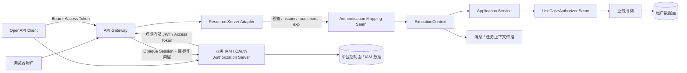
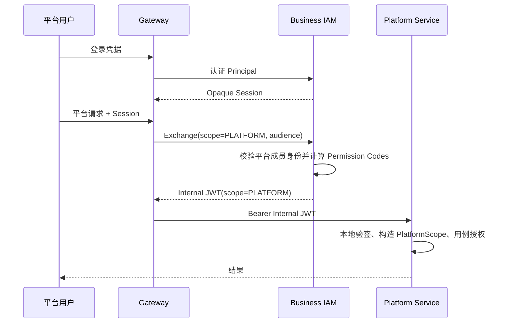
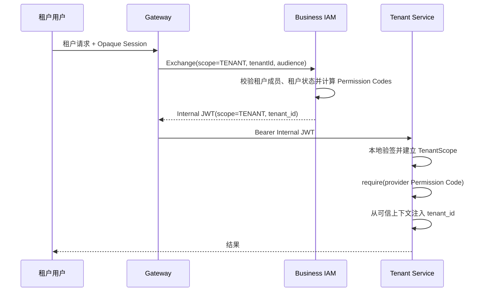
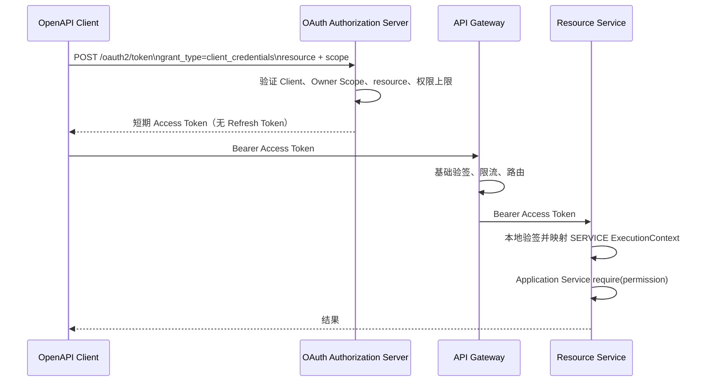

# 认证、平台/租户双身份与多租户技术方案

- 状态：Proposed
- 文档类型：目标技术方案，不代表已经完成实现
- 更新日期：2026-09-01
- 适用范围：Moduvera 脚手架、参考应用以及基于脚手架建设的业务项目

## 1. 结论摘要

本方案采用“脚手架定义安全边界和适配接缝，业务项目实现 IAM”的分层模式。

1. 脚手架不内置完整 IAM，不拥有用户目录、租户主数据、成员关系、RBAC、资源树、License 或对象级数据权限。
2. 脚手架负责把可信认证结果映射为统一执行上下文，在 Application Service 用稳定的 Permission Code 进行失败关闭的用例授权，并将租户边界传播到 HTTP、消息和持久化链路；任务链路目前仍处于孵化阶段。
3. `identity-app` 与 `gateway-app` 只作为参考 Adapter 和端到端证明，不是业务项目必须采用的用户体系或生产级认证中心。
4. 人员只保留一个 Principal；平台用户和租户用户是该 Principal 在不同授权作用域中的成员身份，不复制用户。一次请求只能激活 `PLATFORM` 或某一个 `TENANT` 作用域，权限不跨作用域继承或合并。
5. 平台人员进入租户处理业务时，必须建立有时效、可审计、可撤销的 Delegation；不得把平台管理员权限直接换算成租户权限，也不得伪造租户成员身份。
6. 浏览器参考链路保持为 Opaque Session，经网关调用 IAM/Identity 交换为短期内部 JWT。参考内部 JWT 携带当前作用域下的最终 Permission Code 快照，资源服务本地验签，不在每个请求上同步查询 IAM。当前 Gateway 会在每个受保护请求上执行 Exchange，是否缓存或复用内部 JWT 属于后续 Adapter 策略。
7. OpenAPI 采用 OAuth 2.0 Client Credentials。Client 映射为 `SERVICE` Principal；租户 Client 固定绑定所属租户，平台 Client 默认只获得平台作用域。调用方提交的 `tenant_id` 不能成为可信租户来源。
8. 当前脚手架已支持租户数据面的 JWT、ExecutionContext、Permission Code、持久化及消息隔离；平台作用域、双身份、标准 Client Credentials，以及真正可替换的认证映射和授权接口仍需补齐。

## 2. 目标与非目标

### 2.1 目标

- 建立单一 Principal 下平台/租户双成员身份与作用域激活模型。
- 区分 Principal、成员身份、执行 Actor、原始 Initiator 和当前授权作用域。
- 定义浏览器用户、OpenAPI Client 和内部服务调用的一致可信上下文。
- 明确平台控制面与租户数据面的边界及数据隔离要求。
- 固化脚手架支持范围、参考实现范围、业务 IAM 责任和后续演进顺序。

### 2.2 非目标

- 本文不实现 IAM、OAuth Authorization Server、RBAC、License 或管理页面。
- 本文不规定业务项目必须采用某一 IAM 产品、表结构或角色模型。
- 本版本不设计对象级或行级业务数据权限；数据权限后续由业务项目在授权接缝后扩展。
- Permission Code 只表示后端业务能力，不统一承担页面、按钮、菜单和 API 路由定义。前端资源可由业务 IAM 映射到 Permission Code，但不进入脚手架核心模型。

## 3. 设计输入与优先级

本方案综合以下输入：

- 会话附件《IAM-资源授权与 License 边界设计-Handoff》中的 Principal、平台/租户作用域、Delegation、Client Credentials 和控制面/数据面原则。
- 本次讨论确认的脚手架边界：只保留认证、身份、权限和租户校验接缝；业务 IAM/RBAC 与独立的 License/Entitlement 能力均由业务项目适配。
- 当前仓库 ADR、产品面说明和源码现状。

若输入之间存在差异，采用以下结论：

- Handoff 中完整 IAM 数据模型只作为业务 IAM 的参考设计，不纳入脚手架实现范围。
- 当前参考 Adapter 允许内部 JWT 携带最终 Permission Code；“JWT 不携带权限”的早期建议不再作为当前参考链路约束。
- JWT 不携带角色、资源树、License 明细、客户信息或对象级权限规则。

## 4. 责任分层

| 层级 | 当前或目标责任 | 明确边界 |
| --- | --- | --- |
| 脚手架当前正式能力 | ExecutionContext、Actor/Initiator、Permission Code、JWT 默认映射、本地权限快照检查、401/403、租户上下文、MyBatis 和消息链路隔离 | 不应表述为已经具备可替换 SPI、授权不可用语义或外部 Adapter TCK |
| 脚手架目标责任 | 可替换的认证映射与用例授权接缝、双作用域不变量、稳定错误语义、Adapter 合约测试 | 用户、密码、租户注册、成员关系、角色、资源树、License、对象级数据权限 |
| 当前参考 Adapter | Opaque Session、网关 Token Exchange、内部 JWT、极简用户/服务账号、自定义 SERVICE Token 流程证明 | 不是生产 IAM，也不是标准 OAuth 2.0 Client Credentials |
| 目标参考 Adapter | 标准 Client Credentials 示例以及平台/租户作用域接入证明 | 不形成强制产品架构 |
| 业务 IAM / 外部 IdP | 认证、用户目录、成员关系、角色、Permission 计算、Client、密钥轮换、撤销和 Delegation | 不拥有商业 License，也不执行业务用例和租户数据存取 |
| 平台商业控制面 / License | 产品、套餐、License 生命周期和租户 Entitlement | 不负责认证身份；向授权决策提供商业边界事实 |
| 业务服务 | 声明 provider-owned Permission Code，在 Application Service 入口授权，执行业务规则和业务数据隔离 | 解释外部角色、接受调用方自报权限或任意租户 |

脚手架的价值不在于替业务项目选择 IAM 模型，而在于保证无论接入何种 IAM，进入业务核心后的身份、作用域、权限和租户语义一致。

## 5. 核心概念模型

### 5.1 Principal 与成员身份

`Principal` 表示可认证主体，分为：

- `HUMAN`：自然人账号。
- `SERVICE`：OpenAPI Client、服务账号或工作负载身份。

`PrincipalType.HUMAN` 在当前执行模型中映射为 `ActorType.USER`。`SYSTEM` 是平台内部建立的执行 Actor，不是可登录 Principal；外部 HTTP 身份不得声明为 `SYSTEM`。

平台用户和租户用户不应建成两套相互独立的登录用户。同一 HUMAN Principal 可以同时拥有：

- 零或一个平台成员身份；
- 零到多个租户成员身份；
- 每个身份下相互独立的角色、Permission Code 和状态。

用户登录只证明“你是谁”；激活平台或租户上下文还必须证明“你以哪个成员身份、在哪个作用域工作”。

### 5.2 授权作用域

目标模型引入显式 `AuthorizationScope`：

```text
AuthorizationScope = PlatformScope | TenantScope(tenantId)
```

必须满足：

- 一次执行只能有一个作用域。
- `PLATFORM` 作用域禁止携带 `tenant_id`。
- `TENANT` 作用域必须携带且只能携带一个可信 `tenant_id`。
- 平台权限与租户权限独立计算，不继承、不合并。
- `ActorType` 只表示 USER/SERVICE/SYSTEM 等主体种类，不能代替作用域。
- 缺少作用域、作用域与租户不一致或映射失败时，一律失败关闭。

### 5.3 Actor、Initiator 与 Delegation

- `Actor`：当前一步实际执行操作的主体。例如入口用户、内部服务账号或消息消费者执行身份。
- `Initiator`：整条调用链最初的发起主体，用于审计和跨服务追踪。
- `Delegation`：平台主体进入某个租户上下文时取得的临时授权凭证，记录授权来源、目标租户、权限边界、原因、有效期和撤销状态。

普通同步用户请求中 Actor 与 Initiator 通常相同。服务间调用或异步消费时，Actor 可变为服务主体，但 Initiator 应继续保留原始用户或 Client。

平台人员进入租户时：

- Actor 仍是真实平台人员，不能伪装成租户用户；
- Scope 切换为目标 TenantScope；
- Permission Code 来自 Delegation 上限、目标租户授权政策及适用 Entitlement 边界的交集，该计算由业务授权实现负责；
- 上下文必须包含 `delegation_id` 和过期时间等可审计信息；
- Token 的 `exp` 不得晚于 Delegation 的 `expiresAt`，`delegation_id` 必须可回溯授权来源；
- Delegation 失效后不得继续换发 Token，已签发 Token 的撤销窗口通过短 TTL、撤销版本/事件或高风险用例在线校验收敛。

若未来支持 Impersonation，还必须分别记录真实 Actor 与被代理主体，不能用被代理身份覆盖真实操作者。

### 5.4 目标执行上下文

概念结构如下，具体 Java API 由后续实现 ADR 固化：

```text
ExecutionContext
  authorizationScope: PlatformScope | TenantScope
  actor: Actor(type, subjectId, permissions)
  initiator: Initiator(type, subjectId)
  delegation: optional DelegationReference
  correlationId: String
```

租户数据组件只接受 `TenantScope`。平台组件不得通过空租户、魔法租户或 `ignoreTenant=true` 复用租户数据路径。

## 6. 总体技术架构



关键原则：

- 网关处理外部认证协议、路由和 Token 交换；资源服务仍需独立验证 Token，不能只信任网关转发头。
- Authentication Mapping 将已验证凭证转换为协议无关上下文；Application Service 不依赖 JWT Claim 或 Spring Security 类型。
- 最终业务授权在 Application Service 入口执行。Controller、URL 规则和页面显隐只能作为前置保护，不能替代用例授权。
- 业务服务不直接解释角色、License 或 IAM 资源树，只消费稳定 Permission Code 或业务项目提供的 Authorizer 决策。

## 7. 平台/租户双身份与作用域激活机制

### 7.1 登录与身份激活分离

目标流程拆成两个阶段：

1. 认证阶段：IAM 验证密码、SSO、MFA 等凭据，建立 Principal 级会话。
2. 上下文激活阶段：用户选择平台或某一租户，IAM 校验对应成员身份、租户状态和激活政策，再签发该单一作用域的短期内部 JWT。业务授权实现随后在计算最终 Permission Code 时按需叠加 License/Entitlement 边界。

这样同一用户可在不同窗口或请求中使用不同作用域，但每个 Token 和请求保持单一、明确的安全上下文。

当前参考实现登录时必须同时提交 `tenantId`，相当于把两个阶段合并，只覆盖租户用户场景。平台登录、身份选择和租户切换属于待补能力。

### 7.2 平台用户流程



平台作用域主要服务于客户、租户、平台账号、License 和全局配置等控制面能力。平台服务不得直接使用租户数据仓储的通用绕过模式。

### 7.3 租户用户流程



用户提交的租户选择只是请求参数。只有 IAM 校验成员关系并写入已签名 Token 后，它才成为可信 `tenant_id`。

### 7.4 平台进入租户

平台进入租户不是普通作用域切换，而是受控委托：

1. 平台用户发起进入目标租户的申请或操作。
2. IAM 校验平台权限、平台与租户关系、授权策略和必要审批。
3. 创建短时 Delegation，明确目标租户、允许权限、原因和有效期。
4. 使用 Delegation 换发 TenantScope Token。
5. 业务服务以真实 Actor、目标 tenantId 和 delegationId 执行并记录审计。

平台与客户/租户之间的管理关系本身不等于访问授权；只有有效 Delegation 或业务定义的显式租户授权才能授予访问。

## 8. 内部 JWT 与认证映射契约

### 8.1 参考 Token Claims

| Claim | 当前状态 | 目标语义 |
| --- | --- | --- |
| `iss` | 已支持 | 可信签发者，必须配置并校验 |
| `sub` | 已支持 | Actor 的稳定主体 ID |
| `aud` | 已支持 | 目标服务/资源，必须校验 |
| `iat` / `exp` | 已支持 | 短期 Token 的签发与过期时间 |
| `actor_type` | 已支持 | `USER` 或 `SERVICE`；HTTP 禁止 `SYSTEM` |
| `tenant_id` | 已支持租户场景 | TenantScope 必填、PlatformScope 禁止 |
| `permissions` | 已支持 | 当前作用域和 audience 下最终 Permission Code 快照 |
| `initiator_type` / `initiator_id` | 已支持 | 原始发起者 |
| `authorization_scope` | 待设计 | `PLATFORM` 或 `TENANT` |
| `client_id` 或 `azp` | 待设计 | Client Credentials 调用方标识 |
| `delegation_id` | 待设计 | 平台进入租户时必填 |
| `jti` | 待设计 | 撤销、重放分析和审计关联 |

Token 不应包含：

- 角色及角色继承关系；
- 页面、菜单、按钮或完整资源树；
- License 明细和计量状态；
- 客户、租户或用户详细资料；
- 对象级数据范围表达式。

Permission Code 是签发时已经计算出的粗粒度能力快照。Token 生命周期必须足够短，以控制成员停用、角色变更和 License 变化带来的陈旧窗口；高风险操作仍可由业务 Authorizer 在线决策。

### 8.2 Authentication Mapping Seam

当前 Resource Server 把 Claims 映射逻辑固定在具体 `final` 类中，虽可通过 Bean 条件退让，但尚不是业务方可实现的稳定接口。

目标需要形成正式接缝，职责包括：

- 接收已经通过协议级校验的认证断言；
- 映射 Principal、Actor、Initiator、AuthorizationScope 和 Delegation；
- 校验 Claim 组合不变量；
- 输出协议无关 ExecutionContext；
- 对缺失、冲突、未知枚举和非法租户失败关闭。

JWT、Opaque Token Introspection、API Gateway Assertion 或测试身份分别作为 Adapter，不把协议类型带入 Kernel。

### 8.3 UseCaseAuthorizer Seam

目标 `UseCaseAuthorizer` 是稳定接口，业务用例只表达：

```text
require(PermissionCode)
```

默认 Adapter 从 ExecutionContext 中的 Permission Code 快照作本地判断。业务项目可替换为：

- 本地 RBAC 计算；
- 远程 IAM/PDP 决策；
- Permission + License 的组合决策；

对象级或数据权限如需扩展，应由业务项目在领域内定义独立、强类型的授权接缝，不属于当前 `require(PermissionCode)` 契约。

稳定结果至少区分：

- 未认证：401；
- 已认证但无权：403；
- 授权服务不可用且无可接受缓存：失败关闭，返回稳定的 unavailable 错误语义；
- 上下文不合法：失败关闭并记录安全审计。

当前 `UseCaseAuthorizer` 是只能读取 `Actor.permissions` 的具体 `final` 类，“授权不可用”语义也尚未实现，属于优先补齐项。

## 9. OpenAPI Client Credentials 认证机制

### 9.1 模型

OpenAPI Client 在 IAM 中对应 SERVICE Principal 和 Client 注册信息，而不是伪造用户：

- `client_id`：公开且稳定的客户端标识；
- Client 认证材料：哈希保存的 Secret、私钥、mTLS 证书等；
- Owner Scope：平台或固定租户；
- Allowed Audiences：允许调用的资源服务；
- Allowed Permissions/Scopes：可申请能力的上限；
- 状态、有效期、轮换版本、创建者和审计信息。

OAuth `scope` 是 Client 请求的能力子集，可由 IAM 映射为 provider-owned Permission Code。请求只能缩小权限，不能扩大 Client 注册上限。

资源指示优先采用 OAuth Resource Indicators 的 `resource` 参数，并由 Authorization Server 映射为 JWT `aud`。若具体 IAM 使用 `audience`，它是产品扩展参数，不属于 Client Credentials 的核心标准字段。

### 9.2 标准流程



### 9.3 平台 Client 与租户 Client

- 平台 Client：签发 PlatformScope Token，只能调用平台控制面 API。
- 租户 Client：在注册时固定绑定一个 tenantId，签发 TenantScope Token 时必须把该 tenantId 写入已签名 Claims。
- 一个 Client 若服务多个租户，应采用多个租户 Client，或由业务 IAM 建立显式、多租户授权模型；不能让调用方通过 `Tenant-Id` 请求头任选租户。即使采用多租户授权模型，每次 Token 签发也必须解析为单一 TenantScope。
- 平台 Client 进入租户也必须使用服务主体适用的 Delegation/Grant，不能凭平台身份自动获得租户权限。

### 9.4 安全约束

- Client Secret 只展示一次、加密传输、服务端不可逆存储并支持双版本平滑轮换。
- 高安全场景优先支持 `private_key_jwt` 或 mTLS；AK/SK HMAC 可作为特定生态 Adapter，不作为脚手架默认协议。
- Access Token 短期有效并具备 `jti`；停用和轮换通过短 TTL、撤销事件或必要的 Introspection 缩短生效时间。
- 强制 audience、issuer、签名算法、时间窗口和 Client 状态校验。
- 认证日志不得记录 Secret 或完整 Token。
- 网关限流、IP 策略和 WAF 只属于纵深防御，不能替代资源服务授权。

当前参考实现的 `/internal/api/v1/service-token` + HTTP Basic 是流程证明，不是标准 Client Credentials，也缺少 Client 注册、scope、Secret 轮换、撤销及正式租户绑定模型。

## 10. 多租户总体架构与结构拆分

### 10.1 平台控制面

平台控制面由业务项目建设，拥有：

- Customer 与 Tenant Registry；Customer 和 Tenant 不是固定一对一关系，Customer 不作为租户数据隔离键，Tenant 才是安全边界；
- Tenant 生命周期和状态；
- 平台成员身份与平台授权；
- 租户成员关系、角色绑定及 Permission 计算；
- Client、服务账号、Delegation、认证会话和审计；
- 租户开通、停用、迁移和跨租户运维编排。

同属平台控制面的商业 License 服务独立拥有产品、套餐、License 生命周期和租户 Entitlement。IAM 和业务授权实现可以消费 Entitlement，但 License 不是 IAM 的内部角色或资源模型。

这些概念不是脚手架 Kernel 的实体，也不要求进入每个业务服务数据库。

### 10.2 租户数据面

租户数据面拥有设备、生产、流程、任务、订单等业务数据。每条共享存储中的租户业务记录必须带 `tenant_id`，并满足：

- tenantId 来自可信 ExecutionContext，不接受客户端直接提供的值作为隔离依据；
- 仓储、缓存、锁、幂等键、Outbox/Inbox、对象存储路径和搜索索引都纳入租户命名空间；
- 缺失 TenantScope 时租户组件失败关闭；
- 业务表只保留必要的 `tenant_id`、创建/更新审计信息，不复制密码、手机号、角色、资源或 License 数据。

当前脚手架已提供基于 ExecutionContext 的 MyBatis-Plus TenantLine 拦截器，并在参考仓储和 PostgreSQL/MySQL 合约中验证共享表隔离。手写 SQL、旁路 JDBC 和其他存储技术仍需由对应 Adapter 提供同等保证。

### 10.3 平台与租户服务拆分

推荐按安全边界而非仅按部署数量拆分：

| 维度 | 平台控制面服务 | 租户数据面服务 |
| --- | --- | --- |
| 作用域 | 普通接口只接受 PlatformScope；Delegation 创建和换发仍是显式控制面用例 | 只接受委托后或普通成员取得的 TenantScope |
| 数据 | Customer、Tenant、IAM、License、Client、Delegation | 订单、设备、库存、任务等租户业务数据 |
| 仓储 | 平台专用仓储 | 强制 tenant_id 隔离的仓储 |
| API | 租户生命周期、平台配置、授权管理 | 单租户业务用例 |
| 跨租户操作 | 显式管理用例、显式授权、强审计 | 不提供通用绕过开关 |

物理上可部署为微服务或单体模块，但依赖方向、上下文类型和仓储能力必须保持边界。单体模式也不能因为同进程而跳过身份与租户约束。

委托后产生的 TenantScope Token 只用于目标租户数据面，除非另有独立、显式的跨租户管理 API；平台服务不能以“委托接口”为名直接绕过租户数据边界。

### 10.4 HTTP、消息和任务入口

- HTTP：Resource Server 校验凭证并建立上下文；用户请求头不得覆盖 Token 的可信作用域。
- 消息：消息携带 tenantId、生产时 Actor/Initiator 和 correlation，但不携带可直接信任的权限；消费端用本地 Inbound Contract 的执行 Actor 和权限策略重建上下文。Broker 认证与 destination ACL 才是可信生产者边界。
- 任务：调度器必须从可信 Tenant Registry 或显式管理命令获得租户集合，为每次租户任务建立独立 TenantScope；平台任务使用 PlatformScope。不得用无租户上下文遍历全部租户数据。
- 内部同步调用：本地和远程调用保持相同身份、作用域和授权语义，不因传输方式变化而隐式升级权限。

## 11. 当前能力与目标差距

| 能力 | 当前状态 | 结论 |
| --- | --- | --- |
| `ExecutionContext`、Actor、Initiator、correlation | 已正式支持 | 当前 tenantId 必填，只覆盖租户数据面 |
| Permission Code 与 Application Service 授权 | 已正式支持 | 格式稳定，但 Authorizer 仍是具体类 |
| JWT issuer/audience/签名/时间校验 | 已正式支持 | 继续作为默认 Resource Server Adapter |
| USER 租户约束与上下文清理 | 已正式支持 | 请求头不能覆盖 USER Token tenantId |
| MyBatis 租户隔离 | 已正式支持 | 其他数据技术需同等 Adapter |
| 消息上下文与本地消费策略 | 已正式支持 | Broker 认证/ACL 由运行环境保障 |
| JobRunner 上下文 | Incubating | 调用方显式提供 Tenant ExecutionContext；无平台 Scope、可信租户枚举或正式任务身份模型 |
| Servlet Resource Server | 已正式支持 | 当前为 Servlet + ThreadLocal；异步线程需显式 Snapshot，尚无通用 Reactive Context Adapter |
| Opaque Session → 内部 JWT | Reference-only | 可保留为示例，不规定业务 IAM |
| 极简用户、直接权限、服务账号 | Reference-only | 证明链路，不等同完整 IAM/RBAC |
| PlatformScope / TenantScope | 未支持 | 当前 ExecutionContext 强制 TenantId，Claims 无作用域 |
| 平台/租户双身份和作用域选择 | 未支持 | 当前登录始终要求 tenantId |
| Delegation | 未支持 | 需由业务 IAM 实现，脚手架定义映射与审计字段 |
| Authentication Mapping Interface | 部分具备 | 只有具体 final 类和 Bean 退让，不是稳定 SPI |
| UseCaseAuthorizer Interface | 部分具备 | 当前只能本地读取权限集合，缺 unavailable 语义 |
| 标准 OAuth2 Client Credentials | 未支持 | 当前是自定义 service-token 接口 |
| 生产密钥轮换/多实例 | 未支持 | 参考 Identity 重启生成内存密钥 |
| IAM/RBAC/资源/数据权限 | 非脚手架范围 | 由业务项目实现并映射到接缝 |
| License/Entitlement | 非脚手架范围 | 由平台商业控制面实现，作为授权决策的独立事实源 |

## 12. 当前已识别风险

### 12.1 SERVICE Token 租户越界风险

当前参考 Identity 在申请 service-token 时接收 tenantId，但签发 JWT 时没有写入 `tenant_id`。Resource Server 对未绑定租户的 SERVICE Token 接受调用方提供 `Tenant-Id`，而 Identity 只按 serviceId + audience 查询权限。这会使 Client 具备自选租户的可能性。

目标方案禁止该行为：租户 Client 必须由 IAM 固定绑定 tenantId 并写入签名 Token；平台或多租户 Client 必须走显式 Grant/Delegation 决策。该问题在参考实现演进时应列为最高优先级安全项。

### 12.2 SERVICE Token Initiator 完整性风险

当前自定义 service-token 请求直接接收 `initiatorType` 和 `initiatorId`，但只校验格式，不能证明该 Initiator 来自已认证的上游身份。认证成功的服务可以提交任意用户 ID，因此这些字段目前只能视为服务声明的审计信息，不能作为可验证身份。

目标实现必须从已验证的上游 Token Exchange、Delegation 或签名 Actor Chain 派生 Initiator，不接受任意 JSON 字段作为可信原始发起者。

### 12.3 Tenant ID 契约不一致

Kernel `TenantId` 最大长度为 64，而参考 Identity 的数据库和 service-token 校验允许更长值，可能产生签发端接受、资源端拒绝。目标方案需要在共享契约中统一格式和长度，并为 Adapter 增加合约测试。

### 12.4 参考签名密钥不具备生产能力

参考 Identity 启动时在内存生成 RSA 密钥和随机 `kid`，不支持重启连续性、多实例共享、轮换和历史公钥保留。生产 IAM 必须使用持久化密钥管理、JWKS 轮换和重叠验证窗口。

### 12.5 消息 source 不等于生产者认证

消息契约中的 source 只能做语义匹配，不能证明真实生产者。实际项目必须配置 Broker 身份认证、Topic/Destination ACL 和必要的传输加密。

## 13. 后续演进方案

### 阶段 1：固化脚手架接缝

- 将认证映射抽象为业务可实现的稳定接口，JWT 作为默认 Adapter。
- 将 `UseCaseAuthorizer` 抽象为稳定接口，保留本地 Permission 快照默认实现。
- 定义 missing permission、authorization unavailable 和 invalid context 的稳定错误语义。
- 提供外部 IAM Adapter 合约测试，而不仅是默认 JWT 路径测试。

完成标准：业务项目可接入不同 IAM，而 Application Service、持久化和消息模块无需理解外部角色或 Claims。

### 阶段 2：引入显式双作用域

- 增加 PlatformScope / TenantScope，不使用 nullable tenantId 表达平台上下文。
- 扩展内部断言的 `authorization_scope`，并校验与 tenantId、ActorType 的组合不变量。
- 提供平台控制面和租户数据面的负向架构测试。
- 覆盖平台权限误入租户、租户 Token 访问平台 API、Scope 混合和 Tenant 覆盖等场景。

完成标准：同一 Principal 可安全激活平台或单一租户身份，任何作用域混淆均失败关闭。

### 阶段 3：补齐标准 Client Credentials 参考 Adapter

- 提供标准 `/oauth2/token` Client Credentials 示例或正式对接外部 OAuth Server。
- 增加 Client Owner Scope、resource/audience 映射、scope/Permission 映射、租户固定绑定、Secret 轮换和 `jti`。
- 修复参考 SERVICE Token 可自选 Tenant-Id 的风险。
- 明确无需 Refresh Token，并验证停用、轮换、过期和 audience 错误路径。

完成标准：OpenAPI Client 无法越过注册时的租户、audience 和权限上限。

### 阶段 4：Delegation 与控制面参考契约

- 定义 Delegation 在认证映射、Token 和审计中的最小字段。
- 提供平台进入租户的参考流程与拒绝场景。
- 只定义接入契约和示例，不把 Tenant Registry、审批或 License 引入脚手架 Kernel。

完成标准：平台进入租户可追溯真实 Actor、授权来源、目标租户、有效期和权限边界。

### 阶段 5：入口一致性与生产化验证

- 对 HTTP、同步远程调用、消息和任务建立同一上下文不变量测试矩阵。
- 验证缓存、锁、搜索、对象存储、Outbox/Inbox 和审计的租户命名空间。
- 验证生产密钥轮换、多实例、撤销传播和故障时失败关闭。

完成标准：不同传输和部署形态不改变身份、权限与租户隔离语义。

## 14. 安全不变量与验收场景

以下规则应作为后续实现和 Adapter 合约测试的最低验收集：

1. 无可信认证结果不能建立 ExecutionContext。
2. 一个请求不能同时具有 PlatformScope 和 TenantScope。
3. PlatformScope 携带 tenantId 必须拒绝；TenantScope 缺失 tenantId 必须拒绝。
4. 用户或 Client 请求头不能覆盖已签名 Token 中的 tenantId。
5. 租户 Client 不能访问其他 tenantId，即使提交合法格式的请求头。
6. 平台权限不能直接访问租户数据面；必须有有效 Delegation。
7. Delegation 过期、撤销或权限越界时必须拒绝。
8. Application Service 未声明或未获得 Permission Code 时必须拒绝。
9. IAM/远程 PDP 不可用时不得默认放行。
10. audience、issuer、签名、算法、exp 任一校验失败均不得进入业务用例。
11. HTTP、消息和任务重建的上下文必须保持 tenantId 与 Initiator 可追踪。
12. 消息中的自报权限不得成为消费端授权依据。
13. 单体本地调用与微服务远程调用必须具有相同授权结果。
14. 跨租户管理只能通过独立显式用例，不能开放全局 ignore-tenant 开关。
15. 日志、指标和审计不得泄露密码、Client Secret 或完整 Token。

## 15. 待后续实现阶段确认的设计点

以下问题不影响本方案边界，但在编码前需通过 ADR 或业务 IAM 选型确认：

- `AuthorizationScope` 是升级现有 ExecutionContext，还是以兼容层逐步迁移；
- 内部 JWT 与外部 OAuth Access Token 是同一 Token，还是由网关继续执行 Token Exchange；
- Delegation 的审批来源、最长时效和紧急访问机制；
- Permission 快照的默认 TTL，以及哪些高风险用例要求在线决策；
- Client 认证首选 `client_secret_basic`、`private_key_jwt` 或 mTLS 的产品组合；
- 平台控制面与租户数据面在单体和微服务拓扑中的具体模块落位。

这些选择属于 Adapter 或业务项目架构，不改变“脚手架只提供接缝与安全不变量”的核心结论。

## 16. 相关决策与现状文档

- [ADR 0002：Opaque Browser Token 与内部 JWT](../adr/0002-use-internal-authentication-with-opaque-browser-tokens-and-internal-jwt.md)
- [ADR 0003：Tenant Context 是系统边界](../adr/0003-make-tenant-context-a-system-boundary.md)
- [ADR 0004：本地与远程 Service API 语义一致](../adr/0004-use-one-service-api-for-local-and-remote-calls.md)
- [ADR 0021：消息入站契约不信任线上权限](../adr/0021-validate-inbound-message-contracts-without-wire-permissions.md)
- [ADR 0035：提供认证授权接缝而不拥有 IAM](../adr/0035-expose-authentication-and-authorization-seams-without-owning-iam.md)
- [脚手架产品能力面](SCAFFOLD-PRODUCT-SURFACE.md)
- [RFC 6749 §4.4：OAuth 2.0 Client Credentials Grant](https://www.rfc-editor.org/rfc/rfc6749.html#section-4.4)
- [RFC 8707：OAuth 2.0 Resource Indicators](https://www.rfc-editor.org/rfc/rfc8707.html)
- [RFC 9700：OAuth 2.0 Security Best Current Practice](https://www.rfc-editor.org/rfc/rfc9700.html)
