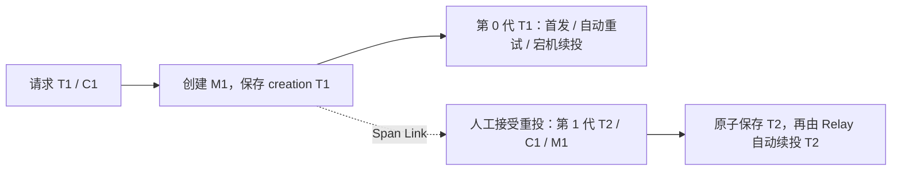

# 日志接入整体方案

状态：2026-09-06 维护者已整体确认。维护者审阅完整方案、核对 Outbox Trace 持久化与改动范围后回复“好的，那就这样定”。本文件记录已选定的接入设计与待取得的实施证据；日志活规则已同步到 [LOGGING.md](LOGGING.md)，Java 映射见[本地绑定](bindings/JAVA-SPRING-BOOT.md)。[正式规格](../../.scratch/governed-observability/spec.md)已按后续 to-spec 请求整理，状态为 needs-triage 待审阅；相邻契约同步见第 9 节，运行代码仍未实施。完整经过见[决策记录](decisions/TRACE-AND-BUSINESS-CORRELATION.md)。

## 1. 整体选择

采用灵脉日志规范，首版直接接入 OTel Java Agent。`correlationId` 关联一次根入口操作及其派生工作，Trace 描述实际执行关系，消息与命令 ID 保留各自业务职责。关联从入口开始，跨持久化保留；Trace 在明确的人工重投边界换新，不按等待时长切换。

| 事项 | 本稿默认方案 |
|---|---|
| correlation 创建 | 公网请求、独立任务等新根入口创建一次；查询入口也创建 |
| correlation 继承 | 内部 HTTP、本地调用、异步任务、消息与原消息重投继承 |
| Trace 创建与传播 | Agent 管理；框架补足任务与持久化边界，共用一个 SDK |
| Outbox 自动发送与重试 | 同一发布代次继续同一 Trace，每次实际执行创建新 Span |
| 人工重投 | 同一消息的新发布代次，建立新 Trace，Link 原创建上下文；新代次信息与状态原子持久化 |
| 消费与批量 | 使用本次投递的 Agent 上下文；消息创建上下文用于 Link，不覆盖当前消费上下文 |
| 清理 | 请求、任务和逐条消息作用域退出时恢复进入前状态，涵盖异常、取消和线程复用 |
| HTTP 回写 | `X-Correlation-Id`、`X-Trace-Id`；Problem 保留 `correlationId`，不新增 Trace 正文字段 |
| 输出与指标 | ECS JSON → stdout；Trace → OTLP；应用指标继续由 Micrometer 管理 |
| 审计能力 | 单独专题定义；复用身份与关联语义，另定持久性和事务保证 |

## 2. 标识与载体

| 含义 | Java / 运行载体 | HTTP / 消息 | 持久化 / 日志 |
|---|---|---|---|
| 根操作及其派生工作 | `ExecutionContext.correlationId`；认证前使用请求诊断状态 | `X-Correlation-Id`；信封 `correlationid` | 既有 `correlation_id` 列；日志 `correlation_id` |
| 当前执行追踪 | OTel Context / Span；不进入 Kernel | 标准 `traceparent`、可选 `tracestate` | 日志 `trace_id` / `span_id`；持久化完整传播值 |
| 不可变消息创建上下文 | MessageDescriptor 中可选纯值 `creationContext` | 信封可选 `traceparent` / `tracestate` | Outbox `creation_traceparent` / `creation_tracestate` |
| 当前 Outbox 发布代次 | claim 结果中的独立元数据 | 不增加业务 payload 或消息身份字段 | `publication_generation`、`publication_traceparent` / `publication_tracestate` |
| 消息 / 命令 / 直接因果 | 保留现有模型 | 保留现有 ID、payload 与 `causationid` | 原去重键与领域键不变 |

新 correlation 使用标准 UUID v4 字符串。内部 HTTP 接受 1–128 个字符，匹配 `[A-Za-z0-9][A-Za-z0-9._-]{0,127}`；不裁剪、不补零、不转成 Trace。ExecutionContext 保留既有非空与构造校验，无需改成 Optional；消息模型/存储读取沿用既有非 blank、长度不超过 128 的约束，不借日志接入额外收紧旧信封格式。纯值 Trace 载体只包含标准传播字符串，不序列化 SDK 对象、MDC、权限或身份 baggage。

兼容范围以当前可执行业务的消息为准：MessageDescriptor 能容纳的值不一定能通过 ExecutionContext 的现有校验。仅能读出但此前就不能进入执行上下文的旧值，保留原值并走既有契约失败流程；不声称本轮修复这类历史数据，也不生成新 C 冒充原关联。

信封与 Kafka transport header 的同名 Trace 字段属于不同层：**信封保存首次创建关系，Kafka header 表示本次投递关系**。人工重投后二者不同是正常情况。读取方必须明确来源，不能笼统地把任意 `traceparent` 当成当前父节点。

订单、库存等业务表和 Inbox 不统一增加 correlation 列。Outbox 已有 correlation 列；新增存储成本主要来自两组 Trace Context 与一个发布代次。需要脱离原消息恢复操作的持久任务/流程，才在自身操作记录保存 correlation。当前 Order 的 messageId 与 commandId 恰好取相同值，此次不改变其生成规则。

## 3. 创建、继承与结束时机

| 时机 | Correlation | Trace / Span | 结束与持久化 |
|---|---|---|---|
| 新公网 HTTP，包括普通查询 | 新 C；忽略调用方提供的 correlation | 合法 W3C 上下文由 Agent 接续；缺失/非法则新 Trace | 完整请求结束后记录一次 canonical，释放请求状态 |
| 内部 HTTP | 继承有效 C | Agent 创建 client/server Span 并传播 | 每次可观察客户端尝试记录结果，各服务记录自身请求结果 |
| 单体内直接调用 | 继承 C | 保持当前上下文；不为每个 Java 方法强制开 Span | 原作用域负责结束 |
| 同一执行单元切换线程 | 捕获并恢复 C | 传播完整当前 Context，不额外开任务 Span | 每次回调退出即恢复该线程原状态 |
| 新的进程内异步任务 | 提交前捕获 C | 提交前捕获父 Context；任务实际开始时开一个任务 Span | 完成/失败/取消后记任务结果并结束 Span |
| 新的独立定时触发 | 每次触发新 C | 每次任务新 Trace | 本次任务结束即结束，不跨调度周期保持打开 |
| 显式触发新的持久任务 | 继承触发操作 C，保存到任务记录 | 执行时独立 Trace，Link 保存的触发 Context | 排队本身不是任务执行耗时；两者分开观察 |
| Outbox 首次追加 | 保存当前 C | 捕获消息创建 Context，初始发布代次为 0 | 与业务状态、发布意图共同提交；不在此声称已发送 |
| Relay 首发、自动重试、租约接管、宕机续投 | 恢复消息 C | 恢复当前发布代次；每次实际执行新 Span | 本次发送与状态写回完成后结束，等待期不开长 Span |
| 人工 redrive / 原消息独立恢复任务 | 保持原 C，管理请求 C 不覆盖它 | 新发布代次、新 Trace，Link 原创建 Context | 接受恢复时原子保存新代次；后续自动重试沿用这一代 |
| 消费及消费侧局部重试 | 恢复消息 C | 保留本次 Agent 消费 Context；局部每次业务尝试用子 Span | Inbox/handler 每次尝试结束恢复作用域 |
| 新命令、新事件 | 同一因果操作继承 C；新根操作新 C | 以实际执行位置产生新创建 Context | 按原业务契约创建消息，不能用 redrive 替代新业务操作 |

在上下文完整的正常路径中，只有明确的新根操作和人工新发布代次会主动断开相应父链。HTTP 父 Span 已结束、队列积压很久、跨天、进程重启，都不是自动换 Trace 的条件。历史缺失或损坏的 Context 无法保证连续性，按第 5.3 节显式修复。已结束 Span 的上下文可以继续成为父节点，这是 OTel 允许的行为；本项目仍在各执行尝试结束时及时结束 Span。[OTel Tracing API](https://opentelemetry.io/docs/specs/otel/trace/api/#end)

任务提交失败或执行前被取消时，没有“任务已执行完成”这一事实；由提交/取消边界记录实际处置。已经开始的任务在其可观察终止点记录一次结果。Job、长连接、设备等未进入当前受支持产品面的能力，本节仅定义今后接入遵守的语义，不激活对应运行组件。

## 4. HTTP、身份建立与线程清理

### 4.1 入口分类与缺失值

公网入口由装配与路由的信任边界声明，不能凭请求自行设置的“内部”Header 判断。Gateway 对公网建立 C，向内部调用注入它；服务只在已配置的内部来源边界继承。直接暴露为公网的服务也执行根入口规则。Trace 与 correlation 都不授予任何身份或权限。

- 公网 `X-Correlation-Id` 不采信，也不记录其原值。所有后续响应与下游请求使用本入口建立的 C。
- 内部 HTTP 缺失/非法 C：入口只补建一次，记录恢复 WARN，不因诊断字段单独拒绝业务请求。拒绝认证/租户信息缺失的原规则不变。
- 消息仍按既有必填 correlation 与执行上下文契约验证；不把本稿 HTTP Header 的格式要求新增为旧信封 schema 限制。缺失或违反既有执行契约按非重试契约错误处理，不能消费到一半另造 C 掩盖契约错误。
- Trace 缺失或非法：标准解析器放弃无效关联并建立有效执行 Context；不更换已存在的 C，不把仅 Trace 格式异常的合法消息判成业务 poison。

公网默认接受合法 W3C Trace Context，但它只参与诊断拓扑；不传播身份 baggage。若未来需要完全忽略公网 Trace，应在 Agent 提取前的入口/传播器接缝实施，不能假设普通 Servlet Filter 能撤销已经创建的 server Span。

### 4.2 一个请求只有一份诊断状态

请求进入时建立诊断状态：C、请求计时起点、server Span 上下文、可信身份投影快照，以及结果日志的一次性完成标记。Servlet 放入 request attribute，WebFlux 放入 exchange / Reactor Context。所有响应处理器读取同一状态，不再各自调用 UUID 兜底。

认证之前只有诊断状态，没有伪造 Tenant/Actor 的 ExecutionContext。认证及执行身份建立成功时，身份组件同时提供用于结束日志的不可变字段快照；实际身份作用域仍按原安全规则及时退出。最终日志从快照取字段，不能为等日志而延长授权上下文生命周期。

| 字段 | 类型与投影规则 |
|---|---|
| `correlation_id` | string，取本执行单元已有 C |
| `tenant_id` | string，仅可信租户已建立时出现 |
| `actor_type` / `actor_id` | string；类型为 USER / SERVICE / SYSTEM，ID 来自当前可信 Actor |
| `initiator_type` / `initiator_id` | string；来自原始可信 Initiator，不能替代当前 Actor 授权 |
| `user_id` | string，仅当前 Actor 为 USER 时投影其 ID；SERVICE/SYSTEM 不填入此字段 |
| `trace_id` / `span_id` | string，来自实际 OTel Context；结束日志使用捕获的本执行单元上下文 |

未知身份字段省略。认证前拒绝不猜测 tenant/user；已建立可信执行身份后的权限拒绝可以记录其字段。MQ 消费使用本地 consumer 执行 Actor，不能把原 producer Actor 当成本次权限主体。

### 4.3 完成、响应与恢复

Servlet 同步请求在最终状态确定时结束；异步请求由实际 complete/error/timeout 生命周期收口，不能在第一次 Filter 返回时提前记完成。重分派、错误回调和超时竞争共享一次性完成标记。

WebFlux 在订阅与实际终止生命周期中记录；`doFinally` 等终止入口共用完成标记。Reactor Context 保存跨回调状态，ThreadLocal/MDC 只在当前回调的短作用域内安装。线程池与虚拟线程同样在 `finally` 恢复进入前的 ExecutionContext、OTel Scope 和本层 MDC 键；不使用全局 `MDC.clear()` 清除上层字段，不把某条消息的 Context 挂到整个轮询批次。

响应统一回写 `X-Correlation-Id` 与 `X-Trace-Id`；Problem 的 `correlationId` 等于本请求 C。保留原生状态码与 RFC 9457，暂不新增 `traceId` 正文字段。Gateway 自产错误使用自身请求状态；下游 Problem 正文保持透传，正常链路因 C 继承自然一致。若异常下游返回不一致的 C，保留入口响应头与原正文并记录传播契约失败，不能重写业务响应掩盖断点。

响应已提交或客户端断开时，不伪造实际未发送的 Header/状态码。可观察传输异常必须进入请求结果；捕获的 server Span 上下文也用于结束日志对位，即使该回调执行时线程上已无活动 Span。

## 5. Outbox 的持久化闭环

### 5.1 三层上下文

1. **消息创建上下文不可变。** 在框架发布边界捕获一次。采用短 `outbox.append` INTERNAL Span 作为创建锚点，随消息保存其 Context；Span 结束只表示追加调用结束，不证明外层事务提交或 Broker 接收。
2. **发布代次父上下文可持久替换。** 第 0 代直接引用 creation；每次成功人工 redrive 更新为一个新的无 parent 根锚点，Link creation，也可 Link 管理请求。该根锚点在数据库决定完成后结束，不等待消息最终送达。
3. **单次执行上下文不回写。** 每次 Relay 执行开 `outbox.publish` INTERNAL Span，以当前代次为 parent，并 Link creation，覆盖 Broker 发送与 Outbox 完成状态写回。Kafka producer Span 与实际 transport header 注入由 Agent 负责，不另造 producer Span。

框架仅在 Adapter 层使用 Agent 的 OTel API；Kernel 与 message-core 保存纯值、保留协议无关契约。[Agent API 接入说明](https://opentelemetry.io/docs/zero-code/java/agent/api/)

### 5.2 redrive 的唯一接受点

保持现有 `message_id + TERMINAL + claim_token` 的 CAS 条件。在同一个数据库更新/事务中执行：`TERMINAL → PENDING`、`publication_generation + 1`、保存新 publication Context，以及原有调度/claim/失败状态清理。creation、C、MessageId、causation、payload、原始时间、tenant、source、destination、partition key 不变。

CAS 失败不产生有效新代次；回滚时状态与 Context 一起回滚；提交成功后只发既有无载荷 wake 信号。Relay 从数据库读取该条消息的当前代次，不能依赖管理请求线程、after-commit 闭包中的上下文或进程缓存。

第一次人工恢复为 T2，第二次成功人工恢复为 T3；各代内自动重试仍使用自己的 Trace。保留现有累计失败计数，generation 不充当尝试次数，也不进入 Inbox 去重键。保留 MessageId 的重投不会强制已成功消费者重新执行业务。

当前行仅保存最新发布代次，满足重启后恢复；它不提供历次操作人、理由和变更历史的完整审计。

### 5.3 故障结果

| 情况 | 结果规则 |
|---|---|
| Broker ACK 后、数据库标记前宕机 | 后续同代 Trace、新 Span 续投；允许重复投递，Inbox 仍按原键去重 |
| Broker 成功但状态写回失败/claim 已失效 | 发送结果可成功，Outbox 完成不能记成功；保留两层可观察结果 |
| redrive 已提交、根 Span 尚未导出即宕机 | 新代次 Context 仍可恢复；每次 publish Link creation，补足可见关联；不承诺根 Span 已落入后端 |
| 旧记录没有 creation | 保持历史未知；有效 claim 下首次发送前 CAS 初始化并持久化 publication Context，后续复用；不伪造旧 creation |
| 当前 publication 元数据损坏 | 放弃非法父关系；在有效 claim 下修复并持久化新的 publication Context 后续投，generation 不因自动修复增加；WARN 明确记录 Trace 连续性已中断，之后复用修复后的 Context |
| 无有效 SDK / 未装 Agent 的隔离测试 | 不伪造 Trace ID；已有 correlation 仍有意义。这不构成受治理运行的验收证据 |

claim/poll 的批处理设施不能从第一条消息借 tenant、C 或 Trace。每条恢复、发送与清理独立完成；一个 Kafka API send 内不可观察的网络重发不编造独立尝试计数。

## 6. 消费、批处理与埋点归属

HTTP、Kafka 和支持范围内的客户端自动 Span 由 Agent 创建。框架只补业务执行单元与持久化语义：任务、Outbox append/publish、Inbox/handler 的单次处理。每个同语义 Span 只保留一个 owner，不同时启用另一套 tracing bridge。

消费适配器保留 Agent 根据**本次 transport header**建立的当前处理上下文；原 creation 添加为 Link，禁止再提取为 parent 把人工重投拉回 T1。框架单次处理 Span 是当前消费 Span 的子节点。没有传入父上下文时，仍复用 Agent 已建立的有效根消费 Context；只有当前也不存在有效处理 Context 时，框架才补一个根处理 Span 并 Link 有效 creation，不重复创建 consumer Span。

不要求所有消费者与 producer 强制同一 Trace：Agent 可以通过父子或 Link 表达投递关系，但必须存在可验证的因果关系；跨 Trace 的业务查询使用 C。OTel 消息约定支持 Links，且相关语义仍标为 Development，实际 parent/Link 形状和 Span 数量必须在锁定版本组合中验收。[OTel Messaging spans](https://opentelemetry.io/docs/specs/semconv/messaging/messaging-spans/)

现有逐条消费逐条恢复 C 与身份。未来若引入跨消息批量 handler，批次不能声明一个虚假的共同 C/tenant/parent；批次 Span Link 各消息，逐条业务处理各自恢复。未认证 producer、非法业务信封、Inbox 事务与 handler 重试归属保持现有规则。

## 7. 日志记录时机与结果

沿用主规范的 logger、级别与记录责任，以下把现有歧义统一为本稿默认值：

| 时机 | 记录 |
|---|---|
| HTTP 请求、消息处理、已开始的任务完成 | 一条 canonical INFO；结果不改变其级别 |
| 按业务边界分类需要记录的 HTTP / MQ 发送，每次可观察尝试结束 | 一条交互结果 INFO，带本次结果与耗时；非业务边界沿用主规范分类，异步最终失败沿用场景合并例外 |
| Outbox append 返回 | 仅发布意图加入事务；不记录“消息已发送”或“业务已提交” |
| 业务事务真正提交 | 依赖提交成立的业务事实在提交后记录；回滚不记该成功事实，纯计算事实按其实际成立点记录 |
| 确定执行重试/降级 | WARN；耗尽的最后一次不再记“将重试” |
| 失败无人接盘且需要人工介入 | 最终处理点一条 ERROR，带稳定 `error.code` 与安全处理后的 cause |
| 自有数据库、缓存正常调用 | 默认不记 INFO；技术 Span 与日志各自承担职责 |

HTTP 最终 2xx/3xx 为 success，4xx/5xx 为 failure。即使无状态码，只要观察到 DNS、连接、超时或传输失败，也为 failure；仅无法得知本次结果时为 unknown。1xx 不是完成状态，不提前记完成。发送失败不证明远端业务一定没执行。

`duration_ms` 记录实际经过时间，以单调时钟差值转为毫秒；`@timestamp` 使用 UTC 墙上时间。HTTP 计完整请求，任务计开始执行到终止，Outbox 发送计实际可观察发送；排队等待不能混成调用耗时。中断/取消记录实际终止原因，不能凭已设置 200 推断完整响应成功。

重试字段只来自控制当前重试的计数器。Outbox 已有失败计数不等于全部发送次数；不能为满足 `retry.attempt` 编造数字，也不能与 generation 混用。全套字段安全禁令同时覆盖异常 message、cause、结构化字段以及自动埋点采集的数据；不记录原始 Header、query、SQL 全文或消息正文。

## 8. 脚手架提供的实现边界

| 组件归属 | 应提供能力 |
|---|---|
| 公共日志 Starter | ECS 输出、字段类型与命名、可信身份/correlation 投影、Trace 字段映射、上下文组合工具；仍使用 SLF4J，不封装新 logger 门面 |
| Web/Auth/Gateway 接缝 | 请求诊断状态、根入口与内部继承、Header/Problem、身份快照、canonical 与异步清理 |
| Messaging 接缝 | 创建 Context、纯值载体、Outbox 代次持久化、逐条恢复、处理结果与 Link |
| 已支持的任务执行接缝 | 提交前快照、执行时作用域与任务 Span、结束清理；不提前实现独立任务平台 |
| App 与验证启动资产 | Agent 制品固定与校验、显式装载、配置、两拓扑与独立消费者验证 |

公共日志组件只依赖实际需要的日志、OTel API 与框架上下文接缝，不把 Servlet、Reactor、Kafka 一起强制引入所有服务。优先使用当前 Boot 原生 ECS；输出夹具若证明 `error.code` 与 throwable 等字段冲突，再补最小 Formatter 修正，是否需要修正由真实输出判定。

Agent 首版采用固定版本和 SHA-256 的外置制品，开发/验收启动脚本准备，容器运行时只读挂载；公共镜像不为本轮单独内置 Agent。参数由运行装配注入。正式受治理启动要求 Agent 可用，缺失/装载错误提前失败；库级测试可无 Agent，但不能宣称链路已接入。确切版本、API 依赖组合和摘要由实施者在 JDK 26、Boot 4.1.1 的兼容验证后锁定，不使用 `latest`。

本地与验收基线：`otel.propagators=tracecontext`；`otel.traces.exporter=otlp`，协议显式 `http/protobuf`，指向验证专用接收端；`otel.logs.exporter=none`，保留 stdout 单一日志采集入口；`otel.metrics.exporter=none`，应用指标沿用 Micrometer，避免重复导出。配置项依据 [Java SDK 配置](https://opentelemetry.io/docs/languages/java/configuration/)，这些取值是本仓库选择。

验收根 Trace 全采样，并单独覆盖上游未采样场景；未采样仍应有有效上下文与日志 ID。正式运行采样比例属于环境配置。采集后端不可用使用有界异步导出，不阻塞业务事务、不重放业务、不改变 Broker ACK；启动必需制品缺失与运行中后端失联是不同情况。生产后端、Collector 部署、保留期、告警与 SLO 不由本稿选择。

## 9. 迁移与既有材料对齐

- **数据库采用追加迁移。** PostgreSQL/MySQL 保留 V1，新增两组可空 Trace 字段和非空、默认 0 的 generation；使用标准传播值并对输入限定标准大小。不清库，不自动覆盖现有积压。正常启动仍校验，迁移执行保持 ADR 0033 的显式策略。
- **消息新增可选 Trace 扩展。** 两份 schema、mapper、Java 构造调用与 TCK 一起调整。保留 correlation 必填及原消息语义；本轮设计沿用现有 MessageType major。按 consumer-first 先更新读取与校验端，再启用写出；旧命令 schema 的 `additionalProperties: false` 不接受新增字段，不能宣称旧校验器可直接读取新信封。本稿保持旧消息可由新端读取，不承诺新消息回退到旧严格校验器；旧新消息样本和兼容范围须验证。若实施引入破坏性必填或语义变化，按 ADR 0020 新 major，不能静默豁免。
- **HTTP 有一项明确调整。** 公网不再接受调用方自定 C；内部继承。[HTTP Problem Spec](../../.scratch/http-problem-contract/spec.md)及其既有票已按入口类型同步，并保留正常链路 Header/body 一致性和异常下游不一致时的正文透传规则；未改变其执行状态或实施代码。
- **传播专题保持分工。** [ExecutionContext 传播 Spec](../../.scratch/execution-context-propagation/spec.md) 对齐非空 C、根入口与继承；Trace 快照在适配层组合，不把 OTel 引入 Kernel，不顺带实施全部 Scope/Platform 设计。
- **主规范已对齐。** correlation/身份字段类型、无状态码传输失败、单调计时及生命周期规则已写入活规则和本地绑定；绑定明确源场景在本仓库的适用条件，灵脉原文快照继续保留。
- **正式规格已整理。** [受治理可观测性 Spec](../../.scratch/governed-observability/spec.md)包含完整用户故事、验收接缝与边界；Micrometer 以既有九个 Outbox 指标为本轮基线，保留语义并验证标签与装配，不新建指标平台或公网端点。ExecutionContext Spec 已补共享接缝说明；未新建实施票。

最初盘点的 73 个非历史引用文件是检索起点，不是本方案要求修改的文件数。保留 correlation 后省去废弃字段导致的 Kernel 构造调用、HTTP 关联字段和相应测试的连锁迁移；MessageDescriptor 新增 Trace carrier 仍可能影响消息构造夹具。全局处理使业务接入集中到框架，Outbox 持久化、HTTP/任务生命周期、输出与运行装载的工作仍需完成，不能据此声称总工作量已大幅降低或给出减少文件数。订单/库存状态机、权限、Inbox 去重与事务保证不变，详见[范围证据](TRACE-CONVERGENCE-SCOPE.md)。

## 10. 实施完成需要的证据

| 验证面 | 必须观察到的结果 |
|---|---|
| HTTP Servlet + Gateway | 正常、401/403、未匹配路由、异常、异步超时/取消均只记一次结果；C/Trace 回写正确，认证前不伪造身份 |
| 公网/内部边界 | 外部 C 不生效；内部 C 继承；内部缺失只补一次；合法/非法/未采样 Trace 分别验证 |
| 真实出站 | Gateway→Identity、Order→Catalog、Order→Identity 都有传播；服务令牌缓存命中不为生成 Span 额外调用，不把 C/Trace 加进缓存 key |
| 线程与单体 | Servlet、Reactor、复用线程、虚拟线程、嵌套异常/取消后无串线；纯线程切换不重复开 Span |
| Outbox 真实数据库 | 两数据库升级、追加回滚、独立 Relay、进程重启、自动重试同代；人工 redrive 原子新代；stale CAS 不改变代次 |
| 投递故障 | ACK 后状态失败、租约丢失、中断、旧记录缺上下文、坏 Trace 元数据均保持投递/去重语义 |
| 消费与契约 | 原 MessageId/C/因果保持；已成功消息仍 DUPLICATE；无身份/非法业务信封负例无业务副作用；批次无上下文串线 |
| Agent 实际输出 | 锁定版本下核对真实 Kafka headers、span parent/Links 与数量；重投消费不会被旧 creation 拉回 T1；无重复同语义埋点 |
| JSON 与故障隔离 | 单行可解析、无重复键、类型固定，code/cause 共存且不泄漏禁记内容；采集后端失联不改变业务结果 |
| 产品装配 | 微服务和业务核心单体的公共链路、独立 Notes 消费者取得实际证据；保留已有 JaCoCo 注入 |

数据库/投递语义使用真实运行 Adapter 验证，遵守 ADR 0034；普通 mock 不能证明提交、ACK、租约或重启恢复。本次仅完成设计和文档核对，尚未运行这些验收。

## 11. 审计专题边界

通用审计能力独立讨论：复用可信 Tenant/Actor/Initiator、C、适用 Trace 与领域键，但独立确定“谁对什么做了什么”的事实、事务一致性、失败策略、记录身份与去重、访问和保留。技术日志的提交后回调或 stdout 输出不保证审计完整性；Trace 采样也不能控制审计是否记录。

这里不预设审计必须独立服务或数据库，也不创建审计任务/Spec。当前方案预留清晰的身份和关联接缝，审计无需反过来改变本稿的 Trace 生命周期。
